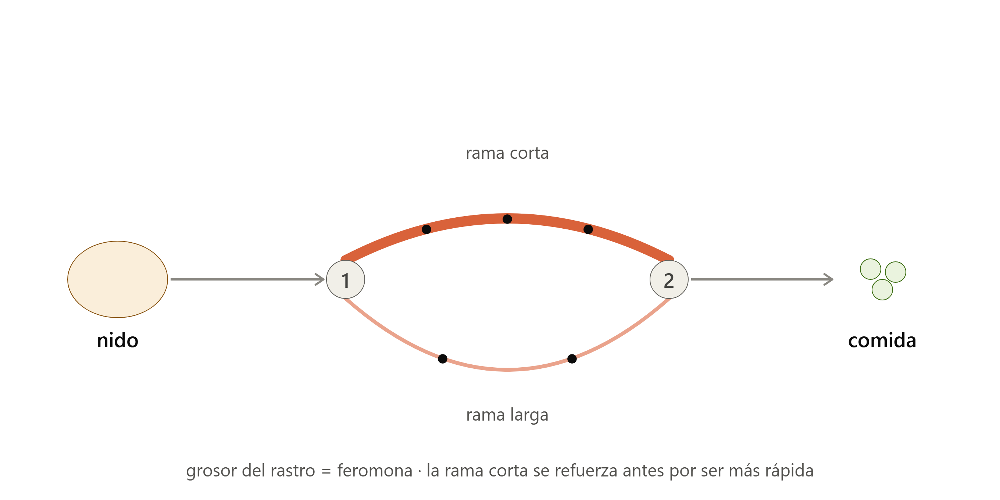
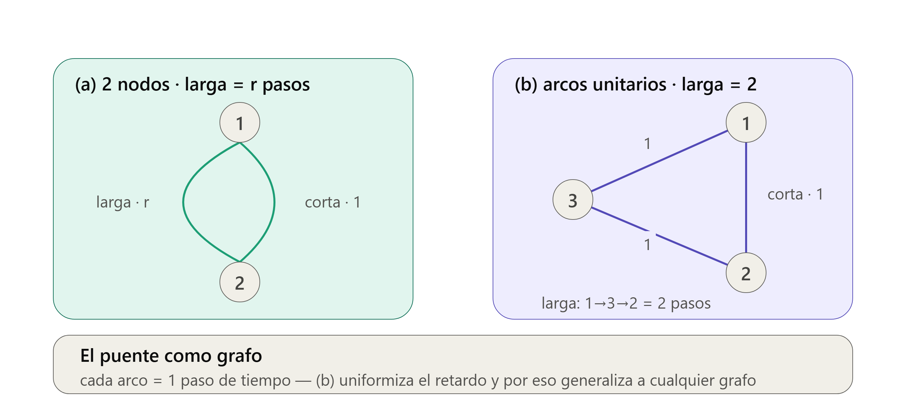

# El modelo de Deneubourg del puente doble: del caso estocástico al discreto

## Qué es esto y qué alcance tiene

Este documento explica, de forma autocontenida y pensada para quien llega por primera vez al tema, el modelo probabilístico con el que Deneubourg y colaboradores (1990) describieron el **experimento del puente doble** — el origen biológico del algoritmo de optimización por colonia de hormigas (ACO).

El recorrido va, deliberadamente, de lo más rico a lo más simple, en un solo salto conceptual a la vez:

1. El experimento físico y qué se observa.
2. El **caso estocástico** (tiempo continuo): la fórmula de decisión 1.1, la dinámica temporal con retardo (1.2 y 1.3), y el análisis del estado estacionario.
3. El **caso discreto simple** (ejercicio 1.5): el modelo de conteos, por qué se rompe al arrancar, y cómo ese problema *motiva* la existencia del offset.
4. Una **tabla comparativa** que aísla exactamente qué cambia entre los dos casos.
5. Glosario de símbolos y referencias.

Las ecuaciones y su numeración siguen a Dorigo, M. & Stützle, T., *Ant Colony Optimization*, MIT Press (2004), capítulo 1, sección 1.1.2 y ejercicio 1.5.

> [!NOTE]
> **Fuera de alcance (a propósito).** Este documento **no** introduce todavía la representación de grafo (nodos y arcos, ecuaciones 1.4–1.7 de la sección 1.2) ni el algoritmo S-ACO con evaporación. Eso es el paso siguiente, y se anticipa al final en la sección [8](#8-hacia-dónde-sigue). La idea es que el modelo de dos ramas quede sólido antes de generalizar a un grafo.

---

## Mapa de ecuaciones (para leer sin el libro al lado)

Todos los números de ecuación son los del libro de Dorigo & Stützle (2004). Como es fácil perderse en ellos sin el libro a mano, esta es la referencia rápida de a qué se refiere cada uno.

**Ecuaciones que se usan en este documento:**

| Ref. (libro) | Qué es | Sección |
|---|---|---|
| (1.1) | Regla de decisión probabilística: elegir rama corta o larga | [§2.1](#21-la-regla-de-decisión-fórmula-11) |
| (1.2) | Evolución temporal de la feromona en la rama **corta** (EDO con retardo) | [§2.3](#23-dinámica-temporal-con-retardo-ecuaciones-12-y-13) |
| (1.3) | Evolución temporal de la feromona en la rama **larga** (EDO con retardo) | [§2.3](#23-dinámica-temporal-con-retardo-ecuaciones-12-y-13) |
| Ejercicio 1.5 | Modelo discreto simple: con conteos y **sin** offset | [§3](#3-el-caso-discreto-simple--ejercicio-15) |

**Ecuaciones nuevas que NO se tratan aquí** (pertenecen a la sección 1.2 del libro, el modelo de grafo, y van en el documento siguiente):

1. (1.4) — Regla de decisión sobre el **grafo** (la versión de 1.1, pero sin offset y con feromona $\varphi$)
2. (1.5) — Actualización de feromona en la rama **corta** (modelo de grafo)
3. (1.6) — Actualización de feromona en la rama **larga** (modelo de grafo)
4. (1.7) — Flujo de hormigas entre nodos

> [!WARNING]
> **Cuidado con el "1.5": son dos cosas distintas que comparten número por coincidencia.**
> - El **ejercicio 1.5** (modelo de conteos) → **sí** está aquí, en [§3](#3-el-caso-discreto-simple--ejercicio-15).
> - La **ecuación (1.5)** (actualización de feromona en el grafo) → **no** está aquí; va en el documento siguiente.
>
> Uno es un *ejercicio* y la otra una *ecuación*. En estas notas se distinguen siempre escribiendo la palabra completa: "ejercicio 1.5" frente a "ecuación (1.5)".

---

## 1. El experimento del puente doble

Un nido de hormigas se conecta a una fuente de comida mediante **dos ramas de longitud distinta**: una corta y una larga. Las hormigas no tienen un mapa ni un líder; cada una deposita feromona al caminar, y esa feromona influye —de forma probabilística— en la elección de rama de las hormigas que vienen detrás.

El resultado observado (Goss et al., 1989) es notable: con el tiempo, la colonia **converge a usar casi exclusivamente la rama corta**, sin que ninguna hormiga "sepa" cuál es la más corta. Es un caso puro de auto-organización mediada por el ambiente (estigmergia).



La intuición del mecanismo, que las ecuaciones formalizan más abajo, es esta: como la rama corta se recorre en menos tiempo, las hormigas que la eligen **vuelven antes** y la refuerzan antes. Esa pequeña ventaja temprana se amplifica por retroalimentación positiva hasta volverse dominante.

---

## 2. El caso estocástico (tiempo continuo) — sección 1.1.2

### 2.1 La regla de decisión (fórmula 1.1)

Cuando una hormiga en el punto de decisión $i$ debe elegir entre la rama corta ($s$) y la larga ($l$), lo hace con probabilidad:

$$
p_{is}(t) = \frac{\bigl(t_s + \varphi_{is}(t)\bigr)^{\alpha}}{\bigl(t_s + \varphi_{is}(t)\bigr)^{\alpha} + \bigl(t_s + \varphi_{il}(t)\bigr)^{\alpha}}
$$

y de forma simétrica $p_{il}(t)$, con $p_{is}(t) + p_{il}(t) = 1$.

Leyendo la fórmula por partes:

- $\varphi_{ia}(t)$ es la **feromona acumulada** en la rama $a \in \{s, l\}$ en el instante $t$. El modelo supone que es proporcional al número de hormigas que han usado esa rama en el pasado.
- $t_s$ es el **offset** o atractivo base (ver [2.2](#22-el-offset-t_s-y-su-doble-papel)).
- $\alpha$ es el **exponente de no linealidad**. Empíricamente $\alpha \approx 2$, valor derivado de experimentos de seguimiento de rastro (Deneubourg et al., 1990).

El papel de $\alpha$ es el corazón del modelo: al elevar el atractivo a una potencia mayor que 1, una **pequeña** diferencia de feromona entre las dos ramas se convierte en una diferencia **grande** de probabilidad. Es lo que hace que la retroalimentación sea explosiva en lugar de suave.

### 2.2 El offset $t_s$ y su doble papel

> [!IMPORTANT]
> El símbolo $t_s$ aparece en el libro con **dos roles distintos**, y conviene tenerlo claro para no confundirse:
> 1. En la fórmula 1.1 es el **offset**: una atracción base que evita que la fórmula se indetermine cuando aún no hay feromona (ver la sección [3](#3-el-caso-discreto-simple--ejercicio-15), donde ese problema se ve explícitamente).
> 2. En las ecuaciones 1.2 y 1.3 es el **tiempo de cruce de la rama corta** (el retardo con que las hormigas de esa rama depositan al otro lado).
>
> Que sea la misma letra puede ser una conveniencia notacional del modelo o tener una lectura física; aquí lo dejamos señalado como punto abierto y tratamos cada aparición según su rol. En una implementación, lo sano es representar $t_s$ como **un solo objeto** con su doble uso documentado, y no como dos constantes numéricas sin relación.

### 2.3 Dinámica temporal con retardo (ecuaciones 1.2 y 1.3)

Si al inicio las hormigas eligen casi al azar (feromonas parejas ⇒ $p \approx 1/2$), ¿por qué termina ganando la rama corta? La respuesta está en **cómo evoluciona la feromona en el tiempo**:

$$
\frac{d\varphi_{is}}{dt} = \psi\, p_{is}(t) + \psi\, p_{js}(t - t_s)
$$

$$
\frac{d\varphi_{il}}{dt} = \psi\, p_{il}(t) + \psi\, p_{jl}(t - r\,t_s)
$$

para $(i=1, j=2)$ y $(i=2, j=1)$, donde $\psi$ es el flujo de hormigas por unidad de tiempo y $r > 1$ es la razón de longitud (la rama larga es $r$ veces la corta).

Cada ecuación tiene **dos términos**:

- Un término **sin retardo**, $\psi\, p_{is}(t)$: las hormigas que salen *ahora mismo* desde el punto $i$ hacia esa rama (su depósito en el extremo $i$ es inmediato).
- Un término **con retardo**, $\psi\, p_{js}(t - t_s)$: las hormigas que salieron del *otro* extremo $j$ hace un tiempo de cruce y **acaban de completar** el recorrido, depositando al llegar.

La clave está en ese retardo. En la rama corta el retardo es $t_s$; en la rama larga es $r\,t_s$, es decir, $r$ veces mayor. Las hormigas del camino corto cierran el circuito y refuerzan su rama **antes** de que las del camino largo siquiera regresen. Ese desfase inclina la fórmula 1.1 a favor de la rama corta de forma temprana, y la no linealidad $\alpha$ lo amplifica.

> [!NOTE]
> **Sin evaporación.** Este modelo *no* incluye evaporación de feromona: $\varphi$ solo crece. Es una simplificación justificada por la observación experimental de que el tiempo que tardan las hormigas en converger al camino corto es del mismo orden que la vida media de la feromona (Goss et al., 1989; Beckers, Deneubourg & Goss, 1993). La evaporación aparece más adelante, ya en el algoritmo ACO general.

### 2.4 Caso estacionario y estabilidad

Suponiendo que la probabilidad se estabiliza, $p_s(t) \to p_s$ constante para $t$ grande (con lo cual $\varphi$ crece linealmente), y tomando el límite $t \to \infty$ en la fórmula 1.1, se llega a la **ecuación de punto fijo**:

$$
p_s = \frac{p_s^{\,\alpha}}{p_s^{\,\alpha} + (1 - p_s)^{\,\alpha}}
$$

Sus soluciones son $p_s \in \{0,\ \tfrac{1}{2},\ 1\}$. La estabilidad de cada una se determina evaluando la derivada de

$$
f(p) = \frac{p^{\alpha}}{p^{\alpha} + (1-p)^{\alpha}}
$$

en cada punto fijo. Se puede demostrar (y se verifica simbólicamente con `sympy` en el notebook) que:

$$
f'\!\left(\tfrac{1}{2}\right) = \alpha
$$

Como $\alpha \approx 2 > 1$, el punto $p = \tfrac{1}{2}$ es **inestable**, mientras que $p = 0$ y $p = 1$ son **estables**. Interpretación: el "empate" inicial es un equilibrio precario; cualquier fluctuación pequeña se amplifica y empuja a la colonia hacia usar **una sola** de las ramas. La dinámica con retardo de [2.3](#23-dinámica-temporal-con-retardo-ecuaciones-12-y-13) es la que decide *cuál* — casi siempre la corta.

---

## 3. El caso discreto simple — ejercicio 1.5

La versión más simple del modelo elimina el offset y trabaja directamente con los **conteos acumulados** $m_s$ y $m_l$ de hormigas que ya usaron cada rama:

$$
p_s = \frac{m_s^{\,n}}{m_s^{\,n} + m_l^{\,n}}
$$

donde $n$ juega el mismo papel de amplificación no lineal que $\alpha$ en el caso continuo. Es el mismo esquema "atractivo elevado a una potencia, normalizado", pero sobre conteos discretos y **sin offset**.

### 3.1 El problema del $0/0$ (y por qué nace el offset)

Este modelo tiene una fragilidad que resulta ser muy instructiva. **Al arrancar el experimento no hay feromona**: $m_s = m_l = 0$. Sustituyendo:

$$
p_s = \frac{0^{\,n}}{0^{\,n} + 0^{\,n}} = \frac{0}{0} \quad \text{(indeterminado)}
$$

La fórmula pura no está definida en el instante inicial, que es justo cuando la colonia empieza a decidir.

> [!TIP]
> **De aquí sale el offset.** Si en lugar de $m_a$ usamos $(t_s + m_a)$, entonces en el origen
> $$p_s = \frac{(t_s + 0)^n}{(t_s + 0)^n + (t_s + 0)^n} = \frac{t_s^{\,n}}{2\,t_s^{\,n}} = \frac{1}{2}$$
> queda perfectamente definido: sin información, la hormiga elige 50/50, que es exactamente lo que uno esperaría. **El offset $t_s$ de la fórmula 1.1 no es un parámetro arbitrario: es la reparación mínima que hace que el modelo tenga un arranque bien definido.** Verlo aparecer como solución a un problema concreto es más iluminador que recibirlo como un dato dado.

---

## 4. Tabla comparativa: continuo (1.1) ↔ discreto simple (1.5)

La comparación aísla que, entre los dos casos, cambian **solo dos cosas**: el tiempo (continuo → discreto) y el atractivo (feromona con offset → conteos sin offset). Todo lo demás —la estructura de razón de potencias y el papel del exponente— se conserva.

| Elemento | Continuo — fórmula 1.1 (§1.1.2) | Discreto simple — ejercicio 1.5 |
|---|---|---|
| Regla de decisión | $p_{s} = \dfrac{(t_s + \varphi_s)^{\alpha}}{(t_s + \varphi_s)^{\alpha} + (t_s + \varphi_l)^{\alpha}}$ | $p_s = \dfrac{m_s^{\,n}}{m_s^{\,n} + m_l^{\,n}}$ |
| Atractivo de la rama | Feromona $\varphi_a(t)$ (continua) | Conteo $m_a$ (entero) de hormigas que ya usaron la rama |
| Offset | **Presente** ($t_s$): da un arranque bien definido ($p = 1/2$) | **Ausente**: indeterminado ($0/0$) en el instante inicial |
| Exponente | $\alpha$ (empíricamente $\approx 2$) | $n$ — mismo papel de amplificación |
| Estructura | Razón de potencias normalizada | Razón de potencias normalizada — **igual** |
| Tiempo | Continuo, $t \in \mathbb{R}$ | Discreto (paso a paso) |
| Dinámica temporal | Explícita: EDO con retardo (1.2 y 1.3) | No modelada en esta versión (solo la regla de decisión) |
| Evaporación | Ninguna | Ninguna |

> [!NOTE]
> Ambos son **refuerzo puro** (sin evaporación) y comparten la misma forma funcional. La lectura correcta no es "dos algoritmos distintos", sino **el mismo mecanismo visto con dos niveles de detalle**: el continuo describe *cómo evoluciona en el tiempo*; el discreto simple aísla *solo la regla de elección* en su forma más desnuda.

---

## 5. Glosario de símbolos

| Símbolo | Significado |
|---|---|
| $s,\ l$ | Rama corta (*short*) y rama larga (*long*) |
| $i,\ j$ | Los dos puntos de decisión (nodos 1 y 2); en las ecuaciones, $i$ es el actual y $j$ el otro |
| $\varphi_{ia}(t)$ | Feromona acumulada en la rama $a$, en el punto $i$, en el instante $t$ |
| $p_{ia}(t)$ | Probabilidad de que una hormiga en $i$ elija la rama $a$ |
| $t_s$ | **Doble papel:** offset/atractivo base en la fórmula 1.1; y tiempo de cruce de la rama corta (retardo) en 1.2/1.3 |
| $\alpha$ | Exponente de no linealidad en el caso continuo ($\approx 2$ empírico) |
| $n$ | Exponente en el caso discreto simple (ej. 1.5); mismo papel que $\alpha$ |
| $\psi$ | Flujo de hormigas por unidad de tiempo (tasa de depósito) |
| $r$ | Razón de longitud: la rama larga es $r$ veces la corta ($r > 1$) |
| $m_s,\ m_l$ | Conteos de hormigas que ya usaron cada rama (caso discreto) |

---

## 6. Notebooks y cómo ejecutarlos

Este repositorio incluye dos notebooks **complementarios**, que abordan el mismo modelo desde dos niveles de modelado distintos:

| Notebook | Enfoque | Qué aporta |
|---|---|---|
| `deneubourg_puente_doble.ipynb` | **Campo medio determinista** | Integra las ecuaciones 1.2/1.3 con sus dos términos (salida instantánea + llegada con retardo), deduce el punto fijo y **verifica cada paso simbólicamente con `sympy`** (incluida $f'(1/2)=\alpha$ y los 4 ejercicios de repaso de estabilidad). |
| `experimento_doble_puente.ipynb` | **Agente estocástico interactivo** | Simula hormigas individuales que deciden al azar según la fórmula 1.1, con *sliders* para $r$ y $\alpha$. Da intuición de la dinámica. Usa un esquema simplificado de *depósito al llegar* (un solo término), orientado a la intuición más que a reproducir literalmente las dos partes de 1.2/1.3. |

En corto: uno da la **verificación rigurosa**, el otro la **intuición interactiva**.

### Ejecutar localmente

Requisitos: Python 3.x

```bash
pip install numpy matplotlib sympy jupyter ipywidgets
jupyter notebook deneubourg_puente_doble.ipynb
```

### Ejecutar en Colab

```
https://colab.research.google.com/github/UdeA-IoT/ESP-ACO/blob/main/ACO/experimento_doble-puente/deneubourg_puente_doble.ipynb
```

### Material relacionado

- `estabilidad_puntos_fijos.md` — guía de ejercicios de estabilidad de puntos fijos (con respuestas), cuyas soluciones se verifican en la sección 5 del notebook determinista.

---

## 7. Referencias

- Deneubourg, J.-L., Aron, S., Goss, S., & Pasteels, J. M. (1990). The self-organizing exploratory pattern of the Argentine ant. *Journal of Insect Behavior*, 3(2), 159–168.
- Goss, S., Aron, S., Deneubourg, J.-L., & Pasteels, J. M. (1989). Self-organized shortcuts in the Argentine ant. *Naturwissenschaften*, 76, 579–581.
- Beckers, R., Deneubourg, J.-L., & Goss, S. (1993). Modulation of trail laying in the ant *Lasius niger* and its role in the collective selection of a food source. *Journal of Insect Behavior*, 6(6), 751–759.
- Dorigo, M., & Stützle, T. (2004). *Ant Colony Optimization*. MIT Press.

---

## 8. Hacia dónde sigue

Una vez firme el modelo de dos ramas, el paso siguiente es representar el experimento como un **grafo** (nodos = puntos de decisión, arcos = ramas). Esto es lo que habilita generalizar de "dos ramas" a *cualquier* red, y es la puerta al algoritmo ACO propiamente dicho (ecuaciones 1.4–1.7 de la sección 1.2, y luego S-ACO con evaporación).



> [!NOTE]
> Esta figura es solo un **anticipo**: no necesitas entenderla para lo anterior. Se desarrolla en el documento siguiente, dedicado a la sección 1.2.

* https://gazebosim.org/home
* https://github.com/mit-acl/mighty
