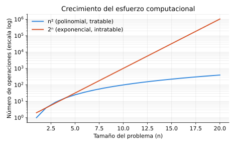
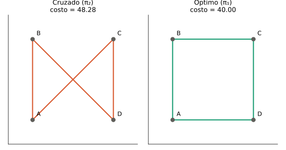
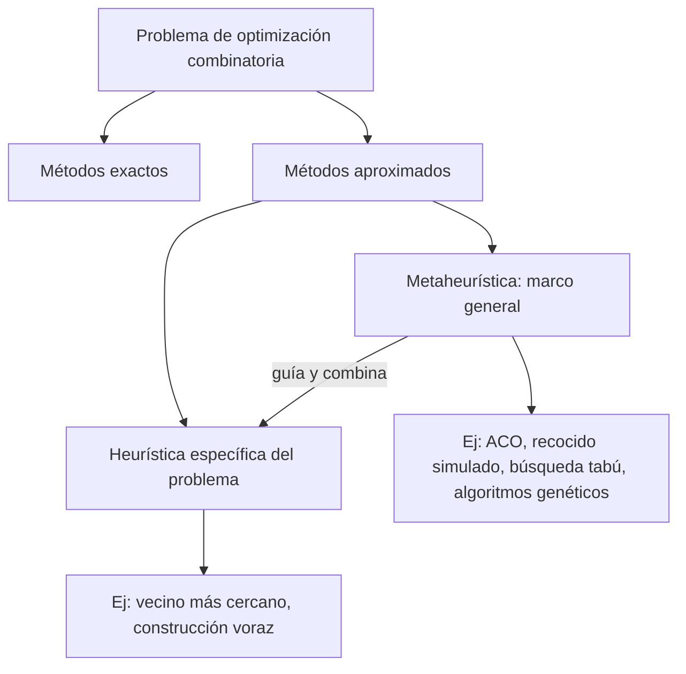
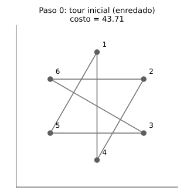
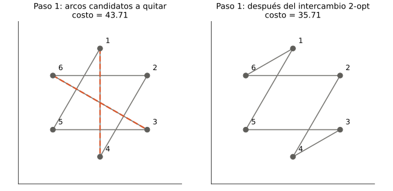
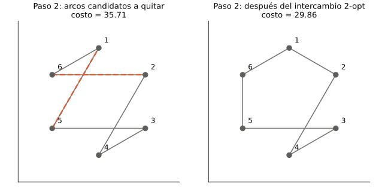
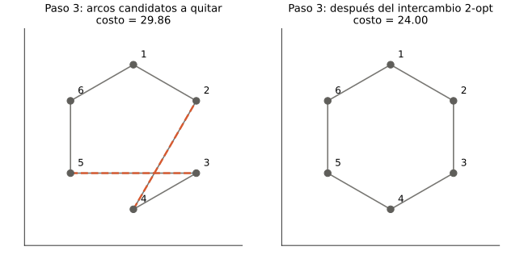
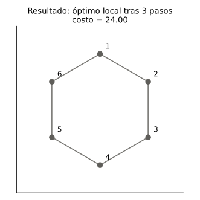

# Fundamentos de optimización combinatoria, TSP y búsqueda local (2-opt)

> **Contexto del documento.** Notas de estudio para el proyecto ESP-ACO, correspondientes al capítulo 2 (y parte del 3) de Dorigo & Stützle, *Ant Colony Optimization* (MIT Press, 2004). El contenido del libro se complementa, cuando fue útil para un lector que se inicia en el tema, con material pedagógico externo (citado en las referencias) y con ejemplos numéricos propios, generados y verificados computacionalmente para este documento — no provienen del libro.

## Índice

1. [¿Qué es un problema de optimización combinatoria y por qué es difícil?](#1-qué-es-un-problema-de-optimización-combinatoria-y-por-qué-es-difícil)
2. [Definición formal y planteamiento del TSP](#2-definición-formal-y-planteamiento-del-tsp)
3. [Cómo se resuelven estos problemas](#3-cómo-se-resuelven-estos-problemas)
4. [Aspectos a tener en cuenta al resolverlos](#4-aspectos-a-tener-en-cuenta-al-resolverlos)
5. [Heurística vs. metaheurística](#5-heurística-vs-metaheurística)
6. [Búsqueda local: el movimiento 2-opt paso a paso](#6-búsqueda-local-el-movimiento-2-opt-paso-a-paso)
7. [Referencias](#7-referencias)

---

## 1. ¿Qué es un problema de optimización combinatoria y por qué es difícil?

Un problema de optimización combinatoria consiste en encontrar, entre un conjunto de opciones **discretas** (no un rango continuo de números, sino elecciones separadas: un orden, una asignación, un subconjunto), la que minimiza o maximiza una función objetivo, respetando ciertas restricciones. Ejemplos: la ruta más corta para repartir paquetes, la asignación óptima de empleados a tareas, o el orden ideal de trabajos en una línea de producción.

**¿Por qué son difíciles?** La forma "obvia" de resolverlos — enumerar todas las combinaciones posibles y quedarse con la mejor (búsqueda exhaustiva) — se vuelve inviable muy rápido, porque el número de combinaciones crece **exponencialmente** con el tamaño del problema, no de forma lineal ni cuadrática.



*Figura 1. Con n = 20, n² apenas llega a 400 operaciones, pero 2ⁿ ya supera el millón. Este comportamiento se formaliza con la notación O grande: un algoritmo es de tiempo polinomial (O(n^k) para algún exponente fijo k) si su tiempo de ejecución crece de forma manejable con n; es exponencial si no existe tal cota. Los problemas para los que no se conoce ningún algoritmo polinomial se llaman **intratables**; la teoría que los clasifica formalmente es la **NP-completitud**. El TSP es el ejemplo clásico de problema NP-difícil.*

---

## 2. Definición formal y planteamiento del TSP

### 2.1 Definición formal de un problema de optimización combinatoria

Una instancia de un problema de optimización combinatoria es una tripleta $(S, f, \Omega)$, donde:

- $S$ es el conjunto de **soluciones candidatas** (todas las combinaciones posibles, sin filtrar).
- $f$ es la **función objetivo**, que asigna un valor (costo o beneficio) $f(s)$ a cada solución candidata $s \in S$.
- $\Omega$ es el conjunto de **restricciones** que una solución debe cumplir.

Las soluciones de $S$ que cumplen $\Omega$ forman el subconjunto $\tilde{S} \subseteq S$ de **soluciones factibles**. El objetivo es hallar una **solución globalmente óptima** $s^*$: la de menor costo en $\tilde{S}$ (minimización) o mayor valor (maximización).

> Nota: casi nunca se enumera $S$ explícitamente — sería absurdo listar todas las rutas posibles de un TSP de 50 ciudades. El problema se representa de forma compacta, típicamente mediante un grafo ponderado.

### 2.2 El TSP como instancia de esta definición

El problema del vendedor viajero (TSP) se representa como un grafo completo ponderado $G = (N, A)$, donde $N$ es el conjunto de nodos (ciudades) y $A$ el conjunto de arcos. Cada arco $(i,j)$ tiene una distancia $d_{ij}$. Si $d_{ij} = d_{ji}$ para todo par de nodos, el TSP es **simétrico**; si existe al menos un par con $d_{ij} \neq d_{ji}$, es **asimétrico**.

Trasladado a la tripleta $(S, f, \Omega)$:

- $S$ = todas las permutaciones posibles del orden de visita de las $n$ ciudades.
- $\Omega$ = cada ciudad se visita exactamente una vez y se regresa al origen (la solución debe ser un **circuito hamiltoniano**: un camino cerrado que pasa por cada nodo exactamente una vez).
- $f$ = la longitud total del recorrido. Para una permutación $\pi$ de los nodos:

```math
f(\pi) = \sum_{i=1}^{n-1} d_{\pi(i)\pi(i+1)} + d_{\pi(n)\pi(1)}
```

### 2.3 Mini-ejemplo: TSP de 4 ciudades

Cuatro ciudades en las esquinas de un cuadrado de lado 10 km:

| Ciudad | Coordenadas |
|---|---|
| A | (0, 0) |
| B | (0, 10) |
| C | (10, 10) |
| D | (10, 0) |

Matriz de distancias (diagonal ≈ 14.14):

| | A | B | C | D |
|---|---|---|---|---|
| **A** | — | 10 | 14.14 | 10 |
| **B** | 10 | — | 10 | 14.14 |
| **C** | 14.14 | 10 | — | 10 |
| **D** | 10 | 14.14 | 10 | — |

Como el TSP simétrico es cíclico (una permutación y su reverso son el mismo tour) y podemos fijar el punto de partida en A, el número de tours *distintos* es $(n-1)!/2 = 3$:

```math
f(\pi_1) = d_{AB}+d_{BC}+d_{CD}+d_{DA} = 10+10+10+10 = 40
```
```math
f(\pi_2) = d_{AB}+d_{BD}+d_{DC}+d_{CA} = 10+14.14+10+14.14 = 48.28
```
```math
f(\pi_3) = d_{AC}+d_{CB}+d_{BD}+d_{DA} = 14.14+10+14.14+10 = 48.28
```



*Figura 2. $\pi_1$ (el perímetro del cuadrado) es la solución globalmente óptima. $\pi_2$ y $\pi_3$ usan las dos diagonales del cuadrado y por eso se cruzan a sí mismas — un tour óptimo en el plano euclidiano nunca se cruza. Esta intuición geométrica es la base del movimiento 2-opt (sección 6).*

---

## 3. Cómo se resuelven estos problemas

**a) Métodos exactos.** Garantizan encontrar la solución óptima y demostrar que lo es (p. ej., ramificación y acotación). Para instancias NP-difíciles de tamaño realista, su tiempo de cómputo se dispara exponencialmente y se vuelven inviables en la práctica.

**b) Métodos aproximados (heurísticos).** Sacrifican la garantía de optimalidad por soluciones muy buenas en tiempo razonable. Se dividen en:

- **Algoritmos constructivos**: construyen una solución desde cero, añadiendo un componente a la vez, sin retroceder. El caso típico es el algoritmo **voraz (greedy)**: en cada paso agrega el componente que parece mejor en ese momento, sin ver el futuro. Ejemplo en el TSP: el **vecino más cercano** — desde la ciudad actual, saltar siempre a la no visitada más cercana. Es rápido, pero de calidad inferior a la búsqueda local.
- **Búsqueda local**: parte de una solución completa y la mejora con cambios locales pequeños hasta no poder mejorar más (ver sección 6).

---

## 4. Aspectos a tener en cuenta al resolverlos

1. **Representación de la solución**: cómo se codifica una solución candidata (permutación, asignación, subconjunto…).
2. **Definición precisa de $f$ y $\Omega$**: qué se minimiza/maximiza y qué hace válida a una solución.
3. **Método exacto vs. aproximado**: según el tamaño de la instancia y si se necesita garantía de optimalidad.
4. **Estructura de vecindad** (si se usa búsqueda local): qué movimientos locales están permitidos y cómo se recorre el vecindario.
5. **Conocimiento específico del problema**: aprovechar la estructura particular acelera la búsqueda (p. ej., en el TSP, usar la distancia inversa como guía).
6. **Estático vs. dinámico**: si los datos cambian mientras se resuelve, el algoritmo debe adaptarse en tiempo real.
7. **Costo computacional aceptable**: cuánto tiempo/recursos se invierten a cambio de cercanía al óptimo.

---

## 5. Heurística vs. metaheurística

**Heurística**: método aproximado diseñado a la medida de un problema específico, que usa conocimiento del dominio para construir o mejorar soluciones rápidamente, sin garantizar optimalidad. Ejemplo: el vecino más cercano para el TSP.

**Metaheurística**: marco de conceptos algorítmicos de alto nivel, independiente del problema, adaptable para definir heurísticas concretas aplicables a muchos problemas distintos. No resuelve el problema por sí sola: aporta la estrategia general (cómo explorar, cómo evitar quedar atrapada en óptimos locales, cómo balancear exploración y explotación), que se combina con conocimiento del problema para producir una heurística funcional. Ejemplos: colonia de hormigas (ACO), recocido simulado, búsqueda tabú, algoritmos genéticos.



*Figura 3 (Mermaid, se renderiza nativamente en GitHub). ACO es el caso central de este proyecto: es una metaheurística que, dentro de su marco general, usa una heurística específica del problema (para el TSP, $\eta_{ij} = 1/d_{ij}$, inversamente proporcional a la distancia) para guiar la construcción de cada solución.*

---

## 6. Búsqueda local: el movimiento 2-opt paso a paso

### 6.1 Conceptos previos: vecindad y óptimo local

La búsqueda local necesita dos ingredientes:

- Una **estructura de vecindad** $N$: una función que asigna a cada solución $s$ un conjunto de soluciones "vecinas" $N(s)$, alcanzables con un solo movimiento.
- Un **óptimo local**: una solución $s$ tal que ningún vecino en $N(s)$ es mejor que $s$ — aunque podría existir una solución mejor fuera de ese vecindario (el óptimo global).

El movimiento **2-opt** (el más usado en TSP) consiste en tomar dos arcos del tour, quitarlos, y reconectar los cuatro extremos de la única otra forma posible — lo que efectivamente **invierte el orden del segmento** entre ellos. Es el movimiento que "deshace cruces" geométricos como los vistos en la figura 2.

Pseudocódigo general (búsqueda local por mejor mejora, *best-improvement*):

```
procedure BusquedaLocal2opt(tour)
    mejorado ← verdadero
    while mejorado hacer
        mejorado ← falso
        for cada par de arcos (i, i+1) y (j, j+1) en tour, con i < j hacer
            tour_nuevo ← invertir_segmento(tour, i+1, j)
            if longitud(tour_nuevo) < longitud(tour) then
                tour ← tour_nuevo
                mejorado ← verdadero
            end if
        end for
    end while
    return tour
end procedure
```

### 6.2 Ejemplo sencillo: el TSP de 4 ciudades

Partiendo del tour cruzado $\pi_2$ = A→B→D→C→A (costo 48.28, panel izquierdo de la figura 2): el único intercambio 2-opt posible que mejora el tour quita los arcos (B,D) y (C,A) — las dos diagonales que se cruzan — y los reemplaza invirtiendo el segmento entre ellos. El resultado es $\pi_1$ = A→B→C→D→A (costo 40, panel derecho de la figura 2).

En la siguiente pasada, ningún intercambio 2-opt produce un tour más corto que $\pi_1$: el algoritmo se detiene. $\pi_1$ es un **óptimo local** (y en este ejemplo tan pequeño, también el óptimo global). Como solo hay 3 tours distintos posibles, este ejemplo permite ver *que* funciona, pero no *cómo evoluciona* paso a paso con varias mejoras sucesivas — para eso usamos un ejemplo más rico a continuación.

### 6.3 Ejemplo más rico: TSP de 6 ciudades, evolución completa

Seis ciudades ubicadas en los vértices de un hexágono regular (radio 4), numeradas 1 a 6 en sentido horario empezando arriba. El tour óptimo es el perímetro del hexágono (costo 24.0). Partimos deliberadamente de un tour "enredado" — como el que podría producir una construcción voraz con mala suerte, o un orden al azar — para ver cómo 2-opt lo va corrigiendo:

**Tour inicial**: 1 → 4 → 2 → 6 → 3 → 5 → 1 (costo 43.71)



*Figura 4. Tour de partida, con varios arcos cruzándose entre sí.*

**Paso 1.** El algoritmo revisa todos los pares de arcos y encuentra que quitar (1,4) y (6,3) y reconectar mejora el tour:



*Figura 5. Izquierda: arcos (1,4) y (6,3) marcados como candidatos a eliminar. Derecha: tour resultante tras invertir el segmento entre ellos → 1→6→2→4→3→5→1, costo 35.71 (baja de 43.71 a 35.71).*

**Paso 2.** Sobre el nuevo tour, el algoritmo encuentra una segunda mejora quitando (6,2) y (5,1):



*Figura 6. Nuevo tour: 1→6→5→3→4→2→1, costo 29.86 (baja de 35.71 a 29.86).*

**Paso 3.** Una tercera mejora, quitando (5,3) y (4,2):



*Figura 7. Tour final: 1→6→5→4→3→2→1, costo 24.0 (baja de 29.86 a 24.0).*



*Figura 8. En la siguiente pasada ningún intercambio 2-opt mejora este tour: es un óptimo local. En este ejemplo coincide exactamente con el perímetro del hexágono, que es también el óptimo global (costo 24.0) — pero, en general, esa coincidencia **no está garantizada**: la búsqueda local puede quedar atrapada en un óptimo local lejano al óptimo global si ningún movimiento 2-opt individual "ve" el camino hacia la mejor solución. Ese es uno de los problemas que las metaheurísticas (sección 5), como ACO, están diseñadas para mitigar: en vez de una única búsqueda local determinista, exploran el espacio de soluciones de forma más amplia y estocástica.*

**Resumen de la evolución:**

| Paso | Arcos removidos | Tour | Costo |
|---|---|---|---|
| 0 | — | 1-4-2-6-3-5 | 43.71 |
| 1 | (1,4) y (6,3) | 1-6-2-4-3-5 | 35.71 |
| 2 | (6,2) y (5,1) | 1-6-5-3-4-2 | 29.86 |
| 3 | (5,3) y (4,2) | 1-6-5-4-3-2 | 24.00 |

---

## 7. Referencias

- Dorigo, M. & Stützle, T. (2004). *Ant Colony Optimization*. MIT Press. Capítulos 2 (fundamentos de optimización combinatoria y metaheurísticas) y 3 (TSP, 2-opt como componente de algoritmos ACO).
- Material pedagógico complementario sobre la distinción heurística/metaheurística (consultado para contextualizar la sección 5, sin citar textualmente): C. Blum & A. Roli (2003), *Metaheuristics in combinatorial optimization: Overview and conceptual comparison*, ACM Computing Surveys; artículo de F. Sancho Caparrini, *Metaheurísticas* (Universidad de Sevilla); entrada "Metaheurística" de Wikipedia en español.
- Figuras 1, 2 y 4–8: generadas computacionalmente para este documento (Python + Matplotlib) a partir de ejemplos numéricos propios, verificados por cómputo directo (no provienen del libro).
