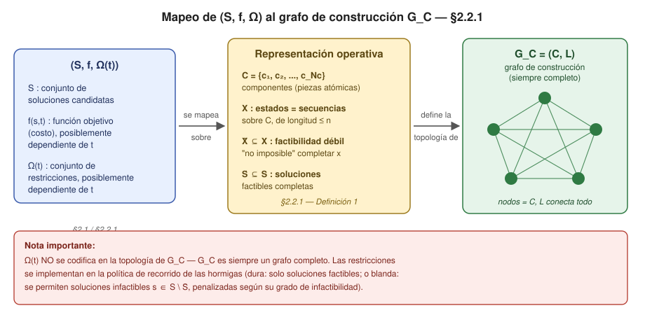
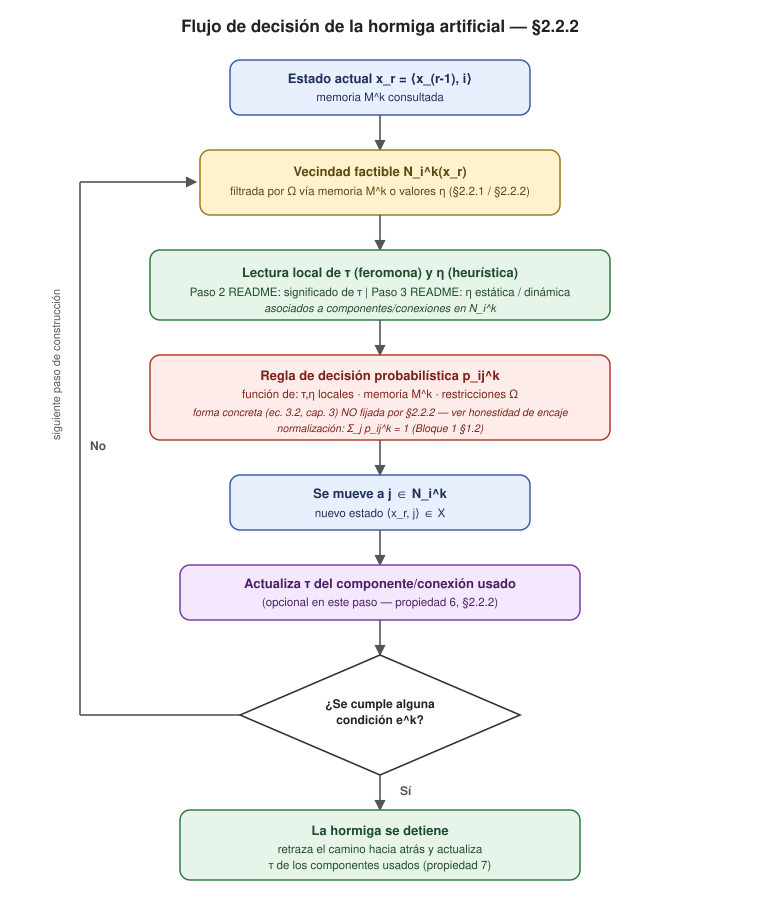
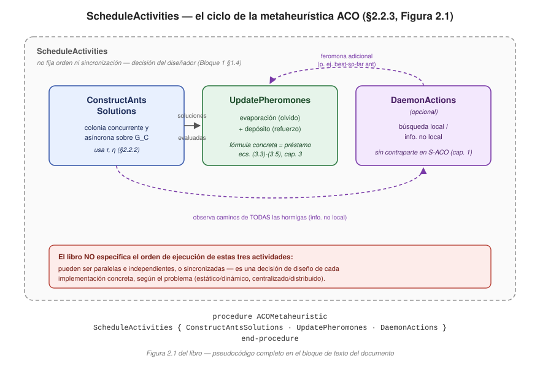

# La Metaheurística ACO: Representación, Comportamiento Estocástico y Ciclo de Actividades (§2.2)

> Notas pedagógicas del proyecto **ESP-ACO** (UdeA). Fuente primaria: Dorigo, M. & Stützle, T.,
> *Ant Colony Optimization*, MIT Press, 2004 — sección 2.2 completa (§2.2.1–§2.2.3).
> Notación: se usa **τ** para feromona a lo largo de todo el documento (ver nota en el mapa de
> ecuaciones sobre las citas textuales del capítulo 1, que originalmente usan φ).

## Ruta de lectura

Este documento asume como ya conocido lo tratado en tres materiales previos y **no los repite**:

1. **`modelo_estocastico_a_discreto.md`** (y su continuación sobre §1.2–§1.3) — cubre la fórmula
   de Deneubourg (1.1), la dinámica con retardo (1.2)/(1.3), y la transición discreta en grafo de
   S-ACO (1.8) (ver corrección de numeración más abajo), junto con la evaporación y el depósito
   ∝ 1/L^k de §1.3. Este documento parte de ese punto: donde el capítulo 1 modela un problema
   *concreto* (puente doble, grafo simple), el capítulo 2 generaliza esa maquinaria a *cualquier*
   problema de optimización combinatoria. Esa generalización es precisamente el primer punto de
   honestidad de encaje que se desarrolla abajo.

2. **Documento sobre optimización combinatoria** — cubre el formalismo (S, S̃, S\*, f(π)), el TSP
   como caso paradigmático, la distinción heurística/metaheurística, y 2-opt como búsqueda local.
   Este documento retoma la terna (S, f, Ω) exactamente donde ese documento la dejó, y la conecta
   con el grafo de construcción G_C.

3. **README Q&A** (hilo narrativo de este documento) — ya estableció, en la Pregunta 3, los seis
   pasos de diseño de ACO (§5.7.8 del libro) y, en la Pregunta 4, un recorrido cronológico que
   llega hasta §2.2.1–§2.2.3. Este documento **no repite** ese recorrido; lo **formaliza y
   profundiza**, verificando cada afirmación contra el texto exacto del libro y señalando dónde el
   README simplificó (a propósito, para un lector novato) algo que aquí se precisa.

> [!TIP]
> Si ya leíste el README Q&A, puedes ir directo al Bloque 3 (Problem Representation). Los Bloques 1
> y 2 son repaso de prerrequisitos y mapa de ecuaciones, útiles como referencia rápida pero no
> imprescindibles si el vocabulario de grafos/probabilidad/optimización combinatoria ya es cómodo.

## Mapa de ecuaciones

### Ecuaciones del capítulo 1 (referenciadas aquí, no re-deducidas)

| Número | Sección origen | Contenido | Rol en este documento |
|---|---|---|---|
| (1.1) | §1.1.2 | Modelo estocástico continuo de Deneubourg, `p_is(t)` | Referencia de fondo |
| (1.2)–(1.3) | §1.1.2 | Dinámica con retardo temporal `t_s` (ecuaciones diferenciales) | Referencia de fondo |
| (1.4)–(1.7) | §1.2 | Versión en **tiempo discreto** del modelo de Deneubourg, aún sobre el puente doble específico (grafo de la Figura 1.5b, 3 ramas) — **no** es la regla general en grafo arbitrario | Contexto; no se usa como punto de contraste directo |
| **(1.8)** | §1.3.1 (S-ACO) | Regla de transición discreta en un **grafo arbitrario** `G = (N,A)`, solo con `τ^α` (sin `η`) | **Punto de contraste directo** con la regla de decisión de §2.2.2 (Bloque 3) |

> [!WARNING]
> **Corrección de encaje verificada en este documento:** el material previo del proyecto refería
> a (1.4)–(1.7) como "la transición discreta en grafo". Al verificar directamente `aco-book.pdf`
> se confirmó que (1.4)–(1.7) modelan específicamente el puente doble en tiempo discreto (aún con
> notación φ, comportamiento *promedio* del sistema, sin generalizar a un grafo arbitrario). La
> regla que sí generaliza a cualquier grafo, con comportamiento estocástico *individual* por
> hormiga, es la **ecuación (1.8)** de §1.3.1. Esta es la que se usa como contraste en el Bloque 3.

### Ecuaciones y expresiones formales de este documento (capítulo 2)

> [!IMPORTANT]
> **Advertencia de numeración, verificada contra `aco-book.pdf`:** §2.2 ("The ACO Metaheuristic")
> **no contiene ninguna ecuación numerada propia** — ni en §2.2.1 (*Problem Representation*), ni en
> §2.2.2 (*Ants' Behavior*), ni en §2.2.3 (*The Metaheuristic*). Todo el formalismo —la terna
> $(S,f,\Omega)$, el conjunto de componentes $C$, los estados $X$, la factibilidad débil $\tilde{X}$,
> las soluciones factibles $\tilde{S}$, el grafo de construcción $G_C=(C,L)$, las propiedades de la
> hormiga $k$, la regla de decisión probabilística— está en **prosa formal**, no en fórmulas con
> tag `(2.x)`. El capítulo 2 sí tiene ecuaciones numeradas (p. ej. la (2.8) de *Simulated Annealing*
> en §2.4.1), pero ninguna cae dentro de §2.2.
>
> Por esa razón, las expresiones formales de §2.2 se rotulan aquí como **"Definición N"**
> (numeración propia de estas notas, no del libro) en vez de inventarles un número de ecuación
> que el libro no les da.

| Etiqueta en este documento | Sección origen | Contenido | Estado de numeración |
|---|---|---|---|
| Definición 1 | §2.2.1 | Terna `(S, f, Ω)`, componentes `C`, estados `X`, `X̃` (factibilidad débil), `S̃` | Prosa en el libro; sin número |
| Definición 2 | §2.2.1 | Grafo de construcción `G_C = (C, L)` | Prosa en el libro; sin número |
| Definición 3 | §2.2.2 | Propiedades de la hormiga artificial `k` (memoria `M^k`, estado inicial, terminación, regla de decisión) | Prosa en el libro; sin número |
| Figura 2.1 | §2.2.3 | Pseudocódigo `ACOMetaheuristic` (`ScheduleActivities`: `ConstructAntsSolutions`, `UpdatePheromones`, `DaemonActions`) | Es figura, no ecuación — numeración real del libro |

> [!WARNING]
> **Préstamos del capítulo 3, no ecuaciones de §2.2 — dos casos identificados en este documento.**
> Ambas fórmulas son préstamos pedagógicos legítimos y muy utilizados —el propio libro define en
> el capítulo 4 un `GenericPheromoneUpdate` que generaliza (3.3)–(3.4)—, pero se mantienen aquí
> rotuladas con su origen correcto en vez de atribuírselas a §2.2. Detalle de cada caso abajo.

**1. La fórmula de probabilidad**

```math
p_{ij}^k = \frac{[\tau_{ij}]^\alpha [\eta_{ij}]^\beta}{\sum_{l \in \mathcal{N}_i^k} [\tau_{il}]^\alpha [\eta_{il}]^\beta}
```

corresponde a la **ecuación (3.2)** del capítulo 3 (regla de Ant System), no a §2.2.2. §2.2.2
solo exige que exista una regla función de $\tau$, $\eta$, memoria y restricciones locales, sin
fijar su forma funcional.

**2. La fórmula de actualización de feromona**

```math
\tau_{ij} \leftarrow (1-\rho)\tau_{ij} + \sum_{k=1}^{m} \Delta \tau_{ij}^k
```

corresponde a la **combinación de las ecuaciones (3.3) y (3.4)** del capítulo 3, no a §2.2.3,
que solo describe `UpdatePheromones` en prosa (aumenta por depósito, disminuye por evaporación).

### Cómo se integran los seis pasos de diseño (README Q3) en este documento

| Paso (Q3) | Dónde se integra aquí | Función |
|---|---|---|
| 1. Representar el problema | Bloque 2 (§2.2.1) | Contenido central del bloque |
| 2. Significado de la feromona | Bloque 3 (§2.2.2) | Aclara qué decisión sesga `τ_ij` antes de la regla de decisión |
| 3. Información heurística | Bloque 3 (§2.2.2) | Aclara el rol de `η_ij` (estática/dinámica) junto a `τ_ij` |
| 4. Búsqueda local | Bloque 4 (§2.2.3, `DaemonActions`) | Motiva por qué `DaemonActions` existe |
| 5. Variante ACO concreta | Fuera de este documento | Pertenece al capítulo 3 (AS/ACS/MMAS) |
| 6. Parámetros (α, β, ρ, m) | Fuera de este documento | Ajuste fino, no representación/comportamiento/ciclo |

---

## 1. Repaso de ciencia básica

Antes de entrar en el marco formal de §2.2, conviene tener a mano cuatro herramientas
conceptuales. Cada una se usará explícitamente en los bloques siguientes; aquí solo se
fija el vocabulario mínimo.

### 1.1 Teoría de grafos: grafo de construcción y vecindad factible

Un **grafo** $G = (N, A)$ consiste de un conjunto de nodos $N$ y un conjunto de arcos
$A$ que conectan pares de nodos. Dos nodos son **vecinos** si existe un arco entre ellos.

En ACO, el grafo relevante no es (necesariamente) el grafo del problema en sí, sino un
**grafo de construcción** $G_C = (C, L)$: sus nodos son los **componentes** $C$ de una
solución (no necesariamente "lugares" del problema original), y $L$ conecta esos
componentes de forma que una hormiga pueda ir ensamblando una solución completa como una
secuencia de componentes visitados. En el Bloque 2 se verá que, para el TSP, $G_C$
coincide con el grafo del problema (ciudades y distancias); pero esto es un caso
particular, no la definición general.

Un concepto que aparecerá varias veces: la **vecindad factible** de una hormiga $k$ en un
estado dado, denotada $\mathcal{N}_i^k$, es el subconjunto de nodos vecinos a los que la
hormiga *puede* moverse sin violar las restricciones del problema. No toda la vecindad de
$G_C$ es necesariamente accesible en cada paso — las restricciones $\Omega$ recortan esa
vecindad dinámicamente, en función de lo que la hormiga ya construyó.

### 1.2 Probabilidad discreta: normalización de probabilidades condicionadas

Cuando una hormiga elige su siguiente paso entre varias opciones $j \in \mathcal{N}_i^k$,
esa elección es una variable aleatoria discreta. Cualquier regla de decisión probabilística
que se use debe satisfacer la condición básica de normalización:

```math
\sum_{j \in \mathcal{N}_i^k} p_{ij}^k = 1, \qquad p_{ij}^k \geq 0 \ \ \forall j \in \mathcal{N}_i^k
```

Es decir, la probabilidad total de moverse a *algún* vecino factible debe ser exactamente 1
(la hormiga no puede "quedarse sin opciones" mientras existan estados factibles alcanzables),
y ninguna probabilidad individual puede ser negativa. Este requisito, aunque no forma parte
de ninguna fórmula específica del libro, es la razón estructural por la que cualquier regla
de decisión concreta —incluida la del capítulo 3, ec. (3.2)— tiene la forma de un cociente
normalizado sobre la vecindad factible: el denominador existe precisamente para garantizar
esta propiedad.

### 1.3 Optimización combinatoria: recordatorio corto de $(S, f, \Omega)$

> [!NOTE]
> Precisión de fuente: la terna $(S, f, \Omega)$ se define formalmente en **§2.1** del libro
> ("Combinatorial Optimization"), no en §2.2.1. §2.2.1 la retoma y la extiende con
> dependencia temporal $t$ para cubrir problemas dinámicos. Este documento hereda la
> versión ya cubierta en el documento previo sobre optimización combinatoria (doc. B de la
> ruta de lectura) y aquí solo se recuerda lo estrictamente necesario.

Una instancia de un problema de optimización combinatoria es una terna $(S, f, \Omega)$:

- $S$: el conjunto de **soluciones candidatas**.
- $f$: la **función objetivo**, que asigna un valor de costo $f(s)$ a cada $s \in S$.
- $\Omega$: el conjunto de **restricciones** del problema.

Las soluciones de $S$ que satisfacen $\Omega$ forman el subconjunto de **soluciones
factibles** $\tilde{S} \subseteq S$. El objetivo es encontrar $s^{\ast} \in \tilde{S}$ tal que
$f(s^{\ast}) \leq f(s)$ para todo $s \in \tilde{S}$ (minimización). Esto es exactamente lo que
el documento B ya formalizó con el TSP como caso paradigmático; aquí se recupera solo para
tener la notación a mano cuando, en el Bloque 2, se muestre cómo §2.2.1 construye $C$, $X$,
$\tilde{X}$ *sobre* esta terna.

### 1.4 Sistemas concurrentes: agentes cuasi-independientes

Por último, un prerrequisito menos matemático y más de diseño de sistemas: en §2.2.3 el
libro describe explícitamente que las hormigas de una colonia *"concurrently and
asynchronously visit adjacent states"* — es decir, no hay un orden global ni un reloj
compartido que sincronice sus decisiones paso a paso. Cada hormiga avanza con su propia
"velocidad" de construcción, y el algoritmo no impone que todas terminen su solución al
mismo tiempo.

Esto tiene una consecuencia de diseño importante que se retomará en el Bloque 4: si las
hormigas actúan de forma concurrente y descentralizada, **cualquier acción que requiera
comparar o combinar información de varias hormigas a la vez no puede ser ejecutada por una
sola hormiga** — necesita un mecanismo aparte. Ese mecanismo es, precisamente,
`DaemonActions`.

---

## 2. Representación del problema (§2.2.1 — *Problem Representation*)

### 2.1 De (S, f, Ω) a (S, f, Ω(t)): la extensión temporal

El Bloque 1 recordó la terna $(S, f, \Omega)$ de §2.1. §2.2.1 la retoma para el problema de
minimización $(S, f, \Omega)$, pero con una extensión: tanto la función objetivo como las
restricciones pueden depender del tiempo, $f(s,t)$ y $\Omega(t)$. Esto no es un capricho
notacional — es lo que permite que la misma maquinaria formal cubra tanto **problemas
estáticos** (el TSP: las distancias entre ciudades no cambian mientras se resuelve el
problema) como **problemas dinámicos** (ruteo en redes de telecomunicaciones: el costo de
un enlace es proporcional al tráfico, que varía en tiempo real, y un nodo puede volverse
inalcanzable súbitamente). El objetivo sigue siendo el mismo: encontrar una solución
factible $s^{\ast}$ de costo mínimo.

> [!NOTE]
> Este documento, siguiendo la decisión notacional ya tomada para el proyecto, usa **τ**
> para feromona. El libro, en las ecuaciones del capítulo 1 que aquí se referencian, usa φ;
> se mantiene φ en esas citas textuales, entendiendo que corresponde a τ en la notación
> adoptada aquí. No se trata de una inconsistencia del libro sino de una decisión de estilo
> de esta serie de documentos.

### 2.2 Componentes, estados y las dos capas de factibilidad: $\tilde{X}$ vs $\tilde{S}$

El libro mapea la terna $(S,f,\Omega)$ sobre una estructura más operativa, mediante la
siguiente lista de elementos — esta es la **Definición 1** de este documento:

**Definición 1 (representación del problema, §2.2.1).**

- Un conjunto finito de **componentes** $C = \{c_1, c_2, \ldots, c_{N_C}\}$, donde $N_C$
  es el número de componentes.
- Los **estados** del problema se definen como secuencias de longitud finita sobre los
  elementos de $C$:
```math
x = \langle c_i, c_j, \ldots, c_h, \ldots \rangle
```
  El conjunto de todos los estados posibles se denota $X$. La longitud de una secuencia
  $x$ (el número de componentes que contiene) se escribe $|x|$, y está acotada por una
  constante $n < +\infty$.
- El conjunto de **soluciones candidatas** $S$ es un subconjunto de $X$: $S \subseteq X$.
  Es decir, no toda secuencia es candidata a solución; las candidatas son las que tienen
  la forma "completa" apropiada para el problema.
- Un conjunto de **estados factibles** $\tilde{X} \subseteq X$, definido mediante una
  prueba dependiente del problema que verifica que **no es imposible** completar una
  secuencia $x \in \tilde{X}$ en una solución que satisfaga las restricciones $\Omega$.
- Un conjunto no vacío $S^{\ast}$ de **soluciones óptimas**, con $S^{\ast} \subseteq \tilde{S}$ y
  $S^{\ast} \subseteq S$.
- Un costo $g(s,t)$ asociado a cada solución candidata $s \in S$. En la mayoría de los
  casos $g(s,t) \equiv f(s,t)$ para todo $s \in \tilde{S}$, donde $\tilde{S} \subseteq S$
  es el conjunto de **soluciones candidatas factibles**, obtenido a partir de $S$ mediante
  las restricciones $\Omega(t)$.
- En algunos casos, un costo (o una estimación de costo) $J(x,t)$ puede asociarse a
  estados que no son soluciones candidatas. Si $x_j$ se obtiene añadiendo componentes a
  $x_i$, entonces $J(x_i,t) \leq J(x_j,t)$. Se cumple $J(s,t) \equiv g(s,t)$ cuando $x$ es
  ya una solución candidata.

> [!IMPORTANT]
> **Honestidad de encaje — $\tilde{X}$ vs $\tilde{S}$, precisión que el README solo esboza.**
> El libro define el proceso en **dos capas**, no en una sola, y aquí conviene ser preciso
> con el orden lógico:
>
> 1. **$\tilde{X}$ (factibilidad débil):** un estado *parcial* $x \in \tilde{X}$ pasa la
>    prueba si no es *imposible* completarlo en una solución válida. Esto es una condición
>    necesaria, no suficiente — el libro es explícito en que la feasibility de un estado en
>    $\tilde{X}$ "debe interpretarse en sentido débil": no garantiza que exista realmente una
>    completación $s$ de $x$ que termine siendo una solución factible.
> 2. **$\tilde{S}$ (factibilidad fuerte):** solo se aplica a secuencias ya *completas*
>    (candidatas a solución, $s \in S$) y sí exige el cumplimiento pleno de $\Omega$.
>
> En otras palabras: $\tilde{X}$ filtra estados parciales que *todavía tienen esperanza* de
> llegar a ser solución; $\tilde{S}$ filtra soluciones completas que *efectivamente lo
> lograron*. Una hormiga puede estar transitando por un estado en $\tilde{X}$ durante varios
> pasos de construcción sin que eso garantice que terminará en $\tilde{S}$.
>
> Adicionalmente, el texto extraído del PDF presenta el símbolo de tilde con ambigüedad
> tipográfica en dos puntos (en la oración sobre la "completación" de $x$, y en la
> definición de $S^{\ast}$). Interpreto ambos pasajes conforme a la lógica interna citada arriba
> —que sí es inequívoca—, y lo señalo aquí en vez de asumir silenciosamente una lectura.
> Esta distinción, como anota el propio README, se vuelve directamente relevante si más
> adelante se profundiza en las pruebas de convergencia del capítulo 4.

### 2.3 El grafo de construcción $G_C = (C, L)$

**Definición 2 (grafo de construcción, §2.2.1).** Dada la representación anterior, las
hormigas artificiales construyen soluciones realizando **caminatas aleatorias** sobre el
grafo completamente conectado

```math
G_C = (C, L)
```

cuyos nodos son los componentes $C$, y donde el conjunto $L$ conecta **completamente** los
componentes entre sí (es decir, $G_C$ es un grafo completo: todo componente es
alcanzable desde todo otro componente en un solo paso, antes de aplicar ninguna
restricción). $G_C$ se llama **grafo de construcción**, y los elementos de $L$ se llaman
**conexiones**.

Las restricciones $\Omega(t)$ **no se codifican en la topología de $G_C$** — $G_C$ es
siempre completo — sino en la **política que siguen las hormigas** al recorrerlo (esto se
desarrolla en el Bloque 3). Esta elección de diseño da flexibilidad: según el problema,
puede convenir implementar las restricciones de forma **dura** (las hormigas solo pueden
construir soluciones factibles) o **blanda** (las hormigas pueden construir soluciones
infactibles, es decir $s \in S \setminus \tilde{S}$, penalizadas según su grado de
infactibilidad).

> [!IMPORTANT]
> **Honestidad de encaje — del problema concreto al marco abstracto.**
> El capítulo 1 trabajó siempre sobre un grafo *físico*: en el puente doble, los nodos eran
> el nido y la fuente de comida, y los arcos representaban ramas reales con una longitud
> real; en el S-ACO sobre grafo simple, la ecuación (1.8) modelaba el movimiento de una
> hormiga sobre un grafo cuya topología *era* el problema — el costo de un arco era
> literalmente una distancia o un tiempo de tránsito.
>
> En §2.2.1 ese grafo físico desaparece como requisito. $G_C$ es **siempre completo por
> definición**, sin importar el problema. Lo que codifica la estructura real del problema ya
> no es la topología del grafo, sino (a) qué son los componentes $C$ — que pueden ser
> ciudades, pero también pares variable-valor en un problema de asignación, u operaciones en
> un problema de scheduling — y (b) las restricciones $\Omega$, que actúan como filtro sobre
> las secuencias válidas, no como ausencia de arcos.
>
> Esto es exactamente el salto que hace posible que ACO se aplique "a cualquier problema de
> optimización combinatoria para el cual se pueda definir una heurística constructiva",
> como dice el libro explícitamente. Es también la razón de fondo por la que el Paso 1 del
> README (Q3) — "representar el problema" — es la decisión de diseño más determinante de
> todas: una mala elección de qué es un "componente" para el problema en cuestión no se
> corrige después con ajuste de parámetros.

En el caso particular del TSP (que se retoma con más detalle en §2.3, fuera del alcance de
este documento), el grafo de construcción coincide con el grafo del problema: los
componentes son las ciudades, y las conexiones llevan como peso la distancia entre ellas.
Pero esto es una coincidencia feliz del TSP, no la regla general — para otros problemas
(asignación, scheduling) los componentes no son "lugares" en absoluto.



*Figura (elaboración propia, no del libro): representa visualmente cómo la terna
$(S, f, \Omega)$ se traduce en $C$, $X$, $\tilde{X}$, $\tilde{S}$, y finalmente en el grafo
completo $G_C = (C, L)$.*

---

## 3. El comportamiento estocástico de la hormiga artificial (§2.2.2 — *Ants' Behavior*)

### 3.1 Pheromone τ y heurística η: dos tipos de información distintos

Antes de listar las propiedades de la hormiga, el libro fija una distinción que conviene
tener clara, porque corresponde exactamente a los **Pasos 2 y 3** del README (Q3):

- **Pheromone trail τ** (por componente, $\tau_i$; o por conexión, $\tau_{ij}$): codifica
  **memoria de largo plazo** sobre todo el proceso de búsqueda de la colonia. La actualizan
  las propias hormigas.
- **Valor heurístico η** (por componente, $\eta_i$; o por conexión, $\eta_{ij}$): es
  **información a priori** sobre la instancia del problema, o información de tiempo de
  ejecución provista por una fuente *distinta* de las hormigas. En muchos casos, $\eta$ es
  el costo (o una estimación del costo) de añadir ese componente/conexión a la solución en
  construcción.

> **Paso 2 del README (significado de la feromona):** aquí es donde esa decisión de diseño
> entra en juego. El libro no impone qué decisión codifica $\tau$ — solo dice que codifica
> "deseabilidad". Es la aplicación concreta (TSP, SMTWTP, etc.) la que decide si $\tau_{ij}$
> mide posición *relativa* o *absoluta*, como ya vio el README.
>
> **Paso 3 del README (información heurística):** $\eta$ puede ser **estática** (fija desde
> el inicio, como $\eta_{ij}=1/d_{ij}$ en el TSP) o **dinámica** (recalculada en tiempo de
> ejecución, como en AntNet). El libro es explícito en que $\eta$ es "especialmente crucial
> cuando no hay búsqueda local disponible" — anticipo directo del Paso 4, retomado en el
> Bloque 4.

### 3.2 Las propiedades de la hormiga artificial $k$

**Definición 3 (comportamiento de la hormiga, §2.2.2).** Cada hormiga $k$ de la colonia
tiene las siguientes propiedades, verificadas textualmente contra el libro:

1. Explota el grafo de construcción $G_C = (C,L)$ para buscar soluciones óptimas
   $s^{\ast} \in S^{\ast}$.
2. Tiene una **memoria** $M^k$ que usa para almacenar información sobre el camino
   recorrido hasta el momento. La memoria sirve para: (a) construir soluciones factibles
   (implementar las restricciones $\Omega$); (b) calcular los valores heurísticos $\eta$;
   (c) evaluar la solución encontrada; y (d) retrazar el camino hacia atrás.
3. Tiene un **estado inicial** $x_s^k$ y una o más **condiciones de terminación** $e^k$.
   Usualmente el estado inicial se expresa como una secuencia vacía o como una secuencia de
   longitud unitaria (un solo componente).
4. Estando en el estado $x_r = \langle x_{r-1}, i \rangle$: si ninguna condición de
   terminación se cumple, se mueve a un nodo $j$ en su vecindad $\mathcal{N}^k(x_r)$ — es
   decir, a un estado $\langle x_r, j \rangle \in X$. Si al menos una condición $e^k$ se
   cumple, la hormiga se detiene. Los movimientos a estados infactibles están prohibidos en
   la mayoría de las aplicaciones, ya sea vía la memoria de la hormiga o vía valores
   heurísticos $\eta$ definidos apropiadamente para excluirlos.
5. Selecciona su movimiento aplicando una **regla de decisión probabilística**, función de:
   (a) los rastros de feromona y valores heurísticos disponibles *localmente* (asociados a
   componentes y conexiones en la vecindad de la posición actual de la hormiga sobre
   $G_C$); (b) la memoria privada de la hormiga, que almacena su estado actual; y (c) las
   restricciones del problema.
6. Al añadir un componente $c_j$ al estado actual, puede actualizar el rastro de feromona
   $\tau$ asociado a él o a la conexión correspondiente.
7. Una vez construida la solución, puede retrazar el mismo camino hacia atrás y actualizar
   los rastros de feromona de los componentes usados.

> [!IMPORTANT]
> **Préstamo del capítulo 3, reiterado con precisión.** Nótese que la propiedad 5 —tal como
> la escribe el libro en §2.2.2— **no fija una forma funcional** para la regla de decisión.
> Dice solo que es función de $\tau$, $\eta$, memoria y restricciones locales. La fórmula
> concreta (citada en la Respuesta 4 del README y en el mapa de ecuaciones) es la
> **ecuación (3.2)** del capítulo 3 — la regla de Ant System —, no una ecuación de §2.2.2.
> Es la instanciación más citada y más pedagógica, por eso se usa aquí como ilustración, pero
> formalmente pertenece a una variante concreta, no a la metaheurística general:

```math
p_{ij}^k = \frac{[\tau_{ij}]^\alpha [\eta_{ij}]^\beta}{\sum_{l \in \mathcal{N}_i^k} [\tau_{il}]^\alpha [\eta_{il}]^\beta}
```

### 3.3 Contraste con la regla de transición del capítulo 1

El contraste correcto (ver corrección de numeración en el mapa de ecuaciones al inicio) es
entre la propiedad 5 de §2.2.2 y la **ecuación (1.8)** de S-ACO (§1.3.1):

Ecuación (1.8), en dos casos:

```math
p_{ij}^k = \frac{\tau_{ij}^\alpha}{\sum_{l \in \mathcal{N}_i^k} \tau_{il}^\alpha} \qquad \text{si } j \in \mathcal{N}_i^k
```

```math
p_{ij}^k = 0 \qquad \text{si } j \notin \mathcal{N}_i^k
```

Comparando ambas:

| Aspecto | S-ACO, ec. (1.8) — cap. 1 | §2.2.2 — cap. 2 (general) |
|---|---|---|
| Información usada | Solo `τ` (pheromone), exponente `α` | `τ` **y** `η` (heurística), en general con exponentes `α`, `β` — aunque §2.2.2 no fija la forma exacta |
| Vecindad `N_i^k` | Todos los nodos conectados a `i` en `G = (N,A)`, excepto el predecesor inmediato (para evitar retroceder) | Vecindad factible sobre `G_C = (C,L)`, filtrada por las restricciones `Ω` del problema — no hay noción de "predecesor prohibido" per se |
| Grafo subyacente | `G = (N,A)`: el grafo *físico* del problema de camino mínimo | `G_C = (C,L)`: grafo de construcción *siempre completo*, abstracto |
| Rol de `η` | Ausente — S-ACO no usa información heurística | Presente como pieza formal del marco, opcional en la práctica según el problema |

> [!IMPORTANT]
> **Honestidad de encaje.** La generalización de (1.8) a la propiedad 5 de §2.2.2 no es
> solo "agregar $\eta$" — es un cambio de naturaleza del grafo: se pasa de un grafo físico
> con una noción concreta de "predecesor" (para evitar loops triviales de ida y vuelta) a un
> grafo de construcción abstracto y completo, donde la prevención de infactibilidad ya no es
> "no vuelvas por donde viniste" sino "no violes $\Omega$", una condición mucho más general
> y potencialmente mucho más compleja de verificar. Esta es otra faceta del mismo salto que
> se señaló en el Bloque 2 §2.3: de un problema concreto a un marco abstracto.

### 3.4 Comportamiento colectivo: por qué "buenas soluciones son una propiedad emergente"

El libro cierra §2.2.2 con una observación que conecta directamente con el prerrequisito de
sistemas concurrentes del Bloque 1: las hormigas actúan **concurrente e independientemente**,
y aunque cada hormiga es lo bastante compleja como para encontrar una solución (probablemente
pobre) por sí sola, las soluciones de buena calidad **solo emergen** de la interacción
colectiva. Esa interacción se da vía comunicación indirecta, mediada por lo que las hormigas
leen y escriben en las variables de feromona — es decir, **estigmergia**, el mismo mecanismo
ya presentado en el capítulo 1.

El libro lo resume con una idea que vale la pena remarcar por su precisión: es un proceso de
aprendizaje distribuido en el que los agentes individuales —las hormigas— no son adaptativos
en sí mismos, pero sí modifican adaptativamente la forma en que el problema es representado y
percibido por las demás hormigas.



*Figura (elaboración propia): estado actual → vecindad factible $\mathcal{N}_i^k$ (filtrada
por $\Omega$) → lectura local de $\tau$ y $\eta$ → regla de decisión probabilística →
actualización opcional de $\tau$ → ¿condición de terminación? → detención o siguiente paso.*

---

## 4. El ciclo de la metaheurística (§2.2.3 — *The Metaheuristic*)

### 4.1 Las tres actividades: ConstructAntsSolutions, UpdatePheromones, DaemonActions

El libro describe la metaheurística ACO, informalmente, como la interacción de tres
procedimientos. Lo siguiente está verificado textualmente contra §2.2.3:

**`ConstructAntsSolutions`.** Gestiona una colonia de hormigas que visitan estados
adyacentes del problema **concurrente y asíncronamente**, moviéndose por los nodos vecinos
del grafo de construcción $G_C$ — esto retoma directamente el comportamiento formalizado
en el Bloque 3 (§2.2.2). Aplican una política de decisión local estocástica que usa $\tau$
y $\eta$, construyendo así soluciones incrementalmente. Una vez construida (o mientras se
construye) una solución, la hormiga la evalúa; esa evaluación es lo que usará
`UpdatePheromones` para decidir cuánta feromona depositar.

**`UpdatePheromones`.** Es el proceso por el cual se modifican los rastros de feromona.
El valor de un rastro puede:
- **Aumentar**, cuando las hormigas depositan feromona en los componentes/conexiones que
  usan.
- **Disminuir**, por **evaporación** de feromona.

El libro explica la función de cada mecanismo: el depósito de nueva feromona aumenta la
probabilidad de que componentes/conexiones usados por muchas hormigas —o usados por al
menos una hormiga que produjo una muy buena solución— vuelvan a ser usados por hormigas
futuras. La evaporación, en cambio, implementa una forma útil de **olvido**: evita una
convergencia demasiado rápida hacia una región subóptima, favoreciendo así la exploración
de nuevas áreas del espacio de búsqueda.

**`DaemonActions`** (opcional). Implementa **acciones centralizadas que ninguna hormiga
individual puede ejecutar por sí sola**. El libro da dos ejemplos explícitos:
1. La **activación de un procedimiento de optimización local** (búsqueda local).
2. La **recolección de información global** que permite decidir si conviene depositar
   feromona adicional para sesgar la búsqueda desde una perspectiva no local. Como ejemplo
   práctico, el daemon puede observar el camino encontrado por cada hormiga de la colonia y
   seleccionar una o pocas (p. ej., las que construyeron las mejores soluciones de esa
   iteración) para que depositen feromona adicional.

> **Paso 4 del README (búsqueda local), verificado con evidencia textual directa:** el
> libro confirma explícitamente, en el capítulo 3, que la búsqueda local *es* una acción
> daemon: al describir el esquema específico de AS/ACS/MMAS para el TSP (Figura 3.3), dice
> literalmente que el procedimiento `DaemonActions` de la Figura 2.1 **es reemplazado por**
> `ApplyLocalSearch`. Esto no es una interpretación del README — es una afirmación textual
> del libro, y por eso se integra aquí sin necesidad de matizarla.
>
> Un segundo ejemplo de acción daemon, también verificado: la reinforcement adicional que
> Elitist Ant System da al mejor camino histórico ($T^{bs}$) se describe explícitamente como
> *"another example of a daemon action of the ACO metaheuristic"* — es decir, no solo la
> búsqueda local es daemon action; cualquier mecanismo que dependa de comparar soluciones de
> distintas hormigas (como saber cuál es la mejor histórica) también lo es, por la misma
> razón de fondo señalada en el Bloque 1 §1.4: ninguna hormiga individual tiene acceso a esa
> información no local.

### 4.2 El pseudocódigo de la Figura 2.1

Verificado textualmente:

```text
procedure ACOMetaheuristic
    ScheduleActivities
        ConstructAntsSolutions
        UpdatePheromones
        DaemonActions % optional
    end-ScheduleActivities
end-procedure
```

*Figura 2.1 del libro — "The ACO metaheuristic in pseudo-code". Nota original: "The
procedure DaemonActions is optional and refers to centralized actions executed by a daemon
possessing global knowledge."*

El procedimiento principal gestiona la programación de las tres actividades mediante el
constructo `ScheduleActivities`: (1) gestión de la actividad de las hormigas, (2)
actualización de feromona, y (3) acciones daemon.

> [!IMPORTANT]
> **`ScheduleActivities` no especifica el orden.** El libro es explícito: este constructo
> **no dice** si las tres actividades deben ejecutarse de forma completamente paralela e
> independiente, o si es necesaria algún tipo de sincronización entre ellas. El diseñador es
> libre de definir cómo interactúan estos tres procedimientos, según las características del
> problema considerado.
>
> Esto conecta directamente con el prerrequisito de sistemas concurrentes del Bloque 1
> §1.4: la definición formal de ACO deja deliberadamente abierta la pregunta de
> sincronización, precisamente porque distintos problemas (estáticos vs. dinámicos,
> centralizados vs. distribuidos como en AntNet) necesitan distintas respuestas. No es una
> omisión del libro — es una decisión de diseño intencional que delega la sincronización a
> cada implementación concreta.



*Figura (elaboración propia): las tres actividades (`ConstructAntsSolutions`,
`UpdatePheromones`, `DaemonActions`) dentro de `ScheduleActivities`, con su relación de
dependencia de datos (la construcción alimenta la evaluación que usa la actualización de
feromona; el daemon puede leer el estado global de todas las hormigas y escribir feromona
adicional) pero sin imponer un orden temporal fijo — coherente con la advertencia anterior.*

### 4.3 Honestidad de encaje: `DaemonActions` no existía en S-ACO puro

El capítulo 1 (S-ACO) tenía solo dos mecanismos: hormigas que construyen soluciones (modo
forward) y actualizan feromona (modo backward), más evaporación. **No existía ningún tercer
mecanismo centralizado.** `DaemonActions` es una pieza que aparece *nueva* en la
generalización de §2.2.3, y no es casual: en S-ACO, sobre un grafo físico simple con
hormigas retrazando su propio camino, no había necesidad de comparar soluciones entre
hormigas ni de aplicar optimización adicional — el efecto de longitud de camino diferencial,
por sí solo, bastaba para el problema didáctico del puente doble.

Al generalizar a *cualquier* problema de optimización combinatoria (Bloque 2), esa
suficiencia deja de sostenerse: para instancias grandes y complejas, según el propio libro,
casi siempre se necesita búsqueda local para alcanzar resultados competitivos (adelanto del
Paso 4 del README, ya integrado arriba). `DaemonActions` es, entonces, la pieza formal que
el marco general necesitó añadir para dar cabida a eso — es un ejemplo claro de una
extensión que el libro introduce sin marcarla explícitamente como "nueva respecto al
capítulo 1", pero que sí lo es si se compara con precisión.

---

## 5. Cierre

### 5.1 Glosario de símbolos


| Símbolo | Significado | Introducido en |
|---|---|---|
| $S$ | Conjunto de soluciones candidatas | §2.1 (Bloque 1) |
| $\tilde{S}$ | Soluciones candidatas **factibles** ($\tilde{S} \subseteq S$), obtenidas de $S$ vía $\Omega(t)$ | §2.2.1 (Bloque 2) |
| $S^*$ | Conjunto no vacío de soluciones **óptimas**, $S^* \subseteq \tilde{S}$ y $S^* \subseteq S$ | §2.2.1 (Bloque 2) |
| $f(s,t)$ | Función objetivo (costo) sobre $s \in S$, posiblemente dependiente del tiempo | §2.2.1 (Bloque 2) |
| $\Omega(t)$ | Conjunto de restricciones, posiblemente dependiente del tiempo | §2.2.1 (Bloque 2) |
| $g(s,t)$ | Costo asociado a una solución candidata; $g(s,t)\equiv f(s,t)$ para $s\in\tilde S$ | §2.2.1 (Bloque 2) |
| $J(x,t)$ | Costo (o estimación) asociado a un estado *parcial* $x$, no necesariamente una solución completa | §2.2.1 (Bloque 2) |
| $C$ | Conjunto finito de **componentes**, $C=\{c_1,\ldots,c_{N_C}\}$ | §2.2.1 (Bloque 2) |
| $X$ | Conjunto de todos los **estados** posibles (secuencias finitas sobre $C$) | §2.2.1 (Bloque 2) |
| $\tilde{X}$ | Conjunto de **estados factibles** (factibilidad *débil*: no imposible completar) | §2.2.1 (Bloque 2) |
| $x = \langle c_i,c_j,\ldots\rangle$ | Un estado: secuencia de componentes | §2.2.1 (Bloque 2) |
| $L$ | Conjunto de **conexiones** del grafo de construcción (completo) | §2.2.1 (Bloque 2) |
| $G_C=(C,L)$ | **Grafo de construcción** | §2.2.1 (Bloque 2) |
| $\tau$ (τ) | **Feromona** — memoria de largo plazo; $\tau_i$ (componentes) o $\tau_{ij}$ (conexiones). Notación adoptada en este documento; el libro usa φ en las ecuaciones del capítulo 1 | §2.2.2 (Bloque 3) |
| $\eta$ (η) | **Información heurística** — a priori o de tiempo de ejecución; $\eta_i$ o $\eta_{ij}$ | §2.2.2 (Bloque 3) |
| $M^k$ | **Memoria** privada de la hormiga $k$ (camino recorrido, costos) | §2.2.2 (Bloque 3) |
| $\mathcal{N}_i^k$ / $\mathcal{N}^k(x_r)$ | **Vecindad factible** de la hormiga $k$ en el nodo $i$ / estado $x_r$ | §1.3.1 (Bloque 1) y §2.2.2 (Bloque 3) |
| $x_s^k$ | Estado inicial de la hormiga $k$ | §2.2.2 (Bloque 3) |
| $e^k$ | Condición(es) de terminación de la hormiga $k$ | §2.2.2 (Bloque 3) |
| $p_{ij}^k$ | Probabilidad de que la hormiga $k$ se mueva de $i$ a $j$ | Ec. (1.8), cap. 1; ec. (3.2), cap. 3 — ver honestidad de encaje, Bloque 3 |
| $\alpha,\beta$ | Parámetros de peso de $\tau$ y $\eta$, respectivamente, en la regla de decisión | Ec. (1.1), cap. 1; ec. (3.2), cap. 3 |
| $\rho$ (ρ) | Tasa de evaporación de feromona | §1.3 (cap. 1); ec. (3.3), cap. 3 |
| $\Delta\tau_{ij}^k$ | Cantidad de feromona que deposita la hormiga $k$ en $(i,j)$ | Ec. (3.5), cap. 3 |
| $m$ | Número de hormigas en la colonia | Paso 6, README Q3 |
| $C_k$ | Costo/longitud de la solución (tour) construida por la hormiga $k$ | Ec. (3.5), cap. 3 |
| `ConstructAntsSolutions` | Procedimiento: construcción concurrente/asíncrona de soluciones | §2.2.3 (Bloque 4) |
| `UpdatePheromones` | Procedimiento: evaporación + depósito de feromona | §2.2.3 (Bloque 4) |
| `DaemonActions` | Procedimiento opcional: acciones centralizadas no locales (p. ej. búsqueda local) | §2.2.3 (Bloque 4) |
| `ScheduleActivities` | Constructo que coordina las tres actividades, sin fijar su sincronización | §2.2.3, Figura 2.1 (Bloque 4) |

### 5.2 Referencias

- Dorigo, M. & Stützle, T. (2004). *Ant Colony Optimization*. MIT Press. — Fuente primaria
  de este documento: §2.1, §2.2 (2.2.1–2.2.3), §2.3 (mención), capítulo 1 (§1.1–§1.3,
  contraste), capítulo 3 (§3.2–3.4, préstamos de las ecs. 3.2–3.5), capítulo 4 (§4.2–4.3,
  mención de `GenericPheromoneUpdate`).
- Deneubourg, J.-L. et al. (1990); Goss, S. et al. (1989). Experimentos del puente doble y
  modelo estocástico — citados por Dorigo & Stützle (2004) en el capítulo 1, base de la
  ec. (1.1).
- Documentos previos del proyecto ESP-ACO (ver Ruta de lectura, al inicio):
  `modelo_estocastico_a_discreto.md` y su continuación §1.2/§1.3; documento de optimización
  combinatoria (formalismo $(S,f,\Omega)$, TSP, 2-opt); README Q&A (hilo narrativo).

### 5.3 Conexión hacia adelante

Este documento cierra la formalización de §2.2 (representación del problema, comportamiento
de la hormiga, ciclo de la metaheurística). Tres líneas quedan abiertas para continuar el
estudio, en orden de cercanía:

1. **§2.3 — "How Do I Apply ACO?"**: el libro aplica el marco recién formalizado a casos
   concretos (TSP, sequential ordering problem, generalized assignment, subset problems),
   mostrando cómo se instancian $C$, $L$, $\tau$, $\eta$ para cada uno. Es el siguiente paso
   natural y el más directamente conectado con este documento.

2. **Capítulo 3 — variantes concretas de ACO**: este es, de hecho, el lugar donde viven
   formalmente las ecuaciones que aquí se usaron como préstamos pedagógicos — la regla de
   decisión (3.2) de Ant System, y las reglas de actualización de feromona (3.3)–(3.5) y sus
   extensiones (Elitist AS, Rank-based AS, MAX-MIN AS, Ant Colony System). Retomar el
   capítulo 3 cerraría el ciclo abierto por las advertencias de honestidad de este documento
   (Bloques 2–4): se vería exactamente cómo el esquema general de la Figura 2.1 se concreta
   en un algoritmo ejecutable.

3. **Despliegue en ESP32 (proyecto ESP-ACO)**: la correspondencia entre el marco formal y la
   arquitectura de hardware ya en desarrollo es directa —`ConstructAntsSolutions` mapea a la
   lógica de cada nodo ESP32 actuando como hormiga/fragmento de mundo; `UpdatePheromones` a
   la comunicación ESP-NOW y el registro en la Raspberry Pi ("nido digital"); `DaemonActions`
   es el candidato natural para el mecanismo OTA de rescate que entrega conocimiento
   acumulado del mundo como condición inicial a agentes de baja experiencia—. Esta
   correspondencia no se desarrolla aquí (excede el alcance de §2.2), pero vale la pena
   dejarla anotada como el destino final de este hilo teórico.

> [!TIP]
> Antes de avanzar a cualquiera de estas tres líneas, recomiendo una revisión rápida de las
> **advertencias de honestidad de encaje** señaladas en este documento (mapa de ecuaciones,
> y Bloques 2, 3 y 4), porque varias tocan directamente material del capítulo 3: la
> distinción $\tilde X$ vs $\tilde S$, el origen real de la fórmula $p_{ij}^k$, el origen
> real de la fórmula de actualización de feromona, la corrección de (1.4)–(1.7) vs (1.8), y
> la ausencia de `DaemonActions` en S-ACO.