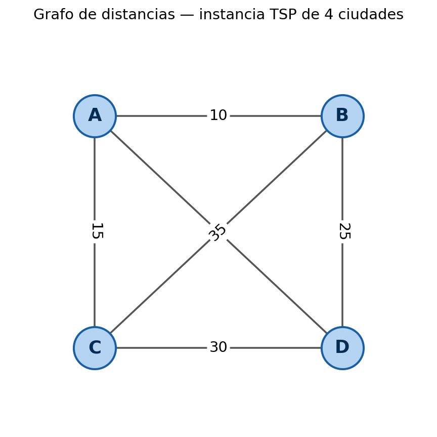
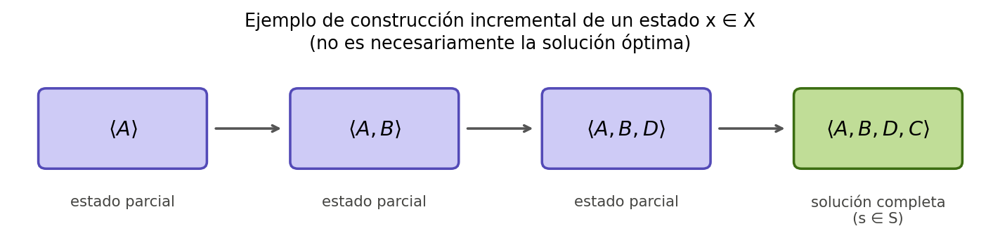

# Ejercicio — Formalización de una instancia del Problema del Viajante (TSP)

> Notas de estudio del proyecto **ESP-ACO** (UdeA). Ejercicio de aterrizaje de notación
> para optimización combinatoria, siguiendo Dorigo & Stützle, *Ant Colony Optimization*
> (MIT Press, 2004), §2.1, §2.2.1 y §2.3.1 (capítulo 3, ecuación 3.1).

---

## Formulario y notación (cheat-sheet)

**Marco general de un problema de optimización combinatoria**

| Símbolo | Definición | Notas |
|---|---|---|
| $(S, f, \Omega)$ | Terna que define una instancia del problema | $S$: soluciones candidatas · $f$: función objetivo · $\Omega$: restricciones |
| $S$ | Conjunto de **soluciones candidatas** | No necesariamente factibles |
| $\Omega$ | Conjunto de **restricciones** | Predicado que una solución debe cumplir |
| $\tilde{S}$ | Conjunto de **soluciones factibles**, $\tilde{S} \subseteq S$ | Las $s \in S$ que cumplen $\Omega$ |
| $f(s)$ | **Función objetivo** — costo de la solución $s$ | Se minimiza (o maximiza, según el problema) |
| $S^*$ | Conjunto (no vacío) de **soluciones óptimas**, $S^* \subseteq \tilde{S}$ | Puede tener más de un elemento |

**Fórmulas de conteo**

| Fórmula | Se aplica cuando... | Expresión |
|---|---|---|
| Permutaciones simples | Ordenar $n$ objetos distintos, importa el orden y el punto de partida | $P(n) = n!$ |
| Permutaciones circulares | Ordenar $n$ objetos en un ciclo, donde rotar todo el arreglo no genera un arreglo nuevo | $(n-1)!$ |

**Representación por estados (§2.2.1)**

| Símbolo | Definición |
|---|---|
| $C = \{c_1, \dots, c_{N_C}\}$ | Conjunto finito de **componentes** |
| $X$ | Conjunto de **estados**: secuencias finitas $x=\langle c_i, c_j, \dots \rangle$ sobre $C$ |
| $\tilde{X} \subseteq X$ | **Estados factibles** (factibilidad *débil*): no es imposible completar $x$ en una solución que cumpla $\Omega$ |
| $|x|$ | Longitud de la secuencia $x$ |

**Grafo de construcción (§2.2.1 / §2.3.1)**

| Símbolo | Definición | Instanciado en TSP |
|---|---|---|
| $G_C = (C, L)$ | Grafo de construcción, completamente conectado | Idéntico al grafo del problema |
| $L$ | Conjunto de **conexiones** entre componentes | $|L| = \binom{n}{2}$ para $n$ componentes (grafo completo no dirigido) |
| $d_{ij}$ | Peso/distancia asociado a la conexión $(i,j)$ | Dato de entrada del problema |

**Función objetivo del TSP — ecuación (3.1), capítulo 3**

```math
f(\pi) = \sum_{i=1}^{n-1} d_{\pi(i)\pi(i+1)} + d_{\pi(n)\pi(1)}
```

$\pi$: permutación de las ciudades que representa el tour. El último término cierra el circuito (regreso al origen).

---

## Enunciado

Considere un vendedor que debe visitar cuatro ciudades, $A$, $B$, $C$ y $D$, partiendo de una de ellas, visitando cada una exactamente una vez, y regresando finalmente a la ciudad de origen. Las distancias entre cada par de ciudades están dadas por la siguiente matriz simétrica:

| | $A$ | $B$ | $C$ | $D$ |
|---|---|---|---|---|
| $A$ | — | 10 | 15 | 20 |
| $B$ | 10 | — | 35 | 25 |
| $C$ | 15 | 35 | — | 30 |
| $D$ | 20 | 25 | 30 | — |



A partir de esta información, resuelva los siguientes numerales, indicando en cada caso la definición formal invocada y el desarrollo que conduce al resultado:

**a)** Identifique el conjunto de componentes $C$ y determine el número de ciudades $n$.

**b)** Construya el conjunto de soluciones candidatas $S$ como el conjunto de todas las permutaciones de las ciudades. Determine $|S|$, indicando la fórmula de conteo utilizada.

**c)** Explique por qué, para este problema, dos permutaciones que difieren únicamente en su punto de partida representan la **misma** solución. A partir de esa observación, determine el número de soluciones verdaderamente distintas y la fórmula de conteo que corresponde a esta reducción.

**d)** Formule explícitamente el conjunto de restricciones $\Omega$ como un predicado sobre una secuencia $s$, y verifique su cumplimiento (o incumplimiento) sobre dos secuencias concretas propuestas por usted.

**e)** A partir de $\Omega$, determine el conjunto de soluciones factibles $\tilde{S}$ para esta instancia. Justifique si $\tilde{S} = S$ o si $\tilde{S} \subsetneq S$.

**f)** Escriba la función objetivo $f(s)$ en su forma general (indicando el capítulo y ecuación del libro de donde proviene) y evalúela explícitamente sobre las 6 soluciones distintas identificadas en el numeral (c).

**g)** Determine el conjunto $S^*$ de soluciones óptimas para esta instancia. Indique si $|S^*|=1$ o $|S^*|>1$, y justifique formalmente por qué.

---

> **Nota conceptual — de dónde sale $X$**
>
> Hasta el numeral (g) trabajamos siempre con **soluciones completas**: secuencias que ya visitan las 4 ciudades. Pero una hormiga (o cualquier procedimiento constructivo) no aparece con la solución completa de golpe — la construye **un componente a la vez**. $X$ es precisamente el conjunto que registra *todas las etapas intermedias* de ese proceso, no solo el resultado final.
>
> Pensemos en cómo se construiría, paso a paso, una solución (la que se muestra a continuación es solo un ejemplo, no necesariamente la solución óptima que usted encontró en (g)):
>
> 
>
> | Paso | Secuencia construida hasta ahora | ¿Es esto una solución completa? |
> |---|---|---|
> | 1 | $\langle A \rangle$ | No — apenas 1 de 4 ciudades |
> | 2 | $\langle A, B \rangle$ | No — 2 de 4 ciudades |
> | 3 | $\langle A, B, D \rangle$ | No — 3 de 4 ciudades |
> | 4 | $\langle A, B, D, C \rangle$ | **Sí** — las 4 ciudades, ya es un elemento de $S$ |
>
> Cada fila de esa tabla es un **estado** $x \in X$. Es decir: $X$ contiene tanto las secuencias incompletas (filas 1–3) como las completas (fila 4) — **$S$ es un subconjunto de $X$** ($S \subseteq X$), específicamente el subconjunto de los estados que ya "terminaron" de construirse.
>
> Dos ejemplos adicionales, para afianzar la idea de que $X$ incluye secuencias que **todavía no son válidas ni inválidas** — simplemente están a medio construir:
> - $x = \langle C \rangle$ es un estado válido de $X$ (apenas se empezó a construir una solución distinta, arrancando en $C$).
> - $x = \langle A, D \rangle$ es otro estado de $X$, correspondiente a una construcción distinta de la anterior, que eventualmente podría completarse como $\langle A, D, B, C \rangle$ o $\langle A, D, C, B \rangle$.
>
> Con esta idea en mente, resuelva los numerales (h) e (i).

**h)** Defina el conjunto de estados $X$ como las secuencias parciales sobre $C$. Dado el estado parcial $x = \langle A, B \rangle$, indique dos posibles estados sucesores $x'$ obtenidos al añadir un componente.

---

> **Nota conceptual — factibilidad débil ($\tilde{X}$) vs factibilidad fuerte ($\tilde{S}$)**
>
> Es tentador pensar que $\tilde{X}$ es simplemente "$\tilde{S}$ pero aplicado a secuencias parciales" — el mismo criterio, en menor escala. **No es así**, y la diferencia importa:
>
> - $\tilde{S}$ (factibilidad **fuerte**) se aplica solo a secuencias **completas** ($s \in S$) y exige el cumplimiento pleno de $\Omega$.
> - $\tilde{X}$ (factibilidad **débil**) se aplica a secuencias **parciales** ($x \in X$, no necesariamente completas) y exige únicamente que **no sea imposible** completarlas en algo que termine cumpliendo $\Omega$.
>
> Para ver por qué esta distinción importa, consideremos —solo a modo de ilustración, no como parte de este ejercicio— un problema hermano del TSP: el **problema de ordenamiento secuencial** (SOP), donde además de visitar cada ciudad una vez existen restricciones de **precedencia** (por ejemplo: "la ciudad $D$ debe visitarse antes que $B$"). Ahí, un estado parcial como $\langle A, B \rangle$ podría ya ser irrecuperable: si $D$ todavía no se ha visitado y la regla exige que $D$ preceda a $B$, ninguna forma de completar esa secuencia podrá satisfacer nunca la restricción — el estado está en $X$, pero **nunca** podrá estar en $\tilde{X}$.
>
> En el TSP que estamos resolviendo esta situación extrema no se presenta (no hay restricciones de precedencia), lo cual simplifica los cálculos — pero **no** significa que la distinción conceptual desaparezca: sigue existiendo un predicado propio para $\tilde{X}$, distinto del de $\tilde{S}$, que hay que formular explícitamente en el numeral (i). No asuma que basta con "copiar" la definición de $\Omega$ usada en (d).

**i)** Formule el predicado de factibilidad débil que define $\tilde{X} \subseteq X$ para este problema, y verifique su cumplimiento sobre el estado $\langle A, B, A \rangle$ y sobre el estado $\langle A, B, D \rangle$.

**j)** Construya el grafo de construcción $G_C = (C, L)$: indique explícitamente el conjunto $L$ y el número de conexiones $|L|$, justificando la fórmula empleada.
