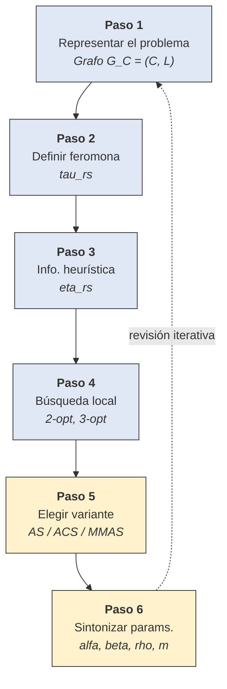
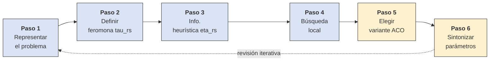

# Metaheuristica ACO 

---

## Pregunta 1 

¿Que se debe tener en cuenta para definir (crear) una metaheristica?

## Respuesta 1

Para definir o crear una **metaheurística**, es fundamental entender que se trata de una "estrategia maestra" o un marco algorítmico general diseñado para guiar a otras heurísticas específicas hacia regiones prometedoras del espacio de búsqueda.

### 1. Definir el equilibrio entre Exploración y Explotación
Este es el concepto crítico en el diseño de cualquier metaheurística:
*   **Explotación (Intensification):** Se refiere a utilizar la experiencia acumulada para concentrar la búsqueda en regiones que ya han mostrado alta calidad.
*   **Exploración (Diversification):** Se refiere a la capacidad de visitar regiones nuevas o poco exploradas para evitar quedar atrapado en óptimos locales o entrar en un estado de "estancamiento".

### 2. Determinar el uso de la Memoria
A diferencia de las heurísticas simples, muchas metaheurísticas exitosas explotan el aprendizaje o la memoria de búsquedas pasadas para dirigir la búsqueda futura:
*   En **ACO**, la memoria es **indirecta y distribuida** (feromonas).
*   En **Búsqueda Tabú**, la memoria es **explícita** (listas de movimientos prohibidos recientemente).

### 3. Elegir el enfoque: ¿Basada en poblaciones o en solución única?
*   **Poblaciones:** Se trabaja con un conjunto de soluciones simultáneamente (como en ACO o Computación Evolutiva), lo que favorece la exploración y la inteligencia colectiva.
*   **Solución única:** El algoritmo sigue una trayectoria en el espacio de búsqueda modificando una sola solución actual (como el Recocido Simulado o la Búsqueda Tabú).

### 4. Pasos prácticos para el diseño (según el marco de ACO)
Para implementar o crear una metaheurística adaptada a un problema específico, se sugieren los siguientes pasos de diseño:

1.  **Representación del problema:** Mapear el problema en componentes y transiciones (por ejemplo, un grafo de construcción).
2.  **Definir el significado de la memoria:** Establecer qué tipo de decisión se va a sesgar. Por ejemplo, en programación de tareas, ¿la memoria indicará que un trabajo debe ir en una *posición absoluta* o que debe ir *después de otro* trabajo específico?.
3.  **Incorporar información heurística:** Definir preferencias locales basadas en el conocimiento previo del problema (como la visibilidad o distancia en el problema del viajante).
4.  **Integrar Búsqueda Local (Opcional pero recomendado):** Muchas metaheurísticas alcanzan un rendimiento de clase mundial cuando se combinan con optimizadores locales que refinan las soluciones generadas.
5.  **Definir reglas de actualización:** Establecer cómo se modificará el modelo o la memoria tras cada iteración (por ejemplo, reglas de evaporación o refuerzo).

### 5. Considerar la complejidad del problema
Es vital identificar si el problema es **NP-hard**, lo que justifica el uso de una metaheurística. Al ser problemas donde el espacio de soluciones crece de forma exponencial, la metaheurística debe ser lo suficientemente flexible para encontrar soluciones "suficientemente buenas" en un tiempo razonable, sacrificando la garantía de optimicidad absoluta por eficiencia.

## Pregunta 2

Muestre en una tabla donde se muestre la aplicación de los conceptos anteriores entre las metaheuristicas tratadas. Es decir especifique cada aspecto comun instanciado para cada una de las metaheuristicas mencionadas en el libro.

## Respuesta 2 

### Comparativa de Conceptos Clave en Metaheurísticas

| Metaheurística | Enfoque Principal | Unidad de Búsqueda | Uso de Memoria | Mecanismo de Exploración / Escape de Óptimos |
| :--- | :--- | :--- | :--- | :--- |
| **ACO** (Optimización por Colonia de Hormigas) | **Constructivo**: Construye soluciones paso a paso. | **Población**: Una colonia de hormigas artificiales. | **Indirecta (Estigmergia)**: Uso de feromonas artificiales que reflejan la experiencia de búsqueda. | **Evaporación** de feromona y construcción probabilística basada en **heurística local**. |
| **Simulated Annealing** (SA) | **Búsqueda Local**: Modifica una solución completa. | **Solución Única**: Itera sobre un solo punto en el espacio de búsqueda. | **Ninguna**: Es un proceso sin memoria en su forma básica. | **Aceptación probabilística** de soluciones peores según el parámetro de "temperatura". |
| **Tabu Search** (TS) | **Búsqueda Local**: Explora vecindarios de soluciones. | **Solución Única**: Se mueve de una solución a su mejor vecina. | **Explícita**: Utiliza listas tabú (memoria de corto plazo) y frecuencias (largo plazo). | **Movimientos Tabú**: Prohíbe temporalmente regresar a estados visitados recientemente. |
| **Guided Local Search** (GLS) | **Búsqueda Local**: Guía a un algoritmo de búsqueda subyacente. | **Solución Única**. | **Explícita**: Almacena penalizaciones asociadas a características de las soluciones. | **Función de Costo Aumentada**: Modifica la evaluación de las soluciones para forzar la salida de óptimos locales. |
| **Iterated Local Search** (ILS) | **Búsqueda Local**: Aplica local search de forma repetida. | **Solución Única**. | **Historial**: Puede usar la historia de búsqueda para decidir criterios de aceptación. | **Perturbación**: Realiza cambios significativos en un óptimo local para reiniciar la búsqueda en otra región. |
| **GRASP** | **Mixto**: Fase constructiva seguida de búsqueda local. | **Solución Única**: Genera y mejora una solución por iteración. | **Ninguna**: Típicamente no guarda información entre iteraciones. | **Aleatoriedad**: La fase constructiva es una versión aleatorizada de un algoritmo codicioso. |
| **Evolutionary Computation** (EC) | **Búsqueda Local (basada en operadores)**: Usa mutación y cruce. | **Población**: Un conjunto de individuos (soluciones). | **Implícita**: La experiencia se conserva en el material genético de la población actual. | **Mutación y Recombinación**: Permiten explorar nuevas zonas del espacio de búsqueda. |
| **Scatter Search** (SS) | **Búsqueda Local**: Combina soluciones para generar nuevas. | **Población**: Utiliza un "Conjunto de Referencia" (*Reference Set*). | **Explícita**: El conjunto de referencia almacena las mejores y más diversas soluciones encontradas. | **Combinación Diversificada**: Selecciona subconjuntos de soluciones para crear nuevas por encima de la calidad actual. |

### Resumen de los Pilares de Diseño
Como se observa en la tabla, el **ACO** es único al combinar una **estrategia constructiva** con una **población** que utiliza **memoria indirecta** (feromonas). Esta combinación lo distingue de metaheurísticas de búsqueda local pura (como TS o SA) o de aquellas basadas en poblaciones que no utilizan una memoria ambiental explícita (como EC). Mientras que la búsqueda local se enfoca en refinar soluciones existentes, el enfoque constructivo de ACO construye inteligencia colectiva a través de la **estigmergia**.

## Pregunta 3

Aplica los pasos mencionados en la parte general de la metaheuristica al caso ACO

### Respuesta 3

### Respuesta 3

Para aplicar el marco general de las metaheurísticas al caso específico de la Optimización por Colonia de Hormigas (ACO), el libro de Dorigo & Stützle (2004) ofrece una guía explícita de **seis tareas de diseño** (Sección 5.7.8, *"Steps to Solve a Problem by ACO"*), que se complementa con la definición formal de la metaheurística (§2.2.3) y con la evidencia experimental sobre el número de hormigas (§1.3.2, §5.7.6).

> **Dos advertencias del propio libro antes de leer los pasos:**
> - **No es una receta lineal de una sola pasada.** El proceso suele ser iterativo: con más comprensión del problema y del comportamiento del algoritmo, decisiones tomadas inicialmente pueden necesitar revisión.
> - **No todos los pasos pesan igual.** Los primeros cuatro son los más importantes, porque un mal diseño en esa etapa no se compensa después con ajuste fino de parámetros (paso 6).

---

#### Paso 1 — Representar el problema

Se construye el **grafo de construcción**:

```math
G_C = (C, L)
```

- **C (componentes)**: piezas atómicas de una solución (ciudades en el TSP, pares variable-valor en asignación).
- **L (transiciones)**: movimientos permitidos entre componentes, sobre los que la hormiga construye la solución paso a paso.

*Ejemplo TSP*: el grafo de construcción coincide con el grafo del problema — los nodos son las ciudades, las conexiones llevan como peso la distancia entre ellas.

#### Paso 2 — Definir el significado de la feromona

Paso crucial y no trivial: requiere comprensión profunda del problema. La pregunta central es **qué tipo de decisión sesga τ**.

| Problema | Qué codifica τ_ij |
|---|---|
| TSP | Deseabilidad de visitar la ciudad *j* inmediatamente después de *i* (posición **relativa**) |
| SMTWTP (programación de tareas) | Deseabilidad de asignar el trabajo *j* a la posición *i* de la secuencia (posición **absoluta**) |
| GSP (taller) | Relaciones entre máquinas, no solo entre posiciones |

La elección depende de si el orden importa de forma cíclica (TSP → relativa) o si la posición exacta cambia el costo (SMTWTP → absoluta).

#### Paso 3 — Definir la información heurística

Preferencia local previa, independiente de lo aprendido por la feromona:

- **Estática**: fija desde el inicio. Ejemplo TSP:

```math
\eta_{ij} = \frac{1}{d_{ij}}
```

- **Dinámica**: cambia con el estado del sistema. Ejemplo: en **AntNet**, η se calcula a partir de la longitud de la cola de espera en cada enlace de red, reflejando congestión en tiempo real.

> La información heurística es especialmente crucial cuando **no** se dispone de búsqueda local (paso 4).

#### Paso 4 — Acoplar búsqueda local (si es posible)

Las hormigas construyen soluciones de exploración relativamente amplia; el mejor desempeño se obtiene refinándolas con un optimizador local (2-opt, 3-opt en el TSP).

> En la definición formal de ACO (§2.2.3), este refinamiento se enmarca como una **acción daemon**: una acción centralizada que ninguna hormiga individual podría ejecutar por sí sola, al requerir información no local.

#### Paso 5 — Elegir la variante ACO concreta

Se selecciona el "motor" del algoritmo — Ant System (AS), Ant Colony System (ACS), MAX-MIN Ant System (MMAS), entre otras (cap. 3) — lo que define principalmente:

- Qué hormigas depositan feromona (¿solo la mejor de la iteración, o la mejor histórica, *best-so-far*?).
- La tasa de evaporación ρ, que evita la convergencia prematura.

#### Paso 6 — Sintonizar los parámetros

- **α**: peso del rastro de feromona.
- **β**: peso de la información heurística.
- **m** (número de hormigas): el libro distingue dos casos.
  - **Problemas distribuidos** (enrutamiento de redes): usar colonia (m > 1) es *necesario*, porque el **efecto de longitud de camino diferencial** —observado ya en las hormigas reales del experimento del puente doble, cap. 1— solo puede manifestarse con varias hormigas actuando en paralelo.
  - **Problemas combinatorios** (TSP): ese efecto no es el motor principal, pero la evidencia experimental muestra mejor desempeño y mayor robustez con m > 1.

---

#### Diagrama de flujo del proceso de diseño



> Los pasos 1-4 (azul) son los más determinantes del resultado final; los pasos 5-6 (amarillo) son ajustes que no compensan un mal diseño en los primeros cuatro.




> **Azul (pasos 1-4):** determinantes del resultado final. **Amarillo (pasos 5-6):** ajuste fino — no compensa errores cometidos en los primeros cuatro.
> 
---

#### Tabla resumen final

| Paso | Pregunta que responde | Elemento formal en ACO | Ejemplo TSP | Importancia relativa |
|---|---|---|---|---|
| 1. Representación | ¿Cómo se estructura el espacio de soluciones? | Grafo de construcción G_C = (C, L) | Ciudades y distancias | Crítica |
| 2. Significado de la feromona | ¿Qué decisión sesga τ? | τ_rs | Deseabilidad de ir de *i* a *j* | Crítica |
| 3. Información heurística | ¿Qué conocimiento previo guía a la hormiga? | η_rs (estática/dinámica) | η_ij = 1/d_ij | Crítica (más aún sin búsqueda local) |
| 4. Búsqueda local | ¿Cómo se refina lo construido? | Acción daemon (§2.2.3) | 2-opt, 3-opt | Crítica |
| 5. Variante ACO | ¿Qué algoritmo concreto se usa? | AS / ACS / MMAS | Regla de actualización de feromona elegida | Importante |
| 6. Parámetros | ¿Cómo se equilibra exploración/explotación? | α, β, ρ, m | m > 1 mejora robustez incluso sin depender del efecto de longitud diferencial | Ajuste fino (no corrige errores de los pasos 1–4) |

