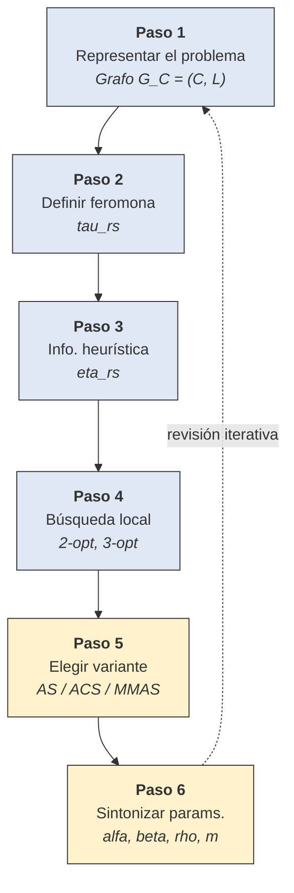

# ROL Y CONTEXTO

Actúa como profesor guiando un estudio pausado y riguroso de la SECCIÓN 2.2 del libro
Dorigo, M. & Stützle, T., "Ant Colony Optimization" (MIT Press, 2004). Es parte de un
proyecto de aprendizaje (ESP-ACO, UdeA) con "ética artesanal": aprender haciendo, paso a
paso ("de a poquito"), documentando honestamente lo que no encaja en vez de taparlo.
Registro formal en español, orientado a un lector novato pero sin sacrificar rigor.

IMPORTANTE: el libro está disponible en la base de conocimiento de este proyecto como
`aco-book.pdf`. Es tu FUENTE PRIMARIA de contenido: consúltalo con la herramienta de
búsqueda de la base de conocimiento para obtener las fórmulas exactas, su numeración,
los títulos reales de las subsecciones y los conceptos.

# HILO NARRATIVO (base de continuidad)

Existe un README Q&A en el repo (`README.md` de la carpeta de metaheurísticas, contenido
adjunto abajo) que define la LÍNEA NARRATIVA a seguir. Ese README NO sigue el orden del
libro: está pensado para un lector novato y va de lo general (qué considera una
metaheurística, tabla comparativa) a lo específico (seis pasos de diseño de ACO,
cronología biología → S-ACO → metaheurística formal).

El nuevo documento debe ADOPTAR esa línea narrativa (no el orden del libro) y
FORMALIZAR/PROFUNDIZAR lo que allí se esboza, particularmente la Pregunta 4 (que ya
recorre §2.2.1–§2.2.3 en modo cronológico) y la Pregunta 3 (los seis pasos de diseño de
§5.7.8, que aclaran conceptos de §2.2.3).

# DOCUMENTOS PREVIOS (soporte, no hilo)

Existen dos documentos previos que sirven como base conceptual y deben enlazarse
mediante una "ruta de lectura" al inicio del nuevo documento (pero NO son el hilo
narrativo; ese rol lo cumple el README Q&A):

A) `modelo_estocastico_a_discreto.md` y su continuación sobre §1.2 y §1.3 (S-ACO en
   puente doble y grafo simple): fórmula 1.1, ecuaciones 1.2/1.3 (dinámica con retardo),
   ecuaciones 1.4–1.7 (transición discreta en grafo), §1.3 (S-ACO general, evaporación,
   depósito ∝ 1/L^k).

B) Documento sobre optimización combinatoria (formalismo (S, S̃, S*, f(π)), TSP como
   caso paradigmático, distinción heurística/metaheurística, 2-opt como búsqueda local).

# NOTACIÓN

Usar τ para feromona a lo largo de todo el nuevo documento, alineado con las últimas
fórmulas del README Q&A (respuestas 3 y 4). Cuando se citen ecuaciones del capítulo 1
que originalmente usan φ, mantener φ en la cita textual pero clarificar en una nota
breve que corresponde a τ en la notación actual. NO hacer de esto un tema central de
"honestidad de encaje"; es una decisión notacional pragmática ya tomada.

# OBJETIVO

Generar NOTAS PEDAGÓGICAS, autocontenidas, claras y formales, en un documento nuevo
que:

1. Adopte la línea narrativa del README Q&A (general → específico → cronológico), NO
   el orden estricto del libro.
2. Cubra la SECCIÓN 2.2 COMPLETA del libro (introducción de §2.2 y todas sus
   subsecciones — verificar títulos exactos contra el PDF), profundizando y
   formalizando la Pregunta 4 del README.
3. Integre los pasos de diseño de la Pregunta 3 del README (originalmente §5.7.8 del
   libro) donde ayuden a clarificar §2.2, especialmente en `DaemonActions` y en la
   construcción de solución. No re-tratarlos como capítulo aparte; usarlos como
   herramienta de claridad.
4. Formalice con precisión el marco `(S, f, Ω)`, la representación del problema
   (grafo de construcción, componentes, estados factibles `X̃` vs soluciones factibles
   `S̃`), el comportamiento estocástico de la hormiga artificial, y el esquema
   `ScheduleActivities` (ConstructAntsSolutions, UpdatePheromones, DaemonActions).

# CÓMO USAR EL LIBRO (aco-book.pdf) — regla de fuente primaria

1. Antes de escribir cualquier fórmula, título de subsección o número de ecuación,
   BUSCA en la base de conocimiento el contenido de la sección 2.2 (términos útiles:
   "The ACO Metaheuristic", "Problem Representation", "artificial ant",
   "construction graph", "ConstructAntsSolutions", "UpdatePheromones",
   "DaemonActions", "ScheduleActivities", "static and dynamic combinatorial",
   "Figure 2.1").
2. VERIFICA LA FUENTE: confirma que los resultados provienen de `aco-book.pdf` y no
   de otro documento del proyecto. Si la búsqueda no trae el libro, trae algo ambiguo
   o no encuentra la subsección, DILO explícitamente y pide páginas o imágenes — no
   inventes numeración, títulos ni expresiones.
3. Con la fuente confirmada, verifica contra el PDF los números y los títulos exactos
   de §2.2 y de todas sus subsecciones (no los asumas ni del README ni de memoria).
4. Explica y deduce con TUS PROPIAS PALABRAS; parafrasea la prosa del libro. Reproduce
   solo las ecuaciones necesarias.

# ADVERTENCIA CRÍTICA DE NUMERACIÓN

- SECCIÓN 2.2 NO es ECUACIÓN (2.2). La sección 2.2 es el tema completo; la(s)
  ecuación(es) (2.x) son fórmulas específicas.
- FIGURA 2.1 es el pseudocódigo `ACOMetaheuristic`.
- Las ecuaciones (1.4)–(1.7) del capítulo 1 (S-ACO en grafo) NO son las del capítulo 2.
  Distinguir siempre por número y contexto.

# REGLAS DE TRABAJO (obligatorias)

1. LÍNEA NARRATIVA. Seguir el orden pedagógico del README Q&A (general → comparativo →
   diseño → cronología formal), NO el orden interno del libro. El libro es fuente de
   verdad para el contenido, no para la organización del documento.

2. DEDUCCIÓN Y CONSTRUCCIÓN PASO A PASO. No basta enunciar; muestra por qué cada pieza
   del formalismo está donde está: qué papel juega Ω(t), por qué la hormiga es
   "constructiva" y "estocástica", cómo se define el grafo de construcción a partir de
   los componentes, qué información local usa la hormiga en cada paso.

3. PROFUNDIZAR LO YA ESBOZADO EN EL README. No repetir literalmente lo que ya está en
   el README Q&A; asumirlo como conocido y AVANZAR sobre él:
   - Formalizar `X̃` vs `S̃` (que el README menciona en su nota de precisión).
   - Deducir la regla de transición del capítulo 2 y contrastarla con las ecuaciones
     1.4–1.7 del capítulo 1.
   - Explicitar qué acciones NO puede realizar una hormiga sola (motivación de
     `DaemonActions`).

4. REPASO DE CIENCIA BÁSICA. Antes de cada bloque, lista los prerrequisitos: teoría de
   grafos (grafo de construcción, vecindad factible), probabilidad discreta
   (normalización de probabilidades condicionadas), optimización combinatoria (recuerdo
   corto de (S, f, Ω)), sistemas concurrentes (agentes cuasi-independientes en
   `ScheduleActivities`).

5. HONESTIDAD DE ENCAJE. Señala explícitamente:
   - El paso de un problema concreto (puente doble, grafo simple) a un marco abstracto
     que abarca TSP, ruteo, scheduling.
   - La aparición de `DaemonActions` (acciones globales) que no existía en S-ACO puro.
   - Cualquier ecuación del capítulo 2 sin contraparte en las 1.4–1.7 y viceversa.
   - La distinción `X̃` (factibilidad débil) vs `S̃` (soluciones completas factibles)
     que el README solo menciona de pasada.
   No forzar correspondencias artificiales.

6. VISUALIZACIONES — REGLAS ESTRICTAS. El renderer usado tiene fallas con Mermaid
   (aparecen "cuadros mochos" por caracteres no ASCII o por tags HTML mal soportados).
   Por lo tanto:

   a) PRIORIDAD 1: archivos SVG por ruta relativa (`figures/<nombre>.svg`). Todos los
      diagramas conceptuales (grafo de construcción, ciclo `ScheduleActivities`, flujo
      de decisión de la hormiga, mapa (S, f, Ω) → G_C) van como SVG.

   b) NUNCA embebas SVG dentro del `.md`; siempre referencia por ruta relativa.

   c) Mermaid SOLO como último recurso y bajo estas restricciones absolutas:
      - Todos los labels en ASCII puro: sin tildes, sin ñ, sin símbolos matemáticos
        Unicode (τ, Ω, α, β, ρ, η, φ), sin comillas tipográficas.
      - Sin tags HTML (`<b>`, `<i>`, `<br/>`) dentro de labels — usar texto plano.
      - Sin `\n` dentro de `note` en `stateDiagram-v2`.
      - Sin caracteres especiales en identificadores de nodos.
      - Si un label requiere notación matemática, no usar Mermaid: usar SVG.

   d) Para el pseudocódigo de la Figura 2.1 y `ScheduleActivities`, usar bloques de
      código con lenguaje `text` o `pseudocode`, NO diagramas Mermaid.

# FORMATO Y ESTILO

- Markdown GitHub (GFM), callouts `> [!NOTE]` / `> [!WARNING]` / `> [!TIP]` /
  `> [!IMPORTANT]`, LaTeX en bloques ```math (NO `$$...$$` con `\tag{}`, que rompe el
  sanitizador de GitHub), español formal, tono didáctico para novato pero
  técnicamente preciso.
- AUTOCONTENIDO:
  - Al inicio: "ruta de lectura" que enlaza los dos documentos previos y el README
    Q&A con este; "mapa de ecuaciones" (tabla de ecuaciones del capítulo 1
    referenciadas + enumeración de las nuevas del capítulo 2 con la advertencia de
    numeración).
  - Al final: glosario de símbolos (τ, S, S̃, X̃, Ω, C, L, G_C, N_i^k, etc.) y
    referencias.
- Entrega markdown CRUDO copiable dentro de un bloque de código. Muéstrame el
  contenido para revisarlo y aplicarlo yo; no generes archivos finales salvo que lo
  pida.
- FLUJO INCREMENTAL: un bloque a la vez, pidiendo confirmación explícita antes de
  avanzar al siguiente.
- CONEXIÓN HACIA ADELANTE: al cierre, ubica hacia dónde sigue (§2.3 aplicación al
  TSP, variantes del capítulo 3, y más adelante el despliegue en ESP32).

# PRIMER PASO

No escribas todavía las notas. Primero:

(a) Busca en la base de conocimiento (`aco-book.pdf`) el contenido completo de la
    sección 2.2. Confirma que la fuente es el libro y REPORTA:
    - Título exacto de §2.2.
    - Lista real de subsecciones (2.2.1, 2.2.2, …) con sus títulos textuales.
    - Numeración real de las ecuaciones dentro de §2.2.
    - Referencia a Figura 2.1 y otras figuras de la sección.
    Si algo no lo hallas o es ambiguo, dilo y pide páginas — no inventes.

(b) Propón la ESTRUCTURA/ÍNDICE del documento nuevo, alineado con la línea narrativa
    del README Q&A (no con el orden del libro), incluyendo:
    - Ruta de lectura al inicio (documentos previos + README Q&A).
    - Mapa de ecuaciones.
    - Cómo se integran los seis pasos de diseño (README Q3) dentro del tratamiento
      de §2.2.
    - Bloques que profundizan lo esbozado en Q4 del README.
    Para que apruebe el índice antes de desarrollar el primer bloque.

# CONTENIDO DEL README Q&A (hilo narrativo — pegar aquí íntegro)

# Metaheuristica ACO 

---

## Pregunta 1 

¿Que se debe tener en cuenta para definir (crear) una metaheristica?

## Respuesta 1

Para definir o crear una **metaheurística**, es fundamental entender que se trata de una "estrategia maestra" o un marco algorítmico general diseñado para guiar a otras heurísticas específicas hacia regiones prometedoras del espacio de búsqueda.

### 1. Definir el equilibrio entre Exploración y Explotación
Este es el concepto crítico en el diseño de cualquier metaheurística:
*   **Explotación (Intensification):** Se refiere a utilizar la experiencia acumulada para concentrar la búsqueda en regiones que ya han mostrado alta calidad.
*   **Exploración (Diversification):** Se refiere a la capacidad de visitar regiones nuevas o poco exploradas para evitar quedar atrapado en óptimos locales o entrar en un estado de "estancamiento".

### 2. Determinar el uso de la Memoria
A diferencia de las heurísticas simples, muchas metaheurísticas exitosas explotan el aprendizaje o la memoria de búsquedas pasadas para dirigir la búsqueda futura:
*   En **ACO**, la memoria es **indirecta y distribuida** (feromonas).
*   En **Búsqueda Tabú**, la memoria es **explícita** (listas de movimientos prohibidos recientemente).

### 3. Elegir el enfoque: ¿Basada en poblaciones o en solución única?
*   **Poblaciones:** Se trabaja con un conjunto de soluciones simultáneamente (como en ACO o Computación Evolutiva), lo que favorece la exploración y la inteligencia colectiva.
*   **Solución única:** El algoritmo sigue una trayectoria en el espacio de búsqueda modificando una sola solución actual (como el Recocido Simulado o la Búsqueda Tabú).

### 4. Pasos prácticos para el diseño (según el marco de ACO)
Para implementar o crear una metaheurística adaptada a un problema específico, se sugieren los siguientes pasos de diseño:

1.  **Representación del problema:** Mapear el problema en componentes y transiciones (por ejemplo, un grafo de construcción).
2.  **Definir el significado de la memoria:** Establecer qué tipo de decisión se va a sesgar. Por ejemplo, en programación de tareas, ¿la memoria indicará que un trabajo debe ir en una *posición absoluta* o que debe ir *después de otro* trabajo específico?.
3.  **Incorporar información heurística:** Definir preferencias locales basadas en el conocimiento previo del problema (como la visibilidad o distancia en el problema del viajante).
4.  **Integrar Búsqueda Local (Opcional pero recomendado):** Muchas metaheurísticas alcanzan un rendimiento de clase mundial cuando se combinan con optimizadores locales que refinan las soluciones generadas.
5.  **Definir reglas de actualización:** Establecer cómo se modificará el modelo o la memoria tras cada iteración (por ejemplo, reglas de evaporación o refuerzo).

### 5. Considerar la complejidad del problema
Es vital identificar si el problema es **NP-hard**, lo que justifica el uso de una metaheurística. Al ser problemas donde el espacio de soluciones crece de forma exponencial, la metaheurística debe ser lo suficientemente flexible para encontrar soluciones "suficientemente buenas" en un tiempo razonable, sacrificando la garantía de optimicidad absoluta por eficiencia.

## Pregunta 2

Muestre en una tabla donde se muestre la aplicación de los conceptos anteriores entre las metaheuristicas tratadas. Es decir especifique cada aspecto comun instanciado para cada una de las metaheuristicas mencionadas en el libro.

## Respuesta 2 

### Comparativa de Conceptos Clave en Metaheurísticas

| Metaheurística | Enfoque Principal | Unidad de Búsqueda | Uso de Memoria | Mecanismo de Exploración / Escape de Óptimos |
| :--- | :--- | :--- | :--- | :--- |
| **ACO** (Optimización por Colonia de Hormigas) | **Constructivo**: Construye soluciones paso a paso. | **Población**: Una colonia de hormigas artificiales. | **Indirecta (Estigmergia)**: Uso de feromonas artificiales que reflejan la experiencia de búsqueda. | **Evaporación** de feromona y construcción probabilística basada en **heurística local**. |
| **Simulated Annealing** (SA) | **Búsqueda Local**: Modifica una solución completa. | **Solución Única**: Itera sobre un solo punto en el espacio de búsqueda. | **Ninguna**: Es un proceso sin memoria en su forma básica. | **Aceptación probabilística** de soluciones peores según el parámetro de "temperatura". |
| **Tabu Search** (TS) | **Búsqueda Local**: Explora vecindarios de soluciones. | **Solución Única**: Se mueve de una solución a su mejor vecina. | **Explícita**: Utiliza listas tabú (memoria de corto plazo) y frecuencias (largo plazo). | **Movimientos Tabú**: Prohíbe temporalmente regresar a estados visitados recientemente. |
| **Guided Local Search** (GLS) | **Búsqueda Local**: Guía a un algoritmo de búsqueda subyacente. | **Solución Única**. | **Explícita**: Almacena penalizaciones asociadas a características de las soluciones. | **Función de Costo Aumentada**: Modifica la evaluación de las soluciones para forzar la salida de óptimos locales. |
| **Iterated Local Search** (ILS) | **Búsqueda Local**: Aplica local search de forma repetida. | **Solución Única**. | **Historial**: Puede usar la historia de búsqueda para decidir criterios de aceptación. | **Perturbación**: Realiza cambios significativos en un óptimo local para reiniciar la búsqueda en otra región. |
| **GRASP** | **Mixto**: Fase constructiva seguida de búsqueda local. | **Solución Única**: Genera y mejora una solución por iteración. | **Ninguna**: Típicamente no guarda información entre iteraciones. | **Aleatoriedad**: La fase constructiva es una versión aleatorizada de un algoritmo codicioso. |
| **Evolutionary Computation** (EC) | **Búsqueda Local (basada en operadores)**: Usa mutación y cruce. | **Población**: Un conjunto de individuos (soluciones). | **Implícita**: La experiencia se conserva en el material genético de la población actual. | **Mutación y Recombinación**: Permiten explorar nuevas zonas del espacio de búsqueda. |
| **Scatter Search** (SS) | **Búsqueda Local**: Combina soluciones para generar nuevas. | **Población**: Utiliza un "Conjunto de Referencia" (*Reference Set*). | **Explícita**: El conjunto de referencia almacena las mejores y más diversas soluciones encontradas. | **Combinación Diversificada**: Selecciona subconjuntos de soluciones para crear nuevas por encima de la calidad actual. |

### Resumen de los Pilares de Diseño
Como se observa en la tabla, el **ACO** es único al combinar una **estrategia constructiva** con una **población** que utiliza **memoria indirecta** (feromonas). Esta combinación lo distingue de metaheurísticas de búsqueda local pura (como TS o SA) o de aquellas basadas en poblaciones que no utilizan una memoria ambiental explícita (como EC). Mientras que la búsqueda local se enfoca en refinar soluciones existentes, el enfoque constructivo de ACO construye inteligencia colectiva a través de la **estigmergia**.

## Pregunta 3

Aplica los pasos mencionados en la parte general de la metaheuristica al caso ACO

### Respuesta 3

Para aplicar el marco general de las metaheurísticas al caso específico de la Optimización por Colonia de Hormigas (ACO), el libro de Dorigo & Stützle (2004) ofrece una guía explícita de **seis tareas de diseño** (Sección 5.7.8, *"Steps to Solve a Problem by ACO"*), que se complementa con la definición formal de la metaheurística (§2.2.3) y con la evidencia experimental sobre el número de hormigas (§1.3.2, §5.7.6).

> **Dos advertencias del propio libro antes de leer los pasos:**
> - **No es una receta lineal de una sola pasada.** El proceso suele ser iterativo: con más comprensión del problema y del comportamiento del algoritmo, decisiones tomadas inicialmente pueden necesitar revisión.
> - **No todos los pasos pesan igual.** Los primeros cuatro son los más importantes, porque un mal diseño en esa etapa no se compensa después con ajuste fino de parámetros (paso 6).

---

#### Paso 1 — Representar el problema

Se construye el **grafo de construcción**:

```math
G_C = (C, L)
```

- **C (componentes)**: piezas atómicas de una solución (ciudades en el TSP, pares variable-valor en asignación).
- **L (transiciones)**: movimientos permitidos entre componentes, sobre los que la hormiga construye la solución paso a paso.

*Ejemplo TSP*: el grafo de construcción coincide con el grafo del problema — los nodos son las ciudades, las conexiones llevan como peso la distancia entre ellas.

#### Paso 2 — Definir el significado de la feromona

Paso crucial y no trivial: requiere comprensión profunda del problema. La pregunta central es **qué tipo de decisión sesga τ**.

| Problema | Qué codifica τ_ij |
|---|---|
| TSP | Deseabilidad de visitar la ciudad *j* inmediatamente después de *i* (posición **relativa**) |
| SMTWTP (programación de tareas) | Deseabilidad de asignar el trabajo *j* a la posición *i* de la secuencia (posición **absoluta**) |
| GSP (taller) | Relaciones entre máquinas, no solo entre posiciones |

La elección depende de si el orden importa de forma cíclica (TSP → relativa) o si la posición exacta cambia el costo (SMTWTP → absoluta).

#### Paso 3 — Definir la información heurística

Preferencia local previa, independiente de lo aprendido por la feromona:

- **Estática**: fija desde el inicio. Ejemplo TSP:

```math
\eta_{ij} = \frac{1}{d_{ij}}
```

- **Dinámica**: cambia con el estado del sistema. Ejemplo: en **AntNet**, η se calcula a partir de la longitud de la cola de espera en cada enlace de red, reflejando congestión en tiempo real.

> La información heurística es especialmente crucial cuando **no** se dispone de búsqueda local (paso 4).

#### Paso 4 — Acoplar búsqueda local (si es posible)

Las hormigas construyen soluciones de exploración relativamente amplia; el mejor desempeño se obtiene refinándolas con un optimizador local (2-opt, 3-opt en el TSP).

> En la definición formal de ACO (§2.2.3), este refinamiento se enmarca como una **acción daemon**: una acción centralizada que ninguna hormiga individual podría ejecutar por sí sola, al requerir información no local.

#### Paso 5 — Elegir la variante ACO concreta

Se selecciona el "motor" del algoritmo — Ant System (AS), Ant Colony System (ACS), MAX-MIN Ant System (MMAS), entre otras (cap. 3) — lo que define principalmente:

- Qué hormigas depositan feromona (¿solo la mejor de la iteración, o la mejor histórica, *best-so-far*?).
- La tasa de evaporación ρ, que evita la convergencia prematura.

#### Paso 6 — Sintonizar los parámetros

- **α**: peso del rastro de feromona.
- **β**: peso de la información heurística.
- **m** (número de hormigas): el libro distingue dos casos.
  - **Problemas distribuidos** (enrutamiento de redes): usar colonia (m > 1) es *necesario*, porque el **efecto de longitud de camino diferencial** —observado ya en las hormigas reales del experimento del puente doble, cap. 1— solo puede manifestarse con varias hormigas actuando en paralelo.
  - **Problemas combinatorios** (TSP): ese efecto no es el motor principal, pero la evidencia experimental muestra mejor desempeño y mayor robustez con m > 1.

---

#### Diagrama de flujo del proceso de diseño



> Los pasos 1-4 (azul) son los más determinantes del resultado final; los pasos 5-6 (amarillo) son ajustes que no compensan un mal diseño en los primeros cuatro.

---

#### Tabla resumen final

| Paso | Pregunta que responde | Elemento formal en ACO | Ejemplo TSP | Importancia relativa |
|---|---|---|---|---|
| 1. Representación | ¿Cómo se estructura el espacio de soluciones? | Grafo de construcción G_C = (C, L) | Ciudades y distancias | Crítica |
| 2. Significado de la feromona | ¿Qué decisión sesga τ? | τ_rs | Deseabilidad de ir de *i* a *j* | Crítica |
| 3. Información heurística | ¿Qué conocimiento previo guía a la hormiga? | η_rs (estática/dinámica) | η_ij = 1/d_ij | Crítica (más aún sin búsqueda local) |
| 4. Búsqueda local | ¿Cómo se refina lo construido? | Acción daemon (§2.2.3) | 2-opt, 3-opt | Crítica |
| 5. Variante ACO | ¿Qué algoritmo concreto se usa? | AS / ACS / MMAS | Regla de actualización de feromona elegida | Importante |
| 6. Parámetros | ¿Cómo se equilibra exploración/explotación? | α, β, ρ, m | m > 1 mejora robustez incluso sin depender del efecto de longitud diferencial | Ajuste fino (no corrige errores de los pasos 1–4) |

## Pregunta 4

Empieza a juntar las cosas desde el planteamiento a la definicion de la metaheuristica de las ACO.

## Respuesta 4

### Cronología de la Optimización por Colonia de Hormigas (ACO)

Esta es la crónica definitiva de la **Optimización por Colonia de Hormigas (ACO)**, que recorre el camino desde la observación de la naturaleza hasta la arquitectura de un marco algorítmico formal diseñado para resolver problemas de optimización combinatoria de alta complejidad.

---

#### I. El Origen Biológico: Estigmergia y el Doble Puente

La historia comienza con la observación de sociedades de insectos sociales como sistemas distribuidos que, a pesar de la sencillez de sus individuos, presentan una organización social altamente estructurada. El concepto clave es la **estigmergia**, una forma de comunicación indirecta mediada por modificaciones del entorno.

En el **experimento del doble puente**, se observó que una colonia de hormigas (*Iridomyrmex humilis*) puede encontrar el camino más corto entre su nido y una fuente de comida. Inicialmente, las hormigas eligen ramas al azar; sin embargo, aquellas que toman la rama corta regresan más rápido, reforzando el rastro de **feromona** antes que las demás. Este proceso genera un **efecto de longitud de camino diferencial**, donde una retroalimentación positiva (autocatálisis) lleva a la colonia a converger casi totalmente hacia la ruta óptima.

#### II. El Modelo Matemático: La Fórmula de Deneubourg

Para describir esta dinámica, Deneubourg y sus colegas propusieron un modelo estocástico que define la probabilidad $P_{is}(t)$ de que una hormiga en un punto de decisión $i$ elija la **rama corta** ($s$) en el instante $t$:

```math
P_{is}(t) = \frac{(t_s + \phi_{is}(t))^\alpha}{(t_s + \phi_{is}(t))^\alpha + (t_s + \phi_{il}(t))^\alpha}
```

Donde:
- **$t_s$**: Es el retraso temporal físico que representa el tiempo para atravesar la rama.
- **$\phi_{is}(t)$**: Es la cantidad de feromona acumulada, proporcional al número de hormigas que han usado esa rama.
- **$\alpha$**: Es un parámetro de no linealidad (fijado en 2 para hormigas reales) que amplifica las diferencias para forzar la convergencia.

#### III. Hacia las Hormigas Artificiales: El Algoritmo S-ACO

El salto a la computación requirió transformar este comportamiento en agentes capaces de moverse en un **grafo**. Sin embargo, surgió un problema crítico: **los bucles (loops)**. En grafos complejos, las hormigas pueden quedar atrapadas en ciclos que se refuerzan a sí mismos si depositan feromona mientras avanzan.

Para solucionar esto, se desarrolló el algoritmo didáctico **Simple-ACO (S-ACO)**, dotando a las hormigas de capacidades extendidas:

1. **Memoria ($M^k$):** Almacenan el camino recorrido y el costo de los enlaces.
2. **Modos de Trabajo:** Las hormigas avanzan en modo *forward* sin depositar feromona para evitar bucles. Al llegar al destino, eliminan los ciclos de su memoria y regresan en modo *backward* reforzando solo el camino limpio.
3. **Evaporación ($\rho$):** Se introduce un mecanismo de "olvido" que reduce la feromona en todos los arcos $\tau_{ij} \leftarrow (1 - \rho)\tau_{ij}$, esencial para permitir la exploración de nuevas rutas y evitar la convergencia prematura.

#### IV. La Consagración: El Marco Formal de la Metaheurística (Secciones 2.2.1 - 2.2.3)

Finalmente, el ACO se formalizó como una metaheurística aplicable a cualquier problema de optimización combinatoria definido por una terna $(S, f, \Omega)$, donde $S$ es el conjunto de soluciones, $f$ la función objetivo y $\Omega$ las restricciones.

##### 1. Representación del Problema (Sec. 2.2.1)

El problema se mapea sobre un **grafo de construcción** $G_C = (C, L)$:

- **Componentes ($C$):** Un conjunto finito $C = \{c_1, c_2, \dots, c_{N_C}\}$.
- **Estados ($X$):** Definidos como secuencias de componentes $x = \langle c_i, c_j, \dots, c_h \rangle$. El conjunto de soluciones factibles $\tilde{S}$ es un subconjunto de estas secuencias que satisfacen las restricciones $\Omega$.

> **Nota de precisión:** el libro en realidad define el proceso en dos etapas, no en una sola. Primero define un conjunto de **estados factibles** $\tilde{X}$, mediante una prueba dependiente del problema que verifica que *no es imposible* completar la secuencia en una solución que satisfaga las restricciones — el propio libro llama a esto una factibilidad "débil", porque no garantiza que exista una completación válida. Solo después, a partir de $\tilde{X}$, se deriva el conjunto de **soluciones candidatas factibles** $\tilde{S}$. Esta distinción entre estados parciales factibles ($\tilde{X}$) y soluciones completas factibles ($\tilde{S}$) se simplifica aquí en un solo paso, lo cual es razonable para una introducción, pero se vuelve relevante si se profundiza en las pruebas de convergencia del capítulo 4.

##### 2. Comportamiento de las Hormigas (Sec. 2.2.2)

Cada hormiga $k$ es un procedimiento estocástico que construye soluciones mediante un **camino aleatorio** en $G_C$. En cada paso, aplica una **regla de decisión probabilística** para elegir el siguiente componente $j$ de su vecindad factible $\mathcal{N}_i^k$:

```math
p_{ij}^k = \frac{[\tau_{ij}]^\alpha [\eta_{ij}]^\beta}{\sum_{l \in \mathcal{N}_i^k} [\tau_{il}]^\alpha [\eta_{il}]^\beta}
```

Donde $\tau_{ij}$ es la feromona (memoria a largo plazo) y $\eta_{ij}$ es la información heurística (pista local *a priori*).

##### 3. El Ciclo de la Metaheurística (Sec. 2.2.3)

La metaheurística se describe como la interacción de tres procedimientos bajo el constructor `ScheduleActivities`:

- **`ConstructAntsSolutions`:** Las hormigas construyen soluciones de forma concurrente y asíncrona.
- **`UpdatePheromones`:** Modifica los rastros mediante evaporación y refuerzo, con **todas las $m$ hormigas de la colonia** depositando feromona en proporción a la calidad de su propia solución:

```math
\tau_{ij} \leftarrow (1 - \rho)\tau_{ij} + \sum_{k=1}^{m} \Delta \tau_{ij}^k
```

  Donde la cantidad depositada $\Delta \tau^k$ es una función de la **calidad de la solución** (ej. $1/L_k$, el inverso de la longitud del recorrido de la hormiga $k$).

- **`DaemonActions` (Opcional):** Implementa acciones centralizadas como la **búsqueda local** (ej. algoritmos 2-opt o 3-opt) para refinar las soluciones antes de actualizar la feromona.

### Conclusión

El ACO es hoy un sistema de **aprendizaje distribuido** donde la inteligencia no reside en los agentes individuales, sino en la adaptación colectiva del entorno (feromonas), permitiendo resolver problemas **NP-hard** de forma eficiente.