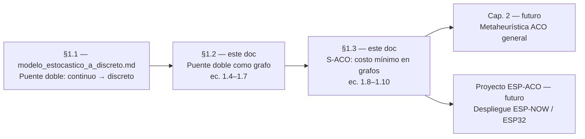
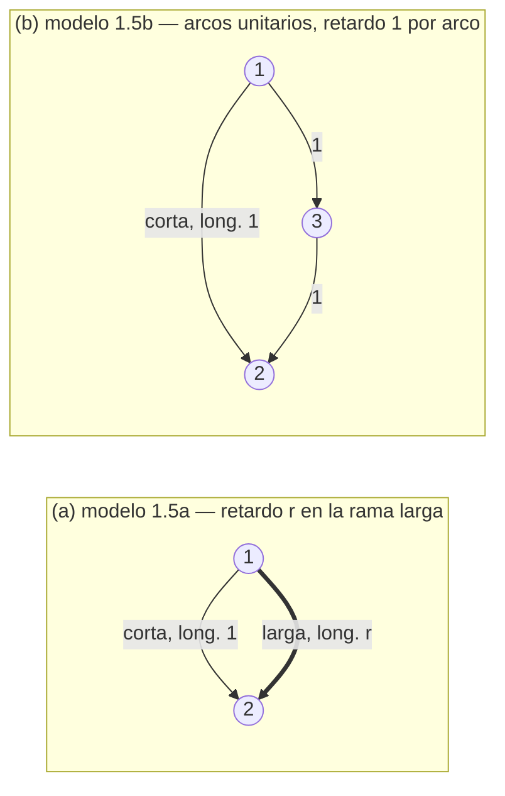
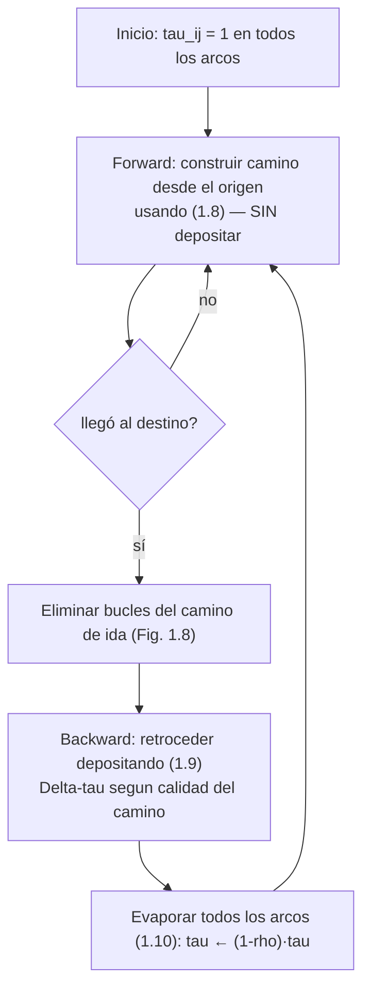
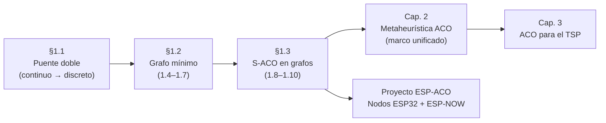

# Del puente doble al grafo: hormigas artificiales y caminos de costo mínimo (§1.2–1.3)

> Continúa a `modelo_estocastico_a_discreto.md`. Aquel documento cubrió el modelo de
> Deneubourg del puente doble (§1.1): del modelo continuo estocástico al discreto simple.
> Este documento cruza de la **dinámica temporal** al **grafo**: primero el puente doble
> discretizado como grafo de comportamiento medio (§1.2), y luego su generalización a
> caminos de costo mínimo sobre grafos arbitrarios mediante el algoritmo S-ACO (§1.3).

> [!IMPORTANT]
> **Cambio de notación respecto al documento anterior: φ → τ.**
> Aquí se adopta **τ (tau)** para la feromona, siguiendo la fuente primaria (Dorigo &
> Stützle, 2004), que usa τ desde la ecuación (1.1). Lo que en `modelo_estocastico_a_discreto.md`
> se escribió como $\varphi_{ia}$ es, en el libro y de aquí en adelante, $\tau_{ia}$.
> (Ver la errata de notación registrada en el documento anterior.)

## 0. Ruta de lectura



El hilo conductor es una única idea que se va formalizando: **el refuerzo probabilístico
de rutas por feromona**. En §1.1 vivía en el tiempo (ecuaciones diferenciales con retardo);
en §1.2 pasa a un grafo mínimo de dos nodos con dinámica en diferencias; en §1.3 se
desprende del puente doble concreto y se convierte en un algoritmo capaz de operar sobre
grafos generales. El destino último del proyecto es llevar ese mismo mecanismo a nodos
físicos que se coordinan por feromona virtual.

## 1. Mapa de ecuaciones

> [!WARNING]
> **Advertencia de numeración — no confundir.**
> - **SECCIÓN 1.2 / SECCIÓN 1.3** (los temas nuevos de este documento) **≠ ECUACIÓN (1.2) /
>   ECUACIÓN (1.3)** (las EDO con retardo de §1.1.2, ya vistas). Se distinguen siempre con
>   la palabra completa: "sección" o "ecuación".
> - **EJERCICIO 1.5** (modelo de conteos del documento anterior) **≠ ECUACIÓN (1.5)**
>   (actualización de feromona de la rama corta, definida más abajo). Comparten el número
>   por pura coincidencia.

### Ecuaciones ya deducidas (contexto de §1.1, para referencia)

| Ec.   | Forma | Rol |
|-------|-------|-----|
| (1.1) | $p_{is}(t)=\dfrac{(t_s+\tau_{is}(t))^{\alpha}}{(t_s+\tau_{is}(t))^{\alpha}+(t_s+\tau_{il}(t))^{\alpha}}$ | Regla de decisión del puente doble, con **offset** $t_s$ y exponente $\alpha\approx 2$. |
| (1.2) | $\dfrac{d\tau_{is}}{dt}=c\,p_{js}(t-t_s)+c\,p_{is}(t)$ | Dinámica de la feromona en la **rama corta** (EDO con retardo $t_s$). Ambos términos suman: **no hay evaporación**. |
| (1.3) | $\dfrac{d\tau_{il}}{dt}=c\,p_{jl}(t-r\,t_s)+c\,p_{il}(t)$ | Ídem **rama larga**, con retardo $r\,t_s$ en el término de llegada del otro extremo. |

> [!NOTE]
> En (1.1) el símbolo $t_s$ es un **offset aditivo** (evita el $0/0$ en el origen); en
> (1.2)–(1.3) el mismo $t_s$ reaparece como **tiempo de cruce** (el retardo). Es el "doble
> papel de $t_s$" ya documentado. En (1.2)–(1.3) los términos son: uno **instantáneo** (las
> hormigas que salen ahora del propio nodo, $p_{i\cdot}(t)$) más uno **retardado** (las que
> salieron del otro nodo y llegan tras cruzar, $p_{j\cdot}(t-\text{retardo})$).

### Ecuaciones nuevas (se deducen en este documento)

**§1.2 — Toward Artificial Ants** (modelo en diferencias, comportamiento medio, sin evaporación):

| Ec.   | Qué introduce |
|-------|---------------|
| (1.4) | Regla de decisión en el grafo, **sin offset** $t_s$: cociente de potencias de $\tau$. |
| (1.5) | Actualización de la feromona en la **rama corta** (ambos términos con retardo 1). |
| (1.6) | Actualización en la **rama larga** (término propio retardo 1; término cruzado retardo $r$). |
| (1.7) | Número de hormigas en el nodo $i$, $m_i(t)$ (conservación del flujo). |

**§1.3 — Artificial Ants and Minimum Cost Paths** (algoritmo S-ACO, ya con evaporación):

| Ec.   | Qué introduce |
|-------|---------------|
| (1.8) | Regla de decisión probabilística de S-ACO sobre el **vecindario** $N_i^k$ de la hormiga. |
| (1.9) | **Depósito** de feromona en modo backward: $\tau_{ij}\leftarrow\tau_{ij}+\Delta\tau^k$. |
| (1.10)| **Evaporación** exponencial: $\tau_{ij}\leftarrow(1-\rho)\,\tau_{ij}$, con $\rho\in(0,1]$. |

> [!NOTE]
> Salto de encaje que anticipamos: el offset $t_s$ **desaparece** al pasar de (1.1) a (1.4);
> y las ecuaciones (1.4)–(1.7) **todavía no tienen evaporación** (son el puente doble
> discretizado, no S-ACO). La evaporación (1.10) es una capa que se añade recién en §1.3.

## 2. Prerrequisitos (repaso de ciencia básica)

Antes de las deducciones, conviene tener a mano cinco piezas. Ninguna es avanzada; la idea
es nombrarlas para que el "de dónde sale cada término" no dependa de memoria.

**Teoría de grafos (mínima).** Un grafo $G=(N,A)$ es un conjunto de **nodos** $N$ y de
**arcos** $A$ que los conectan. Aquí los arcos son **no dirigidos**. Dos nodos $i,j$ son
**vecinos** si existe el arco $(i,j)\in A$. El **vecindario** de un nodo $i$, notado
$N_i$, es el conjunto de nodos directamente conectados a $i$. En §1.2 el grafo es minúsculo
(dos nodos, dos ramas: figura 1.5); en §1.3 el mismo lenguaje se usa sobre grafos grandes.

**Probabilidad discreta y normalización.** Una regla de decisión reparte probabilidad entre
las opciones disponibles de modo que sumen 1. Si a cada opción $a$ le asignamos un "peso"
$w_a\ge 0$, la probabilidad de elegir $a$ es $p_a=\dfrac{w_a}{\sum_b w_b}$. En el puente
doble los pesos son $w_a=[\tau_{ia}]^{\alpha}$, y por eso $p_{is}+p_{il}=1$ automáticamente.
El exponente $\alpha$ controla cuán "codiciosa" es la elección (a mayor $\alpha$, más
sesgo hacia la rama con más feromona).

**Recurrencias con retardo.** Una recurrencia expresa el estado en el paso $t$ en función de
pasos anteriores. Con **retardo** significa que aparecen términos evaluados en $t-1$, pero
también en $t-r$ (varios pasos atrás). Es el análogo discreto de las EDO con retardo de
(1.2)–(1.3): allí el retardo era un tiempo de cruce ($t_s$, $r\,t_s$); aquí será un número
entero de pasos (1 en la rama corta, $r$ en la larga).

**Sistemas dinámicos discretos.** Interesa saber a dónde tiende el sistema. Un **punto fijo**
es un estado que, aplicada la regla, se reproduce a sí mismo; puede ser **estable** (el
sistema regresa a él tras una perturbación) o **inestable**. En §1.1 ya analizamos esto en
el caso continuo ($p=0,1$ estables; $p=1/2$ inestable). En §1.2 la lectura será
cualitativa vía simulación (figura 1.6): el sistema converge al uso de la rama corta.

**Refuerzo y evaporación.** Dos fuerzas opuestas. El **refuerzo** (feedback positivo) es
depositar feromona donde ya pasaron hormigas, aumentando la probabilidad de que futuras
hormigas repitan la ruta: hace que el sistema se "decida". La **evaporación** es el
decaimiento de la feromona en el tiempo; contrarresta el refuerzo, evita el estancamiento
prematuro en una ruta subóptima y acota el valor máximo de $\tau$. En §1.2 solo hay
refuerzo; en §1.3 (S-ACO) entran ambas.

## 3. §1.2 — Toward Artificial Ants: el puente doble como grafo

### 3.1 De la ecuación diferencial al modelo en diferencias

En §1.1 el sistema vivía en tiempo continuo: las ecuaciones (1.2)–(1.3) eran EDO con
retardo que describían el comportamiento **estocástico** de hormigas individuales. El paso
que da §1.2 cambia dos cosas a la vez (el libro las enuncia explícitamente):

1. **De lo estocástico a lo medio.** Ya no seguimos a cada hormiga, sino el
   *comportamiento promedio* del sistema: cuántas hormigas hay en cada nodo y cuánta
   feromona en cada rama, en promedio.
2. **De lo continuo a lo discreto.** El tiempo avanza en pasos $t=1,2,\dots$; se usan
   ecuaciones **en diferencias** en vez de diferenciales.

Reglas del modelo discreto: cada hormiga se mueve a un nodo vecino a velocidad constante de
una unidad de longitud por unidad de tiempo, y **deposita una unidad de feromona** en los
arcos que recorre. La rama corta tiene longitud 1 (se cruza en 1 paso); la rama larga tiene
longitud $r$ (se cruza en $r$ pasos).

Variables de estado:

- $m_i(t)$: número (medio) de hormigas en el nodo $i$ en el instante $t$.
- $\tau_{ia}(t)$: feromona en la rama $a\in\{s,l\}$ tal como la "lee" una hormiga situada en
  el nodo $i$. (Es una lectura **direccional**: asociada al nodo desde el que se observa.)

### 3.2 Dos grafos equivalentes (figura 1.5)



Son **dos representaciones del mismo montaje experimental** (figura 1.1b):

- **1.5a:** la rama larga es un único arco $r$ veces más largo. Una hormiga que entra en la
  rama larga actualiza su feromona $r$ unidades de tiempo después (cuando termina de
  cruzarla).
- **1.5b:** todos los arcos miden lo mismo (longitud 1); una rama larga se representa como
  una *secuencia* de arcos (aquí $r=2$: la larga es $1\!\to\!3\!\to\!2$). La feromona se
  actualiza con un paso de retardo por arco.

Son equivalentes computacionalmente, pero **1.5b es más fácil de implementar** en grafos con
muchos nodos (todo retardo es 1; la longitud se codifica en el número de arcos). Es el modelo
que el libro simula en la figura 1.6 —y por eso allí aparecen *tres* probabilidades,
$p(1,2)$, $p(1,3)$, $p(2,3)$: existe el nodo intermedio 3.

> [!TIP]
> Para la deducción usamos la vista **1.5a** (retardos $1$ y $r$ explícitos), porque hace
> visible de dónde salen los retardos en (1.5)–(1.6). Para la implementación futura (grafos
> grandes, ESP32) conviene la vista **1.5b** (retardo 1 uniforme).

### 3.3 Deducción término a término de (1.4)–(1.7)

**Ecuación (1.4) — regla de decisión (sin offset).**

$$
p_{is}(t)=\frac{[\tau_{is}(t)]^{\alpha}}{[\tau_{is}(t)]^{\alpha}+[\tau_{il}(t)]^{\alpha}},
\qquad
p_{il}(t)=\frac{[\tau_{il}(t)]^{\alpha}}{[\tau_{is}(t)]^{\alpha}+[\tau_{il}(t)]^{\alpha}}
\tag{1.4}
$$

Es la misma estructura de (1.1) —pesos $[\tau_{ia}]^{\alpha}$ normalizados, con
$p_{is}+p_{il}=1$— **pero sin el offset $t_s$**. ¿Por qué podemos quitarlo? En (1.1) el
offset evitaba el $0/0$ cuando la feromona inicial era cero. En el modelo discreto se parte
de una cantidad de feromona **no nula** en las ramas (inicialización $\tau_{ia}(0)>0$), así
que el denominador nunca se anula y el offset deja de ser necesario.

> [!NOTE]
> Primer encaje honesto confirmado: **el $t_s$ de (1.1) desaparece en (1.4).** No es que se
> "absorba" en otro término; simplemente el problema numérico que lo motivaba ya no existe
> en el planteamiento discreto.

**Ecuación (1.5) — actualización de la rama corta.**

$$
\tau_{is}(t)=\underbrace{\tau_{is}(t-1)}_{\text{acumulado (sin evaporación)}}
+\underbrace{p_{is}(t-1)\,m_i(t-1)}_{\text{salen de } i}
+\underbrace{p_{js}(t-1)\,m_j(t-1)}_{\text{salen de } j},
\quad (i=1,j=2;\ i=2,j=1)
\tag{1.5}
$$

Término a término:

- $\tau_{is}(t-1)$: como **no hay evaporación**, toda la feromona pasada persiste.
- $p_{is}(t-1)\,m_i(t-1)$: de las $m_i(t-1)$ hormigas que estaban en $i$ hace un paso, una
  fracción $p_{is}(t-1)$ eligió la rama corta; cada una deposita 1 unidad. Como la rama
  corta mide 1, cruzan en **1 paso**: el depósito queda registrado en $t$. **Retardo 1.**
- $p_{js}(t-1)\,m_j(t-1)$: lo simétrico desde el otro nodo $j$. La rama corta es simétrica
  (longitud 1 en ambos sentidos), así que este término también tiene **retardo 1**.

Los dos términos de aporte llevan el **mismo retardo 1**: es la clave de la simetría (§3.4).

**Ecuación (1.6) — actualización de la rama larga.**

$$
\tau_{il}(t)=\tau_{il}(t-1)
+\underbrace{p_{il}(t-1)\,m_i(t-1)}_{\text{salen de } i,\ \text{retardo }1}
+\underbrace{p_{jl}(t-r)\,m_j(t-r)}_{\text{llegan de } j,\ \text{retardo }r},
\quad (i=1,j=2;\ i=2,j=1)
\tag{1.6}
$$

Aquí está la sutileza de los retardos $1$ vs $r$. Recordando la lectura de la EDO (1.3),
$d\tau_{il}/dt=c\,p_{il}(t)+c\,p_{jl}(t-r\,t_s)$, hay un término **instantáneo** y uno
**retardado**; al discretizar:

- $p_{il}(t-1)\,m_i(t-1)$ (**retardo 1**): las hormigas que **salen ahora del propio nodo $i$**
  empiezan a depositar de inmediato sobre el tramo de la rama larga **adyacente a $i$**. Desde
  la lectura de $i$, ese depósito está disponible al paso siguiente. Es el análogo discreto
  del término instantáneo.
- $p_{jl}(t-r)\,m_j(t-r)$ (**retardo $r$**): las hormigas que **salieron del otro nodo $j$**
  hace $r$ pasos recién ahora **terminan de cruzar** la rama larga y llegan al extremo de $i$.
  Su aporte a la lectura de $i$ aparece con el retardo del tiempo de cruce, $r$.

En otras palabras: cada extremo de la rama larga "ve" primero (retardo 1) lo que deposita
quien sale de ese mismo extremo, y "ve" tarde (retardo $r$) lo que llega desde el extremo
opuesto. En la rama corta ambos retardos coinciden (el tiempo de cruce vale 1), por eso
(1.5) no tiene esta asimetría.

**Ecuación (1.7) — número de hormigas en el nodo $i$.**

$$
m_i(t)=\underbrace{p_{js}(t-1)\,m_j(t-1)}_{\text{llegan por la corta}}
+\underbrace{p_{jl}(t-r)\,m_j(t-r)}_{\text{llegan por la larga}},
\quad (i=1,j=2;\ i=2,j=1)
\tag{1.7}
$$

Esto es **conservación de flujo**, sin feromona: toda hormiga que está en $i$ en el instante
$t$ llegó desde $j$ por una de las dos ramas. Por la corta salieron en $t-1$ (cruce 1 paso);
por la larga salieron en $t-r$ (cruce $r$ pasos). Nótese que aquí **no aparece $\tau$**: (1.7)
mueve hormigas, (1.5)–(1.6) mueven feromona; se acoplan a través de las probabilidades $p$.

### 3.4 Simetría: por qué $\tau_{1s}=\tau_{2s}$ pero $\tau_{1l}\neq\tau_{2l}$ en general

Escribamos (1.5) para los dos nodos:

$$
\tau_{1s}(t)=\tau_{1s}(t-1)+p_{1s}(t-1)m_1(t-1)+p_{2s}(t-1)m_2(t-1)
$$
$$
\tau_{2s}(t)=\tau_{2s}(t-1)+p_{2s}(t-1)m_2(t-1)+p_{1s}(t-1)m_1(t-1)
$$

Los aportes son **el mismo par** $\{p_{1s}m_1,\ p_{2s}m_2\}$, solo escrito en distinto orden,
y **al mismo retardo (1)**. Por tanto, si $\tau_{1s}(0)=\tau_{2s}(0)$, por inducción
$\tau_{1s}(t)=\tau_{2s}(t)$ para todo $t$ — **incluso si $m_1\neq m_2$**. La feromona de la
rama corta es intrínsecamente simétrica: el incremento es *simétrico en las etiquetas de nodo*.

Ahora (1.6):

$$
\tau_{1l}(t)=\tau_{1l}(t-1)+\underbrace{p_{1l}(t-1)m_1(t-1)}_{\text{retardo }1}
+\underbrace{p_{2l}(t-r)m_2(t-r)}_{\text{retardo }r}
$$
$$
\tau_{2l}(t)=\tau_{2l}(t-1)+\underbrace{p_{2l}(t-1)m_2(t-1)}_{\text{retardo }1}
+\underbrace{p_{1l}(t-r)m_1(t-r)}_{\text{retardo }r}
$$

Aquí $\tau_{1l}$ toma la contribución de **su propio nodo (1) al retardo 1** y la del **otro
(2) al retardo $r$**; $\tau_{2l}$ hace lo contrario. El incremento **no** es simétrico en las
etiquetas, salvo que las cantidades muestreadas al retardo 1 y al retardo $r$ coincidan —lo
que solo ocurre en régimen estacionario (todo constante) o bajo simetría perfecta entre
nodos. Durante el transitorio, con asimetría entre nodos (p. ej. todas las hormigas parten
del nido, $m_1\gg m_2$), los muestreos a retardos distintos difieren y $\tau_{1l}\neq\tau_{2l}$.

> [!IMPORTANT]
> La causa **no** es la rama en sí, sino el **desfase temporal** ($1$ vs $r$) combinado con
> una asimetría entre nodos. La rama corta no puede desfasarse (cruce = 1 paso), por eso su
> feromona queda "atada" simétrica; la rama larga sí, y por eso se desatan las dos lecturas
> mientras el sistema no se ha asentado.

### 3.5 Resultado (figura 1.6) y verificación

Simulando (1.4)–(1.7) con los parámetros del libro ($\alpha=2$, $r=2$, $N=20$ hormigas) y
partiendo con toda la población en el nido (nodo 1), se reproduce lo anterior:

| Verificación | Resultado |
|--------------|-----------|
| $\max_t\lvert\tau_{1s}-\tau_{2s}\rvert$ | $\approx 5.7\times10^{-14}$ (cero a precisión de máquina) — **rama corta simétrica** |
| $\max_t\lvert\tau_{1l}-\tau_{2l}\rvert$ | $=10$ — **rama larga asimétrica en el transitorio** |
| $p_{1s}$ (prob. de la rama corta) | $0.50 \to 0.93$ (t=5) $\to 0.995$ (t=20) $\to 0.9999$ (t=120) — **converge a la corta** |

El instante $t=1$ ilustra el desfase con nitidez: con toda la población en el nodo 1,

$$
\tau_{1l}(1)=\underbrace{1}_{\text{base}}+\underbrace{p_{1l}(0)\,m_1(0)}_{=0.5\cdot 20=10}=11,
\qquad
\tau_{2l}(1)=\underbrace{1}_{\text{base}}+0=1,
$$

porque el aporte del nodo 1 hacia el extremo del nodo 2 (retardo $r=2$) **aún no ha
llegado**; recién en $t=2$ ese término retardado alcanza a $\tau_{2l}$ y la diferencia se
reduce. La rama corta, en cambio, ya reparte simétricamente desde $t=1$.

> [!NOTE]
> Segundo encaje honesto confirmado: (1.4)–(1.7) **convergen a la rama corta sin evaporación
> alguna** — solo con refuerzo. Es el puente doble discretizado, no todavía S-ACO. La
> evaporación entra en §1.3 porque los grafos generales la necesitan, no el puente doble.

**Siguiente paso.** El modelo (1.4)–(1.7) resuelve el puente doble, pero se rompe en grafos
con más nodos: la extensión ingenua genera *bucles* que se autorrefuerzan. Eso motiva §1.3,
donde las hormigas artificiales ganan memoria, separan ida/vuelta y añaden evaporación
(S-ACO).

## 4. §1.3 — Artificial Ants and Minimum Cost Paths

El objetivo cambia de escala: ya no el puente doble, sino hallar **caminos de costo mínimo**
sobre un grafo estático y conexo $G=(N,A)$, con $N$ el conjunto de $n=\lvert N\rvert$ nodos y
$A$ el de arcos no dirigidos. Se fijan un nodo **origen** (nido) y uno **destino** (fuente de
comida). Cuando el costo del arco es su longitud, el problema de costo mínimo coincide con el
de camino más corto.

### 4.1 El problema de los bucles

Si extendemos ingenuamente las hormigas de §1.2 a un grafo general, aparece un fallo:
**las hormigas generan bucles**. Y como el depósito de feromona se hace "hacia adelante"
(*forward*), esos bucles se vuelven cada vez más atractivos y **se autorrefuerzan**: las
hormigas quedan atrapadas. Aun escapando de un bucle, la distribución global de feromona deja
de favorecer los caminos cortos, y el mecanismo que en el puente doble sesgaba hacia la ruta
corta ya no funciona.

Podría pensarse que basta con **quitar el depósito hacia adelante** (dejar solo el de vuelta,
*backward*). Pero no: como ya se vio en §1.1.2 (y en el ejercicio 1.1 del libro), si se
elimina la actualización *forward* el sistema deja de funcionar **incluso en el puente doble**.

> [!WARNING]
> El *forward updating* es imprescindible en el puente doble pero es justo lo que rompe los
> grafos generales. La salida no es quitarlo sin más, sino **rediseñar la hormiga**.

### 4.2 Las tres capacidades nuevas

La solución es dotar a las hormigas artificiales de una **memoria limitada** donde guardan el
camino parcial recorrido y el costo de los arcos atravesados. Con ella implementan tres
comportamientos:

1. **Construcción probabilística sin depósito hacia adelante.** La hormiga elige el próximo
   nodo sesgada por la feromona, pero **no deposita** mientras avanza en modo *forward*.
2. **Vuelta determinista con eliminación de bucles y depósito.** Al llegar al destino, retrocede
   por el mismo camino (modo *backward*), pero primero **elimina los bucles**; al volver,
   deposita feromona.
3. **Depósito modulado por la calidad de la solución.** Como la hormiga conoce el costo del
   camino que construyó, puede depositar **más feromona en caminos cortos**, acelerando el
   sesgo hacia buenas soluciones. (Curiosamente, esto también se observa en la naturaleza:
   Beckers et al. (1993) hallaron que en *Lasius niger* las hormigas que vuelven de fuentes
   ricas depositan más feromona.)

A esto se añade la **evaporación** de feromona: innecesaria para explicar a las hormigas
reales, pero que mejora mucho el desempeño de las artificiales. El algoritmo que reúne todo
esto se llama **S-ACO** (*Simple-ACO*), y el libro lo presenta como **herramienta didáctica**,
no como algoritmo eficiente: es el puente conceptual hacia la metaheurística ACO (capítulo 2).

### 4.3 S-ACO (§1.3.1)

A cada arco $(i,j)$ se le asocia una variable $\tau_{ij}$, el **rastro de feromona**, leído y
escrito por las hormigas; su intensidad es proporcional a la utilidad estimada de usar ese
arco. Al inicio se asigna una cantidad constante a todos los arcos (p. ej. $\tau_{ij}=1$,
$\forall (i,j)\in A$).

**Ecuación (1.8) — decisión probabilística sobre el vecindario.**

$$
p_{ij}^{k}=
\begin{cases}
\dfrac{\tau_{ij}^{\alpha}}{\displaystyle\sum_{l\in N_i^{k}}\tau_{il}^{\alpha}}, & \text{si } j\in N_i^{k},\\[2ex]
0, & \text{si } j\notin N_i^{k},
\end{cases}
\tag{1.8}
$$

donde $N_i^{k}$ es el **vecindario de la hormiga $k$ cuando está en el nodo $i$**. Misma idea
de normalización que (1.4), pero ahora la suma recorre los vecinos disponibles, no solo dos
ramas. Detalle clave de S-ACO: $N_i^{k}$ contiene todos los nodos conectados a $i$ **excepto
el predecesor** (el último nodo visitado antes de $i$), para evitar devolverse de inmediato.
Solo si $N_i^{k}$ queda vacío (un callejón sin salida) se readmite el predecesor.

> [!NOTE]
> Aun con esta regla, **se pueden formar bucles** (no volver atrás un paso no impide cerrar un
> ciclo más largo). Por eso hace falta el paso siguiente.

**Eliminación de bucles (figura 1.8).** Antes de volver, la hormiga limpia los bucles de su
camino de ida —si no, un bucle recibiría feromona varias veces al retroceder
(*self-reinforcing loops*). El procedimiento: se recorre el camino posición por posición desde
el origen; para el nodo en la posición $i$, se escanea desde el destino hasta la primera
aparición de ese nodo, digamos en la posición $j$; si $j>i$, el subcamino entre $i$ y $j$ es un
bucle y se elimina. Ejemplo del libro:

```text
Camino de ida:   0 - 1 - 3 - 4 - 5 - 3 - 2 - 8 - 5 - 6 - 9
                         └───── bucle 3-4-5-3 (longitud 3) ─────┘  → se elimina
Camino sin bucles: 0 - 1 - 3 - 2 - 8 - 5 - 6 - 9
```

> [!TIP]
> El procedimiento **no** elimina necesariamente el bucle más largo: aquí el bucle
> $5\!-\!3\!-\!2\!-\!8\!-\!5$ (longitud 4) desaparece por sí solo tras quitar el primero. Con
> bucles anidados, el resultado depende del orden; S-ACO los elimina en el mismo orden en que
> se crearon.

**Ecuación (1.9) — depósito (modo backward).** Al retroceder por el arco $(i,j)$, la hormiga
$k$ aumenta la feromona:

$$
\tau_{ij}\leftarrow\tau_{ij}+\Delta\tau^{k}
\tag{1.9}
$$

Sobre la elección de $\Delta\tau^{k}$: en el caso más simple es una **constante** igual para
todas las hormigas (y entonces solo la *diferencia de longitud* ayuda: la hormiga de camino
corto vuelve antes y deposita antes). Mejor aún, $\Delta\tau^{k}$ puede ser **función no
creciente de la longitud del camino** —a menor longitud, más feromona.

> [!IMPORTANT]
> Encaje honesto: el libro **no fija** aquí una fórmula tipo $1/L$ o $1/L^{k}$; solo exige que
> $\Delta\tau^{k}$ sea no creciente en la longitud. La forma concreta es una decisión de diseño
> (o de ejercicio), no una ecuación numerada de §1.3.

**Ecuación (1.10) — evaporación.** Tras cada movimiento de la hormiga, se evapora en todos los
arcos:

$$
\tau_{ij}\leftarrow(1-\rho)\,\tau_{ij},\qquad \forall (i,j)\in A,\quad \rho\in(0,1]
\tag{1.10}
$$

La evaporación decae la feromona con velocidad exponencial. Cumple tres funciones: es un
**mecanismo de exploración** (evita converger rápido a un camino subóptimo), permite **olvidar
errores** tempranos (cuando las hormigas aún construyen soluciones malas), y **acota el valor
máximo** que puede alcanzar $\tau$.

> [!WARNING]
> No confundir símbolos: **$r$** (entero) es la razón de longitud de la rama larga en §1.2;
> **$\rho$** (en $(0,1]$) es la tasa de evaporación en (1.10). Se parecen a la vista pero son
> cosas distintas.

**El ciclo de iteración.** Una *iteración* de S-ACO es un ciclo completo:



> [!NOTE]
> El orden importa: en S-ACO la evaporación está **intercalada** con el depósito —primero se
> evapora en todos los arcos, luego se añade $\Delta\tau^{k}$. Y ahora sí, a diferencia de
> (1.4)–(1.7), el modelo **incorpora evaporación**: es el salto de encaje que veníamos
> anunciando desde §1.2.

### 4.4 Experimentos con S-ACO (§1.3.2)

El libro evalúa tres aspectos del algoritmo: (1) el papel de la **evaporación**, (2) el
**número de hormigas**, y (3) el **tipo de actualización** (si $\Delta\tau^{k}$ depende o no de
la calidad de la solución). El criterio de juicio es la **convergencia hacia el camino de
costo mínimo**, de forma análoga a como se evaluaron los experimentos de Deneubourg et al. y el
modelo discreto de §1.2.

**Siguiente paso.** Con S-ACO cerramos el capítulo 1: hemos recorrido el camino completo de
*hormiga real* → *modelo del puente doble* → *modelo en grafo* → *algoritmo general sobre
grafos*. La generalización de este esquema (feromona + heurística + construcción + actualización)
en un marco unificado es la **metaheurística ACO** del capítulo 2. Para el proyecto ESP-ACO,
S-ACO es la referencia conceptual del despliegue distribuido: cada nodo ESP32 como hormiga que
lee/escribe feromona sobre un grafo compartido vía ESP-NOW.

## 5. Honestidad de encaje (consolidado)

Reunidos en un solo lugar, los puntos donde este documento **no fuerza** correspondencias con
lo ya visto o con la fuente:

| # | Qué no encaja | Detalle |
|---|---------------|---------|
| 1 | **φ → τ** | El libro usa **τ** desde (1.1); φ fue una elección del documento anterior. Aquí se adopta τ para casar con la fuente. Ver la errata registrada en `modelo_estocastico_a_discreto.md`. |
| 2 | **El offset $t_s$ desaparece en (1.4)** | En (1.1) $t_s$ evitaba el $0/0$; en el modelo discreto se inicializa $\tau>0$, así que el offset ya no hace falta. No se "absorbe": el problema que lo motivaba deja de existir. |
| 3 | **(1.4)–(1.7) siguen SIN evaporación** | Es el puente doble discretizado (solo refuerzo). Convergen a la rama corta sin evaporar. La evaporación (1.10) entra recién en §1.3, porque la necesitan los grafos generales, no el puente doble. |
| 4 | **Depósito $\propto 1/L$ no está fijado en §1.3** | El libro solo exige que $\Delta\tau^{k}$ sea función **no creciente** de la longitud; la forma concreta ($1/L$, $1/L^{k}$, constante…) es diseño/ejercicio, no ecuación numerada. |
| 5 | **$\tau$ es una lectura direccional** | En §1.2, $\tau_{ia}$ es "la feromona de la rama $a$ vista desde el nodo $i$", no un único escalar por arco. Por eso $\tau_{1l}$ y $\tau_{2l}$ pueden diferir aunque haya un solo arco físico. |
| 6 | **Numeración coincidente** | SECCIÓN 1.2/1.3 ≠ ECUACIÓN (1.2)/(1.3); EJERCICIO 1.5 ≠ ECUACIÓN (1.5). Ver §1 (mapa de ecuaciones). |
| 7 | **$r$ vs $\rho$** | $r$ (entero): razón de longitud de la rama larga (§1.2). $\rho\in(0,1]$: tasa de evaporación (1.10). Símbolos parecidos, conceptos distintos. |

## 6. Hacia dónde sigue



- **Capítulo 2 — Metaheurística ACO.** S-ACO se generaliza a un esquema unificado
  (construcción sesgada por feromona + información heurística + actualización de feromona),
  aplicable a problemas de optimización combinatoria arbitrarios, no solo caminos de costo
  mínimo.
- **Capítulo 3 — ACO para el TSP.** Instancia concreta y de referencia histórica (Ant System
  y sucesores).
- **Proyecto ESP-ACO.** S-ACO es la referencia conceptual del despliegue distribuido: cada
  nodo ESP32 actúa como una hormiga que lee/escribe feromona sobre un grafo compartido vía
  ESP-NOW, con la Raspberry Pi como "nido digital" pasivo. Los tres comportamientos de §4.2
  (memoria del camino, ida sin depósito, vuelta con eliminación de bucles y depósito por
  calidad) mapean directamente al firmware de cada nodo; la evaporación (1.10) se vuelve una
  regla local periódica.

## 7. Glosario de símbolos y referencias

### Símbolos

| Símbolo | Significado |
|---------|-------------|
| $G=(N,A)$ | Grafo estático conexo: nodos $N$, arcos no dirigidos $A$. |
| $n=\lvert N\rvert$ | Número de nodos. |
| $i,j$ | Nodos (en §1.2, $i=1$ nido, $j=2$ comida; convención $(i=1,j=2;\ i=2,j=1)$). |
| $a\in\{s,l\}$ | Rama: corta ($s$) o larga ($l$) en el puente doble. |
| $\tau_{ia}(t)$, $\tau_{ij}$ | Feromona: en §1.2, en la rama $a$ vista desde $i$; en §1.3, en el arco $(i,j)$. |
| $p_{ia}(t)$, $p_{ij}^{k}$ | Probabilidad de elección: rama $a$ desde $i$ (§1.2); nodo $j$ desde $i$ por la hormiga $k$ (§1.3). |
| $m_i(t)$ | Número (medio) de hormigas en el nodo $i$ en el instante $t$. |
| $\alpha$ | Exponente de la regla de decisión ($\approx 2$); controla el sesgo hacia la rama con más feromona. |
| $r$ | Entero: la rama larga es $r$ veces la corta; retardo de cruce de la rama larga. |
| $t_s$ | En (1.1): offset aditivo. En (1.2)–(1.3): tiempo de cruce de la rama corta (retardo). |
| $c$ | Tasa de paso de hormigas por unidad de tiempo (modelo continuo, (1.2)–(1.3)). |
| $N_i^{k}$ | Vecindario de la hormiga $k$ en el nodo $i$ (S-ACO): vecinos de $i$ menos el predecesor. |
| $\Delta\tau^{k}$ | Cantidad de feromona depositada por la hormiga $k$ (no creciente en la longitud del camino). |
| $\rho$ | Tasa de evaporación, $\rho\in(0,1]$ (ecuación 1.10). |

### Ecuaciones (mapa rápido)

| Ec. | Sección | Contenido |
|-----|---------|-----------|
| (1.1) | §1.1.2 | Regla de decisión con offset $t_s$. |
| (1.2), (1.3) | §1.1.2 | EDO con retardo (rama corta / larga), sin evaporación. |
| (1.4) | §1.2 | Regla de decisión en el grafo, sin offset. |
| (1.5), (1.6) | §1.2 | Actualización de feromona (corta: retardo 1 / larga: retardos 1 y $r$). |
| (1.7) | §1.2 | Conservación del flujo de hormigas, $m_i(t)$. |
| (1.8) | §1.3.1 | Decisión probabilística de S-ACO sobre el vecindario $N_i^{k}$. |
| (1.9) | §1.3.1 | Depósito de feromona en modo backward. |
| (1.10) | §1.3.1 | Evaporación exponencial. |

### Referencias

- Dorigo, M. & Stützle, T. (2004). *Ant Colony Optimization*. MIT Press (A Bradford Book).
  Capítulo 1, "From Real to Artificial Ants", §§1.2–1.3 (pp. 7–20). **Fuente primaria.**
- Deneubourg, J.-L., Aron, S., Goss, S. & Pasteels, J.-M. (1990). The self-organizing
  exploratory pattern of the Argentine ant. *Journal of Insect Behavior*.
- Goss, S., Aron, S., Deneubourg, J.-L. & Pasteels, J.-M. (1989). Self-organized shortcuts in
  the Argentine ant. *Naturwissenschaften*.
- Beckers, R., Deneubourg, J.-L. & Goss, S. (1993). Modulation of trail laying in *Lasius
  niger* y su influencia en la selección de rutas.

---

> [!NOTE]
> **Documento verificado.** Las afirmaciones sobre (1.4)–(1.7) —simetría de la rama corta,
> asimetría transitoria de la larga y convergencia a la rama corta ($\alpha=2$, $r=2$,
> $N=20$)— se comprobaron numéricamente. Las fórmulas y su numeración provienen de
> `aco-book.pdf` (fuente primaria), no del paper de estigmergia del proyecto.