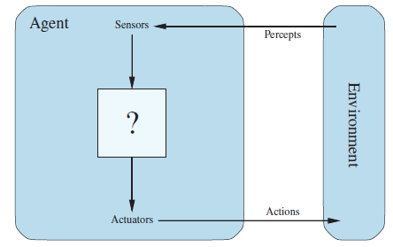
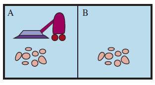
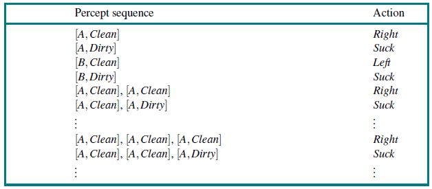
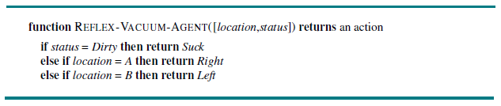
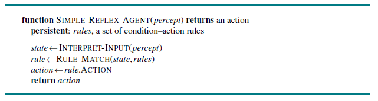
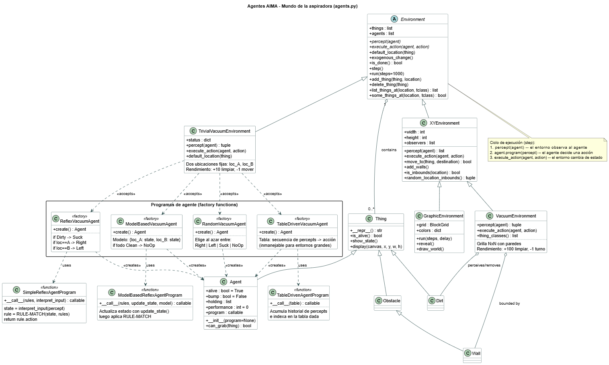

# Información sobre agentes

Material de apoyo para el estudio de **agentes inteligentes** (Capítulo 2 de *Artificial Intelligence: A Modern Approach*, AIMA). Las implementaciones se basan en el repositorio [aima-python](https://github.com/aimacode/aima-python).

---

## Parte 1 – Contenido del directorio

### Archivos

| Archivo | Descripción |
| --- | --- |
| `agents.py` | Módulo principal (AIMA Cap. 1-2). Define `Thing`, `Agent`, `Environment` y sus subclases: entornos del mundo de la aspiradora (`TrivialVacuumEnvironment`, `VacuumEnvironment`), mundo del Wumpus, y los cuatro programas de agente aspiradora. |
| `vacuum_agent.py` | Interfaz gráfica Tkinter (`Gui`) del entorno aspiradora. Permite avanzar paso a paso y marcar celdas sucias de forma interactiva. Ejecutar con `python vacuum_agent.py`. |
| `search.py` | Algoritmos de búsqueda no informada e informada: BFS, DFS, A*, búsqueda de costo uniforme, etc. (AIMA Cap. 3). |
| `logic.py` | Lógica proposicional y de primer orden: inferencia, resolución, encadenamiento (AIMA Cap. 7-9). |
| `games.py` | Juegos con adversario: minimax, poda alfa-beta, juegos de suma cero (AIMA Cap. 5). |
| `learning.py` | Algoritmos de aprendizaje supervisado: árboles de decisión, perceptrón, k-NN (AIMA Cap. 18). |
| `probability.py` | Probabilidad y redes bayesianas (AIMA Cap. 13-14). |
| `probabilistic_learning.py` | Aprendizaje probabilístico: naive Bayes, modelos de mezcla, HMM. |
| `utils.py` | Funciones auxiliares compartidas por los módulos AIMA (distancias, orientaciones, estructuras de datos). |
| `utils4e.py` | Versión de utilidades compatible con la 4ª edición de AIMA. |
| `notebook.py` | Herramientas de visualización para Jupyter (`psource` para mostrar código fuente en celdas). |
| `test_agents.py` | Suite de pruebas pytest para `agents.py`. |
| `test_agents4e.py` | Suite de pruebas pytest compatible con la 4ª edición. |
| `pytest.ini` | Configuración de pytest para el directorio. |
| `aima-data/` | Submódulo git con datos del libro AIMA (textos EN/FR/DE, páginas de manual Unix). |

### Notebooks

#### `agents.ipynb` — Agentes inteligentes

Notebook introductorio al Cap. 2 de AIMA. Muestra cómo definir un `Agent` y un `Environment` concretos: implementa un agente ciego (`BlindDog`) en un parque 1D que come y bebe según sus percepts, luego lo extiende a un entorno 2D con gráficos (`GraphicEnvironment`) y cierra con una exploración interactiva del `WumpusEnvironment`.

**Ejecutar en local:**

```bash
cd bases
jupyter notebook agents.ipynb
```

**Ejecutar en Google Colab:**  
[](https://colab.research.google.com/github/UdeA-IoT/ESP-ACO/blob/main/bases/agents.ipynb)

> El notebook detecta automáticamente si corre en Colab y clona el repositorio y las dependencias necesarias.

---

#### `vacuum_world.ipynb` — El mundo de la aspiradora

Notebook dedicado al ejemplo de la aspiradora del Cap. 2. Compara los cuatro programas de agente sobre `TrivialVacuumEnvironment` (dos habitaciones A y B):

| Programa de agente | Estrategia |
| --- | --- |
| `RandomAgentProgram` | Acción aleatoria, ignora percepts |
| `TableDrivenAgentProgram` | Tabla explícita: historial de percepts → acción |
| `SimpleReflexAgentProgram` | Regla condición-acción sobre el percept actual |
| `ModelBasedVacuumAgent` | Mantiene modelo interno del estado de A y B |

**Ejecutar en local:**

```bash
cd bases
jupyter notebook vacuum_world.ipynb
```

**Ejecutar en Google Colab:**  
[](https://colab.research.google.com/github/UdeA-IoT/ESP-ACO/blob/main/bases/vacuum_world.ipynb)

> El notebook detecta automáticamente si corre en Colab y clona el repositorio y las dependencias necesarias.

---

## Parte 2 – El agente aspiradora

Las siguientes figuras del Cap. 2 de AIMA ilustran la arquitectura e implementación del agente aspiradora tal como está codificado en `agents.py`.

### fig1_agente.png — Arquitectura general de un agente



Todo agente percibe su entorno a través de **sensores** (recibe percepts) y actúa sobre él mediante **actuadores** (emite acciones). El bloque central `?` es el **programa del agente**: la función que se debe diseñar. En código, esto corresponde a la clase `Agent`, cuyo atributo `program` implementa la función `percept → action`.

---

### fig2_agente_arpiradora.png — El mundo de la aspiradora



El entorno consta de dos habitaciones (**A** y **B**). Cada una puede estar sucia o limpia; el agente (aspiradora) ocupa una de ellas. Las acciones posibles son `Left`, `Right` y `Suck`. En código, `TrivialVacuumEnvironment` gestiona el estado como `{loc_A: 'Dirty'|'Clean', loc_B: 'Dirty'|'Clean'}` y actualiza la puntuación de desempeño del agente (+10 al limpiar, -1 por movimiento).

---

### fig3_percepciones_acciones.png — Tabla de percepts y acciones



Muestra la función agente completa del **agente basado en tabla** (`TableDrivenVacuumAgent`): dado el historial acumulado de percepts `(ubicación, estado)`, la tabla determina la acción a tomar. Es conceptualmente correcto pero inmanejable para entornos grandes. En código: `TableDrivenAgentProgram(table)` donde `table` es un diccionario de tuplas de percepts a acciones.

---

### fig4_agente_program.png — Algoritmo REFLEX-VACUUM-AGENT



Define la lógica del **agente reflejo simple** (`ReflexVacuumAgent`): reacciona únicamente al percept actual sin memoria histórica.

```text
si estado == Dirty  →  Suck
si ubicación == A   →  Right
si ubicación == B   →  Left
```

En código esto es la función anidada `program(percept)` dentro de `ReflexVacuumAgent()`.

---

### fig4_ARS_program.png — Algoritmo SIMPLE-REFLEX-AGENT



Versión genérica del agente reflejo: interpreta el percept en un estado abstracto, busca la primera regla que coincida (`RULE-MATCH`) y ejecuta la acción asociada. Generaliza `ReflexVacuumAgent` a cualquier conjunto de reglas condición-acción. En código: `SimpleReflexAgentProgram(rules, interpret_input)`.

---

### Resumen de lo que se implementa

```text
Entorno              TrivialVacuumEnvironment / VacuumEnvironment
Objetos en entorno   Dirt (suciedad), Wall (pared)

Agentes (program):
  RandomVacuumAgent        -- acción aleatoria entre Right/Left/Suck/NoOp
  TableDrivenVacuumAgent   -- tabla explícita de historial de percepts
  ReflexVacuumAgent        -- regla directa: Suck / Right / Left
  ModelBasedVacuumAgent    -- modelo interno {loc_A, loc_B} -> NoOp si todo Clean

Ciclo de ejecución (Environment.step):
  percept(agent) -> program(percept) -> action -> execute_action -> nuevo estado
```

Para el diagrama de clases completo ver [`agents_class.puml`](agents_class.puml).

---

## Diagrama de clases PlantUML

El archivo [`agents_class.puml`](agents_class.puml) contiene el diagrama de clases de `agents.py` centrado en el agente aspiradora.




## Referencias

1. Artificial Intelligence - A Modern Approach (3ed) [PDF del libro](https://people.engr.tamu.edu/guni/csce625/slides/AI.pdf)
2. CSCE-420 - Introduction to AI [Sitio de un curso](https://people.engr.tamu.edu/guni/csce420/index.html)
3. https://people.eecs.berkeley.edu/~russell/slides/
4. https://aima.cs.berkeley.edu/instructors.html
5. https://bahh723.github.io/ai2024fa/
6. https://github.com/mhahsler/Introduction_to_Artificial_Intelligence
7. https://github.com/ChalmersGU-AI-course/AI-lecture-slides
8. https://stanford-cs221.github.io/spring2026/
9. https://web.stanford.edu/class/archive/cs/cs221/cs221.1196/
10. https://ai.stanford.edu/~latombe/cs121/2011/slides/A-introduction.pdf
11. https://ocw.mit.edu/courses/6-034-artificial-intelligence-spring-2005/pages/lecture-notes/
12. https://ocw.mit.edu/courses/6-034-artificial-intelligence-fall-2010/


> [!WARNING]
> Este README fue generado con asistencia de IA y puede contener errores o inexactitudes. Se recomienda revisión humana antes de usar como referencia oficial.