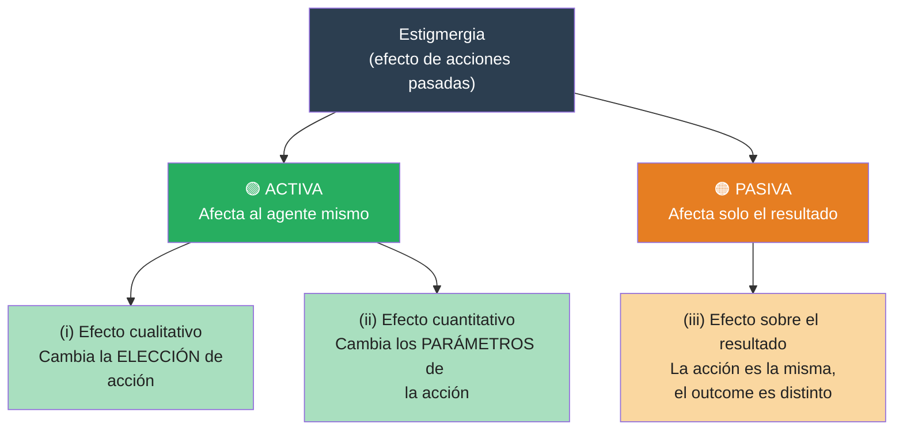
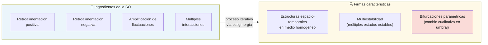
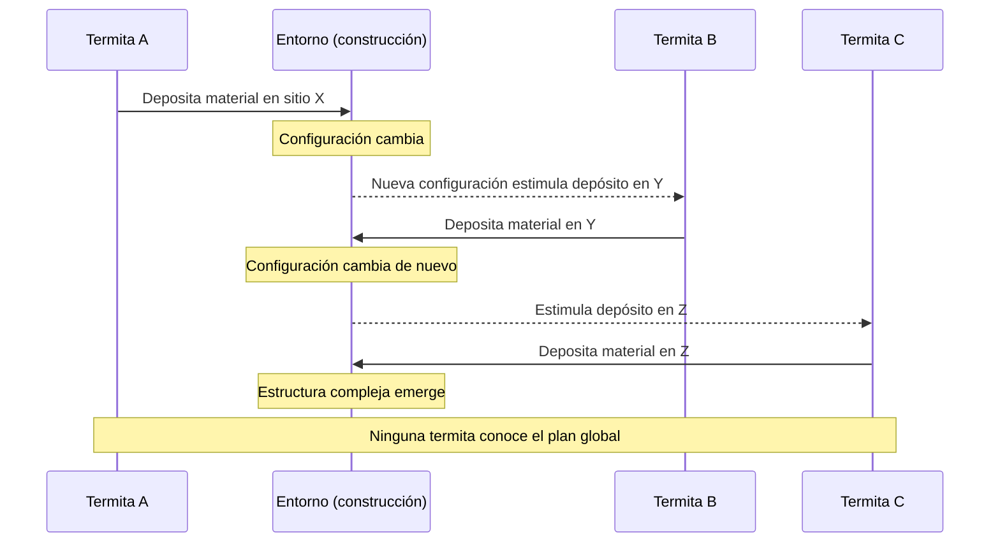
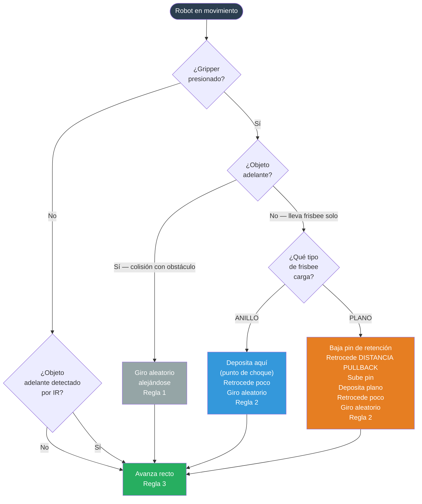
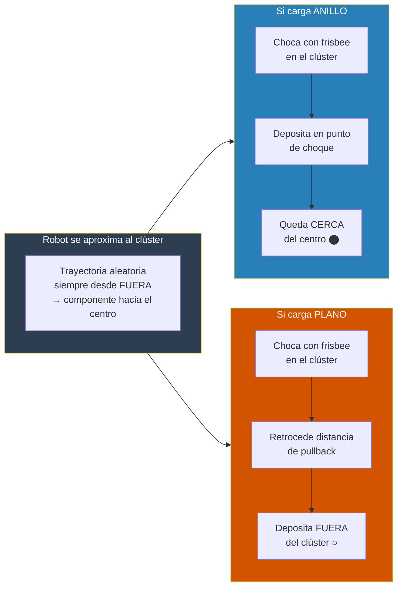
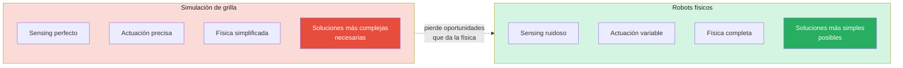

# Estigmergia, Auto-organización y Sorting — Conceptos Clave
**Fuente:** Holland & Melhuish (1999), *Stigmergy, self-organisation, and sorting in collective robotics*

---

## 1. Definición de estigmergia

Concepto introducido por **[Grassé](https://es.wikipedia.org/wiki/Pierre-Paul_Grass%C3%A9) (1959)** para explicar el comportamiento constructor de las termitas.

> [!IMPORTANT]
> *"La coordinación de tareas y la regulación de las construcciones no depende directamente de los obreros, sino de las construcciones mismas. El obrero no dirige su trabajo, sino que es guiado por él."*
> — Grassé, 1959

> [!TIP]
> **Definición operacional:** Estigmergia es la influencia sobre el comportamiento de un agente que ejercen los **efectos persistentes en el entorno** producidos por comportamientos previos. El entorno acumula "memoria" de las acciones pasadas, y esa memoria guía las acciones futuras — sin coordinación directa entre agentes.

El ciclo fundamental es:

La estigmergia funciona a través de un ciclo de interacción con el entorno:
* Un agente realiza un "trabajo" (como depositar material de construcción) en una ubicación específica
* Esta acción modifica la entrada sensorial que se obtendrá en ese lugar en el futuro. 
* Dicho cambio ambiental estimula o modifica el comportamiento posterior de otros agentes (o del mismo) en ese sitio

Las fuentes modernas amplían esta definición: la estigmergia no solo se refiere a "trabajo" físico, sino a cualquier cambio ambiental producido por un animal, incluyendo el rastro de feromonas de las hormigas. Algunos ejemplos:
1. Rastros de feromonas en hormigas
2. Construcción de termitero.
3. Caminos peatonales.
4. Wikipedia.
5. Cafeteria.

> [!IMPORTANT]
> No hay comunicación directa agente→agente. El entorno es el único canal. Esto es lo que distingue la estigmergia de la coordinación explícita.

---

## 2. Taxonomía: estigmergia activa vs. pasiva

La estigmergia se puede clasificar principalmente según la manera en que el cambio ambiental afecta el comportamiento o el resultado de las acciones de los agentes. Se distinguen tres categorías funcionales que luego se agrupan en dos tipos generales: **activa** y **pasiva**.

### 2.1. Clasificación por efecto en la acción

Existen tres formas distintas en las que el resultado de la conducta de un agente puede verse afectado por cambios ambientales previos:
* **Efecto Cualitativo**: El cambio en el entorno afecta **la elección de la acción** que realiza el agente. Este concepto captura la visión original de Grassé sobre el comportamiento siendo "guiado" por la obra misma.
* **Efecto Cuantitativo**: La acción seleccionada no cambia, pero se ven afectados sus parámetros, como la posición exacta, fuerza, frecuencia, latencia o duración. Esto incluye el elemento de la "intensidad" de la actividad.
* **Efecto en el Resultado**: En este caso, una acción previa no afecta ni la elección ni los parámetros de la acción posterior, sino únicamente su desenlace o consecuencia.

### 2.2. Estigmergia Activa vs. Pasiva

Las fuentes agrupan los efectos anteriores en dos grandes tipos:
* **Estigmergia Activa**: Comprende los efectos cualitativos y cuantitativos. Se denomina "activa" porque el estímulo ambiental afecta directamente al agente mismo (su comportamiento o decisiones).
* **Estigmergia Pasiva**: Se refiere al tercer caso, donde el entorno cambia de tal manera que altera el resultado de acciones futuras sin cambiar el comportamiento del agente.
  * **Ejemplo**: Un coche que circula por un camino embarrado. Aunque el conductor intente seguir una ruta, las ruedas pueden quedar atrapadas en los surcos dejados por conductores anteriores, forzando al coche a seguir esa trayectoria
  * **Casos físicos**: Este tipo es muy cercano a situaciones puramente físicas donde fuerzas constantes (como fluidos) cambian el entorno, afectando su evolución futura, como ocurre en la formación de dunas de arena o deltas de ríos.

### 2.3. Diferencia clave en sistemas robóticos y biológicos

La **estigmergia activa** (mediada por el comportamiento) es la que ha sido explotada por la evolución en colonias de insectos sociales y es fundamental en la robótica colectiva.

A diferencia de la puramente física, involucra agentes móviles que pueden sentir el entorno local y actuar sobre él de formas determinadas por su constitución física y computacional, lo que permite la creación de estructuras espaciotemporales mucho más ricas.

---

## 3. Estigmergia y auto-organización

La **autoorganización (SO)** y la **estigmergia** están profundamente vinculadas, siendo la estigmergia el *mecanismo fundamental* que permite que un entorno se estructure a sí mismo a través de las actividades (*mecanismo emergente*) de los agentes que lo habitan.

> [!IMPORTANT]
> **Definición de SO** (Bonabeau et al., citado en el paper): *"Un conjunto de mecanismos dinámicos donde las estructuras aparecen a nivel global a partir de interacciones entre componentes de nivel inferior. Las reglas se ejecutan sobre información puramente local, sin referencia al patrón global."*

### La Estigmergia como Motor de la Autoorganización

La estigmergia es el proceso que proporciona los ingredientes necesarios para que ocurra la autoorganización en sistemas biológicos y robóticos. Esta conexión se basa en que el estado del entorno y la distribución de los agentes determinan cómo cambiarán ambos en el futuro. Para que la estigmergia resulte en autoorganización, se requieren cuatro ingredientes básicos:
1. **Retroalimentación positiva** (amplificación de cambios).
2. **Retroalimentación negativa** (estabilización).
3. **Amplificación de fluctuaciones**.
4. **Interacciones múltiples**

### Firmas de la Autoorganización Estigmergica

Las fuentes identifican tres señales o "firmas" que confirman que un sistema estigmergico se está autoorganizando, las cuales fueron validadas en experimentos con robots:
* **Creación de estructuras espaciotemporales**: Por ejemplo, la formación de cúmulos a partir de objetos distribuidos de manera uniforme.
* **Multiestabilidad**: La capacidad del sistema para alcanzar diferentes estados estables finales partiendo de condiciones similares.
* **Bifurcaciones determinadas paramétricamente**: Cambios cualitativos bruscos en el resultado final debido a variaciones mínimas en un parámetro (como el experimento donde cambiar la probabilidad de soltar un objeto cambió el agrupamiento de central a periférico).

### Diferencia entre Sistemas Físicos y Agentes

Aunque existen procesos de autoorganización puramente físicos (como la formación de dunas de arena), la **autoorganización estigmergica** se distingue por involucrar **agentes móviles**. Estos agentes pueden sentir el entorno y actuar sobre él de formas determinadas por su constitución física y computacional, lo que permite una riqueza de estructuras espaciotemporales infinitamente mayor que las derivadas únicamente de la física ambiental.

> [!TIP]
> En resumen, la estigmergia actúa como el mecanismo de mediación (a través del entorno) que permite que las acciones locales y simples de los individuos se coordinen para generar un orden global complejo sin necesidad de una planificación central.

## 4. Comentarios adicionales

Mas alla de lo anteriormente planteado, hay unos comentarios adicionales fundamentales para comprender la profundidad y las aplicaciones de la estigmergia en sistemas naturales y artificiales:

### 4.1. Requisitos mínimos de Agente y Entorno

Para que la estigmergia ocurra, se deben cumplir condiciones mínimas en ambos componentes del sistema:
* **El Agente**: Debe tener dos capacidades clave: poder moverse por el entorno y poder actuar sobre él.
* **El Entorno**: Debe permitir cambios locales realizados por los agentes, y estos cambios deben persistir lo suficiente para afectar comportamientos futuros. Por esta razón, se descarta la estigmergia en entornos altamente dinámicos o vacíos, como el espacio exterior, el aire o el agua abierta.

### 4.2. La Estigmergia como Estrategia Social

Las fuentes destacan que la estigmergia permite una ventaja crítica para los insectos sociales: **desacoplar la tarea del individuo**.
* A diferencia de las especies solitarias, donde la ejecución de un movimiento suele depender de un "estado interno" del animal, en los sistemas estigmergicos la **señal externa es suficiente** para iniciar el siguiente paso.
* Esto garantiza que una secuencia completa de tareas (como construir un nido) se ejecute incluso **si cada movimiento es realizado por un agente diferente**, permitiendo una coordinación masiva sin comunicación directa.

### 4.3. Explotación de la Física

Un comentario central en las fuentes es que la estigmergia es, esencialmente, la "**explotación de la física a través del comportamiento**".
* Se observa que cuanto más rica y compleja es la física del entorno, más simple puede ser el comportamiento del agente.
* Esto explica por qué los experimentos con robots reales suelen encontrar soluciones más simples que las simulaciones abstractas por computadora; los robots aprovechan las **restricciones físicas reales** (como la fricción o el contacto) que a menudo se omiten en modelos digitales.

### 4.4. Sensibilidad y Evolución

Debido a que la autoorganización estigmergica surge de la interacción continua entre sensores, actuadores, el cuerpo del agente y el entorno, el sistema es **extremadamente sensible** a variaciones mínimas en cualquiera de estos factores
* Desde un punto de vista biológico, esto significa que la **evolución** tiene múltiples puntos donde actuar para modificar un resultado: puede ajustar la sensibilidad de un sensor, la forma del cuerpo o la respuesta algorítmica ante un estímulo.

### 4.5. Control Morfogenético

Finalmente, las fuentes sugieren que la estigmergia no solo controla acciones individuales en sitios específicos, sino que controla el desarrollo de una construcción mediante el **control de la distribución de los agentes** en el espacio. Al atraer a más trabajadores a zonas de alta densidad de estímulos, el sistema regula la velocidad y la forma del crecimiento estructural.

---

## 4. El experimento fundacional: las termitas de Grassé

Grassé observó termitas construyendo estructuras complejas sin ningún plano central ni líder. La clave: **la construcción misma dirige a los constructores**.

> [!TIP]
> **Lo que hace poderoso este mecanismo:**
> - No requiere coordinación directa entre agentes
> - No requiere estado interno que conecte sub-tareas secuenciales
> - La secuencia completa puede ejecutarse con **agentes distintos para cada paso**
> - La tasa de ejecución en cada ubicación es función del número de agentes presentes → el entorno **distribuye la fuerza de trabajo automáticamente**

**NOTA**: Hasta aqui ha sido bien leido el articulo, lo siguiente debe ser analizado con mas calma...

---

## 5. Demostración robótica: complejidad de reglas triviales

Holland & Melhuish demuestran que el **sorting de dos tipos de objetos** emerge de agentes con capacidades mínimas, construyendo sobre Beckers et al. (1994).

> [!IMPORTANT]
> La asimetría entre lo que los robots **tienen** y lo que **no tienen** es el argumento central del paper.

| ✅ Robots SÍ tienen | ❌ Robots NO tienen |
|---|---|
| Detectar si empujan un objeto | Memoria |
| Detectar el color del objeto en el gripper | Orientación espacial |
| Detectar obstáculos por IR | Comunicación entre robots |
| Moverse en línea recta y girar aleatoriamente | Conocimiento de densidad local |
| | Modelo del estado global |

### Taxonomía de la Clasificación Espacial

Los autores definen cuatro tipos básicos de ordenamiento de objetos:
* **Clustering (Agrupamiento)**: Reunir una clase de objetos en un área pequeña.
* **Segregación**: Agrupar dos o más clases de objetos en áreas separadas y no traslapadas.
* **Patch sorting (Clasificación por parches)**: Cada clase es agrupada y segregada en pilas distintas.
* **Annular sorting (Clasificación anular)**: Formar un núcleo de una clase rodeado por anillos concéntricos de otras clases.

### Metodología Experimental

**Agentes (U-bots)**: Robots de 23 cm de diámetro con tracción diferencial, sensores infrarrojos y una pinza diseñada para manipular "frisbees".

  
  

* **Entorno**: Una arena octogonal de gran tamaño (lados de 4m) con una cámara cenital para el seguimiento

  

* **Objetos**: Frisbees amarillos ("plains") y rojos/negros con centro blanco ("rings").

  

### El algoritmo pullback

### Por qué emerge el sorting anular

> [!NOTE]
> El sorting **no requiere** que los anillos sean físicamente más pequeños o que puedan penetrar en espacios inaccesibles a los planos. Ambos tipos llegan igual de cerca al centro. La diferencia es exclusivamente de **destino final**: los anillos se quedan donde llegan; los planos son expulsados hacia afuera.

> [!WARNING]
> **Alta varianza temporal:** en 5 réplicas, el tiempo de convergencia varió entre 2h 45m y 25h 20m — casi un orden de magnitud. Esto es una firma de los sistemas estigmérgicos con múltiples atractores: el tiempo depende de qué clústeres intermedios se forman por azar. No interpretar varianza alta como inestabilidad del mecanismo.

---

## 6. Por qué los robots físicos revelan más que las simulaciones abstractas

> [!TIP]
> **Principio central:** la estigmergia es una *explotación de la física mediante el comportamiento*. A física más rica, más simple puede ser el comportamiento.

Las simulaciones de grilla tienen dos desventajas severas frente a los robots físicos:

1. **Skating sobre sensing y actuación:** en el grid, los objetos se "conocen" directamente y las acciones tienen efectos precisos e invariantes. En el mundo real, ambas cosas son ruidosas y variables.
2. **Física empobrecida:** la geometría del movimiento en línea recta, la forma de los objetos, el radio de colisión — todo esto es parte del mecanismo estigmérgico, no ruido a eliminar.

> [!IMPORTANT]
> El Experimento 4 demostró que el mismo resultado emergente puede obtenerse ajustando un parámetro **computacional** (probabilidad p en el algoritmo) *o* un parámetro **físico** del sensor (ángulo de aceptación del IR). Esto revela que la evolución tiene **múltiples puntos de acceso** para modular un comportamiento estigmérgico — no solo el "software" del agente.

---

*Referencia completa: Holland, O. & Melhuish, C. (1999). Stigmergy, self-organisation, and sorting in collective robotics. Artificial Life.*

## Anotaciones sueltas

En terminos de Estigmergia en teminos humanos, un ejemplo puede verse en el Manual Valve [[ES]](https://media.steampowered.com/apps/valve/hbook-ES.pdf) [[EN]](https://cdn.akamai.steamstatic.com/apps/valve/Valve_NewEmployeeHandbook.pdf) de Valve Corporation [[link]](https://en.wikipedia.org/wiki/Valve_Corporation).

### Simuladores online

## Simuladores de Estigmergia

### Online

| Simulador | Descripción / Modelo | Enlace de Acceso |
| :--- | :--- | :--- |
| **NetLogo Web (Ants)** | El clásico modelo de recolección de comida de hormigas. Permite ajustar la tasa de evaporación y difusión de las feromonas en tiempo real desde el navegador. | [Simular en NetLogo Web](https://netlogoweb.org/launch#http://netlogoweb.org/assets/models/Sample%20Models/Biology/Ants.nlogo) |
| **NetLogo Web (Termites)** | Simulación de estigmergia cualitativa basada en termitas que recolectan astillas de madera. No usan feromonas, sino que modifican el entorno amontonando bloques siguiendo reglas simples. | [Simular en NetLogo Web](https://netlogoweb.org/launch#http://netlogoweb.org/assets/models/Sample%20Models/Biology/Termites.nlogo) |
| **ACO Simulator (GitHub Pages)** | Simulador interactivo en JavaScript del algoritmo de Optimización de Colonias de Hormigas enfocado en resolver el Problema del Viajero del Comercio (TSP). Permite ver visualmente los caminos de feromona. | [Abrir ACO Simulator](https://thiagodnf.github.io/aco-simulator/) |
| **NetLogo Web (Vants)** | Una variante de autómatas celulares (similar a la Hormiga de Langton) orientada a la creación de patrones estigmérgicos en una cuadrícula a través de marcas de color. | [Simular en NetLogo Web](https://www.netlogoweb.org/launch#http://netlogoweb.org/assets/models/Sample%20Models/Computer%20Science/Vants.nlogo) |

### Combinados

| Nombre | Tipo de acceso | Mecanismo principal | Relevancia para Holland & Melhuish | URL |
|---|---|---|---|---|
| **Stigmergy Swarm Simulator** | Online (browser) | Estigmergia genérica, comunicación indirecta | Alta — simulador dedicado al concepto del paper | [stigmergy-simulator.netlify.app](https://stigmergy-simulator.netlify.app/) |
| **Ant Colony Simulator (Starlighttools)** | Online (browser) | Feromona, evaporación, difusión, two-pheromone fields | Alta — captura la dinámica Deneubourg que fundamenta el paper | [starlighttools.org/science/ant-colony-simulator](https://starlighttools.org/science/ant-colony-simulator) |
| **SwarmJS** | Online (browser) | Clustering, sorting de objetos, feromona, construcción planar | Muy alta — incluye escenas de object clustering y sorting directamente análogas a los experimentos | [m-abdulhak.github.io/SwarmJS](https://m-abdulhak.github.io/SwarmJS/) |
| **NetLogo Web — Ants model** | Online (browser) | Feromona, foraging, trails emergentes | Media-Alta — modelo canónico de Wilensky que antecede al paper | [netlogoweb.org/launch#Ants](https://netlogoweb.org/launch#Ants) |
| **NetLogo Web — Ant Lines** | Online (browser) | Formación de senderos, estigmergia de trail | Media | [netlogoweb.org/launch#AntLines](https://netlogoweb.org/launch#AntLines) |
| **ARGoS3** | Desktop (Linux/Mac) | Física real, swarms de cientos de robots, modelos e-puck/foot-bot | Muy alta — el simulador más usado en literatura de swarm con estigmergia | [github.com/ilpincy/argos3](https://github.com/ilpincy/argos3) |
| **Webots** | Desktop (multiplataforma) | Física completa, robots reales modelados, comportamiento colectivo | Alta — útil para validar comportamiento cercano a hardware real | [cyberbotics.com](https://cyberbotics.com) |
| **NetLogo desktop** | Desktop (Java) | Agent-based modeling general, modelos de hormigas, clustering, sorting | Alta — plataforma sobre la que se construyeron simulaciones del linaje Deneubourg | [ccl.northwestern.edu/netlogo](https://ccl.northwestern.edu/netlogo/) |