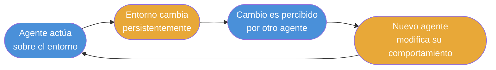
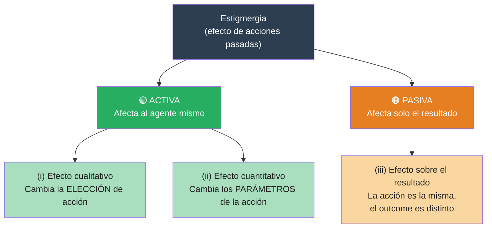
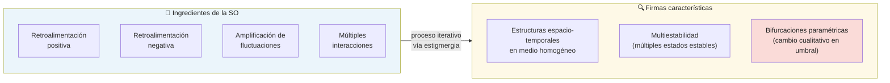
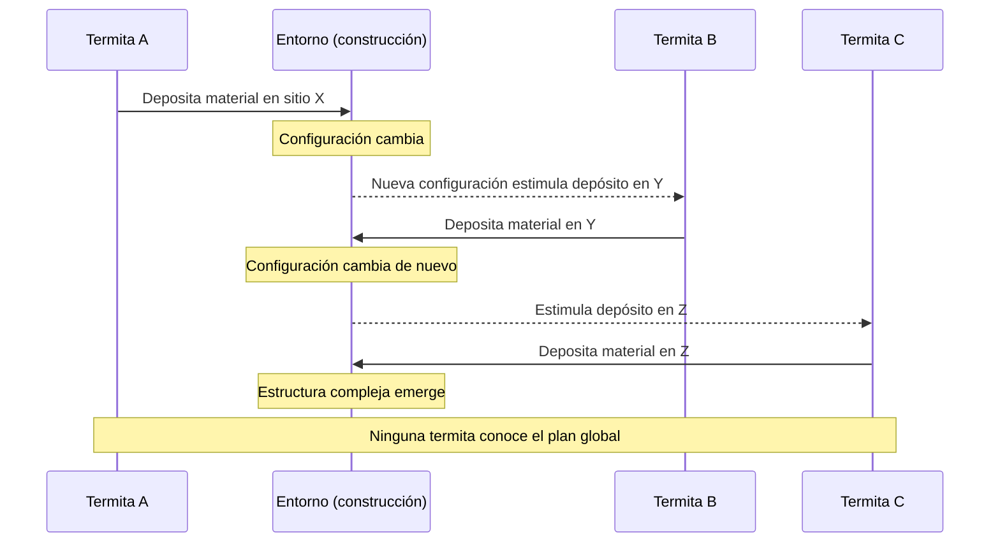
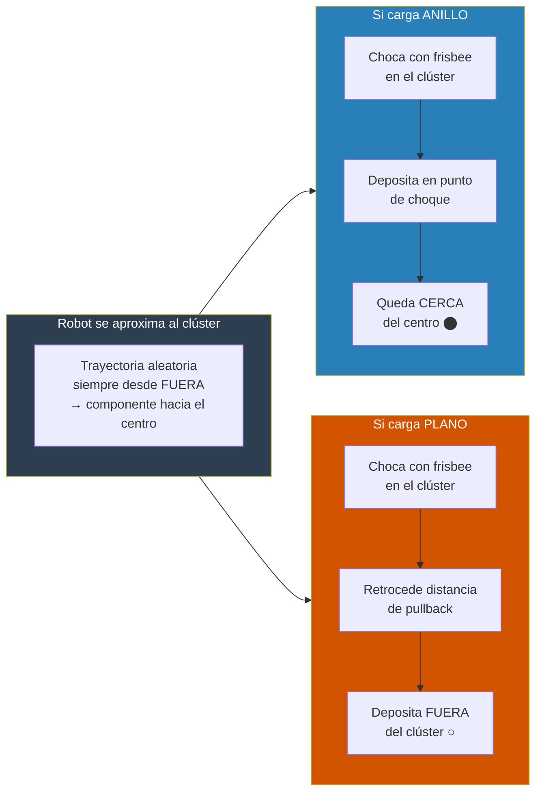
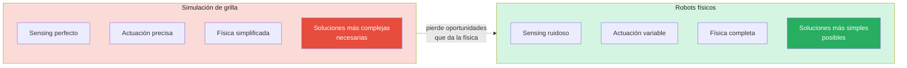

# Estigmergia, Auto-organización y Sorting — Conceptos Clave
**Fuente:** Holland & Melhuish (1999), *Stigmergy, self-organisation, and sorting in collective robotics*

---

## 1. Definición de estigmergia

Concepto introducido por **Grassé (1959)** para explicar el comportamiento constructor de las termitas.

> [!QUOTE]
> *"La coordinación de tareas y la regulación de las construcciones no depende directamente de los obreros, sino de las construcciones mismas. El obrero no dirige su trabajo, sino que es guiado por él."*
> — Grassé, 1959

> [!TIP]
> **Definición operacional:** Estigmergia es la influencia sobre el comportamiento de un agente que ejercen los **efectos persistentes en el entorno** producidos por comportamientos previos. El entorno acumula "memoria" de las acciones pasadas, y esa memoria guía las acciones futuras — sin coordinación directa entre agentes.

El ciclo fundamental es:

> [!IMPORTANT]
> No hay comunicación directa agente→agente. El entorno es el único canal. Esto es lo que distingue la estigmergia de la coordinación explícita.

---

## 2. Taxonomía: estigmergia activa vs. pasiva

Holland & Melhuish refinan el concepto identificando **tres mecanismos** por los que el entorno modificado puede afectar el comportamiento posterior:

### (i) Efecto cualitativo → estigmergia activa
Una acción previa **cambia la elección de acción** del agente siguiente. El agente hace algo *distinto* de lo que habría hecho sin esa señal ambiental. Captura el sentido original de Grassé: la acción es guiada por el entorno.

### (ii) Efecto cuantitativo → estigmergia activa
La acción elegida no cambia, pero sí sus **parámetros**: posición, intensidad, frecuencia, duración, latencia. El agente hace lo mismo pero de forma diferente.

### (iii) Efecto sobre el resultado → estigmergia pasiva
La acción previa no cambia ni la elección ni los parámetros, pero sí el **resultado físico**. El agente intenta hacer X, pero el entorno modificado produce Y.

> [!NOTE]
> **Ejemplo canónico de estigmergia pasiva:** un coche en un camino de barro. El conductor decide su trayectoria independientemente, pero las roderas de conductores anteriores desvían físicamente el resultado. Las acciones pasadas afectan el *outcome* sin tocar la decisión.

> [!TIP]
> La estigmergia pasiva se aproxima a fenómenos puramente físicos — dunas de arena, deltas de ríos, meandros — donde una fuerza constante modifica el entorno. La estigmergia **activa** añade agentes móviles con capacidad de sensar y actuar, amplificando exponencialmente el rango de estructuras posibles.

---

## 3. Estigmergia y auto-organización

La estigmergia es el **mecanismo**; la auto-organización (SO) es el **proceso emergente** que resulta de aplicarlo iterativamente.

> [!IMPORTANT]
> **Definición de SO** (Bonabeau et al., citado en el paper): *"Un conjunto de mecanismos dinámicos donde las estructuras aparecen a nivel global a partir de interacciones entre componentes de nivel inferior. Las reglas se ejecutan sobre información puramente local, sin referencia al patrón global."*

> [!WARNING]
> **Bifurcación paramétrica:** pequeños cambios en un parámetro del sistema pueden producir cambios *cualitativos* en el resultado — no graduales sino abruptos. El Experimento 3 del paper lo demuestra empíricamente: con p=0.88 el sistema produce indistintamente clústeres centrales o periféricos, dos atractores completamente distintos.

---

## 4. El experimento fundacional: las termitas de Grassé

Grassé observó termitas construyendo estructuras complejas sin ningún plano central ni líder. La clave: **la construcción misma dirige a los constructores**.

> [!TIP]
> **Lo que hace poderoso este mecanismo:**
> - No requiere coordinación directa entre agentes
> - No requiere estado interno que conecte sub-tareas secuenciales
> - La secuencia completa puede ejecutarse con **agentes distintos para cada paso**
> - La tasa de ejecución en cada ubicación es función del número de agentes presentes → el entorno **distribuye la fuerza de trabajo automáticamente**

---

## 5. Demostración robótica: complejidad de reglas triviales

Holland & Melhuish demuestran que el **sorting de dos tipos de objetos** emerge de agentes con capacidades mínimas, construyendo sobre Beckers et al. (1994).

> [!IMPORTANT]
> La asimetría entre lo que los robots **tienen** y lo que **no tienen** es el argumento central del paper.

| ✅ Robots SÍ tienen | ❌ Robots NO tienen |
|---|---|
| Detectar si empujan un objeto | Memoria |
| Detectar el color del objeto en el gripper | Orientación espacial |
| Detectar obstáculos por IR | Comunicación entre robots |
| Moverse en línea recta y girar aleatoriamente | Conocimiento de densidad local |
| | Modelo del estado global |

### El algoritmo pullback

### Por qué emerge el sorting anular

> [!NOTE]
> El sorting **no requiere** que los anillos sean físicamente más pequeños o que puedan penetrar en espacios inaccesibles a los planos. Ambos tipos llegan igual de cerca al centro. La diferencia es exclusivamente de **destino final**: los anillos se quedan donde llegan; los planos son expulsados hacia afuera.

> [!WARNING]
> **Alta varianza temporal:** en 5 réplicas, el tiempo de convergencia varió entre 2h 45m y 25h 20m — casi un orden de magnitud. Esto es una firma de los sistemas estigmérgicos con múltiples atractores: el tiempo depende de qué clústeres intermedios se forman por azar. No interpretar varianza alta como inestabilidad del mecanismo.

---

## 6. Por qué los robots físicos revelan más que las simulaciones abstractas

> [!TIP]
> **Principio central:** la estigmergia es una *explotación de la física mediante el comportamiento*. A física más rica, más simple puede ser el comportamiento.

Las simulaciones de grilla tienen dos desventajas severas frente a los robots físicos:

1. **Skating sobre sensing y actuación:** en el grid, los objetos se "conocen" directamente y las acciones tienen efectos precisos e invariantes. En el mundo real, ambas cosas son ruidosas y variables.
2. **Física empobrecida:** la geometría del movimiento en línea recta, la forma de los objetos, el radio de colisión — todo esto es parte del mecanismo estigmérgico, no ruido a eliminar.

> [!IMPORTANT]
> El Experimento 4 demostró que el mismo resultado emergente puede obtenerse ajustando un parámetro **computacional** (probabilidad p en el algoritmo) *o* un parámetro **físico** del sensor (ángulo de aceptación del IR). Esto revela que la evolución tiene **múltiples puntos de acceso** para modular un comportamiento estigmérgico — no solo el "software" del agente.

---

*Referencia completa: Holland, O. & Melhuish, C. (1999). Stigmergy, self-organisation, and sorting in collective robotics. Artificial Life.*