# Estigmergia, Auto-organización y Sorting — Conceptos Clave
**Fuente:** Holland & Melhuish (1999), *Stigmergy, self-organisation, and sorting in collective robotics*

---

## 1. Definición de estigmergia

Concepto introducido por **[Grassé](https://es.wikipedia.org/wiki/Pierre-Paul_Grass%C3%A9) (1959)** para explicar el comportamiento constructor de las termitas.

> [!IMPORTANT]
> *"La coordinación de tareas y la regulación de las construcciones no depende directamente de los obreros, sino de las construcciones mismas. El obrero no dirige su trabajo, sino que es guiado por él."*
> — Grassé, 1959


> [!TIP]
> **Definición operacional:** Estigmergia es la influencia sobre el comportamiento de un agente que ejercen los **efectos persistentes en el entorno** producidos por comportamientos previos. El entorno acumula "memoria" de las acciones pasadas, y esa memoria guía las acciones futuras — sin coordinación directa entre agentes.

El ciclo fundamental es:


La estigmergia funciona a través de un ciclo de interacción con el entorno:
* Un agente realiza un "trabajo" (como depositar material de construcción) en una ubicación específica
* Esta acción modifica la entrada sensorial que se obtendrá en ese lugar en el futuro. 
* Dicho cambio ambiental estimula o modifica el comportamiento posterior de otros agentes (o del mismo) en ese sitio

Las fuentes modernas amplían esta definición: la estigmergia no solo se refiere a "trabajo" físico, sino a cualquier cambio ambiental producido por un animal, incluyendo el rastro de feromonas de las hormigas. Algunos ejemplos:
1. Rastros de feromonas en hormigas
2. Construcción de termitero.
3. Caminos peatonales.
4. Wikipedia.
5. Cafeteria.

> [!IMPORTANT]
> No hay comunicación directa agente→agente. El entorno es el único canal. Esto es lo que distingue la estigmergia de la coordinación explícita.

---

## 2. Taxonomía: estigmergia activa vs. pasiva

La estigmergia se puede clasificar principalmente según la manera en que el cambio ambiental afecta el comportamiento o el resultado de las acciones de los agentes. Se distinguen tres categorías funcionales que luego se agrupan en dos tipos generales: **activa** y **pasiva**.

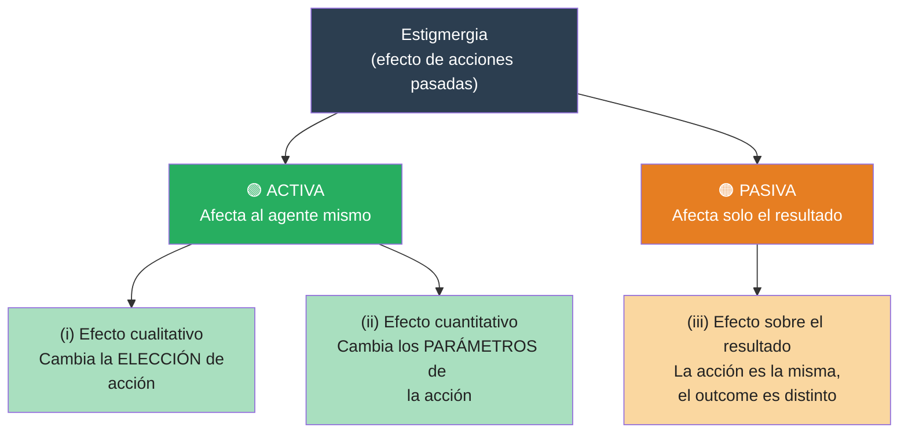

### 2.1. Clasificación por efecto en la acción

Existen tres formas distintas en las que el resultado de la conducta de un agente puede verse afectado por cambios ambientales previos:
* **Efecto Cualitativo**: El cambio en el entorno afecta **la elección de la acción** que realiza el agente. Este concepto captura la visión original de Grassé sobre el comportamiento siendo "guiado" por la obra misma.
* **Efecto Cuantitativo**: La acción seleccionada no cambia, pero se ven afectados sus parámetros, como la posición exacta, fuerza, frecuencia, latencia o duración. Esto incluye el elemento de la "intensidad" de la actividad.
* **Efecto en el Resultado**: En este caso, una acción previa no afecta ni la elección ni los parámetros de la acción posterior, sino únicamente su desenlace o consecuencia.

### 2.2. Estigmergia Activa vs. Pasiva

Las fuentes agrupan los efectos anteriores en dos grandes tipos:
* **Estigmergia Activa**: Comprende los efectos cualitativos y cuantitativos. Se denomina "activa" porque el estímulo ambiental afecta directamente al agente mismo (su comportamiento o decisiones).
* **Estigmergia Pasiva**: Se refiere al tercer caso, donde el entorno cambia de tal manera que altera el resultado de acciones futuras sin cambiar el comportamiento del agente.
  * **Ejemplo**: Un coche que circula por un camino embarrado. Aunque el conductor intente seguir una ruta, las ruedas pueden quedar atrapadas en los surcos dejados por conductores anteriores, forzando al coche a seguir esa trayectoria
  * **Casos físicos**: Este tipo es muy cercano a situaciones puramente físicas donde fuerzas constantes (como fluidos) cambian el entorno, afectando su evolución futura, como ocurre en la formación de dunas de arena o deltas de ríos.

### 2.3. Diferencia clave en sistemas robóticos y biológicos

La **estigmergia activa** (mediada por el comportamiento) es la que ha sido explotada por la evolución en colonias de insectos sociales y es fundamental en la robótica colectiva.

A diferencia de la puramente física, involucra agentes móviles que pueden sentir el entorno local y actuar sobre él de formas determinadas por su constitución física y computacional, lo que permite la creación de estructuras espaciotemporales mucho más ricas.

---

## 3. Estigmergia y auto-organización

La **autoorganización (SO)** y la **estigmergia** están profundamente vinculadas, siendo la estigmergia el *mecanismo fundamental* que permite que un entorno se estructure a sí mismo a través de las actividades (*mecanismo emergente*) de los agentes que lo habitan.

> [!IMPORTANT]
> **Definición de SO** (Bonabeau et al., citado en el paper): *"Un conjunto de mecanismos dinámicos donde las estructuras aparecen a nivel global a partir de interacciones entre componentes de nivel inferior. Las reglas se ejecutan sobre información puramente local, sin referencia al patrón global."*

### La Estigmergia como Motor de la Autoorganización

La estigmergia es el proceso que proporciona los ingredientes necesarios para que ocurra la autoorganización en sistemas biológicos y robóticos. Esta conexión se basa en que el estado del entorno y la distribución de los agentes determinan cómo cambiarán ambos en el futuro. Para que la estigmergia resulte en autoorganización, se requieren cuatro ingredientes básicos:
1. **Retroalimentación positiva** (amplificación de cambios).
2. **Retroalimentación negativa** (estabilización).
3. **Amplificación de fluctuaciones**.
4. **Interacciones múltiples**

### Firmas de la Autoorganización Estigmergica

Las fuentes identifican tres señales o "firmas" que confirman que un sistema estigmergico se está autoorganizando, las cuales fueron validadas en experimentos con robots:
* **Creación de estructuras espaciotemporales**: Por ejemplo, la formación de cúmulos a partir de objetos distribuidos de manera uniforme.
* **Multiestabilidad**: La capacidad del sistema para alcanzar diferentes estados estables finales partiendo de condiciones similares.
* **Bifurcaciones determinadas paramétricamente**: Cambios cualitativos bruscos en el resultado final debido a variaciones mínimas en un parámetro (como el experimento donde cambiar la probabilidad de soltar un objeto cambió el agrupamiento de central a periférico).


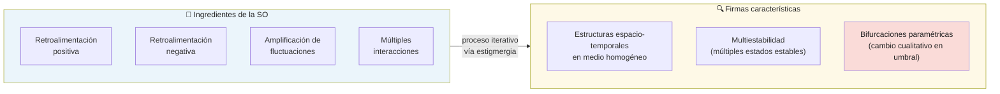

### Diferencia entre Sistemas Físicos y Agentes

Aunque existen procesos de autoorganización puramente físicos (como la formación de dunas de arena), la **autoorganización estigmergica** se distingue por involucrar **agentes móviles**. Estos agentes pueden sentir el entorno y actuar sobre él de formas determinadas por su constitución física y computacional, lo que permite una riqueza de estructuras espaciotemporales infinitamente mayor que las derivadas únicamente de la física ambiental.

> [!TIP]
> En resumen, la estigmergia actúa como el mecanismo de mediación (a través del entorno) que permite que las acciones locales y simples de los individuos se coordinen para generar un orden global complejo sin necesidad de una planificación central.

## 4. Comentarios adicionales

Mas alla de lo anteriormente planteado, hay unos comentarios adicionales fundamentales para comprender la profundidad y las aplicaciones de la estigmergia en sistemas naturales y artificiales:

### 4.1. Requisitos mínimos de Agente y Entorno

Para que la estigmergia ocurra, se deben cumplir condiciones mínimas en ambos componentes del sistema:
* **El Agente**: Debe tener dos capacidades clave: poder moverse por el entorno y poder actuar sobre él.
* **El Entorno**: Debe permitir cambios locales realizados por los agentes, y estos cambios deben persistir lo suficiente para afectar comportamientos futuros. Por esta razón, se descarta la estigmergia en entornos altamente dinámicos o vacíos, como el espacio exterior, el aire o el agua abierta.

### 4.2. La Estigmergia como Estrategia Social

Las fuentes destacan que la estigmergia permite una ventaja crítica para los insectos sociales: **desacoplar la tarea del individuo**.
* A diferencia de las especies solitarias, donde la ejecución de un movimiento suele depender de un "estado interno" del animal, en los sistemas estigmergicos la **señal externa es suficiente** para iniciar el siguiente paso.
* Esto garantiza que una secuencia completa de tareas (como construir un nido) se ejecute incluso **si cada movimiento es realizado por un agente diferente**, permitiendo una coordinación masiva sin comunicación directa.

### 4.3. Explotación de la Física

Un comentario central en las fuentes es que la estigmergia es, esencialmente, la "**explotación de la física a través del comportamiento**".
* Se observa que cuanto más rica y compleja es la física del entorno, más simple puede ser el comportamiento del agente.
* Esto explica por qué los experimentos con robots reales suelen encontrar soluciones más simples que las simulaciones abstractas por computadora; los robots aprovechan las **restricciones físicas reales** (como la fricción o el contacto) que a menudo se omiten en modelos digitales.

### 4.4. Sensibilidad y Evolución

Debido a que la autoorganización estigmergica surge de la interacción continua entre sensores, actuadores, el cuerpo del agente y el entorno, el sistema es **extremadamente sensible** a variaciones mínimas en cualquiera de estos factores
* Desde un punto de vista biológico, esto significa que la **evolución** tiene múltiples puntos donde actuar para modificar un resultado: puede ajustar la sensibilidad de un sensor, la forma del cuerpo o la respuesta algorítmica ante un estímulo.

### 4.5. Control Morfogenético

Finalmente, las fuentes sugieren que la estigmergia no solo controla acciones individuales en sitios específicos, sino que controla el desarrollo de una construcción mediante el **control de la distribución de los agentes** en el espacio. Al atraer a más trabajadores a zonas de alta densidad de estímulos, el sistema regula la velocidad y la forma del crecimiento estructural.

---

## 4. El experimento fundacional: las termitas de Grassé

Grassé observó termitas construyendo estructuras complejas sin ningún plano central ni líder. La clave: **la construcción misma dirige a los constructores**.

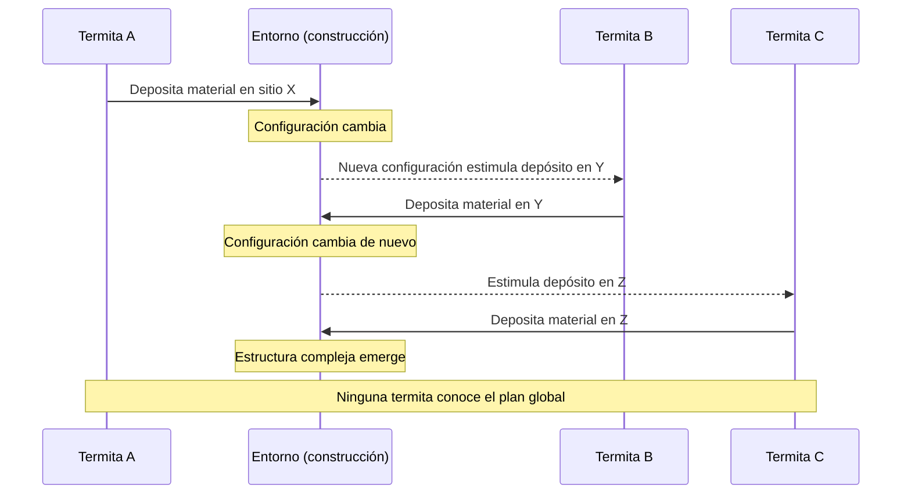

> [!TIP]
> **Lo que hace poderoso este mecanismo:**
> - No requiere coordinación directa entre agentes
> - No requiere estado interno que conecte sub-tareas secuenciales
> - La secuencia completa puede ejecutarse con **agentes distintos para cada paso**
> - La tasa de ejecución en cada ubicación es función del número de agentes presentes → el entorno **distribuye la fuerza de trabajo automáticamente**

**NOTA**: Hasta aqui ha sido bien leido el articulo, lo siguiente debe ser analizado con mas calma...

---

## 5. Demostración robótica: complejidad de reglas triviales

Holland & Melhuish demuestran que el **sorting de dos tipos de objetos** emerge de agentes con capacidades mínimas, construyendo sobre Beckers et al. (1994).

> [!IMPORTANT]
> La asimetría entre lo que los robots **tienen** y lo que **no tienen** es el argumento central del paper.

| ✅ Robots SÍ tienen | ❌ Robots NO tienen |
|---|---|
| Detectar si empujan un objeto | Memoria |
| Detectar el color del objeto en el gripper | Orientación espacial |
| Detectar obstáculos por IR | Comunicación entre robots |
| Moverse en línea recta y girar aleatoriamente | Conocimiento de densidad local |
| | Modelo del estado global |

### Taxonomía de la Clasificación Espacial

Los autores definen cuatro tipos básicos de ordenamiento de objetos:
* **Clustering (Agrupamiento)**: Reunir una clase de objetos en un área pequeña.
* **Segregación**: Agrupar dos o más clases de objetos en áreas separadas y no traslapadas.
* **Patch sorting (Clasificación por parches)**: Cada clase es agrupada y segregada en pilas distintas.
* **Annular sorting (Clasificación anular)**: Formar un núcleo de una clase rodeado por anillos concéntricos de otras clases.

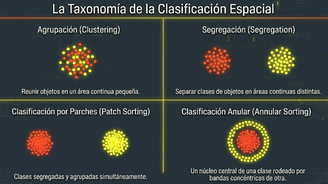

### Metodología Experimental

* **Agentes (U-bots)**: Robots de 23 cm de diámetro con tracción diferencial, sensores infrarrojos y una pinza diseñada para manipular "frisbees".

  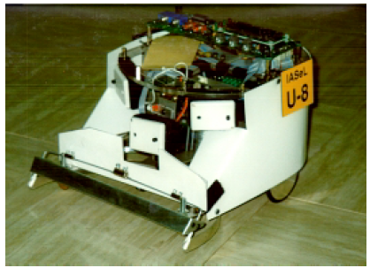
  
  A continuación se presenta una tabla detallada con las características técnicas y mecánicas del **U-bot**:
  
   | Característica | Detalles Técnicos |
   | :--- | :--- |
   | **Size (Tamaño)** | Diámetro de **23 cm**; lo suficientemente pequeño para ser portátil, pero con espacio para diversos sensores como ultrasonic (ultrasónicos), IR (infrarrojos) y CCD video cameras (cámaras de video CCD). |
   | **Manoeuvrability (Maniobrabilidad)** | Posee **Differential drive (tracción diferencial)** y motores potentes con high-resolution optical quadrature encoders (codificadores ópticos de cuadratura de alta resolución); permite **turning on the spot (girar sobre el eje)**, reversing (retroceder) y un control preciso de la velocidad. |
   | **Endurance (Resistencia/Autonomía)** | Aproximadamente **3 horas** de funcionamiento continuo bajo condiciones de aceleración y desaceleración frecuente. |
   | **Computational Power (Potencia computacional)** | Procesador **Motorola 68332** con una capacidad de memoria de hasta **16 Mb**. |
   | **Reliability (Fiabilidad)** | **Chassis (chasis)** de aluminio mecanizado de precisión que soporta las cargas estructurales; **gearboxes (cajas de cambios)** protegidas por un torque-limiting clutch (embrague limitador de par). |
   | **Infra-red sensors (Sensores infrarrojos)** | Cuatro proximity sensors (sensores de proximidad) configurados a unos 20 cm: tres orientados hacia adelante y uno hacia atrás. |
   | **Gripper (Pinza)** | Mecanismo frontal de 8 cm diseñado para sentir, sujetar, retener y soltar frisbees (discos). |
   | **Weighted barbels (Barbelas con contrapeso)** | Dos piezas móviles que caen dentro del disco para retenerlo físicamente (retention) cuando el robot gira, evitando que se salga lateralmente. |
   | **Color sensing (Detección de color)** | Un optical sensor (sensor óptico) de reflexión dentro de la pinza que identifica si el disco es amarillo o rojo/negro. |
   | **Retractable pin (Pasador retráctil)** | Pasador trasero accionado por un motor eléctrico; cuando se baja, permite el **pullback (arrastre hacia atrás)** del disco. |
   | **Tactile feedback (Retroalimentación táctil)** | El gripper (pinza) está suspendido y conectado a un **microswitch (microinterruptor)** que se activa cuando la fuerza de empuje supera un umbral (detecta dos o más frisbees). |
   | **Flexibility (Flexibilidad)** | Incluye extra power rails (rieles de alimentación adicionales), puertos de entrada/salida multiplexados y A/D conversion (conversión analógico-digital) para añadir sensores futuros. |
   
   En lo que reapecta a las operaciones que realiza un **U-bot** con los frisbees y su entorno para lograr la coordinación estigmérgica se pueden resumir en la siguiente lista:
   
   * **Operaciones de Movimiento y Navegación**
     *   **Avanzar (Go forward):** Es la acción por defecto (Regla 3) que permite al robot explorar la arena en línea recta hasta encontrar un objeto o un obstáculo.
     *   **Giro aleatorio (Random turn):** Cuando el robot encuentra un obstáculo (otra máquina o la pared) o decide soltar un frisbee, realiza un giro en un ángulo aleatorio para cambiar su trayectoria.
     *   **Retroceder (Reverse):** El robot retrocede distancias variables según la tarea: una distancia pequeña para soltar un objeto o una distancia específica mayor durante el algoritmo de arrastre.

   * **Operaciones de Manipulación (Pinza/Gripper)**
     *   **Capturar (Grip):** El robot se mueve hacia un frisbee y este encaja de forma pasiva en la parte semicircular de la pinza.
     *   **Retener (Retain):** Gracias a las **barbelas (barbels)** con contrapeso, el robot puede mantener el frisbee dentro de la pinza incluso mientras realiza giros sobre su propio eje.
     *   **Soltar (Release):** Al retroceder con el pasador (pin) levantado, el borde del frisbee empuja las barbelas hacia adelante y el objeto se queda en su lugar.
    *   **Arrastrar (Pullback):** Esta operación es clave para la clasificación y consiste en:
        1.  **Bajar el pasador (Lower pin):** Un motor eléctrico baja un pin que engancha el borde interno del frisbee.
        2.  **Retroceder una distancia fija:** El robot arrastra el frisbee hacia atrás (por ejemplo, 2.6 o 5.2 diámetros de disco).
        3.  **Subir el pasador (Raise pin):** Se libera el enganche para dejar el frisbee en la nueva posición.

   * **Operaciones de Detección y Sensado**
     *   **Detectar color (Color sensing):** Un sensor óptico de reflexión identifica si el frisbee capturado es amarillo ("plain") o rojo/negro ("ring").
     *   **Detectar obstáculos:** Utiliza sensores infrarrojos para identificar paredes o robots adelante (y atrás durante el retroceso).
     *   **Detectar densidad (Tactile feedback):** A través de un microinterruptor en la pinza suspendida, el robot detecta si está empujando más de un frisbee (lo que activa la regla de soltar el objeto).
     *   **Registrar colisiones:** En experimentos de control, los robots fueron programados para contar automáticamente sus impactos con otros agentes o límites.

* **Entorno**: Una arena octogonal de gran tamaño (lados de 4m) con una cámara cenital para el seguimiento

  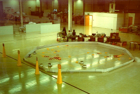

* **Objetos**: Frisbees amarillos ("plains") y rojos/negros con centro blanco ("rings").

  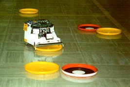

### El algoritmo pullback


### Por qué emerge el sorting anular

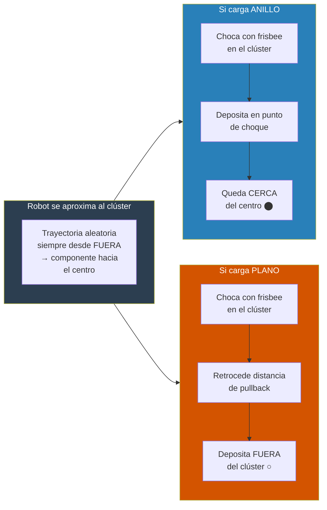

## 6. Experimentos

A continuación se presenta la lista de los diez experimentos realizados con los **U-bots** para investigar la estigmergia y la autoorganización, con una descripción breve de su propósito:

*   **Experimento 1: Adecuación del tamaño de la arena:** Evaluó si el número de colisiones entre robots aumentaba de forma lineal o exponencial al incrementar la cantidad de máquinas, confirmando que la arena era lo suficientemente grande para operar con hasta 10 robots sin interferencias excesivas.
*   **Experimento 2: Agrupamiento básico:** Buscó replicar experimentos previos de agrupamiento de objetos dispersos en un solo cúmulo central utilizando las reglas de comportamiento triviales de los nuevos U-bots.
*   **Experimento 3: Efectos de borde algorítmicos:** Investigó cómo variar la probabilidad ($p$) de que un robot retenga o suelte un objeto al chocar con la pared cambia el resultado entre agrupamiento central o periférico (contra la pared).
*   **Experimento 4: Efectos de borde mediados por sensores:** Intentó obtener el mismo resultado que el experimento anterior (agrupamiento periférico), pero en lugar de cambiar el código, se ajustó físicamente el ángulo y rango de los sensores infrarrojos.
*   **Experimento 5: El algoritmo "pullback" (arrastre):** Introdujo una nueva regla donde los objetos amarillos son arrastrados hacia atrás al chocar, logrando por primera vez la segregación y clasificación de dos tipos de objetos.
*   **Experimento 6: Variación de la distancia de arrastre:** Estudió cómo cambiar la distancia que el robot arrastra el objeto afecta la calidad de la clasificación y el tiempo necesario para completarla.
*   **Experimento 7: Mejora del agrupamiento con el tiempo:** Analizó si permitir que el experimento durara más horas mejoraba la densidad de los objetos que formaban el "halo" exterior en la clasificación anular.
*   **Experimento 8: Agrupamiento en ausencia de núcleos:** Probó si los objetos que son arrastrados podían formar un cúmulo por sí solos sin la presencia de objetos "fijos" que sirvieran como ancla espacial.
*   **Experimento 9: Segregación ignorando objetos:** Intentó lograr la separación de colores programando a los robots para que soltaran inmediatamente un tipo de objeto, confiando en el movimiento aleatorio para la segregación.
*   **Experimento 10: Algoritmo de arrastre aleatorio:** Aplicó la regla de arrastrar objetos de forma aleatoria a ambos colores (en lugar de solo a uno) para ver si el sistema aún era capaz de formar cúmulos densos.

### Experimento 1 - Adecuacion del tamaño de la arena

Tuvo como objetivo principal evaluar las características intrínsecas de los robots al operar en el entorno de pruebas para asegurar que el sistema fuera viable para experimentos colectivos.

Para el desarrollo del experimiento, los investigadores se basaron en observaciones previas (de Beckers et al.), quienes habían notado que aumentar el número de robots provocaba un incremento exponencial de colisiones, lo que deterioraba drásticamente el rendimiento. Para verificar esto en su propio sistema implementaron:

*   **Automatización:** A diferencia de estudios anteriores que usaban observación manual, cada U-bot fue programado para **registrar automáticamente** el número de colisiones que experimentaba tanto con otros robots como con los límites de la arena.
*   **Condiciones:** Se realizaron pruebas con grupos de **1 a 13 robots** durante periodos de 20 minutos bajo dos escenarios: una arena vacía y una arena con un cúmulo central de 22 frisbees.
*   **Resultados:** Los datos mostraron que la tasa de aumento de las colisiones era **baja y aproximadamente constante** en ambas condiciones.

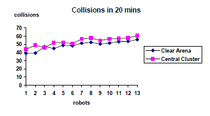

>[!important]
> **Principal conclusión**
> 
> La conclusión fundamental fue que el sistema opera bajo un **régimen lineal y no exponencial** en cuanto al número de colisiones. 
> 
> Esto permitió determinar que los resultados de los experimentos posteriores (que utilizaron hasta **10 robots**) podrían interpretarse de forma fiable, ya que las interacciones físicas directas entre las máquinas no generarían interferencias lo suficientemente graves como para arruinar el proceso de autoorganización estigmérgica.

### Experimento 2 -  Agrupamiento básico

El **Experimento 2** tuvo como objetivo principal verificar si el nuevo diseño de los **U-bots** y sus pinzas, utilizando un algoritmo simplificado, podían replicar los resultados de agrupamiento obtenidos en investigaciones previas.

A continuación se detallan los aspectos clave de este experimento:

1. **Configuración Inicial**:
   *   **Elementos:** Se colocaron **44 frisbees** (22 negros y 22 con un anillo blanco) distribuidos de manera uniforme y regular por toda la arena.
   *   **Agentes:** Se liberaron **10 robots** programados para tratar ambos tipos de frisbees de la misma manera.
   *   **Criterio de éxito:** Se definió que el experimento finalizaría cuando el **90% de los objetos** (40 frisbees) formaran un único cúmulo, donde cada miembro estuviera a menos de un diámetro de distancia de otro.

2. **Reglas de Comportamiento**: Los robots operaron bajo tres reglas simples de prioridad descendente:
   *   **Regla 1 (Evitar obstáculos):** Si la pinza detecta presión y hay un objeto detectado adelante (pared o robot), el robot realiza un **giro aleatorio** para alejarse. Gracias a las barbelas, mantiene el frisbee que lleva durante el giro.
   *   **Regla 2 (Soltar objetos):** Si la pinza detecta presión (al chocar con un segundo frisbee) pero **no hay un obstáculo** detectado adelante, el robot retrocede una pequeña distancia y gira. Esto provoca que el frisbee se quede en ese lugar.
   *   **Regla 3 (Explorar):** Si ninguna de las condiciones anteriores se cumple, el robot simplemente **avanza en línea recta**.
   
   El diagrama mostrado anteriormente resume las reglas:

   ```mermaid
   flowchart TD
    %% Estilos de los nodos
    classDef condition fill:#e1f5fe,stroke:#0277bd,stroke-width:2px,color:#000
    classDef action fill:#e8f5e9,stroke:#2e7d32,stroke-width:2px,color:#000
    classDef default fill:#fff,stroke:#333,stroke-width:1px

    Inicio([Inicio de evaluación de sensores]) --> Cond1

    %% Regla 1
    Cond1{"¿Gripper presionado <br> AND <br> Objeto al frente?"}:::condition
    Cond1 -- "Sí (Cumple Regla 1)" --> Act1["Hacer un giro aleatorio <br> alejándose del objeto"]:::action
    
    %% Regla 2
    Cond1 -- "No" --> Cond2{"¿Gripper presionado <br> AND <br> NO hay objeto al frente?"}:::condition
    Cond2 -- "Sí (Cumple Regla 2)" --> Act2["Retroceder una pequeña distancia <br> y hacer giro aleatorio (izq/der)"]:::action
    
    %% Regla 3 (Por defecto si nada de lo anterior se cumple)
    Cond2 -- "No (Cumple Regla 3)" --> Act3["Avanzar hacia adelante"]:::action
    
    %% Flujo continuo
    Act1 --> Fin([Fin del ciclo])
    Act2 --> Fin
    Act3 --> Fin
   ```

3. **Resultados y Observaciones**
   *   **Proceso de formación:** Los objetos primero se agregaron en pequeños cúmulos, que luego se fusionaron en estructuras más grandes.
   *   **Tiempo de ejecución:** El sistema alcanzó el objetivo de formar un único cúmulo de 40 frisbees después de **8 horas y 25 minutos**.
   *   **Dificultades detectadas:** Los investigadores notaron que, en las fases intermedias, a los robots les resultaba difícil "robar" frisbees de los cúmulos ya formados. Esto se debía a que la geometría de los cúmulos hacía que casi cualquier impacto activara la Regla 2 (soltar), en lugar de permitir que el robot se llevara un objeto individual.

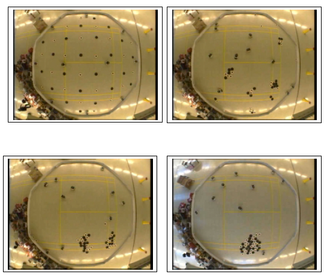

> [!important]
> **Concluiones**
> 
> La conclusión principal de este experimento fue que el proceso de agrupamiento es robusto y se comporta de manera idéntica a experimentos anteriores, validando que el nuevo sistema robótico era apto para estudios de **autoorganización estigmergica**.


---


## 7. Por qué los robots físicos revelan más que las simulaciones abstractas

> [!TIP]
> **Principio central:** la estigmergia es una *explotación de la física mediante el comportamiento*. A física más rica, más simple puede ser el comportamiento.

Las simulaciones de grilla tienen dos desventajas severas frente a los robots físicos:

1. **Skating sobre sensing y actuación:** en el grid, los objetos se "conocen" directamente y las acciones tienen efectos precisos e invariantes. En el mundo real, ambas cosas son ruidosas y variables.
2. **Física empobrecida:** la geometría del movimiento en línea recta, la forma de los objetos, el radio de colisión — todo esto es parte del mecanismo estigmérgico, no ruido a eliminar.

> [!IMPORTANT]
> El Experimento 4 demostró que el mismo resultado emergente puede obtenerse ajustando un parámetro **computacional** (probabilidad p en el algoritmo) *o* un parámetro **físico** del sensor (ángulo de aceptación del IR). Esto revela que la evolución tiene **múltiples puntos de acceso** para modular un comportamiento estigmérgico — no solo el "software" del agente.

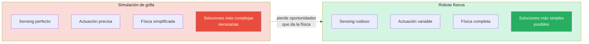

---

*Referencia completa: Holland, O. & Melhuish, C. (1999). Stigmergy, self-organisation, and sorting in collective robotics. Artificial Life.*

## Anotaciones sueltas

En terminos de Estigmergia en teminos humanos, un ejemplo puede verse en el Manual Valve [[ES]](https://media.steampowered.com/apps/valve/hbook-ES.pdf) [[EN]](https://cdn.akamai.steamstatic.com/apps/valve/Valve_NewEmployeeHandbook.pdf) de Valve Corporation [[link]](https://en.wikipedia.org/wiki/Valve_Corporation).


## Simuladores de Estigmergia

### Estigmergia en GitHub — por categoría

#### Simulación de clustering y sorting (los más relevantes para tu proyecto)

| Repositorio | Lenguaje | Qué hace | Relevancia |
|---|---|---|---|
| [m-abdulhak/SwarmJS](https://github.com/m-abdulhak/SwarmJS) | JavaScript | Plataforma 2D completa: clustering, sorting de objetos, feromona, construcción. Corre en el browser. | ⭐ Muy alta — replica directamente los experimentos del paper |
| [denkovarik/Ant-Clustering](https://github.com/denkovarik/Ant-Clustering) | Python | Algoritmo de clustering por similitud inspirado en Deneubourg. Objetos rojos y azules, agentes con probabilidad de pick/drop. | ⭐ Muy alta — implementa el modelo Deneubourg 1991 que cita el paper |
| [Elmosnewshoes/Stigmergy](https://github.com/Elmosnewshoes/Stigmergy) | Python | Plataforma "theANT3000": simulador swarm completo basado explícitamente en estigmergia, con GUI | Alta |
| [mlpi-unipi/sfe](https://github.com/mlpi-unipi/sfe) | Python | Stigmergy + flocking para búsqueda distribuida de objetivos | Media-Alta |

#### Simulación de feromona y foraging

| Repositorio | Lenguaje | Qué hace | Relevancia |
|---|---|---|---|
| [Melell/Ant-Colony-Simulation](https://github.com/Melell/Ant-Colony-Simulation) | C# (Unity) | Foraging con feromona de casa/comida, evaporación, paredes dinámicas. Etiquetado explícitamente como "stigmergy" | Alta |
| [jeffasante/ant-colony-rl](https://github.com/jeffasante/ant-colony-rl) | JavaScript | Colonia de hormigas con Q-learning + feromona, visualización en tiempo real | Media |
| [naummo/swarm_maze_opencl_solver](https://github.com/naummo/swarm_maze_opencl_solver) | Python/OpenCL | Swarm estigmérgico en GPU para mapeo de laberintos (acelerado por paralelismo) | Media |

#### Hardware / ESP32

| Repositorio | Lenguaje | Qué hace | Relevancia |
|---|---|---|---|
| [lnicooo/swarm](https://github.com/lnicooo/swarm) | C++ (Arduino) | Swarm robots con ESP32 | Alta — mismo hardware que el tuyo |

#### Simuladores generales de swarm (estigmergia como mecanismo interno)

| Repositorio | Lenguaje | Qué hace | Relevancia |
|---|---|---|---|
| [ilpincy/argos3](https://github.com/ilpincy/argos3) | C++ | Simulador físico paralelo para swarms de cientos de robots (e-puck, foot-bot, Kilobot) | Alta para validación |
| [tidota/swarm-argos](https://github.com/tidota/swarm-argos) | C++ | Formación de caminos en entorno desconocido sobre ARGoS | Media |


### Combinados

| Nombre | Tipo de acceso | Mecanismo principal | Relevancia para Holland & Melhuish | URL |
|---|---|---|---|---|
| **Stigmergy Swarm Simulator** | Online (browser) | Estigmergia genérica, comunicación indirecta | Alta — simulador dedicado al concepto del paper | [stigmergy-simulator.netlify.app](https://stigmergy-simulator.netlify.app/) |
| **Ant Colony Simulator (Starlighttools)** | Online (browser) | Feromona, evaporación, difusión, two-pheromone fields | Alta — captura la dinámica Deneubourg que fundamenta el paper | [starlighttools.org/science/ant-colony-simulator](https://starlighttools.org/science/ant-colony-simulator) |
| **SwarmJS** | Online (browser) | Clustering, sorting de objetos, feromona, construcción planar | Muy alta — incluye escenas de object clustering y sorting directamente análogas a los experimentos | [m-abdulhak.github.io/SwarmJS](https://m-abdulhak.github.io/SwarmJS/) |
| **NetLogo Web — Ants model** | Online (browser) | Feromona, foraging, trails emergentes | Media-Alta — modelo canónico de Wilensky que antecede al paper | [netlogoweb.org/launch#Ants](https://netlogoweb.org/launch#Ants) |
| **NetLogo Web — Ant Lines** | Online (browser) | Formación de senderos, estigmergia de trail | Media | [netlogoweb.org/launch#AntLines](https://netlogoweb.org/launch#AntLines) |
| **ARGoS3** | Desktop (Linux/Mac) | Física real, swarms de cientos de robots, modelos e-puck/foot-bot | Muy alta — el simulador más usado en literatura de swarm con estigmergia | [github.com/ilpincy/argos3](https://github.com/ilpincy/argos3) |
| **Webots** | Desktop (multiplataforma) | Física completa, robots reales modelados, comportamiento colectivo | Alta — útil para validar comportamiento cercano a hardware real | [cyberbotics.com](https://cyberbotics.com) |
| **NetLogo desktop** | Desktop (Java) | Agent-based modeling general, modelos de hormigas, clustering, sorting | Alta — plataforma sobre la que se construyeron simulaciones del linaje Deneubourg | [ccl.northwestern.edu/netlogo](https://ccl.northwestern.edu/netlogo/) |

### Simuladores de robotica espacial

* https://vr.vex.com/
* https://mblock.cc/
* https://root.samlabs.com/
* https://arcade.makecode.com/

## Repos

| Recurso | Descripción | Tipo | Enlace |
|---|---|---|---|
| BruJu/Ants | Implementación directa del modelo de Deneubourg en HTML, con demo en vivo | GitHub | [github.com/BruJu/Ants](https://github.com/BruJu/Ants) |
| BruJu/Ants demo | Simulación corriendo en el navegador | Demo | [bruju.github.io/Ants](https://bruju.github.io/Ants/) |
| denkovarik/Ant-Clustering | Algoritmo de clustering por hormigas en Python con objetos de dos colores | GitHub | [github.com/denkovarik/Ant-Clustering](https://github.com/denkovarik/Ant-Clustering) |
| SwarmJS | Plataforma 2D de swarm robotics en el navegador, soporta sorting, clustering y foraging | GitHub | [github.com/m-abdulhak/SwarmJS](https://github.com/m-abdulhak/SwarmJS) |