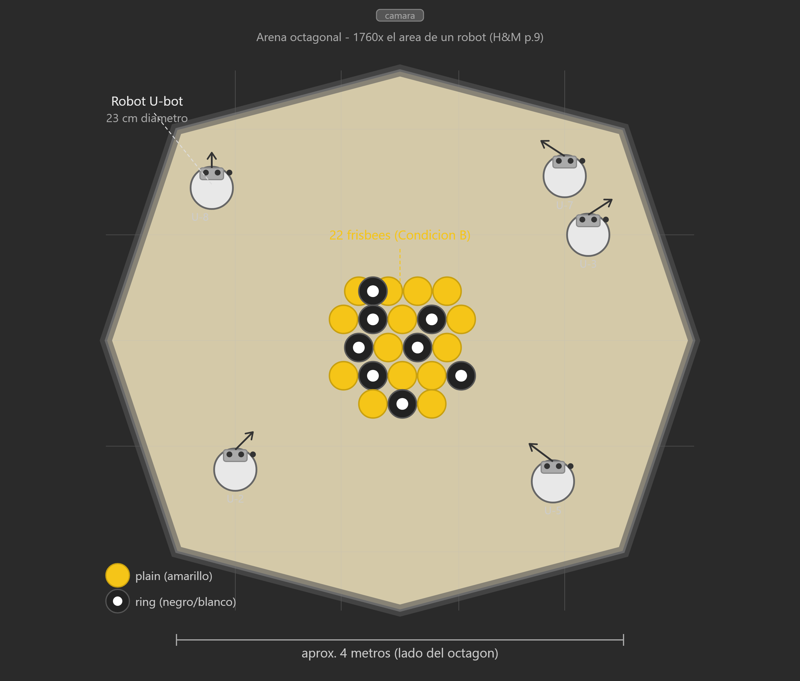
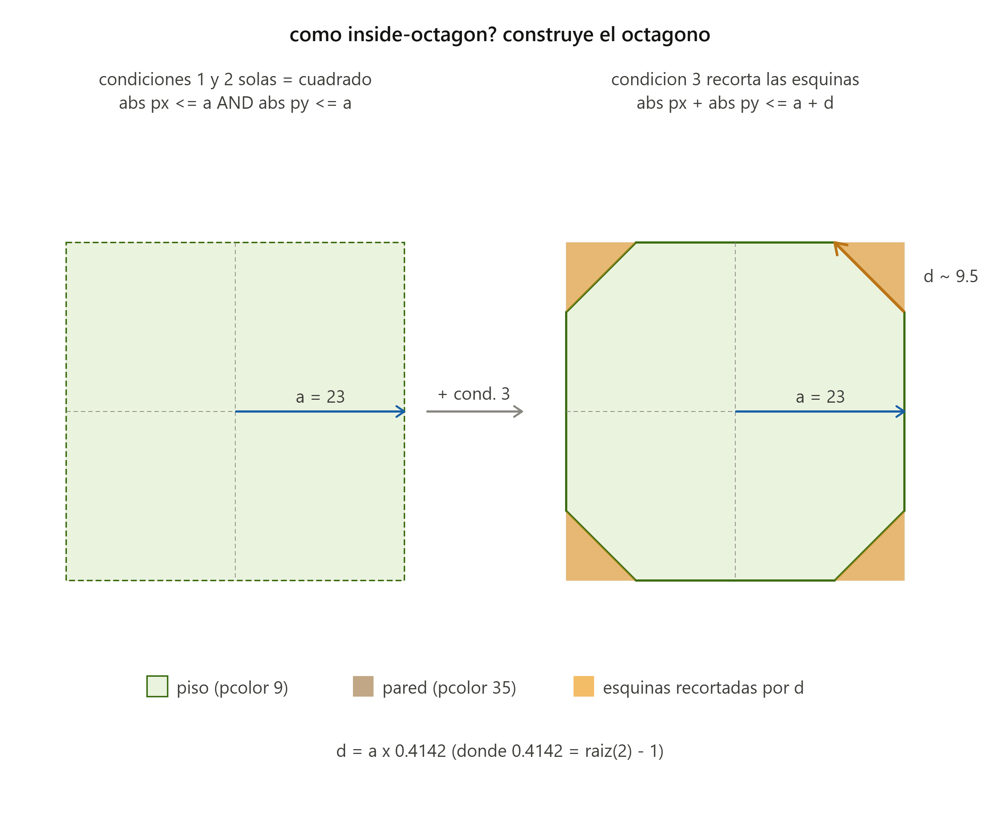
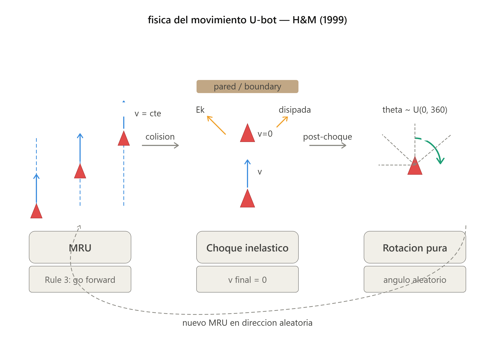

# Stigmergy, Self-Organisation, and Sorting in Collective Robotics
## Replicacion del Experimento 1 — Holland & Melhuish (1999)

> Holland, O. & Melhuish, C. (1999). Stigmergy, self-organisation, and sorting in collective robotics.
> *Artificial Life*, 5(2), 173–202. https://doi.org/10.1162/106454699568737

**Autor del modelo NetLogo:** Claude (Anthropic, claude-sonnet-4-6)
**Supervision e investigacion:** Proyecto Estigmergia & Swarm Robotics
**Fecha:** Junio 2026
**Herramienta:** NetLogo 7.0.4

---

## Contexto del experimento

El Experimento 1 de H&M no es un experimento de clustering. Es una **prueba de prerequisito**: antes de correr cualquier experimento de comportamiento colectivo, los autores necesitaban verificar que su arena era lo suficientemente grande para que los robots no se estorbaran entre si.

La pregunta central es:

> *El aumento en colisiones al agregar robots, crece de forma lineal o exponencial?*

Si el crecimiento fuera exponencial, los robots se bloquearian mutuamente y cualquier comportamiento emergente seria producto del caos de crowding, no de estigmergia. Que sea **lineal** confirma que cada robot se comporta como agente independiente en un ambiente disperso.

H&M (p. 10):
> *"The rate of increase in number of collisions with increasing numbers of robots is low and roughly constant under both conditions, the system is operating under a linear rather than an exponential regime."*

---

## Configuracion fisica del experimento

### Arena octagonal

El experimento fisico usaba una arena octagonal con lados de 4 metros. Para entender la geometria del arena, partimos de la descomposicion en triangulos internos.



Al dividir el octagono en 8 triangulos isosceles desde el centro y bisecar cada uno, se obtienen triangulos rectangulos con:

| Elemento | Valor real | En patches (NetLogo) |
|---|---|---|
| Semilado | 2.00 m | ~10 patches |
| Apotema (cateto adyacente) | 4.83 m | ~23 patches |
| Circunradio (hipotenusa) | 5.23 m | ~25 patches |
| Cuadrado circunscrito | 9.66 m | 47 patches |
| Perimetro del octagono | 32.00 m | — |

El apotema se deduce como:

```
r = (lado/2) / tan(22.5°) = 2 / 0.4142 ≈ 4.83 m
```

### Ratio arena / robot

H&M (p. 9): *"The area is 1760 times the area of a robot."*

El robot U-bot tiene 23 cm de diametro — equivalente a 1 patch en el modelo. Con `arena-radius = 23` patches:

```
Area arena = pi * 23^2 ≈ 1661 patches
Area robot = 1 patch
Ratio ≈ 1661:1  (H&M fisico: 1760:1)
```

Este ratio es el parametro critico. Si fuera demasiado pequeno, el regimen seria exponencial y los experimentos posteriores serian invalidos.

---

## Implementacion del arena en NetLogo

### De circulo a octagono

Una primera implementacion usa `distancexy 0 0 <= arena-radius`, que genera un **circulo**, no un octagono. Esto se debe a que la condicion euclidiana define exactamente el conjunto de puntos a distancia menor o igual a un radio — es decir, un circulo por definicion.

La implementacion corregida usa la interseccion de tres bandas geometricas:



Un octagono regular es la interseccion de:
- Una banda vertical: `abs px <= a`
- Una banda horizontal: `abs py <= a`
- Dos bandas diagonales: `abs px + abs py <= a + d`

Donde `d = a * (sqrt(2) - 1) ≈ a * 0.4142` controla el recorte de las esquinas.

```netlogo
globals [ arena-radius ]

to draw-arena
  ask patches [
    ifelse inside-octagon? pxcor pycor
    [ set pcolor 9  ]   ; piso: gris claro
    [ set pcolor 35 ]   ; pared: marron
  ]
end

to-report inside-octagon? [px py]
  ; Un octagono regular = interseccion de 4 bandas.
  ; d = a * (sqrt(2) - 1) define el recorte de esquinas.
  let a arena-radius
  let d (a * 0.4142)
  report (abs px <= a) and
         (abs py <= a) and
         (abs px + abs py <= a + d)
end
```

> [!NOTE]
> El arena es circular en el modelo original de H&M pero octagonal en el experimento fisico.
> La forma no afecta la conclusion estadistica (lineal vs exponencial) pero si la fidelidad visual.

---

## Fisica del movimiento del U-bot

### Tres fases del ciclo de movimiento



El U-bot implementa un ciclo de tres fases que se repite indefinidamente:

**Fase 1 — Movimiento Rectilineo Uniforme (MRU)**

Entre colisiones el robot avanza en linea recta a velocidad constante. No hay aceleracion ni friccion modelada. Corresponde a la Rule 3 del paper (Fig. 6):

```netlogo
; Rule 3: go forward
forward robot-speed
```

**Fase 2 — Choque inelastico**

Al detectar un obstaculo, el robot se detiene. Toda la energia cinetica se disipa en el chasis de aluminio. H&M (p. 12): *"The U-bots are designed to withstand frequent collisions."*

No hay rebote elastico — la velocidad final es cero.

**Fase 3 — Rotacion pura**

Post-colision el robot gira en su propio eje sin traslacion. El angulo es aleatorio, distribuido uniformemente en el rango `[-collision-turn-range/2, +collision-turn-range/2]`. Corresponde a Rule 1 del paper:

```netlogo
; Rule 1: make random turn away from object
rt (random-float collision-turn-range) - (collision-turn-range / 2)
```

### Caminata aleatoria correlacionada

La combinacion de MRU + giro aleatorio produce una **caminata aleatoria correlacionada**: entre colisiones el robot mantiene su direccion (correlacion), pero cada colision reinicia la direccion aleatoriamente (aleatoriedad).

Esta trayectoria tiene una propiedad estadistica fundamental: con suficiente tiempo, el robot cubre el espacio de forma uniforme sin zonas preferidas. Eso es exactamente lo que requiere la estigmergia para funcionar.

---

## Implementacion del agente U-bot

### Deteccion de obstaculos

H&M (p. 10): *"The robots are unable to discriminate between [robot-robot and robot-boundary collisions]."*

Esta restriccion se implementa fielmente — una sola condicion maneja ambos tipos de colision:

```netlogo
turtles-own [
  collision-count   ; contador por robot — H&M p.10: "each robot records
                    ; the number of collisions it experienced"
]

to move-ubot
  ifelse obstacle-ahead?
  [
    ; COLISION: incrementar contador y girar aleatoriamente
    ; No se discrimina entre robot-robot y robot-boundary
    set collision-count collision-count + 1
    rt (random-float collision-turn-range) - (collision-turn-range / 2)
  ]
  [
    ; MOVIMIENTO LIBRE: Rule 3
    forward robot-speed
  ]
end

to-report obstacle-ahead?
  ; Devuelve true si hay pared o robot adelante.
  ; H&M: robots no distinguen el tipo de obstaculo.
  let ahead patch-ahead 1
  if ahead = nobody [ report true ]
  if [ pcolor ] of ahead = 35 [ report true ]
  if any? other turtles-on ahead [ report true ]
  report false
end
```

### Inicializacion de agentes

Los robots se colocan en posiciones aleatorias dentro del octagono con heading aleatorio:

```netlogo
to place-ubots
  create-turtles num-ubots [
    set shape "default"
    set color red
    set size 2
    set heading random-float 360
    set collision-count 0
    ; Rejection sampling: posicion aleatoria dentro del octagono
    let placed? false
    while [ not placed? ] [
      setxy (random-float (2 * arena-radius) - arena-radius)
            (random-float (2 * arena-radius) - arena-radius)
      if inside-octagon? round xcor round ycor [
        set placed? true
      ]
    ]
  ]
end
```

---

## Condiciones experimentales

H&M midieron colisiones promedio por robot bajo dos condiciones:

| Condicion | Descripcion | Switch en modelo |
|---|---|---|
| A — Arena vacia | 1 a 13 robots, sin objetos | `show-central-frisbees? = OFF` |
| B — Cluster central | mismo sweep, 22 frisbees en el centro | `show-central-frisbees? = ON` |

Duracion: 20 minutos por corrida → `max-ticks = 1200` en el modelo.

---

## Parametros de la interfaz

| Parametro | Rango | Default | Descripcion |
|---|---|---|---|
| `num-ubots` | 1 — 13 | 5 | Numero de robots (sweep de H&M) |
| `robot-speed` | 0.1 — 1.0 | 0.5 | Velocidad en patches/tick |
| `collision-turn-range` | 90 — 360 | 180 | Rango del giro aleatorio en grados |
| `max-ticks` | 100 — 5000 | 1200 | Proxy de 20 minutos |

> [!TIP]
> Para reproducir la Figura 5 de H&M, fija `robot-speed=0.5` y `collision-turn-range=180`.
> Corre el sweep `num-ubots = 1` a `13` anotando `mean [collision-count] of turtles` al final
> de cada corrida. Usa **Tools -> BehaviorSpace** para automatizar el sweep.

---

## Metrica y resultado esperado

**Metrica:** `mean [collision-count] of turtles` al finalizar cada corrida.

**Resultado esperado (Figura 5 de H&M):** Dos curvas aproximadamente lineales — una para arena vacia y otra para cluster central — que crecen con el numero de robots sin aceleracion exponencial.

> [!IMPORTANT]
> La linealidad es el criterio de validacion del modelo. Si las curvas son exponenciales,
> el arena es demasiado pequeno o los robots demasiado grandes relativamente.
> Esta es la condicion de entrada para todos los experimentos posteriores (Exp. 2-10).

---

## Hipotesis abiertas para proxima iteracion

Durante las pruebas se identificaron limitaciones del modelo actual que requieren investigacion:

> [!WARNING]
> **Hipotesis 1 — Falta debounce:** Un robot pegado a la pared incrementa `collision-count`
> cada tick mientras gira, inflando artificialmente el contador de colisiones con la pared.

> [!WARNING]
> **Hipotesis 2 — Robots sin volumen fisico:** Los robots son puntos matematicos.
> Dos robots pueden ocupar el mismo patch sin detectarse. Solucion: `in-radius` calibrado
> al diametro real del U-bot (1 patch).

> [!WARNING]
> **Hipotesis 3 — Gap de deteccion:** Con `robot-speed < 1`, `patch-ahead 1` mira mas
> lejos de lo que el robot avanza por tick. Calibrar la distancia de deteccion a `robot-speed`.

> [!WARNING]
> **Hipotesis 4 — Arena relativamente grande:** Con ratio 1661:1 y robots sin volumen,
> las colisiones robot-robot son estadisticamente raras. En el experimento fisico los robots
> ocupaban espacio real — esa propiedad se pierde en la abstraccion NetLogo.

---

## Estructura del repositorio

```
/
|-- holland_melhuish_exp1_v5.nlogox   modelo NetLogo 7.0.4
|-- README.md                          este archivo
|-- figuras/
    |-- hm1999_arena_exp1.png          vista cenital del arena fisico
    |-- octagon_geometry_d_v2.png      construccion geometrica del octagono
    |-- ubot_default_shape.png         shape del agente U-bot
    |-- ubot_fisica_movimiento.png     ciclo de movimiento del U-bot
```

---

## Proximos pasos

- [ ] Cerrar hipotesis 1-4 con protocolo de prueba sistematico
- [ ] Usar BehaviorSpace para sweep automatico num-ubots 1-13
- [ ] Reproducir Figura 5 con ambas condiciones (A y B)
- [ ] Experimento 2: clustering con algoritmo de Beckers et al. (Figura 6)

---

## Referencias

- Holland, O. & Melhuish, C. (1999). Stigmergy, self-organisation, and sorting in collective robotics. *Artificial Life*, 5(2), 173-202.
- Beckers, R., Holland, O.E. & Deneubourg, J.L. (1994). From local actions to global tasks: Stigmergy and collective robotics. *Artificial Life IV*, MIT Press.
- Deneubourg, J.L. et al. (1991). The dynamics of collective sorting: Robot-like ants and ant-like robots. *Simulation of Adaptive Behaviour*, MIT Press.
- Bonabeau, E. et al. (1997). Self-organisation in social insects. *TREE*, 12(5).