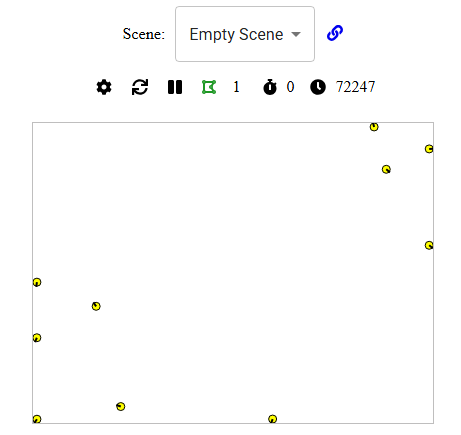

# Experimento 0




## Arena

```
Env Width → 400
Env Height → 300
```

## Agente

### Init

```js
(CONST, VAR, FUNC, robot, params) => {
  CONST.maxForwardSpeed = 0.15;
  CONST.maxAngularSpeed = 0.03;
  VAR.collisions = 0;
  VAR.tick = 0;
}
```

### Loop


```js
(sensors, actuators) => {
  const nearbyRobots = sensors.polygons?.left?.reading?.robots 
                     + sensors.polygons?.right?.reading?.robots || 0;

  if (nearbyRobots > 0) {
    VAR.collisions += 1;
  }

  const angularSpeed = (Math.random() - 0.5) * CONST.maxAngularSpeed;

  return {
    linearVel: CONST.maxForwardSpeed * robot.velocityScale,
    angularVel: angularSpeed * robot.velocityScale,
    type: robot.SPEED_TYPES.RELATIVE
  };
}
```

### Con debug


```js
(CONST, VAR, FUNC, robot, params) => {
  CONST.maxForwardSpeed = 0.15;
  CONST.maxAngularSpeed = 0.03;
  VAR.collisions = 0;
  VAR.tick = 0;
}
```

```js
(sensors, actuators) => {
  const nearbyRobots = (sensors.polygons?.left?.reading?.robots || 0)
                     + (sensors.polygons?.right?.reading?.robots || 0);

  if (nearbyRobots > 0) {
    VAR.collisions += 1;
  }

  // Imprime cada 100 ticks
  if (VAR.tick % 100 === 0) {
    console.log(`Robot colisiones: ${VAR.collisions} | tick: ${VAR.tick}`);
  }

  VAR.tick = (VAR.tick || 0) + 1;

  const angularSpeed = (Math.random() - 0.5) * CONST.maxAngularSpeed;

  return {
    linearVel: CONST.maxForwardSpeed * robot.velocityScale,
    angularVel: angularSpeed * robot.velocityScale,
    type: robot.SPEED_TYPES.RELATIVE
  };
}
```

## Ver 

* https://bots.cs.mun.ca/waggle1/
* https://dgarzonramos.github.io/robotics101/p2/
* https://dgarzonramos.com/