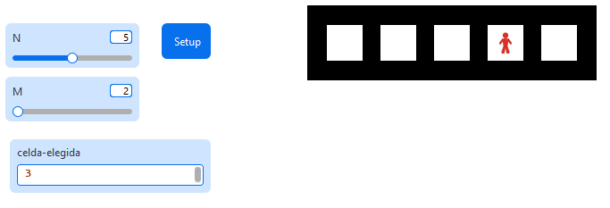

# Construcción de un mundo en NetLogo

## Características

* [x] El mundo debe estar compuesto por **N** celdas cuadradas colocadas horizontalmente.
* [x] Cada celda tiene **M** patches al interior, y en el borde una línea negra de 1 parche. Los bordes interiores entre celdas contiguas se comparten.
* [x] El color por defecto del interior de la celda es blanco.
* [x] Agregar un agente (turtle) a una de las celdas ubicado en la parte central.
* [x] Interfaz de texto para elegir el número de celda (0 a N - 1).
* [x] Validación de límites: si el número excede los límites, se despliega un mensaje de error y no se actualiza el agente.

---

## Instrucciones empleadas

| Instrucción / Operador | Sintaxis Básica | Explicación |
| --- | --- | --- |
| `clear-all` | `clear-all` | Limpia todo el entorno. |
| `resize-world` | `resize-world min-x max-x min-y max-y` | Define las dimensiones del mundo. |
| `set-patch-size` | `set-patch-size numero` | Ajusta el tamaño visual de cada parche. |
| `ask patches` | `ask patches [ ... ]` | Ejecuta comandos en todos los parches. |
| `pcolor` | `set pcolor color` | Define el color del parche. |
| `mod` | `x mod y` | Residuo de la división (clave para los bordes). |
| `create-turtles` | `create-turtles n [ ... ]` | Crea agentes. |
| `setxy` | `setxy x y` | Ubica al agente en coordenadas exactas. |
| `ifelse` | `ifelse cond [ ... ] [ ... ]` | Estructura de control condicional. |
| `user-message` | `user-message "texto"` | Muestra una ventana de alerta. |

---

## Procedimiento de construcción

### 1. Configuración de la interfaz

* **Slider `N`**: Rango 1-10.
* **Slider `M`**: Rango 2-10.
* **Input `celda-elegida`**: Número entero (0 a N-1).
* **Button `setup`**: Ejecuta la lógica de inicialización.

A continuación se muestra la interfaz tentativa:

### 2. Dimensionamiento Matemático

Calculamos los límites del mundo para que encajen exactamente las celdas:

* $Y_{max} = M + 1$
* $X_{max} = (N \times M) + N$

### 3. Dibujado de Celdas

Pintamos de blanco el interior usando: `pxcor mod (M + 1) != 0` y `0 < pycor < (M + 1)`.

### 4. Ubicación del Agente

El centro de la celda $i$ se calcula como:

* $Centro_Y = \frac{M + 1}{2}$
* $Centro_X = (i \times (M + 1)) + \frac{M + 1}{2}$

---

## Referencias y Recursos de Consulta

* **NetLogo User Manual:** Wilensky, U. (1999). Center for Connected Learning and Computer-Based Modeling, Northwestern University. [http://ccl.northwestern.edu/netlogo/](http://ccl.northwestern.edu/netlogo/)
* **NetLogo Dictionary:** Referencia de sintaxis y primitivas. [https://ccl.northwestern.edu/netlogo/docs/dictionary.html](https://www.google.com/search?q=https://ccl.northwestern.edu/netlogo/docs/dictionary.html)
* **Wilensky, U., & Rand, W. (2015).** *An Introduction to Agent-Based Modeling*. MIT Press.
* **NetLogo Models Library:** Ejemplos de referencia integrados en el software.

> [!important]
> Este material fue desarrollado con apoyo de herramientas de IA como asistente de redacción y estructuración. El contenido ha sido supervisado, validado y refinado por intervención humana para garantizar su precisión técnica y coherencia pedagógica. No obstante, pueden haber errores.