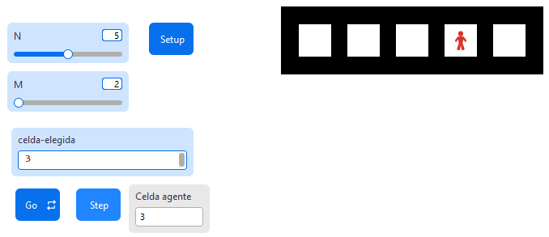

# Movimiento de un agente en NetLogo

## Características

* [x] El mundo está compuesto por **N** celdas cuadradas colocadas horizontalmente.
* [x] Cada celda tiene **M** patches al interior, con una línea negra de 1 parche en el borde. Los bordes interiores entre celdas contiguas se comparten.
* [x] El color por defecto del interior de la celda es blanco.
* [x] El agente (turtle) se mueve de izquierda a derecha, ubicándose en el **centro exacto** de cada celda por cada iteración, con wrap automático a la celda 0 al llegar al final.
* [x] Monitor en la interfaz que muestra la **celda lógica actual** del agente (0 a N-1).
* [x] Botones **Go** (ejecución continua) y **Step** (ejecución paso a paso) para controlar la simulación.
* [x] Interfaz de texto para elegir la celda inicial del agente (0 a N-1).
* [x] Validación de límites: si el número excede los límites, se despliega un mensaje de error y no se crea el agente.

---

## Instrucciones empleadas

| Instrucción / Operador | Sintaxis Básica | Explicación |
| --- | --- | --- |
| `clear-all` | `clear-all` | Limpia todo el entorno. |
| `resize-world` | `resize-world min-x max-x min-y max-y` | Define las dimensiones del mundo. |
| `set-patch-size` | `set-patch-size numero` | Ajusta el tamaño visual de cada parche. |
| `ask patches` | `ask patches [ ... ]` | Ejecuta comandos en todos los parches. |
| `pcolor` | `set pcolor color` | Define el color del parche. |
| `mod` | `x mod y` | Residuo de la división (clave para los bordes y el wrap). |
| `create-turtles` | `create-turtles n [ ... ]` | Crea agentes. |
| `setxy` | `setxy x y` | Ubica al agente en coordenadas exactas. |
| `ifelse` | `ifelse cond [ ... ] [ ... ]` | Estructura de control condicional. |
| `user-message` | `user-message "texto"` | Muestra una ventana de alerta. |
| `ask turtles` | `ask turtles [ ... ]` | Ejecuta comandos en todos los agentes. |
| `floor` | `floor x` | Redondea hacia abajo (clave para calcular la celda actual). |
| `xcor` | `xcor` | Coordenada X actual del agente. |
| `tick` | `tick` | Avanza el contador de tiempo en 1. |
| `reset-ticks` | `reset-ticks` | Reinicia el contador de tiempo. |

---

## Procedimiento de construcción

### 1. Configuración de la interfaz

* **Slider `N`**: Rango 1-10. Número de celdas.
* **Slider `M`**: Rango 2-10. Tamaño interior de cada celda en patches.
* **Input `celda-elegida`**: Número entero (0 a N-1). Celda inicial del agente.
* **Button `Setup`**: Ejecuta la lógica de inicialización.
* **Button `Go`**: Ejecuta `go` en bucle continuo (`forever = true`).
* **Button `Step`**: Ejecuta `go` una sola vez por clic (`forever = false`).
* **Monitor `Celda agente`**: Muestra la celda lógica actual del agente.



### 2. Dimensionamiento Matemático

Igual que en el ejemplo 1:

* $Y_{max} = M + 1$
* $X_{max} = (N \times M) + N$

### 3. Dibujado de Celdas

Pintamos de blanco el interior usando: `pxcor mod (M + 1) != 0` y `0 < pycor < (M + 1)`.

### 4. Ubicación Inicial del Agente

El centro de la celda $i$ se calcula como:

* $Centro_Y = \frac{M + 1}{2}$
* $Centro_X = (i \times (M + 1)) + \frac{M + 1}{2}$

### 5. Movimiento del Agente

En cada tick, el agente calcula su celda actual a partir de su `xcor`, avanza a la siguiente y se ubica en su centro exacto:

1. **Celda actual:** $celda_{actual} = \lfloor \frac{xcor}{M + 1} \rfloor$
2. **Siguiente celda (con wrap):** $celda_{sig} = (celda_{actual} + 1) \mod N$
3. **Coordenadas del centro:** misma fórmula del paso 4.
4. **Reposicionamiento:** `setxy nuevo-x nuevo-y`

El operador `mod N` garantiza que al superar la última celda el agente regrese automáticamente a la celda 0.

### 6. Monitor de posición

El reporter del monitor aplica la misma fórmula del paso 5.1 para reportar el número de celda lógica (no la coordenada cruda de parche):

```netlogo
[floor (xcor / (M + 1))] of turtle 0
```

---

## Referencias y Recursos de Consulta

* **NetLogo User Manual:** Wilensky, U. (1999). Center for Connected Learning and Computer-Based Modeling, Northwestern University. [http://ccl.northwestern.edu/netlogo/](http://ccl.northwestern.edu/netlogo/)
* **NetLogo Dictionary:** Referencia de sintaxis y primitivas. [https://ccl.northwestern.edu/netlogo/docs/dictionary.html](https://ccl.northwestern.edu/netlogo/docs/dictionary.html)
* **Wilensky, U., & Rand, W. (2015).** *An Introduction to Agent-Based Modeling*. MIT Press.
* **NetLogo Models Library:** Ejemplos de referencia integrados en el software.

> [!important]
> Este material fue desarrollado con apoyo de herramientas de IA como asistente de redacción y estructuración. El contenido ha sido supervisado, validado y refinado por intervención humana para garantizar su precisión técnica y coherencia pedagógica. No obstante, pueden haber errores.