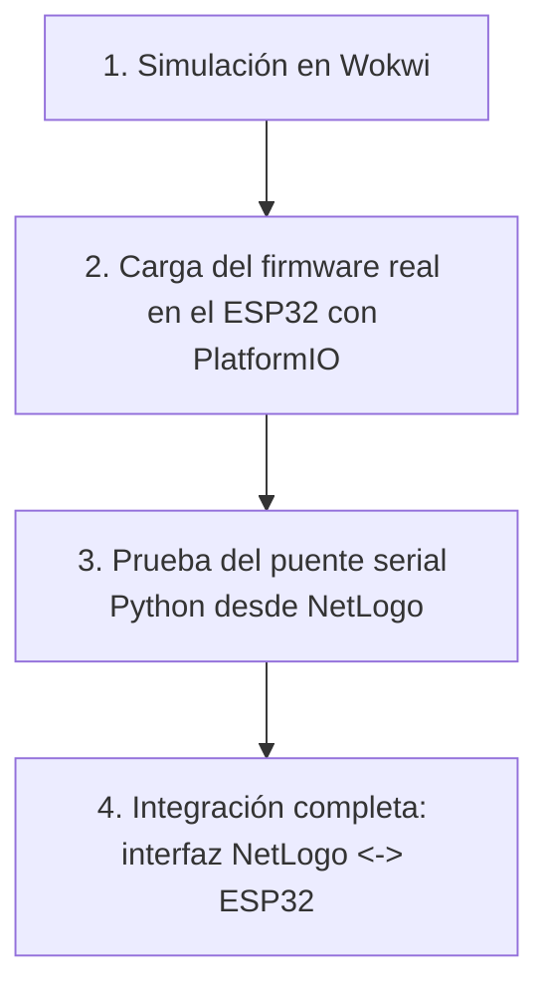
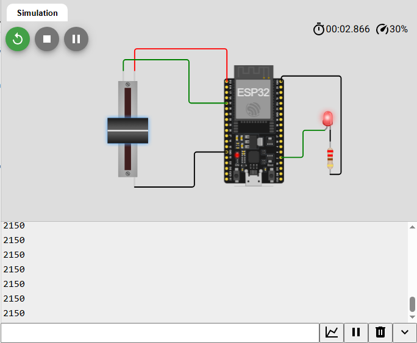
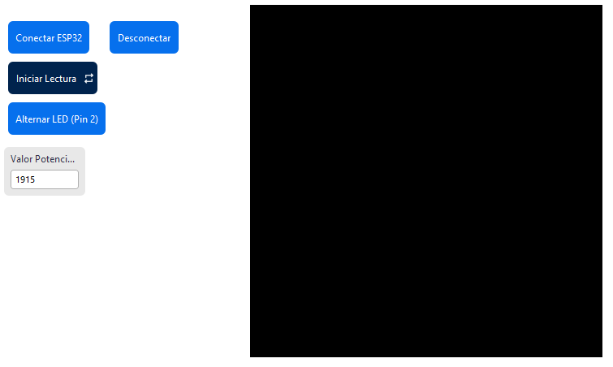

# Conexio serial empleando netlogo

A continuación se muestra un ejemplo el cual se lleva a cabo la conexión serial entre un ESP32 y una interfaz sencilla de Netlogo empleando el modulo pyserial# Conexión serial entre NetLogo y ESP32 usando pyserial

Este ejemplo documenta el procedimiento completo para establecer una comunicación serial bidireccional entre un microcontrolador ESP32 y una interfaz gráfica construida en NetLogo, utilizando la extensión `py` de NetLogo como puente hacia la librería `pyserial` de Python.

El resultado final es una interfaz en NetLogo capaz de:

- Leer periódicamente el valor analógico de un potenciómetro conectado al ESP32.
- Enviar comandos desde NetLogo para encender o apagar un LED conectado al ESP32.

> [!NOTE]
> Este documento asume que quien lo sigue no ha ejecutado previamente ninguno de los pasos. Cada sección incluye lo necesario para reproducir el procedimiento de forma independiente.

---

## Requisitos previos

Antes de iniciar, verifique que dispone de lo siguiente:

**Hardware**

- Una placa ESP32 (en este ejemplo, una NodeMCU-32S).
- Un potenciómetro.
- Un LED (opcional si únicamente se desea probar la lectura; obligatorio si se desea probar la escritura).
- Cable USB de datos (no solo de carga) para conectar el ESP32 al computador.

**Software**

- [PlatformIO](https://platformio.org/) (recomendado como extensión de Visual Studio Code) para compilar y cargar el firmware al ESP32.
- [NetLogo 7.0.4](https://ccl.northwestern.edu/netlogo/) o superior, con la extensión `py` disponible.
- Una distribución de Python (en este ejemplo, Anaconda) con la librería `pyserial` instalada. Si no la tiene instalada, ejecute:

  ```bash
  pip install pyserial
  ```

> [!IMPORTANT]
> El controlador (driver) USB-serial del ESP32 debe estar instalado en el sistema operativo. Los NodeMCU-32S suelen emplear el chip **CP2102** o **CH340**; si el puerto no aparece en el sistema al conectar la placa, instale el driver correspondiente antes de continuar.

---

## Flujo general del procedimiento

El procedimiento se desarrolla en cuatro etapas, cada una construida sobre la anterior:



1. **Simulación en Wokwi**: valida la lógica del firmware sin necesidad de hardware físico.
2. **Carga en el ESP32 real**: despliega el mismo firmware en la placa física mediante PlatformIO.
3. **Prueba del puente serial**: verifica, desde un modelo mínimo de NetLogo, que Python puede abrir y cerrar el puerto serial correctamente.
4. **Integración completa**: construye la interfaz final de NetLogo que lee el potenciómetro y controla el LED.

---

## 1. Simulación en Wokwi

Antes de cargar cualquier código a la placa física, se recomienda validar la lógica del firmware en un entorno simulado.

**Componentes utilizados en la simulación:**

- 1 ESP32 (DevKit).
- 1 potenciómetro, conectado al pin analógico `34` (canal `ADC1_CH6`).
- 1 LED con su resistencia limitadora de corriente, conectado al pin digital `2`.



En la simulación, el monitor serial (parte inferior de la imagen) muestra el valor leído del potenciómetro, que se actualiza cada 100 ms.

**Lógica del firmware:**

```cpp
// Definición de pines físicos del ESP32 / NodeMCU-32S
const int LED_PIN = 2;            // LED integrado o externo
const int POTENCIOMETRO_PIN = 34; // Pin analógico de entrada (ADC1_CH6)

unsigned long tiempoPrevio = 0;
const long intervaloEnvio = 100;  // Enviar datos a NetLogo cada 100 ms

void setup() {
  pinMode(LED_PIN, OUTPUT);
  pinMode(POTENCIOMETRO_PIN, INPUT);

  Serial.begin(9600); // Debe coincidir con el baudrate configurado en NetLogo
}

void loop() {
  // ---- 1. RECIBIR ACCIONES DESDE NETLOGO ----
  if (Serial.available() > 0) {
    char comando = Serial.read(); // Lee un único byte entrante

    if (comando == '1') {
      digitalWrite(LED_PIN, HIGH); // Enciende el LED
    }
    else if (comando == '0') {
      digitalWrite(LED_PIN, LOW);  // Apaga el LED
    }
  }

  // ---- 2. ENVIAR DATOS DE SENSOR A NETLOGO ----
  unsigned long tiempoActual = millis();
  if (tiempoActual - tiempoPrevio >= intervaloEnvio) {
    tiempoPrevio = tiempoActual;

    int valorAnalogico = analogRead(POTENCIOMETRO_PIN); // Rango 0-4095 (ADC de 12 bits)

    Serial.println(valorAnalogico); // El salto de línea es indispensable para el lado de Python
  }
}
```

**Puntos clave del diseño:**

- El firmware recibe un único carácter (`'1'` o `'0'`) para controlar el LED. Cualquier otro carácter recibido es ignorado.
- El firmware envía el valor del potenciómetro terminado en un salto de línea (`\n`). Esto es indispensable porque, del lado de Python, la lectura se realiza por líneas completas (ver sección 4).
- El intervalo de envío (100 ms) evita saturar el puerto serial con lecturas innecesarias.

**Simulación en línea:** [Wokwi - Conexión ESP32](https://wokwi.com/projects/468215728190016513)

> [!TIP]
> Puede modificar libremente el valor de `intervaloEnvio` según la frecuencia de actualización que necesite en su propia aplicación. Valores muy bajos (por ejemplo, 10 ms) pueden saturar el puerto serial si NetLogo no alcanza a leer con la misma rapidez.

---

## 2. Implementación del programa en el ESP32 real

Una vez validada la lógica en simulación, el mismo firmware se despliega en la placa física utilizando PlatformIO.

**Archivos del proyecto:**

- [`esp32/platformio.ini`](esp32/platformio.ini)
- [`esp32/main.cpp`](esp32/main.cpp)

**Contenido de `platformio.ini`:**

```ini
[env:nodemcu-32s]
platform = espressif32
board = nodemcu-32s
framework = arduino
monitor_speed = 9600
```

> [!WARNING]
> Si utiliza una placa ESP32 distinta a la NodeMCU-32S (por ejemplo, un ESP32 DevKit genérico, un ESP32-S3, o una WEMOS LOLIN32), reemplace el valor de `board` por el identificador correspondiente. Puede consultar la lista completa de placas soportadas ejecutando `pio boards espressif32` en una terminal con PlatformIO instalado, o consultando la [documentación oficial de PlatformIO](https://docs.platformio.org/en/latest/boards/index.html#espressif-32).

**Pasos para cargar el firmware:**

1. Abra la carpeta del proyecto (la que contiene `platformio.ini`) en Visual Studio Code con la extensión de PlatformIO instalada.
2. Conecte el ESP32 al computador mediante el cable USB de datos.
3. Verifique en el sistema operativo qué puerto fue asignado a la placa:
   - **Windows**: revise el Administrador de dispositivos, sección "Puertos (COM y LPT)". El puerto tendrá un nombre como `COM3`, `COM7`, etc.
   - **Linux**: ejecute `ls /dev/tty*` antes y después de conectar la placa; el nuevo dispositivo suele llamarse `/dev/ttyUSB0` o `/dev/ttyACM0`.
   - **macOS**: ejecute `ls /dev/tty.*`; el dispositivo suele llamarse `/dev/tty.usbserial-XXXX` o similar.
4. Compile y cargue el firmware utilizando el botón "Upload" de PlatformIO (o el comando `pio run --target upload` desde la terminal).
5. Abra el monitor serial de PlatformIO (`pio device monitor`, o el ícono correspondiente) a **9600 baudios** para confirmar que el ESP32 está enviando valores del potenciómetro.

> [!IMPORTANT]
> El monitor serial de PlatformIO (o del IDE de Arduino) **debe estar cerrado** antes de intentar conectar NetLogo al mismo puerto. Un puerto serial solo puede ser controlado por un programa a la vez; si el monitor está abierto, la conexión desde Python fallará con un error de tipo "puerto en uso" o "acceso denegado".

**Resultado esperado:** al abrir el monitor serial, se debe observar una secuencia continua de números (el valor del potenciómetro, entre 0 y 4095) actualizándose cada 100 ms, similar a lo mostrado en la simulación de Wokwi.

---

## 3. Prueba del puente serial usando NetLogo

Antes de construir la interfaz completa, se recomienda verificar de forma aislada que NetLogo puede comunicarse con Python y que Python puede abrir el puerto serial correctamente. Para esto se utiliza el modelo mínimo:

[`test_serial.nlogox`](test_serial.nlogox)

Este modelo contiene tres procedimientos, pensados para ejecutarse manualmente desde el **Centro de Comandos** (Command Center) de NetLogo, uno a la vez:

```netlogo
extensions [ py ]

to test-python-serial
  ; Reemplace esta ruta por la ruta real de su instalación de Python.
  ; La puede encontrar ejecutando "where python" en el Anaconda Prompt (Windows)
  ; o "which python" en una terminal de Linux/macOS.
  py:setup "C:/Users/Usuario/anaconda3/python.exe"
  py:run "import serial"
  py:run "print('pyserial disponible, version:', serial.__version__)"
end

to abrir-puerto
  py:run (word
    "import serial\n"
    "ser = serial.Serial('COM7', 57600, timeout=0)\n"
    "print('Puerto abierto:', ser.name)"
  )
end

to cerrar-puerto
  py:run (word
    "if 'ser' in globals() and ser.is_open:\n"
    "    ser.close()\n"
    "    print('Puerto cerrado correctamente.')\n"
    "else:\n"
    "    print('No habia ningun puerto abierto.')"
  )
end
```

**Procedimiento de prueba:**

1. Abra `test_serial.nlogox` en NetLogo.
2. En el Centro de Comandos, escriba `test-python-serial` y presione Enter. Debe aparecer un mensaje confirmando la versión de `pyserial` instalada. Si aparece un error, revise la advertencia sobre la ruta de Python más abajo.
3. Escriba `abrir-puerto` y presione Enter. Debe aparecer el mensaje `Puerto abierto: COMx`. Si aparece un error, revise la advertencia sobre el puerto serial y el baudrate más abajo.
4. Escriba `cerrar-puerto` y presione Enter para liberar el puerto antes de cerrar NetLogo o de abrir el monitor serial de PlatformIO nuevamente.

> [!WARNING]
> **Ruta de Python (`py:setup`)**: la ruta `"C:/Users/Usuario/anaconda3/python.exe"` corresponde a una instalación particular de Anaconda en Windows. Es prácticamente seguro que deba modificarla. Para encontrar la ruta correcta:
> - **Windows (Anaconda Prompt)**: ejecute `where python`.
> - **Linux/macOS**: ejecute `which python3`.
>
> Reemplace la ruta completa (incluyendo el nombre del ejecutable) dentro de las comillas de `py:setup`.

> [!WARNING]
> **Puerto serial (`COM7`)**: este valor es específico del equipo en el que se desarrolló el ejemplo. Debe reemplazarlo por el puerto identificado en el paso 2 (por ejemplo, `COM3`, `/dev/ttyUSB0`, etc.). Si el puerto no coincide, `abrir-puerto` fallará con un error indicando que el dispositivo no existe o no puede abrirse.

> [!WARNING]
> **Velocidad de comunicación (baudrate)**: el valor de baudrate configurado en Python (`57600` en este modelo de prueba) **debe coincidir exactamente** con el valor configurado en `Serial.begin(...)` dentro del firmware del ESP32. En este ejemplo, el firmware definitivo (`main.cpp`, sección 2) utiliza `9600`, por lo que, si se reutiliza este modelo de prueba contra ese firmware, el valor `57600` debe ajustarse a `9600`. Un baudrate distinto entre ambos lados no siempre produce un error explícito: en muchos casos simplemente se reciben datos corruptos o vacíos.

---

## 4. Integración con NetLogo

Una vez verificado que el puente serial funciona de forma aislada, se construye la interfaz completa en:

[`serial-ESP32.nlogox`](serial-ESP32.nlogox)

Esta interfaz agrega, sobre la prueba anterior, la lectura continua del potenciómetro y el control del LED.



La interfaz cuenta con los siguientes elementos:

| Elemento | Función |
|---|---|
| Botón **Conectar ESP32** | Ejecuta `setup-conexion`: abre el puerto serial y prepara el buffer de lectura en Python. |
| Botón **Iniciar Lectura** (forever) | Ejecuta `go` en bucle continuo: lee el potenciómetro y actualiza la vista y la gráfica. |
| Botón **Alternar LED (Pin 2)** | Ejecuta `alternar-led`: envía `'1'` o `'0'` al ESP32 para encender o apagar el LED. |
| Botón **Desconectar** | Ejecuta `cerrar-puerto`: cierra la conexión serial de forma segura. |
| Monitor **Valor Potenciómetro** | Muestra la última lectura numérica recibida. |
| Gráfica **Potenciometro** | Traza la evolución del tamaño de las turtles en pantalla (proporcional al valor leído). |

### Explicación del código

```netlogo
extensions [ py ]

globals [
  valor-potenciometro  ; última lectura numérica recibida del ESP32
  led-encendido?       ; estado booleano del LED controlado por el ESP32
  puerto-serial        ; nombre del puerto, p.ej. "COM7"
  baudrate-serial      ; velocidad requerida por el ESP32
]
```

**`setup-conexion`** — se ejecuta al presionar "Conectar ESP32". Define el puerto y el baudrate, inicia la sesión de Python, abre el puerto serial y define una función auxiliar de Python (`leer_ultima`) que acumula los bytes entrantes en un búfer y solo entrega la última línea completa recibida (evitando así procesar fragmentos de líneas incompletas):

```netlogo
to setup-conexion
  clear-all
  reset-ticks
  set led-encendido? false
  set puerto-serial "COM7"
  set baudrate-serial 9600

  py:setup "C:/Users/usuario/anaconda3/python.exe"

  py:run "import serial"

  py:run (word
    "ser = serial.Serial('" puerto-serial "', " baudrate-serial ", timeout=0)\n"
    "print('Puerto abierto:', ser.name)"
  )

  ; Buffer persistente + función que solo entrega líneas completas
  py:run (word
    "rx_buffer = ''\n"
    "def leer_ultima():\n"
    "    global rx_buffer\n"
    "    if ser.in_waiting > 0:\n"
    "        rx_buffer += ser.read(ser.in_waiting).decode('utf-8', errors='ignore')\n"
    "    ultima = ''\n"
    "    while '\\n' in rx_buffer:\n"
    "        linea, rx_buffer = rx_buffer.split('\\n', 1)\n"
    "        linea = linea.strip()\n"
    "        if linea != '':\n"
    "            ultima = linea\n"
    "    return ultima"
  )

  print "Conexión establecida con el ESP32 via pyserial."
end
```

> [!WARNING]
> Al igual que en la sección 3, los valores `"COM7"`, `9600` y la ruta de `py:setup` deben ajustarse al puerto, al baudrate configurado en el firmware del ESP32, y a la instalación de Python del equipo donde se ejecuta este modelo, respectivamente.

**`leer-arduino`** — reporter que solicita a Python la última línea completa disponible, sin bloquear la ejecución de NetLogo si no hay datos nuevos:

```netlogo
to-report leer-arduino
  report py:runresult "leer_ultima()"
end
```

**`go`** — procedimiento del botón "Iniciar Lectura" (tipo *forever*). En cada ciclo: solicita la última lectura, intenta convertirla a número, y si tiene éxito, actualiza la variable global, el tamaño de las turtles en pantalla y la gráfica:

```netlogo
to go
  let lectura leer-arduino

  if lectura != "" [
    print (word "Lectura del Hardware: " lectura)

    let valor 0
    carefully [
      set valor read-from-string lectura
    ] [
      set valor "no-numero"
    ]

    if is-number? valor [
      set valor-potenciometro valor
      ask turtles [
        set size 1 + (valor-potenciometro / 1000)
      ]
    ]
  ]

  set-current-plot "Potenciometro"
  plot valor-potenciometro

  wait 0.5
  tick
end
```

> [!NOTE]
> El bloque `carefully` evita que el modelo se detenga con un error si, por alguna razón, llega una línea que no puede interpretarse como número (por ejemplo, un fragmento de texto corrupto). En ese caso, la lectura se descarta silenciosamente y la variable `valor-potenciometro` conserva su último valor válido.

**`alternar-led`** — procedimiento del botón "Alternar LED". Cambia el estado interno del LED y envía el byte correspondiente (`'1'` o `'0'`) al ESP32:

```netlogo
to alternar-led
  set led-encendido? not led-encendido?

  ifelse led-encendido? [
    py:run "ser.write(b'1')"
    print "Señal enviada: Encender LED"
  ] [
    py:run "ser.write(b'0')"
    print "Señal enviada: Apagar LED"
  ]
end
```

**`cerrar-puerto`** — procedimiento del botón "Desconectar". Libera el puerto serial de forma segura, comprobando primero que exista una conexión abierta:

```netlogo
to cerrar-puerto
  py:run (word
    "if 'ser' in globals() and ser.is_open:\n"
    "    ser.close()\n"
    "    print('Puerto cerrado correctamente.')\n"
    "else:\n"
    "    print('No habia ningun puerto abierto.')"
  )
end
```

### Procedimiento de prueba de la interfaz completa

1. Cargue el firmware del ESP32 (sección 2) y conecte la placa físicamente al computador.
2. Ajuste en el código de `setup-conexion` el puerto serial, el baudrate y la ruta de Python, según lo identificado en las secciones 2 y 3.
3. Abra `serial-ESP32.nlogox` en NetLogo.
4. Presione **Conectar ESP32**. Debe aparecer en el Centro de Comandos el mensaje `Conexión establecida con el ESP32 via pyserial.`.
5. Presione **Iniciar Lectura**. El monitor "Valor Potenciómetro" debe comenzar a actualizarse y el tamaño de las turtles en la vista debe cambiar en función del valor leído. La gráfica "Potenciometro" debe comenzar a trazar la serie de valores.
6. Gire el potenciómetro físico y confirme que el valor mostrado en NetLogo cambia en consecuencia.
7. Presione **Alternar LED (Pin 2)**. El LED conectado al ESP32 debe encenderse. Vuelva a presionar el botón para apagarlo.
8. Antes de cerrar NetLogo, presione **Desconectar** para liberar el puerto serial correctamente.

**Resultado esperado:** una interacción bidireccional estable, en la que NetLogo refleja en tiempo casi real los cambios físicos del potenciómetro, y los comandos enviados desde NetLogo se reflejan de inmediato en el estado del LED físico.

---

## Solución de problemas frecuentes

| Síntoma | Causa probable | Acción sugerida |
|---|---|---|
| `py:setup` falla o no reconoce el intérprete | Ruta de Python incorrecta | Verifique la ruta con `where python` (Windows) o `which python3` (Linux/macOS) y actualícela en el código. |
| Error al abrir el puerto (`could not open port`, `PermissionError`, `Access is denied`) | El puerto no existe, está mal escrito, o está siendo usado por otro programa | Confirme el nombre del puerto en el Administrador de dispositivos (Windows) o con `ls /dev/tty*` (Linux/macOS), y cierre cualquier monitor serial abierto (PlatformIO, Arduino IDE, etc.). |
| Se reciben datos vacíos o corruptos | El baudrate de NetLogo/Python no coincide con el del firmware (`Serial.begin(...)`) | Verifique que ambos valores sean idénticos. |
| El LED no responde a `alternar-led` | Cableado incorrecto, o el pin definido en `main.cpp` no coincide con el pin físico usado | Revise la conexión física y el valor de `LED_PIN` en el firmware. |
| NetLogo se congela al ejecutar `go` | El puerto no fue abierto previamente (no se ejecutó `setup-conexion`) | Ejecute siempre `setup-conexion` antes de `go`. |
| Error al reconectar tras una prueba anterior | El puerto quedó abierto por una sesión previa de NetLogo o Python | Ejecute `cerrar-puerto`, o reinicie NetLogo, antes de intentar una nueva conexión. |

---

## Referencias

- Simulación de referencia en Wokwi: [https://wokwi.com/projects/468215728190016513](https://wokwi.com/projects/468215728190016513)
- Documentación de la extensión `py` de NetLogo: [https://ccl.northwestern.edu/netlogo/docs/py.html](https://ccl.northwestern.edu/netlogo/docs/py.html)
- Documentación de `pyserial`: [https://pyserial.readthedocs.io/](https://pyserial.readthedocs.io/)
- Documentación de PlatformIO para Espressif32: [https://docs.platformio.org/en/latest/boards/index.html#espressif-32](https://docs.platformio.org/en/latest/boards/index.html#espressif-32)
