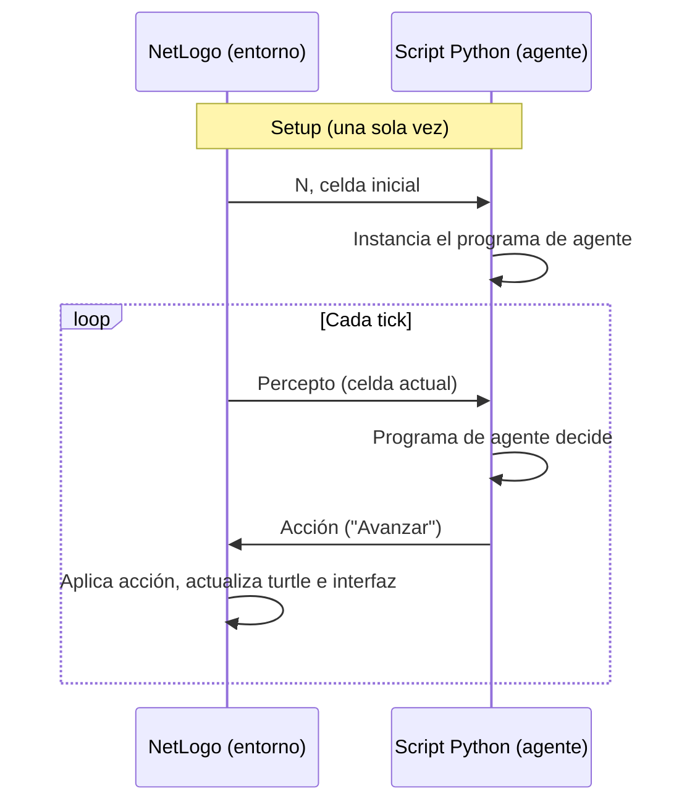

## Fase 2 — Agente distribuido vía comunicación serial

### 1. Motivación y pregunta que se busca resolver

En la Fase 1 se implementó un agente basado en modelo (Russell & Norvig, Cap. 2) en un único proceso de Python, donde agente y entorno coexistían como dos objetos en la misma memoria. La pregunta que motiva esta fase es: **¿sigue siendo un agente, en el sentido estricto del libro, si se le retira la comodidad de compartir proceso con su entorno?** Esta fase busca demostrar que sí, siempre que se respete la única frontera que el libro exige: percepción y acción como los únicos canales de intercambio.

### 2. Marco teórico aplicado

Se apoya en una distinción del propio Capítulo 2 de AIMA, poco explotada en la Fase 1 por no ser necesaria entonces:

- **Programa de agente** (*agent program*): la función que mapea percepto → acción, incluyendo el estado interno que mantiene entre invocaciones.
- **Arquitectura de agente** (*agent architecture*): el dispositivo físico o mecanismo de entrada/salida que aloja ese programa y lo conecta al mundo.

En la Fase 1 estas dos nociones estaban fusionadas implícitamente. Esta fase las separa de forma explícita y verificable.

### 3. Diseño en dos capas

| Capa | Contenido | Restricción de diseño |
|---|---|---|
| Programa de agente | `self.model`, regla de decisión, conteo de vueltas | No contiene ninguna instrucción de entrada/salida (sin `serial`, sin `print` de comunicación) |
| Arquitectura | Apertura del puerto, lectura del percepto, escritura de la acción | No contiene ninguna lógica de decisión propia |

Esta separación no es estética: es la que permite que, en la Fase 3, solo la segunda capa deba reescribirse en C++, mientras la primera se traduce de forma casi literal.

### 4. Secuencia de la interacción propuesta

Se trata de un esquema **síncrono, de pregunta-respuesta**: NetLogo no avanza el tick hasta recibir la acción correspondiente al percepto que acaba de enviar.

### 5. Justificación de la decisión de mantenerlo síncrono

Se descartó deliberadamente introducir asincronismo (lectura no bloqueante + escritura periódica, como en el firmware del ESP32) por dos razones:

1. **No aporta nada a la esencia teórica que se busca demostrar.** El libro define al agente por la función percepto→acción, sin condicionar esa definición al régimen temporal de la comunicación. Los propios ejemplos de código de AIMA son síncronos.
2. **El asincronismo resuelve un problema que aún no existe.** Es una necesidad de la arquitectura física real (un microcontrolador no puede bloquearse esperando datos), no una necesidad del script de Python en esta fase. Introducirlo ahora adelantaría una complejidad de la Fase 3 sin beneficio pedagógico inmediato.

### 6. Lo que queda explícitamente pendiente para la Fase 3

- Sustituir el esquema síncrono por el patrón asíncrono ya validado en `main.cpp` (`Serial.available()` no bloqueante + escritura periódica por `millis()`).
- Traducir la Capa 1 (programa de agente) de Python a C++, esperando que el cambio sea menor dado su aislamiento.
- Reescribir por completo la Capa 2 (arquitectura), esta vez en firmware real.

### 7. Criterio de validación de esta fase

Se considerará exitosa la Fase 2 si:

- El script de Python puede desconectarse y reemplazarse por cualquier otra implementación del programa de agente, sin que NetLogo requiera ningún cambio (verificando que la frontera percepto/acción es real y no solo nominal).
- La turtle en NetLogo se comporta de forma indistinguible respecto a la Fase 1, confirmando que el cambio de arquitectura no alteró el comportamiento del agente.