## Fase 2 — Agente distribuido vía comunicación serial

### 1. Motivación y pregunta que se busca resolver

En la Fase 1 se implementó un agente basado en modelo (Russell & Norvig, Cap. 2) en un único proceso de Python, donde agente y entorno coexistían como dos objetos en la misma memoria. La pregunta que motiva esta fase es: **¿sigue siendo un agente, en el sentido estricto del libro, si se le retira la comodidad de compartir proceso con su entorno?** Esta fase busca demostrar que sí, siempre que se respete la única frontera que el libro exige: percepción y acción como los únicos canales de intercambio.

### 2. Marco teórico aplicado

Se apoya en una distinción del propio Capítulo 2 de AIMA, poco explotada en la Fase 1 por no ser necesaria entonces:

- **Programa de agente** (*agent program*): la función que mapea percepto → acción, incluyendo el estado interno que mantiene entre invocaciones.
- **Arquitectura de agente** (*agent architecture*): el dispositivo físico o mecanismo de entrada/salida que aloja ese programa y lo conecta al mundo.

En la Fase 1 estas dos nociones estaban fusionadas implícitamente. Esta fase las separa de forma explícita y verificable.

### 3. Diseño en dos capas

| Capa | Contenido | Restricción de diseño |
|---|---|---|
| Programa de agente | `self.model`, regla de decisión, conteo de vueltas | No contiene ninguna instrucción de entrada/salida (sin `serial`, sin `print` de comunicación) |
| Arquitectura | Apertura del puerto, lectura del percepto, escritura de la acción | No contiene ninguna lógica de decisión propia |

Esta separación no es estética: es la que permite que, en la Fase 3, solo la segunda capa deba reescribirse en C++, mientras la primera se traduce de forma casi literal.

### 4. Secuencia de la interacción propuesta

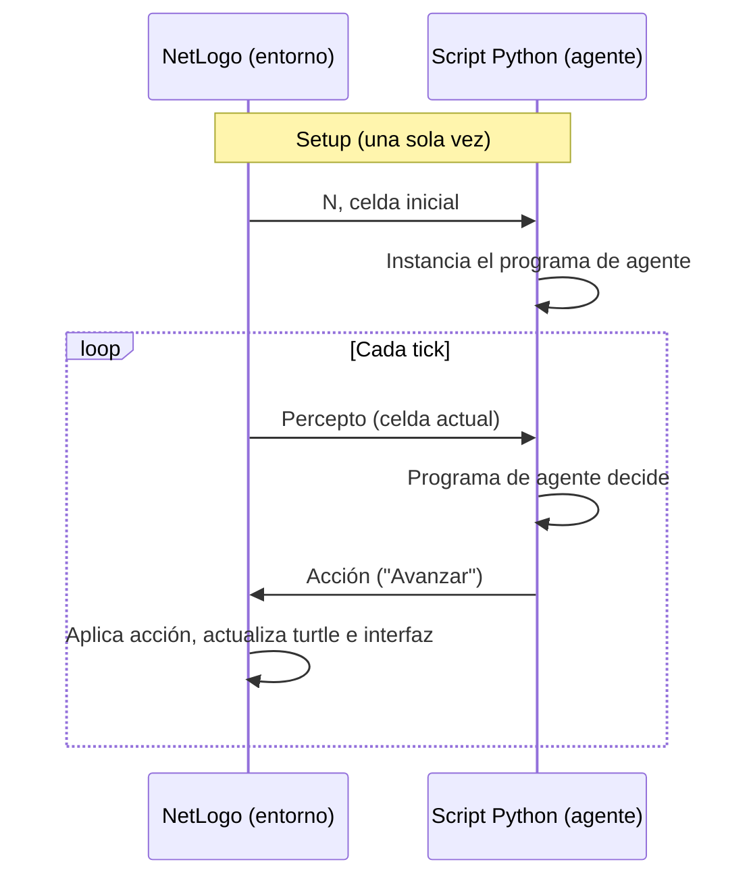

Se trata de un esquema **síncrono, de pregunta-respuesta**: NetLogo no avanza el tick hasta recibir la acción correspondiente al percepto que acaba de enviar.

### 5. Justificación de la decisión de mantenerlo síncrono

Se descartó deliberadamente introducir asincronismo (lectura no bloqueante + escritura periódica, como en el firmware del ESP32) por dos razones:

1. **No aporta nada a la esencia teórica que se busca demostrar.** El libro define al agente por la función percepto→acción, sin condicionar esa definición al régimen temporal de la comunicación. Los propios ejemplos de código de AIMA son síncronos.
2. **El asincronismo resuelve un problema que aún no existe.** Es una necesidad de la arquitectura física real (un microcontrolador no puede bloquearse esperando datos), no una necesidad del script de Python en esta fase. Introducirlo ahora adelantaría una complejidad de la Fase 3 sin beneficio pedagógico inmediato.

### 5.1 Detalle de implementación: timeout de lectura

El puerto serial se abre con `timeout=1` (1 segundo), tanto del lado de `agente.py` como del lado de NetLogo (`py:setup`). Esto es lo que hace posible usar `readline()` de forma segura, sin necesidad de reconstruir el patrón de buffer persistente (`rx_buffer`) usado en el ejemplo ESP32↔NetLogo: con timeout, `pyserial` espera hasta recibir una línea completa o hasta agotar el segundo, evitando fragmentos de línea a medias. Un `timeout=0` (no bloqueante, como en aquel ejemplo) no sería compatible con el esquema síncrono de pregunta-respuesta adoptado aquí.

### 6. Lo que queda explícitamente pendiente para la Fase 3

- Sustituir el esquema síncrono por el patrón asíncrono ya validado en `main.cpp` (`Serial.available()` no bloqueante + escritura periódica por `millis()`).
- Traducir la Capa 1 (programa de agente) de Python a C++, esperando que el cambio sea menor dado su aislamiento.
- Reescribir por completo la Capa 2 (arquitectura), esta vez en firmware real.

### 7. Formato de mensajes por el puerto serial

Se adopta un protocolo minimalista, alineado con el patrón ya validado en `main.cpp` (número por línea para el percepto, carácter único para la acción), en lugar de un formato con etiquetas explícitas, dado que en esta fase el agente solo tiene una acción real disponible.

| Momento | Quién escribe | Contenido | Ejemplo |
|---|---|---|---|
| Setup (una vez) | NetLogo → Python | `N` y celda inicial, separados por coma, en un único mensaje | `5,0\n` |
| Cada tick — percepto | NetLogo → Python | Celda actual, como número | `3\n` |
| Cada tick — acción | Python → NetLogo | Un carácter: `A` = avanzar, `N` = no-op (reservado, sin uso actual) | `A\n` |
| Cierre (al desconectar) | NetLogo → Python | Señal reservada de salida | `EXIT\n` |

**Nota sobre el cierre de conexión.** Los puertos virtuales creados con Free Virtual Serial Ports (bridge local, ver sección 10) no propagan una señal de desconexión de un extremo al otro: si NetLogo cierra su lado del puerto (`ser.close()`), `agente.py` no recibe ningún error ni notificación — su `readline()` simplemente sigue esperando y agotando el timeout indefinidamente, ciclo tras ciclo. Por esta razón se añadió la señal explícita `EXIT`, enviada desde NetLogo justo antes de cerrar su propio puerto. Al recibirla, `agente.py` sale de su bucle principal y cierra su extremo del puerto de forma ordenada, sin requerir `Ctrl+C`.

### 8. Criterio de validación de esta fase

Se considerará exitosa la Fase 2 si:

- El script de Python puede desconectarse y reemplazarse por cualquier otra implementación del programa de agente, sin que NetLogo requiera ningún cambio (verificando que la frontera percepto/acción es real y no solo nominal).
- La turtle en NetLogo se comporta de forma indistinguible respecto a la Fase 1, confirmando que el cambio de arquitectura no alteró el comportamiento del agente.

### 9. Resultados y conclusiones

**Lo que se logró demostrar:**

- El programa de agente (`ModelBasedLocationAgent`), aislado por completo de cualquier instrucción de entrada/salida, funciona de forma idéntica ya sea invocado directamente en Python (`agente_base.py`) o a través de un puerto serial (`agente.py`) — el comportamiento observado (avance con *wrap-around*, conteo de vueltas en `performance`) es indistinguible entre ambos casos.
- La frontera percepto/acción se sostuvo de forma real, no solo nominal: NetLogo nunca accede al estado interno del agente (`self.model`, `self.performance`), y el agente nunca accede al estado interno de NetLogo (posición real de la turtle) — todo el intercambio ocurre exclusivamente a través de los mensajes definidos en el protocolo (sección 7).
- El esquema síncrono de pregunta-respuesta resultó suficiente y estable para esta fase: no se presentaron bloqueos permanentes ni pérdida de sincronización entre percepto y acción a lo largo de las pruebas.

**Dificultades encontradas y resueltas:**

- El uso de `xcor`/`setxy` fuera de contexto de turtle (error `"expected to be called by a turtle"`) en `go` y `mover-agente`, corregido con `[xcor] of turtle 0` y `ask turtle 0 [ ... ]`.
- Ejecución de `go` sin que existiera ninguna turtle (error `NOBODY`), corregido con verificaciones explícitas de `count turtles = 0` antes de operar sobre `turtle 0`.
- Ausencia de propagación de la desconexión entre los dos extremos de un puerto virtual bridged (Free Virtual Serial Ports), resuelta con la señal explícita `EXIT` en el protocolo, en lugar de depender de una excepción de `pyserial` que nunca llega a dispararse en este tipo de puerto.

**Conclusión respecto a la pregunta de motivación (sección 1):** sí, la separación entre agente y entorno se sostiene como una relación de agente genuina, en el sentido estricto de Russell & Norvig, incluso cuando se le retira la comodidad de compartir proceso — la única condición necesaria fue diseñar deliberadamente el programa de agente para que no dependiera de nada más que su percepto de entrada.

### 10. Puesta en marcha (replicación desde cero)

Esta sección describe los pasos necesarios para que cualquier persona que descargue este código pueda ejecutar la interfaz completa en su propia máquina, sin haber participado en su desarrollo.

**Archivos involucrados:**

- [`mundo2.nlogox`](mundo2.nlogox) — el mundo, la interfaz y la lógica de conexión/ciclo en NetLogo.
- [`agente.py`](agente.py) — el agente completo (programa de agente + comunicación serial).
- [`agente_base.py`](agente_base.py) — el programa de agente aislado, sin serial (referencia / prueba independiente, no es necesario ejecutarlo para ver la interfaz funcionando).

#### 10.1 Requisitos previos

- **NetLogo 7.0.4** o superior, con la extensión `py` disponible.
- **Python** (en este proyecto, una distribución de Anaconda) con la librería `pyserial` instalada:
  ```bash
  pip install pyserial
  ```
- **Free Virtual Serial Ports** (HHD Software, versión gratuita, uso no comercial) — u otra herramienta equivalente de puertos COM virtuales — para crear el par de puertos que simulan el cable serial entre NetLogo y el agente.

> [!NOTE]
> Este proyecto no requiere ningún ESP32 físico ni Wokwi: toda la comunicación ocurre entre dos procesos en la misma máquina, a través de un puerto serial virtual.

#### 10.2 Crear el par de puertos virtuales

1. Instale y abra **Free Virtual Serial Ports** [[link]](https://freevirtualserialports.com/).
2. En la sección **Local Bridges**, presione el botón **+** (agregar).
3. Cree un par de puertos, por ejemplo `COM1 ↔ COM2` (los nombres exactos pueden variar según qué puertos estén libres en su equipo).
4. Confirme que el par aparece en la lista, tal como `COM1 ↔ COM2`.

   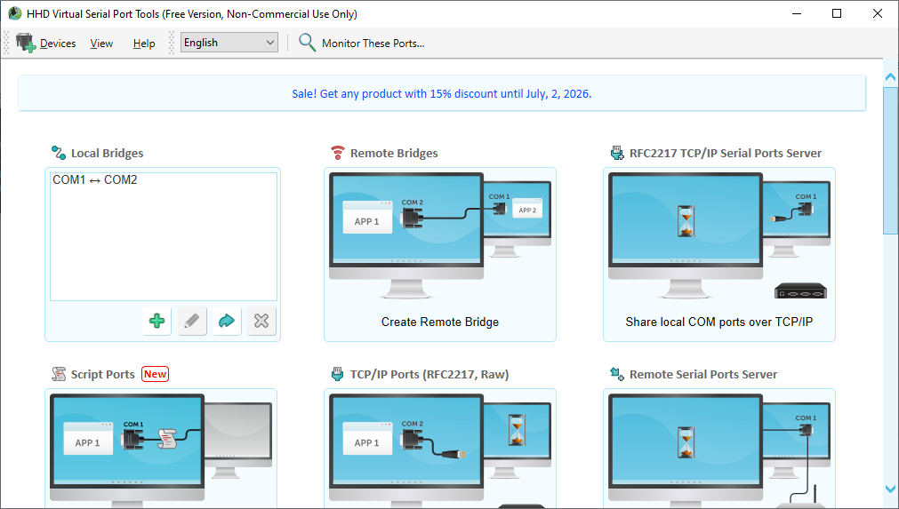

> [!WARNING]
> Si `COM1` o `COM2` ya están ocupados por otro dispositivo en su equipo (por ejemplo, un ESP32 conectado), elija otro par de números libres. En ese caso, ajuste también los valores `PUERTO_SERIAL` en `agente.py` y el puerto usado en `conectar-agente` dentro de `mundo2.nlogox`, para que coincidan con los puertos que haya creado.

5. Verifique desde Python que ambos puertos son detectables:

   ```python
   import serial.tools.list_ports

   for puerto in serial.tools.list_ports.comports():
       print(puerto.device, "-", puerto.description)
   ```

   Debe ver ambos puertos listados, con una descripción similar a `HHD Software Bridged Serial Port`.

   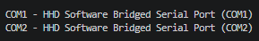

#### 10.3 Ajustar rutas y puertos en el código

Antes de ejecutar nada, revise y ajuste dos valores específicos de su instalación:

1. **Ruta de Python**, dentro de `mundo2.nlogox`, en el procedimiento `conectar-agente`:

   ```netlogo
   py:setup "C:/Users/usuario/anaconda3/python.exe"
   ```

   Reemplace la ruta por la de su propia instalación. Para encontrarla:
   - Windows (Anaconda Prompt): `where python`
   - Linux/macOS: `which python3`

2. **Nombres de puerto**, si su par virtual no quedó exactamente como `COM1`/`COM2`:
   - En `agente.py`: constante `PUERTO_SERIAL`.
   - En `mundo2.nlogox`, dentro de `conectar-agente`: el puerto indicado en `serial.Serial('COM2', ...)`.

   El agente y NetLogo deben abrir **extremos distintos** del mismo par virtual.

#### 10.4 Ejecutar la interfaz completa

1. Abra una terminal y ejecute el agente:

   ```bash
   python agente.py
   ```

   Debe quedar mostrando `[Agente] puerto abierto: COM1` y `[Agente] esperando mensaje de Setup...`, sin avanzar más — esto es correcto, está esperando a NetLogo.

   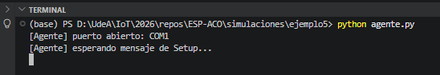

2. Abra `mundo2.nlogox` en NetLogo.

   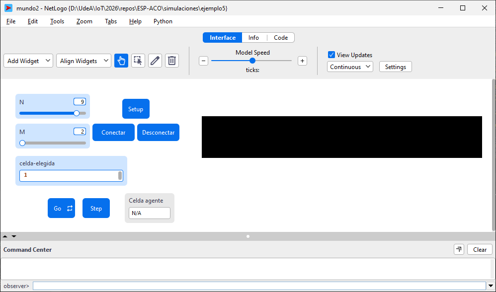

3. Ajuste, si lo desea, los sliders **N** (número de celdas) y **M** (tamaño interior de cada celda), y el input **celda-elegida** (posición inicial del agente, debe estar entre `0` y `N-1`).

   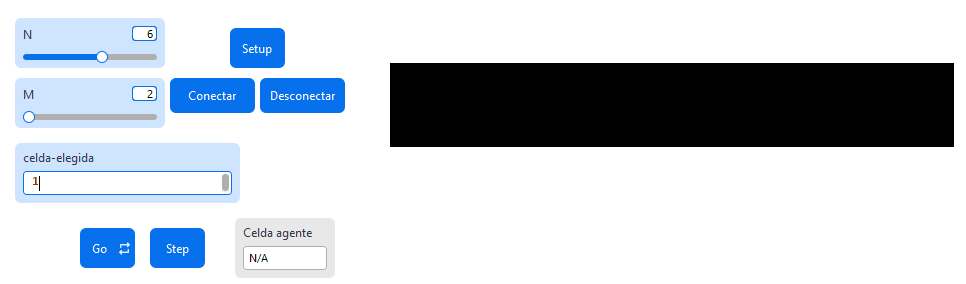

4. Presione **Setup**. Debe aparecer la turtle roja en la celda indicada.

   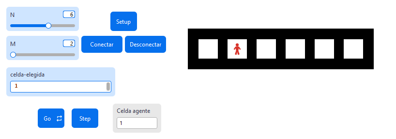

5. Presione **Conectar**. Debe ver:
   - En NetLogo: `Conexion establecida con el agente.`

     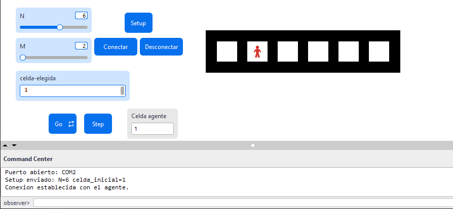

   - En la terminal de Python: `[Agente] setup recibido: N=... celda_inicial=...`

     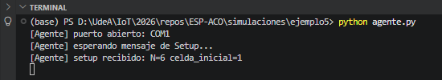

6. Presione **Step** una o varias veces, o **Go** (modo continuo), para observar a la turtle avanzar celda por celda, con salto a la celda `0` al llegar al final. El monitor **Celda agente** debe reflejar la posición actual en todo momento.

   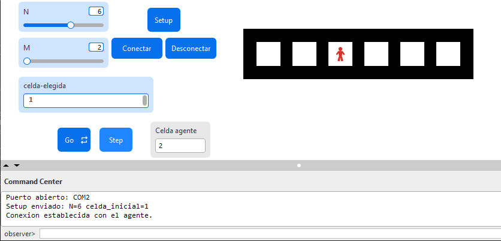

   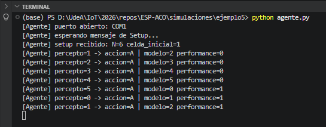

7. Al finalizar, presione **Desconectar**. El script de Python debe imprimir `[Agente] senal de desconexion recibida desde NetLogo.` y terminar por sí solo, sin necesitar `Ctrl+C`.

   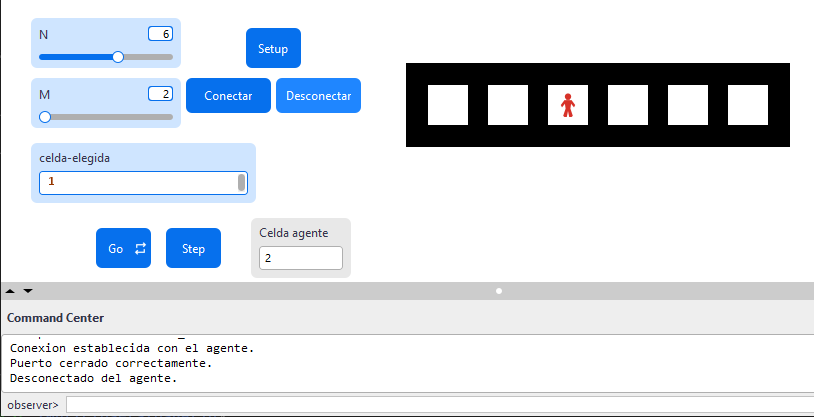

   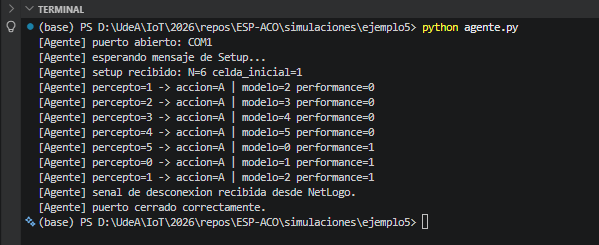

#### 10.5 Solución de problemas frecuentes

| Síntoma | Causa probable | Acción sugerida |
|---|---|---|
| Error `NOBODY` al presionar `Go`/`Step` | No se ejecutó `Setup`, o `celda-elegida` estaba fuera de rango y no se creó ninguna turtle | Verifique con `show count turtles` en el Centro de Comandos; vuelva a ejecutar `Setup` con un valor válido |
| `py:setup` falla o no reconoce el intérprete | Ruta de Python incorrecta | Verifique la ruta con `where python` / `which python3` |
| Error al abrir el puerto en `conectar-agente` | El puerto no existe o ya está en uso por `agente.py` sin haberlo cerrado antes | Confirme que `agente.py` esté corriendo y que los puertos coincidan con los creados en Free Virtual Serial Ports |
| `agente.py` no se cierra al presionar Desconectar | El puerto no llegó a abrirse correctamente, o `agente.py` no se había conectado aún | Cierre manualmente con `Ctrl+C` y revise que ambos procesos se hayan iniciado en el orden descrito (agente primero, luego Setup/Conectar en NetLogo) |
| NetLogo se congela varios segundos en cada `Step`/`Go` | Comportamiento esperado del esquema síncrono: cada tick espera hasta 1 segundo la respuesta del agente | No es un error; si se prolonga más de 1-2 segundos, confirme que `agente.py` sigue corriendo en su terminal |

### 11. Próximos pasos

- **Fase 3 — Migración a ESP32 real**: reescribir la Capa 2 en firmware C++, reemplazando el esquema síncrono por el patrón asíncrono ya validado en `main.cpp` (`Serial.available()` no bloqueante + escritura periódica por `millis()`); traducir la Capa 1 (`agente_base.py`) a una función equivalente en C++, verificando cuánta lógica sobrevive sin cambios dado su aislamiento actual.
- **Actualizar el criterio de validación (sección 8) con una medición concreta**: por ejemplo, cuántas líneas de la Capa 1 requieren modificación al migrar a C++, frente a las líneas de la Capa 2 (que se espera reescribir por completo), para convertir la afirmación cualitativa de "migración transparente" en un dato verificable.
- **Enriquecer intencionalmente el ejercicio con una decisión condicional real** antes de dar el salto a un mundo con múltiples agentes: el agente actual siempre responde `'Avanzar'`, por lo que no ejercita todavía la parte de la definición de agente basado en modelo relacionada con que el comportamiento dependa de una historia acumulada.
- **No extender este código hacia ACO.** Según lo discutido, el mecanismo central de ACO (feromona como magnitud continua en el entorno, regla de transición probabilística, múltiples agentes concurrentes) no está representado en este ejercicio y no debe agregarse por extensión incremental de `ModelBasedLocationAgent`. El siguiente peldaño relacionado con ACO debe iniciar como un ejercicio nuevo, aplicando lo aprendido aquí (separación programa/arquitectura, disciplina de protocolo, manejo de contexto turtle/observer en NetLogo) sin heredar el código de este agente de ubicación.
- **Formalizar esta fase como parte de la documentación del repositorio ESP-ACO**, dejando explícito que se trata de un ejercicio de aprendizaje escalonado (SIL, en la terminología de la sección de metodología discutida fuera de este documento) y no de un componente que se integre directamente al sistema final.

> [!important]
> Este material fue desarrollado con apoyo de herramientas de IA como asistente de redacción y estructuración. El contenido ha sido supervisado, validado y refinado por intervención humana para garantizar su precisión técnica y coherencia pedagógica. No obstante, pueden haber errores.