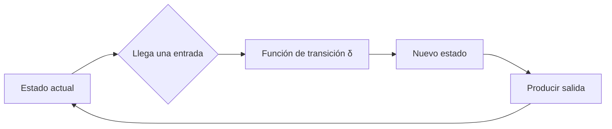
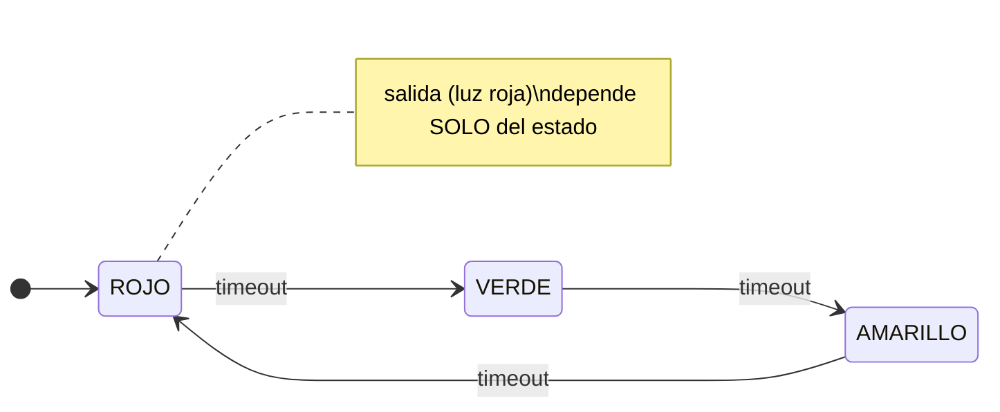
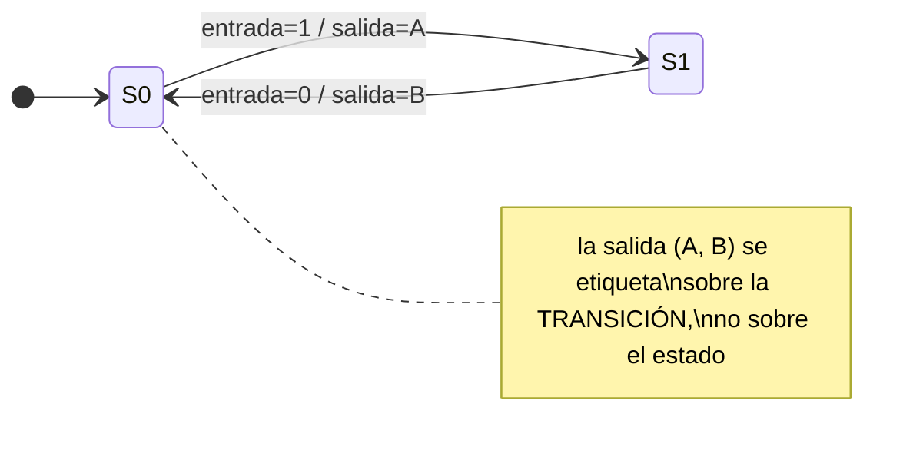
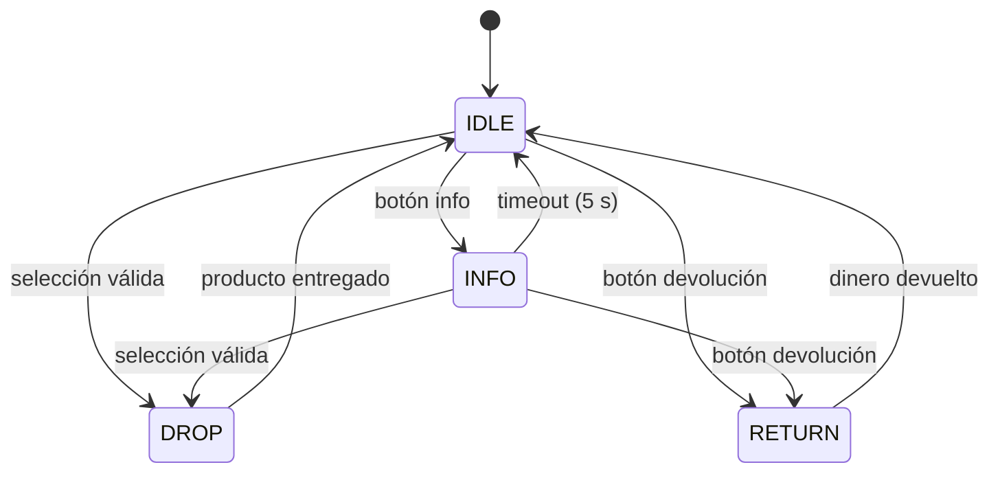
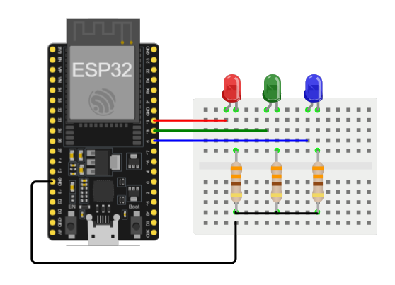
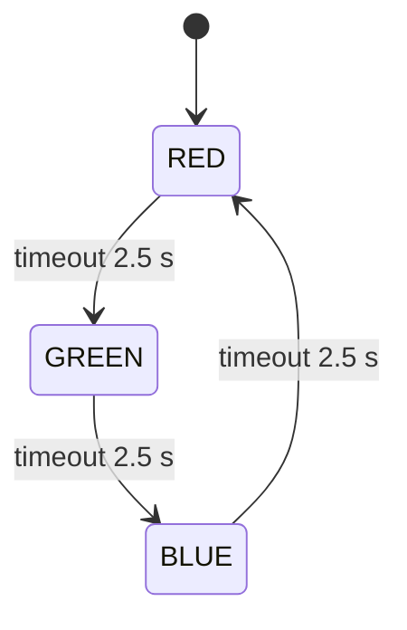
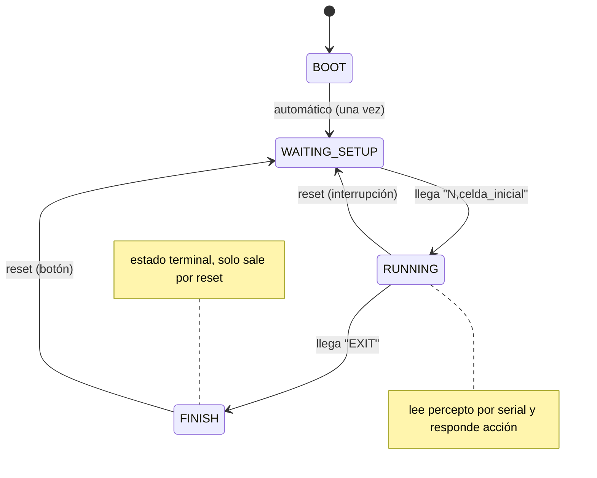

# Máquinas de estado finito (FSM) en sistemas embebidos

Material autocontenido: no requiere haber leído otros documentos de este
repositorio. El objetivo es entender qué es una máquina de estado finito,
por qué es una herramienta natural para programar sistemas embebidos, y
verla funcionar en un ejemplo mínimo ejecutable sobre un ESP32.

---

## 1. Motivación: el problema que la FSM resuelve

Un programa embebido típico no ejecuta una secuencia lineal de principio a
fin: reacciona. Espera entradas (un botón, un mensaje serial, un umbral de
sensor), y su respuesta correcta ante la misma entrada **depende de lo que
haya ocurrido antes**. Un botón de encendido apaga el equipo si está
encendido y lo enciende si está apagado: misma entrada, dos respuestas
distintas, y la diferencia es la *historia*.

La forma ingenua de manejar esa historia es acumular variables booleanas
(`encendido`, `esperandoConfiguracion`, `enError`, ...) y condicionales que
las combinan. El problema es combinatorio: con n banderas hay 2^n
combinaciones posibles, la mayoría sin significado, y nada en el código
impide caer en una de las combinaciones inválidas. El comportamiento se
vuelve difícil de predecir, de verificar y de explicar.

La máquina de estado finito ataca ese problema de raíz: en lugar de muchas
banderas independientes, existe **una sola variable de estado** que solo
puede tomar valores de una lista cerrada y con nombre. El sistema está
siempre en exactamente uno de esos estados, y solo cambia de estado por
transiciones definidas explícitamente. Las combinaciones inválidas dejan
de ser posibles porque nunca se declararon.

> [!IMPORTANT]
> El valor de una FSM no está en el código que genera, sino en lo que
> prohíbe: todo comportamiento que no esté dibujado en el diagrama de
> estados es, por construcción, imposible. Eso convierte al diagrama en
> una especificación verificable, no en documentación decorativa.

---

## 2. Definición formal

Una máquina de estado finito queda definida por cinco elementos:

| Elemento | Símbolo usual | En un sistema embebido, típicamente... |
|---|---|---|
| Conjunto finito de estados | S | los valores de un `enum` |
| Estado inicial | s₀ ∈ S | la asignación hecha en `setup()` |
| Alfabeto de entradas | Σ | eventos: botón, byte serial, timeout |
| Función de transición | δ: S × Σ → S | los `if` que reasignan la variable de estado |
| Salidas | — | acciones sobre pines, mensajes, actuadores |

Dos representaciones equivalentes acompañan siempre a la definición:

- **El diagrama de estados**: un grafo dirigido donde los nodos son
  estados y las aristas son transiciones, etiquetadas con el evento que
  las dispara. Es la vista para razonar y comunicar.
- **La tabla de estados** (*next-state table*): una tabla con el estado
  actual en las filas, las entradas posibles en las columnas, y el estado
  siguiente en cada celda. Es la vista para verificar exhaustivamente:
  una celda vacía es una combinación estado/entrada que nadie decidió
  qué hace — un bug esperando a ocurrir.

> [!TIP]
> El diagrama y la tabla contienen la misma información. En la práctica
> conviene dibujar primero el diagrama (para pensar) y llenar después la
> tabla (para auditar que ninguna combinación quedó sin definir).

El esquema general de operación de cualquier FSM, independientemente del
dominio, es el mismo ciclo:



---

## 3. Dos familias de FSM: Moore y Mealy

La definición formal deja abierta una pregunta que Valvano trata con
cuidado en *Embedded Systems*: **¿de qué depende la salida?** Según la
respuesta, una FSM pertenece a una de dos familias.

### Máquina de Moore

La salida depende **únicamente del estado actual**. No importa por cuál
transición se llegó a ese estado ni qué entrada está presente en este
instante: estar en el estado X produce siempre la misma salida.

```
salida = f(estado)
```

Un semáforo es el ejemplo canónico: en el estado `ROJO` la luz roja está
encendida, y punto — la salida es una propiedad del estado, no del evento
que hizo llegar hasta él. El ejemplo RGB de la sección siguiente es una
máquina de Moore pura: cada estado (`RED`, `GREEN`, `BLUE`) enciende su
LED correspondiente sin consultar ninguna entrada.



### Máquina de Mealy

La salida depende **del estado actual y de la entrada** simultáneamente.
La misma entrada puede producir salidas distintas según el estado, y estar
en el mismo estado puede producir salidas distintas según la entrada.

```
salida = f(estado, entrada)
```

La salida queda asociada a la *transición*, no al estado. Esto suele
producir máquinas con menos estados que su equivalente de Moore (parte de
la información que Moore codifica en estados separados, Mealy la codifica
en la combinación estado+entrada), a cambio de un acoplamiento más directo
entre entrada y salida.



> [!NOTE]
> Toda máquina de Mealy puede convertirse en una de Moore equivalente y
> viceversa; no son capacidades distintas, sino estilos de diseño. Moore
> tiende a ser más fácil de razonar y verificar (la salida se lee del
> estado); Mealy tiende a ser más compacta y a reaccionar en el mismo
> ciclo en que llega la entrada. En sistemas embebidos con recursos
> ajustados, la elección suele ser pragmática, no dogmática.

### Cómo distinguirlas en el código

En una implementación con `switch(estado)`, la diferencia se ve en dónde
vive la escritura de la salida:

- **Moore**: la salida se fija *al entrar* al estado o dentro del `case`
  del estado, sin mirar la entrada.
- **Mealy**: la salida se fija *dentro de la lógica de transición*, en el
  punto donde se evalúa la entrada y se decide el próximo estado.

---

## 4. La tabla de estados como artefacto de diseño

Valvano insiste en un punto que es fácil pasar por alto: **la tabla de
estados se construye antes que el código, no se extrae después.** Es la
herramienta que obliga a decidir, para cada combinación de estado y
entrada, qué debe pasar — incluidas las combinaciones que uno preferiría
ignorar.

Su formato general (para una máquina de Moore):

| Estado actual | Entrada | Estado siguiente | Salida (del estado) |
|---|---|---|---|
| S₀ | e₁ | S₁ | salida de S₀ |
| S₀ | e₂ | S₀ | salida de S₀ |
| S₁ | e₁ | S₁ | salida de S₁ |
| ... | ... | ... | ... |

El ejercicio de llenarla completa tiene un beneficio concreto: cada fila
que uno *no sabe cómo llenar* es una decisión de diseño que estaba oculta.
¿Qué hace el sistema si llega la entrada e₂ estando en el estado S₁? Si la
tabla no tiene esa fila, el código tampoco la tendrá, y el comportamiento
ante ese caso quedará indefinido — que en la práctica significa "lo que sea
que el compilador y el azar decidan".

> [!TIP]
> Una tabla de estados completa es una lista de verificación: N estados por
> M entradas posibles = N×M filas que *deben* existir. Si su tabla tiene
> menos filas que ese producto, hay combinaciones sin decidir. Ese conteo
> es la forma más rápida de auditar una FSM antes de escribir una línea de
> código.

---

## 5. Ejemplo canónico: la máquina expendedora

Antes de pasar a un ejemplo ejecutable, conviene ver el caso que la
literatura usa una y otra vez para presentar las FSM con transiciones por
evento: la máquina expendedora. Se presenta aquí solo como modelo
conceptual —su diagrama de estados—, sin implementación; el objetivo es
leer una FSM antes de escribir una.

Una máquina expendedora típica se modela con cuatro estados:

- **IDLE (reposo)**: muestra el saldo y espera. Es el estado al que la
  máquina siempre regresa.
- **INFO**: muestra información de un producto (precio, existencias)
  durante un tiempo, y vuelve sola a IDLE.
- **DROP (entrega)**: libera el producto seleccionado y vuelve a IDLE.
- **RETURN (devolución)**: devuelve el dinero insertado y vuelve a IDLE.



Este diagrama ilustra varios rasgos que reaparecerán en cualquier FSM
embebida real:

- **Un estado central de reposo** (IDLE) que actúa como eje: casi todas
  las transiciones parten de él o regresan a él. Es un patrón tan común
  que conviene reconocerlo como tal.
- **Transiciones por evento externo** (insertar moneda, pulsar un botón,
  elegir un producto) frente a **transiciones automáticas** (el timeout
  de 5 segundos que saca de INFO sin que nadie intervenga). Una misma FSM
  suele combinar ambos tipos.
- **Acciones que son globales al sistema, no propias de un estado**:
  insertar dinero incrementa el saldo *sin importar en qué estado esté la
  máquina*. Esas acciones no viven en el `switch` de estados; viven en el
  manejo del evento (una interrupción, típicamente), y son ortogonales a
  la máquina de estados en sí.

> [!NOTE]
> Este documento no reproduce la implementación en código de la máquina
> expendedora; existe desarrollada en la referencia de Digikey sobre cómo
> programar una FSM en Arduino (ver Referencias). Aquí interesa únicamente
> como diagrama de lectura: dado el grafo anterior, usted debería poder
> anticipar qué hace la máquina ante cualquier evento, en cualquier estado,
> sin ver una sola línea de código. Esa capacidad de predicción es
> exactamente lo que una buena FSM garantiza.

---

## 6. Ejemplo ejecutable: ciclo RGB en ESP32

El ejemplo más simple posible de FSM es uno sin ninguna entrada externa:
un ciclo de tres estados que avanza solo por el paso del tiempo. Cada
estado enciende un LED de color distinto (rojo → verde → azul → rojo…),
cambiando cada 2.5 segundos. Es una **máquina de Moore pura**: la salida
(qué LED se enciende) depende solo del estado, y no hay ninguna entrada
que consultar.

Proyecto Wokwi (ejecutable en el navegador, sin hardware):
https://wokwi.com/projects/468484978648176641

### 6.1 Circuito

Un ESP32 con tres LEDs en protoboard, cada uno en serie con su resistencia
limitadora hacia GND:



| LED | Pin ESP32 |
|---|---|
| Rojo | GPIO 19 |
| Verde | GPIO 18 |
| Azul | GPIO 5 |

### 6.2 Tabla de estados

Al no haber entradas externas, la tabla es trivial —una sola columna de
transición, siempre automática— pero vale la pena escribirla para ver que
la FSM está completa: los 3 estados tienen su transición definida.

| Estado actual | Entrada | Estado siguiente | Salida |
|---|---|---|---|
| RED | (timeout 2.5 s) | GREEN | LED rojo encendido |
| GREEN | (timeout 2.5 s) | BLUE | LED verde encendido |
| BLUE | (timeout 2.5 s) | RED | LED azul encendido |

### 6.3 Diagrama de estados



### 6.4 Código

```cpp
#define R_LED_PIN 19
#define G_LED_PIN 18
#define B_LED_PIN 5

enum States {
  RED,
  GREEN,
  BLUE
};

// Estado inicial (de arranque)
States state = States::RED;

void setup() {
  pinMode(R_LED_PIN, OUTPUT);
  pinMode(G_LED_PIN, OUTPUT);
  pinMode(B_LED_PIN, OUTPUT);
}

void nextState() {
  if (state == States::RED) state = States::GREEN;
  else if (state == States::GREEN) state = States::BLUE;
  else state = States::RED;
}

void loop() {
  // Estas acciones ocurren siempre, sin importar el estado:
  // apagar los tres LEDs antes de encender el que corresponda.
  digitalWrite(R_LED_PIN, LOW);
  digitalWrite(G_LED_PIN, LOW);
  digitalWrite(B_LED_PIN, LOW);

  // Acciones dependientes del estado (salida de Moore: función solo del estado)
  switch(state) {
    case States::RED:
      digitalWrite(R_LED_PIN, HIGH);
      break;
    case States::GREEN:
      digitalWrite(G_LED_PIN, HIGH);
      break;
    case States::BLUE:
      digitalWrite(B_LED_PIN, HIGH);
      break;
  }

  // Espera y transición al siguiente estado
  delay(2500);
  nextState();
}
```

### 6.5 Anatomía: cómo el código refleja la teoría

Cada pieza del código mapea directamente a un elemento de la definición
formal de la sección 2:

- **`enum States`** es el conjunto finito de estados S. Que sea un `enum`
  y no tres enteros sueltos es lo que garantiza que `state` solo pueda
  tomar valores válidos.
- **`States state = States::RED`** es el estado inicial s₀.
- **`nextState()`** es la función de transición δ. Aquí no recibe ninguna
  entrada porque el único "evento" es el paso del tiempo; en una FSM con
  entradas, esta función las consultaría.
- **El bloque de apagado + `switch`** es la salida. Que sea salida de
  **Moore** se ve en que el `switch` solo mira `state`, nunca una entrada.
- **El patrón "apagar todo, luego encender el del estado actual"** es una
  técnica de diseño importante: garantiza que la salida sea función *solo*
  del estado presente, sin depender de qué LED estaba encendido antes. Sin
  ese apagado previo, la salida arrastraría historia y dejaría de ser una
  Moore limpia.

> [!WARNING]
> Este ejemplo usa `delay(2500)`, que **bloquea** el `loop()` durante 2.5
> segundos completos. Es aceptable aquí porque no hay ninguna otra cosa
> que el sistema deba atender: sin entradas, sin otros periféricos. En el
> momento en que una FSM deba responder a un botón o a un mensaje serial
> *mientras* transcurre un intervalo de tiempo, `delay()` deja de servir y
> hay que reemplazarlo por comparación de marcas de tiempo con `millis()`.
> Esta es exactamente la diferencia que separa este ejemplo didáctico de
> una FSM embebida de uso real (ver sección siguiente).

---

## 7. De este ejemplo a una FSM embebida real: el agente ESP-ACO

El ejemplo RGB es deliberadamente mínimo, pero su estructura no es de
juguete: es exactamente la misma que sostiene el firmware del agente de
ubicación del proyecto ESP-ACO. Si abre `main.cpp` (Fase 3) encontrará el
mismo esqueleto que acaba de estudiar —un `enum` de estados, una variable
de estado global, y un `switch(estado)` dentro de `loop()`—, no un patrón
parecido sino el mismo. Lo que cambia es aquello que el agente le añadió
al esqueleto, y cada añadido corresponde a un concepto ya visto en este
documento.



### Evolución 1: de transición automática a transición por entrada

El RGB es una máquina de Moore que solo avanza por el paso del tiempo: no
consulta ninguna entrada. El agente, en cambio, transiciona en respuesta a
mensajes que llegan por el puerto serial —la configuración inicial que lo
lleva a operar, el percepto en cada ciclo, la señal de cierre que lo
termina—. Es el salto de una FSM sin alfabeto de entrada a una FSM cuya
función de transición δ sí depende de lo que recibe (sección 2).

### Evolución 2: de `delay()` a tiempo no bloqueante

El `[!WARNING]` de la sección anterior anticipó este punto. El agente no
puede permitirse un `delay()`: mientras "espera", debe seguir atendiendo el
puerto serial, porque un percepto puede llegar en cualquier momento. Por eso
su lectura es no bloqueante —consulta si hay datos disponibles en cada
vuelta de `loop()` y solo actúa cuando una línea está completa— en lugar de
detener todo el sistema durante un intervalo fijo. Esa es, en concreto, la
frontera entre un ejemplo didáctico y una FSM embebida que convive con
otros periféricos.

### Evolución 3: acciones globales por interrupción

En la máquina expendedora (sección 5), insertar dinero incrementaba el
saldo *sin importar el estado* —una acción global, ajena al `switch`—. El
agente tiene su equivalente exacto: un botón de reset que, mediante una
interrupción, fuerza el regreso al estado de espera desde cualquier punto,
sin pasar por la lógica del `switch`. Aquello que en la expendedora era un
diagrama conceptual, en el agente es una rutina de interrupción funcionando
sobre hardware real.

### El puente con la teoría de agentes (AIMA)

Hay una última conexión que vale la pena nombrar, aunque su desarrollo
pertenece a otro documento. La variable de estado de una FSM —esa creencia
única y con nombre sobre "en qué situación estoy"— es, conceptualmente, el
mismo objeto que el *modelo interno* de un agente basado en modelo en el
sentido de Russell & Norvig (AIMA, Cap. 2). Una FSM es, en el fondo, la
maquinaria mínima que le permite a un agente embebido sostener un modelo de
su propia situación y decidir en función de él. Las dos líneas teóricas del
proyecto —máquinas de estado por el lado de sistemas embebidos, agentes
basados en modelo por el lado de la IA— convergen en la misma variable.

> [!TIP]
> Si quiere ver el esqueleto de este documento convertido en un sistema
> completo —con entrada serial, tiempo no bloqueante e interrupciones—,
> revise la implementación del firmware del agente en la Fase 3 del proyecto
> (`main.cpp`) y su documentación asociada.

---

## Referencias

- Digikey — *What is a State Machine?*
  https://www.digikey.com/es/maker/tutorials/2023/what-is-a-state-machine
- Digikey — *How to Program an Arduino Finite State Machine*
  https://www.digikey.com/en/maker/tutorials/2023/how-to-program-an-arduino-finite-state-machine
- Valvano, J. — *Embedded Systems: Introduction to ARM Cortex-M Microcontrollers*
  (capítulos sobre máquinas de estado finito: Moore, Mealy, tablas de estado)
- Proyecto Wokwi — *fsm-hello-world*
  https://wokwi.com/projects/468484978648176641