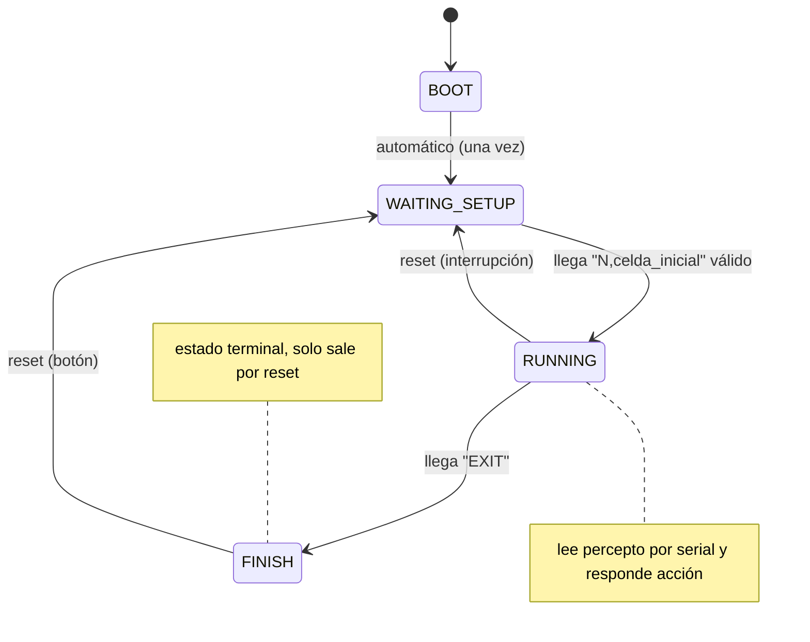
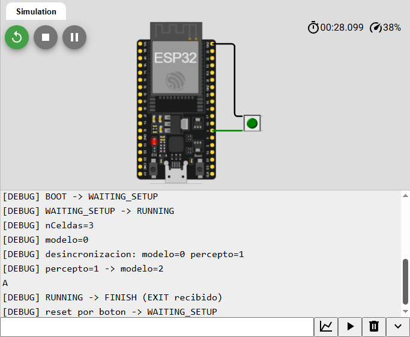
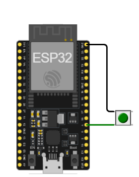
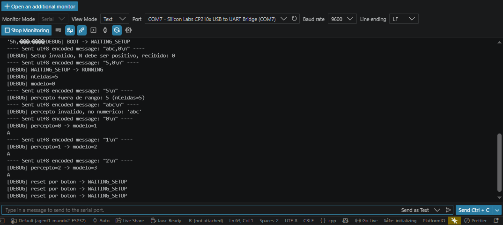
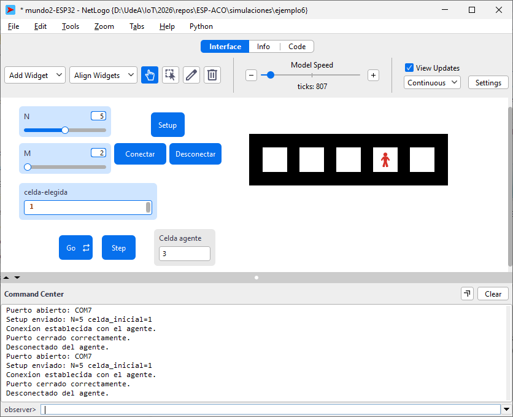
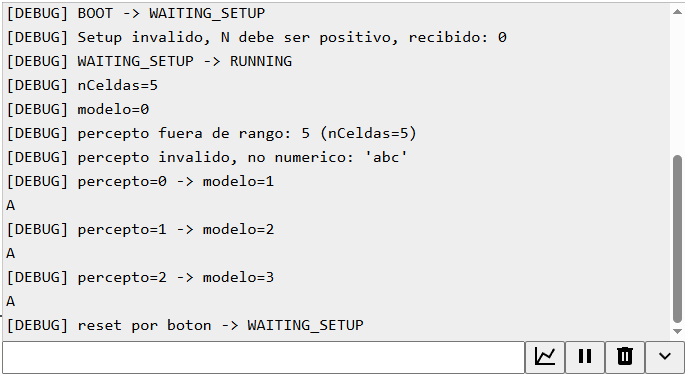

# Fase 3 — Integración del agente AIMA en firmware ESP32

Documentación de la puesta en marcha e integración del agente de ubicación
(Russell & Norvig, *AIMA*, Cap. 2) como firmware C++ corriendo en un ESP32
físico, comunicándose con un mundo simulado en NetLogo por puerto serial.

Este README es autocontenido, pero forma parte de una progresión de tres
fases. La sección 1 resume esa progresión para dar contexto; el resto del
documento se concentra en la Fase 3.

---

## 1. Contexto: de dónde viene esta fase

El proyecto explora, de forma incremental, un agente basado en modelo en un
mundo lineal de N celdas dispuestas en anillo (con *wrap-around*). El agente
mantiene una creencia interna sobre su propia ubicación (`modelo`), la
contrasta contra el percepto real que recibe del mundo, predice su próxima
celda y decide su acción. Es el ejercicio canónico de *conciencia de
ubicación* de AIMA.

La misma idea se ha implementado en tres arreglos progresivamente más
cercanos a un sistema embebido real:

| Fase | Dónde vive el agente | Dónde vive el mundo | Comunicación |
|---|---|---|---|
| **Fase 1** | Proceso Python | Mismo proceso Python | Llamadas a función (en memoria) |
| **Fase 2** | Proceso Python (`agente.py`) | NetLogo | Puerto serial virtual, protocolo síncrono |
| **Fase 3** | **Firmware ESP32** (`main.cpp`) | NetLogo | **Puerto serial físico (USB)**, mismo protocolo |

En la Fase 1, entorno y agente son un solo programa: no hay frontera. En la
Fase 2, el agente se extrae a un proceso aparte y se comunica con el mundo
de NetLogo a través de un puerto serial virtual, usando un protocolo
síncrono de pregunta-respuesta (NetLogo envía el percepto y espera la
acción). La Fase 3 —este documento— da el último paso: el proceso Python
desaparece y su lugar lo ocupa un ESP32 físico conectado por USB.

> [!IMPORTANT]
> La invariante que gobierna toda la Fase 3: **la interfaz observable de
> NetLogo no cambia.** El mundo sigue enviando el mismo Setup, el mismo
> percepto por tick, y esperando la misma acción. Solo cambia qué hay del
> otro lado del cable serial: antes un script de Python, ahora un
> microcontrolador. Si la migración es correcta, la turtle en NetLogo se
> comporta de forma indistinguible respecto a la Fase 2.

Esta invariante es también el criterio de éxito de la fase: no se trata de
que el ESP32 "funcione", sino de que sea un reemplazo transparente del
`agente.py` que ya funcionaba.

---

## 2. Decisión de diseño: síncrono vs. asíncrono

La primera decisión, tomada antes de escribir una línea de firmware, fue
cómo debía leer el ESP32 el puerto serial. En Python, `agente.py` podía
permitirse bloquear: la llamada `readline()` con `timeout=1` detiene el
proceso hasta que llega una línea completa, y eso no causa ningún problema
porque el sistema operativo gestiona todo lo demás.

En un microcontrolador no hay sistema operativo detrás. Bloquear el `loop()`
esperando una línea significa detener **todo** el firmware: no se atiende el
botón de reset, no se actualiza el indicador de estado, y —de forma más
peligrosa— el *watchdog* del ESP32 podría reiniciar la placa si la espera se
prolonga. El bloqueo que era inofensivo en Python se vuelve inviable en
hardware.

La clave para resolver esto fue separar dos conceptos que se confunden con
facilidad:

- **El protocolo es síncrono**: NetLogo envía un percepto y espera una
  acción antes de continuar. Esto no cambia — es parte de la interfaz
  observable que la invariante de la sección 1 prohíbe tocar.
- **La lectura del firmware es no bloqueante**: el ESP32 no se detiene a
  esperar. En cada vuelta de `loop()` consulta si hay datos disponibles
  (`Serial.available()`), acumula caracteres en un buffer propio, y solo
  actúa cuando ha recibido una línea completa (delimitada por `\n`).

> [!NOTE]
> "Síncrono/asíncrono" del **protocolo** (quién espera a quién) y
> "bloqueante/no bloqueante" de la **lectura** (cómo consume el firmware el
> puerto) son decisiones independientes. La Fase 3 combina un protocolo
> síncrono con una lectura no bloqueante: NetLogo sigue esperando su
> respuesta, pero el ESP32 nunca se congela para producirla.

Esta lectura no bloqueante es la misma solución que ya se había usado del
lado de Python para manejar tramas seriales parciales (un buffer persistente
que acumula fragmentos hasta completar la línea). La función
`leerLineaSerial()` del firmware es su equivalente directo en C++:

```cpp
bool leerLineaSerial(String &lineaCompleta) {
  while (Serial.available() > 0) {
    char c = Serial.read();
    if (c == '\n') {
      lineaCompleta = rxBuffer;
      rxBuffer = "";
      return true;      // línea completa lista
    } else if (c != '\r') {
      rxBuffer += c;     // acumula, descartando '\r'
    }
  }
  return false;          // aún no hay línea completa; loop() sigue
}
```

El `return false` es el corazón del diseño no bloqueante: si no hay una
línea completa todavía, la función cede el control de inmediato y `loop()`
continúa con sus otras tareas (LED, botón), en lugar de quedarse esperando.

---

## 3. Arquitectura del firmware: máquina de estado finito

El firmware se organiza como una máquina de estado finito (FSM) de cuatro
estados. Esta elección no es decorativa: el agente tiene un ciclo de vida
con etapas bien diferenciadas (arrancar, esperar configuración, operar,
terminar), y una FSM hace que cada etapa —y las transiciones permitidas
entre ellas— sean explícitas y verificables.

```cpp
enum class AgentState {
  BOOT,
  WAITING_SETUP,
  RUNNING,
  FINISH
};
```

### 3.1 Los cuatro estados

| Estado | Qué hace | Cómo sale de él |
|---|---|---|
| **BOOT** | Arranque del hardware. Se ejecuta una sola vez tras el encendido. | Transición automática e inmediata a `WAITING_SETUP`. |
| **WAITING_SETUP** | Espera el mensaje de configuración (`N,celda_inicial`) de NetLogo. Valida el formato. | Al recibir un Setup válido, pasa a `RUNNING`. |
| **RUNNING** | Ciclo de operación: lee percepto, actualiza modelo, decide y responde acción. | Al recibir `EXIT`, pasa a `FINISH`. |
| **FINISH** | Estado terminal. No lee serial ni transiciona por sí solo. | Solo sale por el botón de reset (interrupción). |

> [!NOTE]
> Separar `BOOT` (arranque de hardware, una única vez) de `WAITING_SETUP`
> (espera del *handshake* con NetLogo, repetible) es una decisión de diseño
> deliberada. El botón de reset regresa a `WAITING_SETUP`, no a `BOOT`:
> reinicia la *sesión lógica* con el mundo sin reiniciar el hardware.

### 3.2 Diagrama de estados



Dos transiciones merecen atención porque son decisiones explícitas de este
diseño, no consecuencias automáticas:

- **`RUNNING → WAITING_SETUP` por reset**: el reset es válido en cualquier
  momento, incluso a mitad de una sesión activa. Permite abortar y reiniciar
  sin esperar a que llegue `EXIT`.
- **`FINISH` como estado terminal**: una vez recibido `EXIT`, el agente no
  se re-arma solo. Queda inerte hasta que el operador presione el botón. Es
  una decisión de seguridad: el agente no vuelve a estar disponible por
  accidente.

### 3.3 Correspondencia AIMA ↔ firmware

El firmware es una traducción directa del agente basado en modelo de AIMA.
Cada elemento conceptual tiene su encarnación en el código:

| Concepto AIMA (`agente_base.py`) | En el firmware ESP32 |
|---|---|
| `self.n_celdas` (tamaño del mundo) | variable global `nCeldas` |
| `self.model` (creencia de ubicación) | variable global `modelo` |
| `self.performance` (vueltas completas) | variable global `performance` |
| `act_from_percept()` (función de decisión) | cuerpo de `handleRunningState()` |
| Regla de transición (avance con *wrap-around*) | `(modelo + 1) % nCeldas` |
| Detección de vuelta completa | `if (prediccion == 0) performance++` |

La lógica de decisión es idéntica a la de las fases anteriores; lo único que
cambia es que ahora vive dentro del estado `RUNNING` de la FSM en lugar de
en un método de una clase Python.

### 3.4 Protocolo de mensajes serial

El protocolo es **idéntico** al de la Fase 2 — esa es justamente la
invariante que preserva la transparencia del reemplazo. Todos los mensajes
son líneas de texto terminadas en `\n`, a **9600 baudios**.

| Mensaje | Dirección | Formato | Cuándo | Ejemplo |
|---|---|---|---|---|
| **Setup** | NetLogo → ESP32 | `N,celda_inicial` | Una vez, al conectar | `5,0` |
| **Percepto** | NetLogo → ESP32 | `celda_actual` | Cada tick | `3` |
| **Acción** | ESP32 → NetLogo | `A` | Respuesta a cada percepto | `A` |
| **Salida** | NetLogo → ESP32 | `EXIT` | Al desconectar | `EXIT` |

Detalles del protocolo que el firmware asume:

| Aspecto | Valor | Nota |
|---|---|---|
| Velocidad | 9600 baudios | Debe coincidir en ambos extremos. |
| Terminador de línea | `\n` (LF) | El firmware descarta `\r`, por lo que `\r\n` (CRLF) también funciona. |
| Codificación | Texto/UTF-8 | Números en ASCII, no bytes crudos. |
| Acción única | Siempre `A` (avanzar) | El mundo es determinista: la única acción posible es avanzar. `N` (no-op) está reservado pero sin uso. |
| Emparejamiento | Una acción por percepto | El ESP32 responde exactamente una vez por cada percepto recibido, nunca por temporizador. Esto preserva el emparejamiento tick↔respuesta que NetLogo espera. |

> [!IMPORTANT]
> El firmware responde una acción **por cada percepto recibido**, no de forma
> periódica. Esta distinción es esencial: NetLogo, tras enviar un percepto,
> bloquea esperando exactamente una línea de respuesta. Una emisión por
> temporizador (como la del ejemplo potenciómetro/LED de referencia)
> rompería el emparejamiento y desincronizaría la turtle.

---

## 4. Evolución del firmware: de la primera versión funcional al MVP

El firmware no se escribió de una vez. La primera versión (A) implementaba
la máquina de estados completa y ya funcionaba en simulación, pero con una
lógica mínima. Una segunda ronda de correcciones (B) endureció esa base
hasta el mínimo viable que se descargó a hardware. Documentar esa evolución
importa porque cada corrección responde a un riesgo concreto que la primera
versión no atendía.

Ambas versiones existen como proyectos Wokwi independientes:

- **Versión A** (primera versión funcional): https://wokwi.com/projects/468558655121830913
- **Versión B** (MVP corregido, descargado a hardware): https://wokwi.com/projects/468489112008302593

| Aspecto | Versión A (inicial) | Versión B (MVP) | Por qué se corrigió |
|---|---|---|---|
| **Debounce del botón** | Ausente. El ISR reasigna estado en cada flanco. | `DEBOUNCE_MS = 200`, se compara `millis()` en el ISR. | Un botón mecánico rebota: una pulsación generaba varias interrupciones. |
| **Reset y `performance`** | El reset no limpiaba `performance`. | El reset limpia `performance = 0` de inmediato. | Comportamiento intuitivo: un "reset" debe borrar todo el estado, no dejar el contador con el valor anterior. |
| **Validación de Setup** | Solo `if (comaPos > 0)`. | Valida formato, campos no vacíos, y `N > 0`. | Un Setup mal formado producía `nCeldas = 0`, y luego una división por cero en `(modelo + 1) % nCeldas`. |
| **Validación de percepto** | `linea.toInt()` directo, sin verificar. | Verifica que sea numérico y esté en rango `[0, nCeldas)`. | Un percepto corrupto se aceptaba silenciosamente como una celda válida. |
| **Indicador LED** | El pin se declara pero nunca se escribe. | `actualizarLed()` da un patrón distinto por estado. | Diagnóstico visual sin depender del monitor serial. |

> [!NOTE]
> El patrón de indicación del LED en la versión B: apagado en `BOOT`,
> parpadeo lento (500 ms) en `WAITING_SETUP`, encendido fijo en `RUNNING`, y
> parpadeo rápido (100 ms) en `FINISH`. Esto permite leer el estado del
> agente de un vistazo, algo esencial una vez que el puerto serial queda
> ocupado exclusivamente por el protocolo (con `DEBUG_MODE = 0`).

La versión descargada finalmente a hardware es la B con `DEBUG_MODE = 0`
(protocolo limpio, sin mensajes de diagnóstico que contaminen el puerto).
El único cambio entre la versión de prueba y la de producción es ese flag
de compilación — nada de la lógica cambia.

```cpp
#define DEBUG_MODE 0  // 1 = mensajes de debug (Wokwi) | 0 = protocolo limpio (NetLogo)
```

---

## 5. Puesta en marcha (I): validación en simulador (Wokwi)

Antes de tocar hardware, el firmware se validó por completo en Wokwi con
`DEBUG_MODE = 1`. Como el protocolo no distingue quién escribe al puerto,
toda la máquina de estados puede ejercitarse manualmente desde el monitor
serial del simulador, escribiendo los mensajes que en producción enviaría
NetLogo.

### 5.1 Batería de casos

Se probó una secuencia diseñada para ejercitar tanto el camino feliz como
las ramas de validación y error:

| # | Se envía | Resultado esperado | Qué verifica |
|---|---|---|---|
| 1 | `abc,0` | `Setup invalido, N debe ser positivo` | Validación de Setup (N no numérico → 0) |
| 2 | `5,0` | `WAITING_SETUP -> RUNNING`, `nCeldas=5` | Setup válido |
| 3 | `5` | `percepto fuera de rango: 5 (nCeldas=5)` | Validación de rango (válidos: 0–4) |
| 4 | `abc` | `percepto invalido, no numerico` | Validación de tipo |
| 5 | `0`,`1`,`2` | `percepto=N -> modelo=N+1` + `A` | Ciclo correcto de percepto/acción |
| 6 | `EXIT` | `RUNNING -> FINISH` | Transición a estado terminal |
| 7 | botón (pulsación) | `reset por boton -> WAITING_SETUP` | Reset e interrupción |



La captura anterior corresponde a una corrida con `N=3` (mundo de tres
celdas), por lo que los valores concretos difieren de la tabla —construida
sobre `N=5`—, pero la secuencia de casos ejercitada es la misma. En ella se
observa el ciclo completo, incluyendo una **desincronización provocada a
propósito**: al enviar un percepto (`1`) distinto del que el agente predecía
(`0`), el firmware reporta la discrepancia (`desincronizacion: modelo=0
percepto=1`), corrige su modelo al valor recibido, y continúa. En el mundo
determinista real esta situación no debería ocurrir; forzarla en simulación
confirma que el mecanismo de resincronización funciona.

> [!NOTE]
> La desincronización es una comprobación de robustez, no un modo de
> operación normal. El agente cree estar en una celda; el percepto le indica
> otra; el agente acepta el percepto como verdad y sigue desde ahí. En un
> mundo determinista donde cada acción avanza exactamente una celda, modelo y
> percepto siempre coinciden — salvo que se inyecte un valor incorrecto a
> mano, como se hizo aquí para la prueba.

---

## 6. Puesta en marcha (II): hardware físico

Validado el comportamiento en simulación, el firmware se descargó a un
ESP32 real (placa NodeMCU-32S, puente USB-serial Silicon Labs CP210x).

### 6.1 Montaje

El circuito es mínimo: la placa ESP32 y un pulsador. El LED indicador usa el
LED azul integrado de la placa (`GPIO2`), por lo que no requiere cableado
adicional.



| Componente | Conexión | Nota |
|---|---|---|
| Pulsador (reset) | GPIO4 ↔ GND | Sin resistencia externa: se usa `INPUT_PULLUP`. |
| LED de estado | GPIO2 (integrado) | LED azul de la placa, no requiere cableado. |

> [!IMPORTANT]
> El pulsador se conecta a **GND**, no a Vcc. El pin se configura con
> `INPUT_PULLUP` (reposo en alto) y la interrupción se dispara en flanco de
> bajada (`FALLING`). Al presionar, el pin cae a tierra y dispara el evento.
> Conectarlo a Vcc no solo impediría el disparo, sino que podría cortocircuitar
> el GPIO.

### 6.2 Descarga desde PlatformIO

El `platformio.ini` usado es mínimo:

```ini
[env:nodemcu-32s]
platform = espressif32
board = nodemcu-32s
framework = arduino
```

> [!NOTE]
> Esta configuración **no** incluye `monitor_speed = 9600`. El firmware fija
> la velocidad con `Serial.begin(9600)`, así que la comunicación funciona;
> pero al abrir el monitor de PlatformIO habrá que fijar 9600 manualmente
> cada vez. Añadir `monitor_speed = 9600` al `.ini` lo automatiza — es una
> comodidad opcional, no un requisito.

Con `DEBUG_MODE = 1` se descargó a hardware para replicar en la placa real
la misma batería de casos ya validada en Wokwi.

### 6.3 Troubleshooting: tres hallazgos en hardware real

El paso de simulador a hardware reveló tres problemas que Wokwi no exponía.
Ninguno era un defecto del firmware; los tres eran de configuración del
entorno de comunicación.

**Hallazgo 1 — Falta el terminador de línea al enviar.**
Los primeros envíos desde el monitor no producían ninguna reacción: ni
transición, ni mensaje de error. La causa era que el campo de envío estaba
configurado con "No line ending", de modo que los mensajes llegaban sin el
`\n` final. Como `leerLineaSerial()` solo completa una línea al encontrar
`\n`, el firmware acumulaba caracteres indefinidamente sin llegar a
procesar nada.

> [!TIP]
> Síntoma característico: se envían mensajes y el firmware queda mudo, sin
> siquiera un mensaje de error. Casi siempre es falta de terminador de línea.
> Solución: configurar el terminador de línea del monitor en `\n` (LF) o
> `\r\n` (CRLF); el firmware acepta ambos.

**Hallazgo 2 — Codificación en hexadecimal en vez de texto.**
En el log aparecían envíos etiquetados como `hex encoded message: "50"` en
lugar de texto. El panel de envío había quedado en modo Hex, transmitiendo
bytes crudos (`0x50` = `'P'`) en vez de los caracteres ASCII esperados. La
corrección fue cambiar la codificación del panel a Texto/UTF-8.

**Hallazgo 3 — Reinicio automático al abrir el puerto (esperado).**
Al abrir el monitor aparecía un fragmento ilegible antes del primer mensaje
de arranque (`@@@?3C@@[DEBUG] BOOT -> WAITING_SETUP`). No es un fallo: muchas
placas ESP32 se reinician automáticamente cuando una aplicación abre el
puerto serial (vía las líneas DTR/RTS). El texto ilegible son los mensajes
del bootloader de la ROM (que opera a otra velocidad) justo antes de que
`Serial.begin(9600)` tome el control.

> [!NOTE]
> Este auto-reset, lejos de ser un problema, resulta conveniente: deja el
> ESP32 limpio en `BOOT → WAITING_SETUP` justo cuando la aplicación (el
> monitor, o más adelante NetLogo) abre el puerto — exactamente el estado en
> que debe estar para recibir un Setup nuevo. La única precaución es no
> enviar comandos antes de ver el mensaje de arranque, porque el reinicio
> los descartaría.



Con los tres puntos resueltos, la placa reprodujo en hardware la misma
secuencia validada en Wokwi: Setup inválido rechazado, Setup válido
aceptado, percepto fuera de rango y no numérico rechazados, ciclo de
percepto/acción correcto, y reset por botón operativo.

---

## 7. Integración final con NetLogo

El último paso conecta el mundo de NetLogo directamente con el ESP32 físico,
cerrando el reemplazo del `agente.py` de la Fase 2. Requiere solo dos
cambios respecto al arreglo anterior, y ninguno toca la lógica del mundo.

### 7.1 Cambio de puerto: de virtual a físico

En la Fase 2, NetLogo abría un puerto serial **virtual** (creado por
software, p. ej. `COM2`) para hablar con el proceso Python. En la Fase 3, el
ESP32 aparece en el sistema como un puerto serial **físico** —en este
montaje, `COM7`, asignado al puente CP210x—. El procedimiento de conexión de
NetLogo se actualiza para apuntar a ese puerto real:

| Fase | Puerto | Naturaleza |
|---|---|---|
| Fase 2 | `COM2` (ejemplo) | Virtual, creado por software; par del puerto de `agente.py`. |
| Fase 3 | `COM7` | Físico, asignado por el sistema al ESP32 (CP210x). |

> [!IMPORTANT]
> El puerto físico solo puede tener un dueño a la vez. Si el monitor serial
> de PlatformIO/VS Code sigue abierto sobre `COM7`, NetLogo fallará al
> intentar abrirlo. Hay que cerrar cualquier monitor antes de conectar desde
> NetLogo.

### 7.2 Retiro de `agente.py`

En esta fase, el script `agente.py` queda **obsoleto**: su rol (recibir
percepto, decidir, responder acción) lo cumple ahora íntegramente el
firmware del ESP32. Ya no se ejecuta ningún proceso Python del lado del
agente; tampoco se necesita el software de puertos virtuales que la Fase 2
usaba para enlazar los dos procesos. El "cable" entre mundo y agente, que
antes era virtual, ahora es un cable USB real.

### 7.3 Resultado

Con el firmware descargado (`DEBUG_MODE = 0`) y el puerto actualizado, el
ciclo completo de NetLogo opera contra el ESP32 sin ninguna diferencia
observable respecto a la Fase 2: `Setup` envía la configuración, `Conectar`
abre el puerto y establece la sesión, `Go`/`Step` intercambian
percepto/acción tick a tick, y `Desconectar` envía `EXIT` y cierra el
puerto.

El primer hito de la integración es el acoplamiento exitoso: NetLogo abre el
puerto físico y establece la sesión con el agente embebido.



En esta captura, el Command Center confirma la secuencia de enganche:
`Puerto abierto: COM7`, `Setup enviado: N=5 celda_inicial=1` y `Conexion
establecida con el agente`. Es el momento en que el ESP32 físico queda
efectivamente acoplado al mundo simulado —el objetivo central de la fase—,
con el agente (figura roja) ya situado en su celda dentro del mundo de cinco
celdas.

Una sesión completa, incluyendo su cierre ordenado, se observa en el
siguiente registro:



En la captura, el Command Center registra la secuencia real de una sesión:
`Puerto abierto: COM7`, `Setup enviado: N=5 celda_inicial=1`, `Conexion
establecida con el agente`, y al terminar `Desconectado del agente`. El
mundo muestra las cinco celdas con el agente (figura roja) en su posición
actual, exactamente como en la Fase 2 — que es, precisamente, la prueba de
que el reemplazo fue transparente.

> [!NOTE]
> El reinicio automático del ESP32 al abrir el puerto (Hallazgo 3) también
> ocurre aquí, disparado por NetLogo en lugar del monitor. Es de nuevo
> conveniente: el agente arranca limpio en `WAITING_SETUP` justo antes de
> recibir el Setup que NetLogo envía a continuación.

---

## 8. Deuda técnica: resuelta y pendiente

La primera versión del firmware arrastraba una lista de vacíos conocidos.
Documentar cuáles se cerraron durante esta fase y cuáles persisten
deliberadamente es parte de mantener la trazabilidad del estado real del
sistema.

### 8.1 Resuelto durante la Fase 3

| Vacío original | Cómo se cerró |
|---|---|
| Validación de Setup ausente | `handleWaitingSetupState` valida formato, campos y `N > 0`. |
| Validación de percepto ausente | `handleRunningState` valida tipo numérico y rango `[0, nCeldas)`. |
| Sin indicador visual de estado | `actualizarLed()` da un patrón de LED por estado. |
| Reset no limpiaba `performance` | El ISR de reset limpia `performance = 0` de inmediato. |
| Botón sin *debounce* | `DEBOUNCE_MS = 200` filtra los rebotes en el ISR. |
| `mundo2.nlogox` apuntaba a puerto virtual | Actualizado a `COM7` (físico); `agente.py` retirado. |
| Auto-reset por DTR/RTS sin confirmar | Confirmado en hardware; documentado como comportamiento esperado. |

### 8.2 Pendiente (deuda aceptada)

| Pendiente | Riesgo | Por qué se aceptó |
|---|---|---|
| Uso de `String` en vez de buffer `char` fijo | Puede fragmentar el *heap* en ejecuciones muy largas. | Válido para el alcance actual (mensajes cortos, sesiones acotadas). A revisar si el nodo pasa a operar de forma continua por días. |

> [!NOTE]
> El único pendiente de firmware que persiste es el manejo de cadenas con
> `String`. Para el uso previsto —sesiones de simulación de duración
> acotada— no representa un problema práctico. Se registra explícitamente
> para que, si en el futuro el nodo debe operar de forma continua y
> prolongada (por ejemplo, en un escenario de red con múltiples nodos), la
> decisión de migrarlo a un buffer fijo se tome con conocimiento del motivo.

---

## 9. Próximos pasos y conexión de conceptos

Con la Fase 3 completa, el agente AIMA quedó encarnado en hardware real,
comunicándose con un mundo simulado exactamente como lo hacía su predecesor
en Python. Vale la pena cerrar situando este logro dentro de la progresión
más amplia del proyecto, y señalando qué conceptos conviene conectar de
cara a lo que sigue.

### 9.1 Qué se consolidó en esta fase

Esta fase reunió, en un solo artefacto funcional, tres cuerpos de
conocimiento que hasta ahora vivían por separado:

- **Agentes basados en modelo (AIMA)**: la creencia interna, la
  contrastación contra el percepto, la predicción y la decisión.
- **Máquinas de estado finito (sistemas embebidos)**: la organización del
  ciclo de vida del firmware en estados explícitos y transiciones
  verificables.
- **Comunicación serial en tiempo real**: el protocolo síncrono sobre una
  lectura no bloqueante, y toda la práctica de puesta en marcha en hardware
  (terminadores de línea, codificación, auto-reset).

La convergencia de estos tres es el verdadero resultado de la fase. La
variable de estado de la FSM y el modelo interno del agente AIMA no son dos
cosas distintas que conviven: son la misma idea —una creencia con nombre
sobre "en qué situación estoy"— vista desde dos tradiciones. Reconocer esa
identidad es lo que permite razonar sobre el firmware como un agente, y no
solo como un programa que responde al puerto serial.

### 9.2 Advertencia sobre el patrón de comunicación

Un punto importante de honestidad arquitectónica: el esquema de esta fase
—un mundo central que dirige a un agente remoto mediante pregunta-respuesta
síncrona— es un **artefacto pedagógico**, no un escalón directo hacia una
arquitectura de agentes autónomos. Es excelente para aislar y estudiar la
lógica del agente, la FSM y la comunicación serial de forma controlada; pero
un agente que depende de que un mundo externo le envíe cada percepto y espere
cada acción no es autónomo por diseño.

> [!IMPORTANT]
> El patrón "mundo que controla a un agente remoto por serial síncrono" es
> válido y valioso como paso de aprendizaje, pero no compone hacia un sistema
> de agentes que operen por sí mismos. Un salto futuro hacia autonomía
> requeriría que la lógica de percepción-decisión-acción corra enteramente en
> el nodo, sin depender de un director externo. Conviene tener presente esta
> distinción para no confundir el andamiaje didáctico con la meta.

### 9.3 Por qué conectar estos conceptos importa

La razón de fondo para haber construido esta fase con tanto cuidado —FSM
explícita, protocolo documentado, validación por capas, deuda registrada— no
es solo tener un agente que funcione. Es que cada uno de estos conceptos es
un ladrillo reutilizable:

- La **FSM** que aquí organiza cuatro estados de un agente único es el mismo
  patrón que organizaría el ciclo de vida de un nodo dentro de un sistema
  más complejo.
- El **manejo de comunicación no bloqueante** que aquí atiende un solo
  puerto serial es la base sobre la que se construiría la atención simultánea
  de varios canales.
- La **disciplina de validación y trazabilidad de deuda** es lo que hace que
  un prototipo pueda evolucionar sin colapsar bajo su propia complejidad.

Dominar estos conceptos por separado, en un ejercicio deliberadamente
acotado, es lo que hace viable combinarlos después con confianza. Esta fase
no es un fin en sí misma: es la construcción de un vocabulario común entre la
teoría de agentes y la práctica de sistemas embebidos, sobre el cual se puede
seguir construyendo.

---

## Referencias

- Russell, S. & Norvig, P. — *Artificial Intelligence: A Modern Approach*,
  Cap. 2 (agentes inteligentes, agentes basados en modelo).
- Documentación de la Fase 2 del proyecto (`agente.py`, protocolo serial
  síncrono con NetLogo).
- Proyectos Wokwi de esta fase:
  - Versión A (inicial): https://wokwi.com/projects/468558655121830913
  - Versión B (MVP): https://wokwi.com/projects/468489112008302593