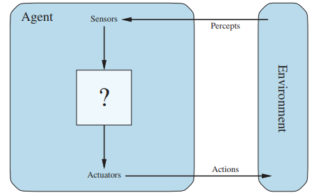
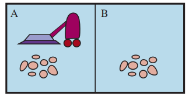
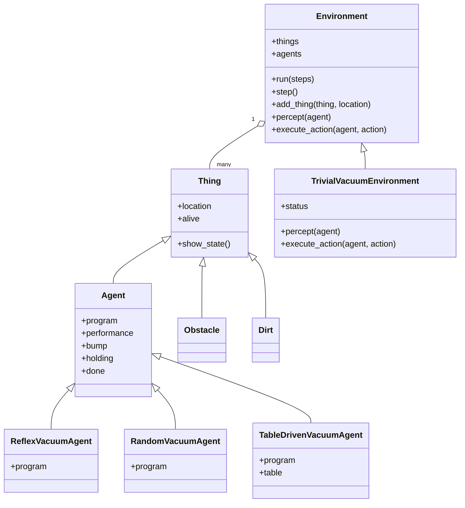
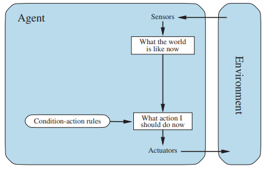
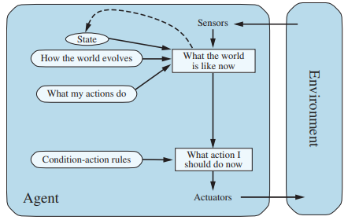
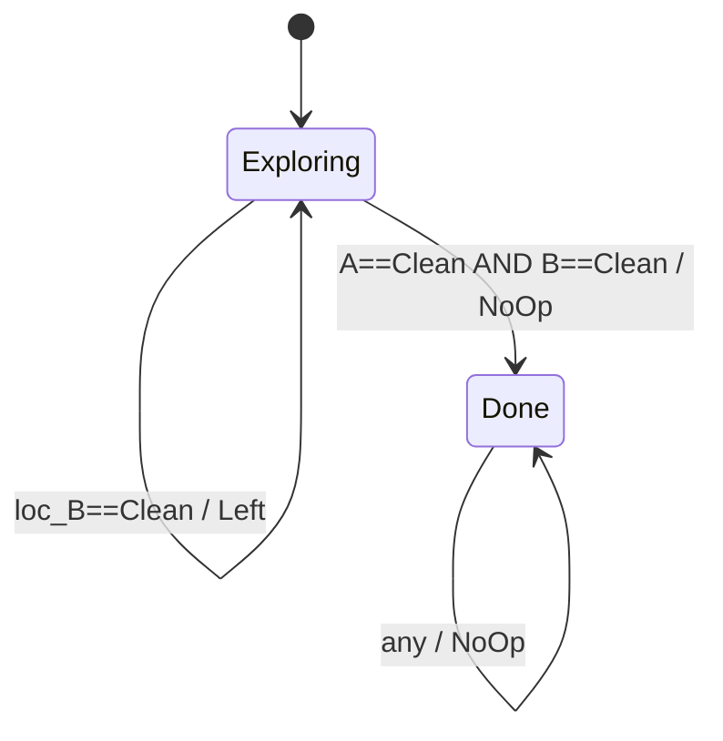

# Agente






# Comprendiendo los agentes


```
python -m pytest test_agents.py
```




## Documentacion de las clases

---

**`Thing`**

| operation | description |
|---|---|
| `Thing()` | objeto físico base; toda entidad del entorno hereda de esta clase |
| `t.is_alive()` | retorna `True` si `t` tiene atributo `alive = True` |
| `t.show_state()` | muestra el estado interno del objeto (subclases deben sobreescribir) |
| `t.display(canvas, x, y, w, h)` | dibuja el objeto en un canvas gráfico |

---

**`Agent(Thing)`**

| operation | description |
|---|---|
| `Agent(program)` | agente con función `program: percept → action`; si `program` es `None`, solicita acción al usuario por consola |
| `a.program(percept)` | función callable que mapea una percepción a una acción |
| `a.performance` | medida numérica de desempeño acumulado, inicializada en `0` |
| `a.bump` | `True` si el agente chocó con un obstáculo en el último paso |
| `a.holding` | lista de objetos que el agente lleva consigo |
| `a.can_grab(thing)` | retorna `True` si el agente puede agarrar `thing`; por defecto `False` |

---

**`Environment`**

| operation | description |
|---|---|
| `Environment()` | entorno abstracto; inicializa listas vacías `things` y `agents` |
| `e.percept(agent)` | retorna la percepción que `agent` recibe en el paso actual (abstracto) |
| `e.execute_action(agent, action)` | aplica `action` al entorno y actualiza el estado (abstracto) |
| `e.add_thing(thing, location)` | agrega `thing` al entorno en `location` |
| `e.run(steps=1000)` | ejecuta el entorno por `steps` pasos de tiempo |
| `e.step()` | ejecuta un único paso: recoge percepciones, ejecuta acciones, aplica cambios exógenos |
| `e.is_done()` | retorna `True` cuando no quedan agentes vivos |
| `e.list_things_at(location, tclass)` | retorna todos los objetos de tipo `tclass` en `location` |
| `e.some_things_at(location, tclass)` | retorna `True` si existe al menos un objeto de tipo `tclass` en `location` |
| `e.thing_classes()` | retorna lista de clases permitidas en el entorno |

---

**`TrivialVacuumEnvironment(Environment)`**

| operation | description |
|---|---|
| `TrivialVacuumEnvironment()` | mundo de dos celdas `loc_A=(0,0)` y `loc_B=(1,0)` con estado sucio/limpio aleatorio |
| `e.percept(agent)` | retorna tupla `(location, status)` — ubicación actual y estado de la celda |
| `e.execute_action(agent, action)` | ejecuta `'Suck'`, `'Right'`, `'Left'` o `'NoOp'` y actualiza `agent.performance` |
| `e.status` | diccionario `{loc: 'Clean'/'Dirty'}` con el estado actual de cada celda |

---

**`ReflexVacuumAgent`**

| operation | description |
|---|---|
| `ReflexVacuumAgent()` | retorna un `Agent` con programa reflejo simple (Figura 2.8) |
| `program(percept)` | si `status=='Dirty'` → `'Suck'`; si `loc_A` → `'Right'`; si `loc_B` → `'Left'` |

---

**`TableDrivenVacuumAgent`**

| operation | description |
|---|---|
| `TableDrivenVacuumAgent()` | retorna un `Agent` cuyo programa indexa una tabla de secuencias de percepciones → acción |
| `program(percept)` | acumula el historial de percepciones y consulta la tabla; retorna `None` si la secuencia no está en la tabla |

---

**`RandomVacuumAgent`**

| operation | description |
|---|---|
| `RandomVacuumAgent()` | retorna un `Agent` que elige aleatoriamente entre `'Right'`, `'Left'`, `'Suck'`, `'NoOp'` |
| `program(percept)` | ignora la percepción; retorna una acción al azar |

## Pruebas

```
python -i agents.py
```
### Agente sin memoria - Agente reactivo simple



```
function REFLEX-VACUUM-AGENT([location, status]) returns action
    if status == Dirty then return Suck
    else if location == A then return Right
    else if location == B then return Left
```

Basicamente es como un **sistema digital combinacional**:
* La salida depende únicamente de la entrada presente
* No hay flip-flops, no hay memoria, no hay retroalimentación

La tabla de verdad es la siguiente:

| location | status | action |
|---|---|---|
| A (0,0) | Dirty | Suck |
| A (0,0) | Clean | Right |
| B (1,0) | Dirty | Suck |
| B (1,0) | Clean | Left |


#### Prueba 1

```
>>> a = TraceAgent(ReflexVacuumAgent())
>>> e = TrivialVacuumEnvironment()
>>> e.add_thing(a)
>>> e.run(5)
<Agent> perceives ((1, 0), 'Clean') and does Left
<Agent> perceives ((0, 0), 'Clean') and does Right
<Agent> perceives ((1, 0), 'Clean') and does Left
<Agent> perceives ((0, 0), 'Clean') and does Right
<Agent> perceives ((1, 0), 'Clean') and does Left
>>>
```

#### Prueba 2

```
>>> a = TraceAgent(ReflexVacuumAgent())
>>> e = TrivialVacuumEnvironment()
>>> e.add_thing(a)
>>> e.status[(0, 0)] = 'Dirty'
>>> e.run(5)
<Agent> perceives ((1, 0), 'Dirty') and does Suck
<Agent> perceives ((1, 0), 'Clean') and does Left
<Agent> perceives ((0, 0), 'Dirty') and does Suck
<Agent> perceives ((0, 0), 'Clean') and does Right
<Agent> perceives ((1, 0), 'Clean') and does Left
```

### Agente con memoria - Agente reactivo basado en modelos



```
function MODEL-BASED-REFLEX-AGENT(percept) returns action
    persistent: state,  the agent's current conception of the world state
                model,  a description of how the next state depends on
                        current state and action
                rules,  a set of condition-action rules
                action, the most recent action, initially none

    state  ← UPDATE-STATE(state, action, percept, model)
    rule   ← RULE-MATCH(state, rules)
    action ← rule.ACTION
    return action
```

Vemos que aca el agente se modela de alguna manera como como una FSM donde:
* **Estados** — el conocimiento interno del agente sobre el mundo (model)
* **Entradas** — las percepciones del entorno (location, status)
* **Salidas** — las acciones Suck, Right, Left, NoOp
* **Función de transición** — UPDATE-STATE: cómo el modelo interno cambia con cada percepción
* **Función de salida** — RULE-MATCH: qué acción produce cada combinación de estado + entrada

El `ReflexVacuumAgent` es un circuito combinacional — sin memoria, salida depende solo de la entrada. El `ModelBasedVacuumAgent` es un circuito secuencial tipo Mealy — la salida depende de la entrada y del estado interno acumulado. La variable **model** actúa como el registro de estado del circuito.




```
>>> a = TraceAgent(ModelBasedVacuumAgent())
>>> e = TrivialVacuumEnvironment()
>>> e.add_thing(a)
>>> e.status[(0, 0)] = 'Dirty'
>>> e.run(5)
<Agent> perceives ((0, 0), 'Dirty') and does Suck
<Agent> perceives ((0, 0), 'Clean') and does Right
<Agent> perceives ((1, 0), 'Clean') and does NoOp
<Agent> perceives ((1, 0), 'Clean') and does NoOp
<Agent> perceives ((1, 0), 'Clean') and does NoOp
```


