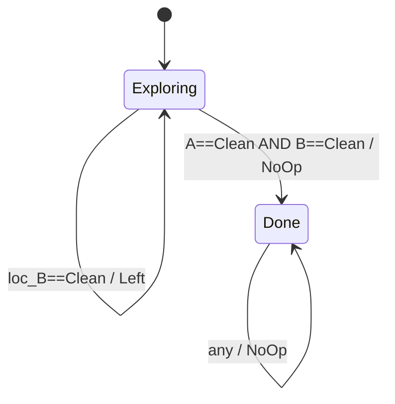
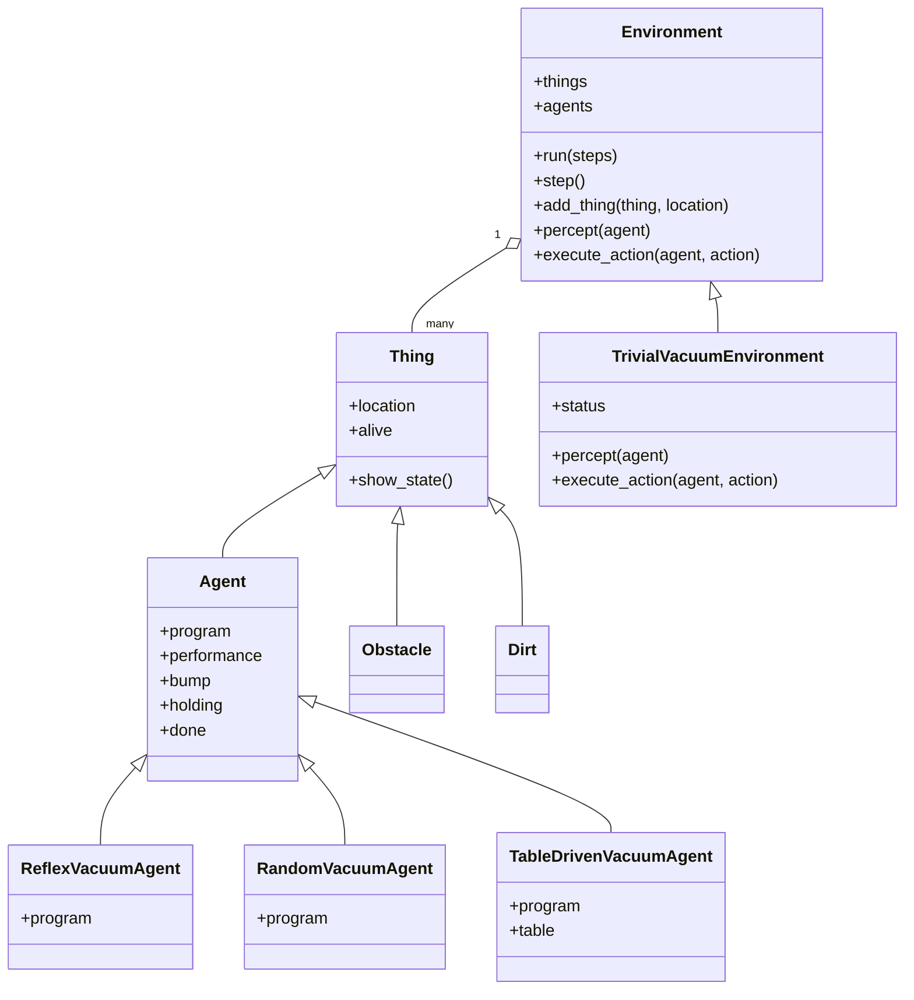

# Agentes AIMA — Implementación de referencia (Capítulo 2)

Implementación del repositorio oficial `aima-python` correspondiente al
Capítulo 2 de *Artificial Intelligence: A Modern Approach* (AIMA) de
Russell & Norvig. Contiene las clases base del framework de agentes y tres
variantes del agente aspiradora: reflejo simple, basado en tabla y basado
en modelo.

A diferencia de los ejemplos en `codes/`, esta implementación usa la
**jerarquía completa del AIMA**: `Thing → Agent → Environment`, lo que
permite componer agentes, entornos y medidas de desempeño de forma
uniforme.

---

## 1. Conexión con la teoría

### Tipos de agentes en AIMA


El Capítulo 2 del AIMA presenta una jerarquía de agentes ordenados por
complejidad creciente. Este directorio implementa los dos primeros niveles:

| Tipo de agente | Usa estado interno | Usa modelo del mundo | Implementado en |
|---|:---:|:---:|---|
| **Simple reflex**      | No  | No  | `ReflexVacuumAgent()` |
| Table-driven           | No  | No  | `TableDrivenVacuumAgent()` |
| **Model-based reflex** | Sí  | Sí  | `ModelBasedVacuumAgent()` |
| Goal-based             | Sí  | Sí  | — |
| Utility-based          | Sí  | Sí  | — |

### El mundo de la aspiradora


Entorno de dos celdas `A=(0,0)` y `B=(1,0)`. Cada celda puede estar
`'Dirty'` o `'Clean'`. El agente percibe su ubicación y el estado de la
celda actual, y puede ejecutar `'Suck'`, `'Right'`, `'Left'` o `'NoOp'`.

La **medida de desempeño** de `TrivialVacuumEnvironment` es:

```
+10  por cada celda limpiada con Suck
 -1  por cada movimiento (Right, Left)
  0  por NoOp
```

### Agente reactivo simple


Selecciona su acción basándose **únicamente en la percepción actual**.
Equivale a un **circuito combinacional**: la salida depende solo de la
entrada, sin memoria ni retroalimentación.

```
function REFLEX-VACUUM-AGENT([location, status]) returns action
    if status == Dirty then return Suck
    else if location == A then return Right
    else if location == B then return Left
```

Tabla de verdad completa:

| location | status | action |
|---|---|---|
| A (0,0) | Dirty | Suck  |
| A (0,0) | Clean | Right |
| B (1,0) | Dirty | Suck  |
| B (1,0) | Clean | Left  |

### Agente basado en modelo


Mantiene un **modelo interno** del mundo que se actualiza con cada
percepción. Equivale a un **circuito secuencial tipo Mealy**: la salida
depende de la entrada *y* del estado interno acumulado.

```
function MODEL-BASED-REFLEX-AGENT(percept) returns action
    persistent: state   ← concepción actual del mundo
                model   ← cómo el siguiente estado depende del estado actual y la acción
                rules   ← conjunto de reglas condición-acción
                action  ← acción más reciente, inicialmente None

    state  ← UPDATE-STATE(state, action, percept, model)
    rule   ← RULE-MATCH(state, rules)
    action ← rule.ACTION
    return action
```

Diagrama de estados (FSM):



El estado `Exploring` agrupa todas las combinaciones donde el modelo
interno aún no confirmó ambas celdas como limpias. En cuanto lo confirma,
la transición a `Done` es permanente: el agente ejecuta `NoOp` indefinidamente.

---

## 2. Arquitectura del código

### Diagrama de clases



### Diseño: agentes como fábricas de funciones

En esta implementación, `ReflexVacuumAgent()` y `ModelBasedVacuumAgent()`
**no son clases sino funciones** que retornan un objeto `Agent` con un
`program` como clausura. El modelo interno del agente basado en modelo es
una variable capturada en la clausura, no un atributo de instancia:

```python
def ModelBasedVacuumAgent():
    model = {loc_A: None, loc_B: None}   # clausura — pertenece al agente

    def program(percept):
        location, status = percept
        model[location] = status
        if model[loc_A] == model[loc_B] == 'Clean':
            return 'NoOp'
        ...

    return Agent(program)
```

Contrástese con `codes/model_based_vacuum_agent.py`, donde el modelo es
`self.model`, un atributo de la clase `ModelBasedVacuumAgent`. Ambos
enfoques son equivalentes; el de `aima-python` favorece composición sobre
herencia.

### `TraceAgent`: decorador de observabilidad

`TraceAgent(agent)` envuelve el `program` del agente para imprimir cada
par percepción → acción sin modificar la lógica del agente:

```python
def TraceAgent(agent):
    old_program = agent.program
    def new_program(percept):
        action = old_program(percept)
        print('{} perceives {} and does {}'.format(agent, percept, action))
        return action
    agent.program = new_program
    return agent
```

Toda la salida de los ejemplos que siguen proviene de este decorador.

### Documentación de clases

---

**`Thing`**

| Operación | Descripción |
|---|---|
| `Thing()` | Objeto físico base; toda entidad del entorno hereda de esta clase |
| `t.is_alive()` | Retorna `True` si `t` tiene atributo `alive = True` |
| `t.show_state()` | Muestra el estado interno del objeto (subclases deben sobreescribir) |

---

**`Agent(Thing)`**

| Operación | Descripción |
|---|---|
| `Agent(program)` | Agente con función `program: percept → action` |
| `a.program(percept)` | Callable que mapea una percepción a una acción |
| `a.performance` | Medida de desempeño acumulada, inicializada en `0` |
| `a.bump` | `True` si el agente chocó con un obstáculo en el último paso |
| `a.holding` | Lista de objetos que el agente lleva consigo |
| `a.can_grab(thing)` | Retorna `True` si el agente puede agarrar `thing`; por defecto `False` |

---

**`Environment`**

| Operación | Descripción |
|---|---|
| `Environment()` | Entorno abstracto; inicializa listas vacías `things` y `agents` |
| `e.percept(agent)` | Retorna la percepción que `agent` recibe en el paso actual (abstracto) |
| `e.execute_action(agent, action)` | Aplica `action` al entorno y actualiza el estado (abstracto) |
| `e.add_thing(thing, location)` | Agrega `thing` al entorno en `location` |
| `e.run(steps=1000)` | Ejecuta el entorno por `steps` pasos de tiempo |
| `e.step()` | Ejecuta un único paso: recoge percepciones, ejecuta acciones, aplica cambios exógenos |
| `e.is_done()` | Retorna `True` cuando no quedan agentes vivos |
| `e.list_things_at(location, tclass)` | Retorna todos los objetos de tipo `tclass` en `location` |
| `e.some_things_at(location, tclass)` | Retorna `True` si existe al menos un objeto de tipo `tclass` en `location` |

---

**`TrivialVacuumEnvironment(Environment)`**

| Operación | Descripción |
|---|---|
| `TrivialVacuumEnvironment()` | Mundo de dos celdas con estado inicial **aleatorio** |
| `e.percept(agent)` | Retorna tupla `(location, status)` |
| `e.execute_action(agent, action)` | Ejecuta `'Suck'`/`'Right'`/`'Left'`/`'NoOp'` y actualiza `agent.performance` |
| `e.status` | Diccionario `{loc: 'Clean'/'Dirty'}` con el estado actual de cada celda |

> El estado inicial es **aleatorio**: cada prueba interactiva puede producir
> resultados diferentes. Para reproducibilidad, sobreescribir `e.status`
> después de crear el entorno (ver ejemplos abajo).

---

**`ReflexVacuumAgent()`**

| Operación | Descripción |
|---|---|
| `ReflexVacuumAgent()` | Retorna un `Agent` con programa reflejo simple (Figura 2.8 AIMA) |
| `program(percept)` | `status=='Dirty'` → `'Suck'`; `loc_A` → `'Right'`; `loc_B` → `'Left'` |

---

**`ModelBasedVacuumAgent()`**

| Operación | Descripción |
|---|---|
| `ModelBasedVacuumAgent()` | Retorna un `Agent` con modelo interno `{loc_A: None, loc_B: None}` |
| `program(percept)` | Igual que reflejo, pero si `model[A]==model[B]=='Clean'` → `'NoOp'` |

---

**`TableDrivenVacuumAgent()`**

| Operación | Descripción |
|---|---|
| `TableDrivenVacuumAgent()` | Retorna un `Agent` cuyo programa indexa una tabla de secuencias de percepciones → acción |
| `program(percept)` | Acumula el historial de percepciones y consulta la tabla; retorna `None` si la secuencia no está |

---

**`RandomVacuumAgent()`**

| Operación | Descripción |
|---|---|
| `RandomVacuumAgent()` | Retorna un `Agent` que elige aleatoriamente entre `'Right'`, `'Left'`, `'Suck'`, `'NoOp'` |
| `program(percept)` | Ignora la percepción; retorna una acción al azar |

---

## 3. Ejecución

**Requisitos:** Python 3.7 o superior. No requiere librerías externas
para los ejemplos de este directorio.

### Modo interactivo (`python -i`)

Carga el módulo y deja el intérprete abierto para explorar manualmente:

```bash
python -i agents.py
```

Patrón de uso estándar para cualquier agente:

```python
a = TraceAgent(<AgentFactory>())   # 1. crear agente con traza
e = TrivialVacuumEnvironment()     # 2. crear entorno (estado aleatorio)
e.status[(0, 0)] = 'Dirty'        # 3. (opcional) fijar estado inicial
e.add_thing(a)                     # 4. colocar agente en el entorno
e.run(5)                           # 5. ejecutar N pasos
```

### Suite de pruebas (`pytest`)

Ejecuta todos los doctests y tests de `test_agents.py`:

```bash
python -m pytest test_agents.py
```

Para ver la salida detallada de cada test:

```bash
python -m pytest test_agents.py -v
```

---

## 4. Resultados esperados

### Agente reactivo simple — `ReflexVacuumAgent`

**Prueba 1:** entorno con estado aleatorio, ambas celdas limpias al inicio.

```python
>>> a = TraceAgent(ReflexVacuumAgent())
>>> e = TrivialVacuumEnvironment()
>>> e.add_thing(a)
>>> e.run(5)
<Agent> perceives ((1, 0), 'Clean') and does Left
<Agent> perceives ((0, 0), 'Clean') and does Right
<Agent> perceives ((1, 0), 'Clean') and does Left
<Agent> perceives ((0, 0), 'Clean') and does Right
<Agent> perceives ((1, 0), 'Clean') and does Left
```

El agente **oscila indefinidamente** entre A y B. Sin memoria, no puede
saber que el entorno ya está limpio.

**Prueba 2:** forzar celda A sucia antes de ejecutar.

```python
>>> a = TraceAgent(ReflexVacuumAgent())
>>> e = TrivialVacuumEnvironment()
>>> e.add_thing(a)
>>> e.status[(0, 0)] = 'Dirty'
>>> e.run(5)
<Agent> perceives ((1, 0), 'Dirty') and does Suck
<Agent> perceives ((1, 0), 'Clean') and does Left
<Agent> perceives ((0, 0), 'Dirty') and does Suck
<Agent> perceives ((0, 0), 'Clean') and does Right
<Agent> perceives ((1, 0), 'Clean') and does Left
```

El agente limpia ambas celdas pero no detecta que ya terminó: continúa
oscilando en los pasos siguientes.

### Agente basado en modelo — `ModelBasedVacuumAgent`

**Prueba:** misma configuración, celda A forzada sucia.

```python
>>> a = TraceAgent(ModelBasedVacuumAgent())
>>> e = TrivialVacuumEnvironment()
>>> e.add_thing(a)
>>> e.status[(0, 0)] = 'Dirty'
>>> e.run(5)
<Agent> perceives ((0, 0), 'Dirty') and does Suck
<Agent> perceives ((0, 0), 'Clean') and does Right
<Agent> perceives ((1, 0), 'Clean') and does NoOp
<Agent> perceives ((1, 0), 'Clean') and does NoOp
<Agent> perceives ((1, 0), 'Clean') and does NoOp
```

### Traza anotada

| Paso | Percepción | Modelo interno | Regla disparada | Acción |
|:---:|---|---|---|---|
| 1 | A, Dirty | `{A: Dirty, B: None}` | `status = Dirty → Suck` | **Suck** |
| 2 | A, Clean | `{A: Clean, B: None}` | `location = A → Right` | **Right** |
| 3 | B, Clean | `{A: Clean, B: Clean}` | `model[A]=model[B]='Clean' → NoOp` | **NoOp** |
| 4 | B, Clean | `{A: Clean, B: Clean}` | `model[A]=model[B]='Clean' → NoOp` | **NoOp** |
| 5 | B, Clean | `{A: Clean, B: Clean}` | `model[A]=model[B]='Clean' → NoOp` | **NoOp** |

En el paso 3 el modelo interno queda completo. A partir de ese punto la
transición a `Done` es permanente y el agente deja de gastar movimientos,
lo que se refleja en una **medida de desempeño superior** respecto al
agente reflejo simple.
