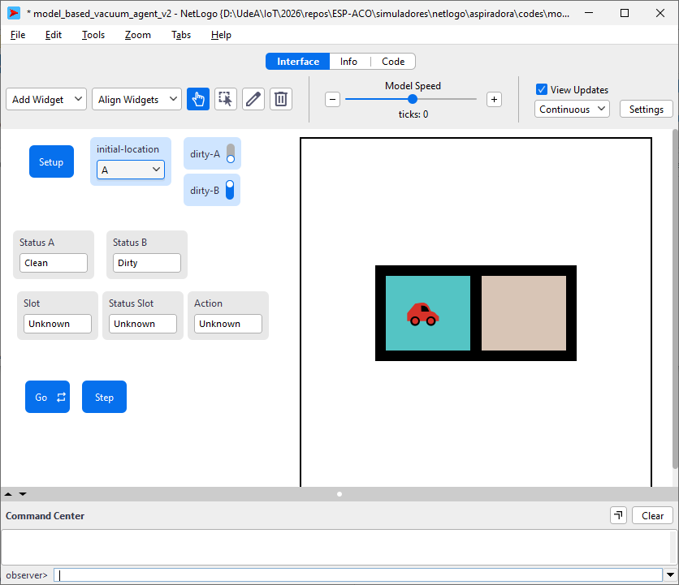

# Agente Basado en Modelo — Mundo de la Aspiradora

Implementación del agente basado en modelo descrito en el Capítulo 2 del
libro *Artificial Intelligence: A Modern Approach* (AIMA) de Russell & Norvig.
Incluye una versión standalone en Python y su equivalente en NetLogo 7.
Este agente es el paso siguiente en la jerarquía respecto al
`reflex_vacuum_agent`: incorpora memoria interna del estado del mundo.

---

## 1. Conexión con la teoría

### Tipos de agentes en AIMA

El Capítulo 2 del AIMA presenta una jerarquía de agentes inteligentes
ordenados por complejidad creciente:

| Tipo de agente | Usa estado interno | Usa modelo del mundo | Tiene metas | Tiene utilidad |
|---|:---:|:---:|:---:|:---:|
| Simple reflex         | No  | No  | No  | No  |
| **Model-based reflex**| Sí  | Sí  | No  | No  |
| Goal-based            | Sí  | Sí  | Sí  | No  |
| Utility-based         | Sí  | Sí  | Sí  | Sí  |

Este ejemplo implementa el segundo nivel: el **agente reactivo basado en
modelo** (*model-based reflex agent*).

### ¿Qué lo diferencia del agente reactivo simple?

El agente reactivo simple tomaba decisiones basándose únicamente en la
percepción del momento presente, lo que lo llevaba a **oscilar
indefinidamente** entre celdas aunque el entorno ya estuviera limpio.

El agente basado en modelo resuelve esto manteniendo un **estado interno**
que registra lo que sabe sobre el mundo, incluso cuando no puede percibirlo
directamente:

```
model = { loc_A: None, loc_B: None }   ← inicialmente sin información
```

Con ese modelo, la función de decisión se extiende:

```
MODEL-BASED-VACUUM-AGENT([location, status])   ← Fig. 2.11, AIMA
  model[location] ← status                     (actualizar modelo)
  if model[A] = Clean AND model[B] = Clean  then return NoOp
  if status = Dirty                          then return Suck
  if location = A                            then return Right
  if location = B                            then return Left
```

La acción `NoOp` (*no operation*) indica que el agente reconoce que su
tarea está completa y deja de actuar, a diferencia del agente reflejo que
nunca alcanza ese estado.

### Flujo de decisión

```
Percepción
    │
    ▼
Actualizar modelo interno
    │
    ▼
¿model[A]='Clean' AND model[B]='Clean'? ──► Sí ──► NoOp (detener)
    │ No
    ▼
¿status = 'Dirty'? ──► Sí ──► Suck
    │ No
    ▼
¿location = A? ──► Sí ──► Right
    │ No
    ▼
   Left
```

### Limitación de esta versión

El modelo interno se construye **solo por observación directa**: el agente
actualiza `model[location]` al visitar una celda, pero no puede inferir
el estado de la celda no visitada. Si una celda se ensuciara después de
haber sido limpiada, el modelo interno quedaría desactualizado. Esto motiva
los agentes de nivel superior con metas y percepción más rica.

---

## 2. Archivos

```
model_based_vacuum_agent/
├── model_based_vacuum_agent.py            # Implementación standalone en Python
├── model_based_vacuum_agent_v2.nlogox     # Simulación equivalente en NetLogo 7
├── interfaz.png                           # Captura de la interfaz NetLogo
├── prompt_model_based_vacuum_agent_v2.md  # Prompt de diseño del modelo v2
└── old/                                   # Versiones anteriores (referencia)
```

### `model_based_vacuum_agent.py`

Contiene dos clases:

| Clase | Responsabilidad | Equivalente AIMA |
|---|---|---|
| `VacuumEnvironment` | Define el entorno de dos celdas | Environment (Fig. 2.1) |
| `ModelBasedVacuumAgent` | Implementa las reglas con modelo interno | Agent (Fig. 2.11) |

Métodos clave:

| Método | Qué hace |
|---|---|
| `ModelBasedVacuumAgent.__init__` | Crea el modelo interno `{loc_A: None, loc_B: None}` |
| `update_model(location, status)` | Registra el estado observado de la celda actual |
| `act(env)` | Actualiza el modelo, evalúa reglas y ejecuta la acción |
| `run(env, steps)` | Ciclo percepción-actualización-acción por `steps` pasos |

El modelo interno (`self.model`) es un atributo de la instancia del agente,
no del entorno. Esto es importante: **el conocimiento pertenece al agente**.

### `model_based_vacuum_agent_v2.nlogox`

Simulación visual en NetLogo 7.0.4. Esta versión implementa el modelo
interno como `turtles-own`, lo que es fiel a la estructura orientada a
objetos de Python (el modelo es un atributo de la tortuga, no una variable
global del entorno):

```netlogo
turtles-own [
  model-A   ; "Unknown", "Dirty" o "Clean"
  model-B   ; "Unknown", "Dirty" o "Clean"
]
```

Los monitores de la interfaz exponen en tiempo real el estado interno del
agente: celda percibida (`Slot`), estado percibido (`Status Slot`) y última
acción ejecutada (`Action`).

### `interfaz.png`

Captura de la interfaz NetLogo mostrando la disposición de controles,
monitores y el mundo simulado.



### Mapeo de conceptos entre implementaciones

| Concepto AIMA | Python | NetLogo |
|---|---|---|
| Entorno | `VacuumEnvironment` | `globals` + `patches` |
| Estado real del entorno | `self.status` dict | `status-A`, `status-B` |
| Agente | `ModelBasedVacuumAgent` | `turtle 0` |
| **Modelo interno** | `self.model` dict | `turtles-own [model-A model-B]` |
| Percepción | `get_percept()` | `pxcor` + `status-A/B` |
| Actualización del modelo | `update_model()` | `ask turtle 0 [set model-A/B ...]` |
| Reglas condición-acción | `act()` | `step-once` |
| Ciclo principal | `run()` | `go` (forever) |
| Condición de parada | `model[A]==model[B]=='Clean'` → `NoOp` | `model-A = "Clean" AND model-B = "Clean"` → `stop` |

---

## 3. Ejecución

### Python

**Requisitos:** Python 3.7 o superior. No requiere librerías externas.

**Ejecutar con el estado inicial por defecto:**

```bash
python model_based_vacuum_agent.py
```

El bloque `__main__` configura el entorno con `status_A='Dirty'`,
`status_B='Clean'` y el agente parte desde la celda A `(0, 0)`.

**Modificar el estado inicial** editando el bloque `__main__` al final del
archivo:

```python
# Ambas celdas sucias, agente inicia en B
env   = VacuumEnvironment(status_A='Dirty', status_B='Dirty')
agent = ModelBasedVacuumAgent(location=(1, 0))
agent.run(env, steps=8)
```

Valores válidos para `status_A` / `status_B`: `'Dirty'` o `'Clean'`.  
Valores válidos para `location`: `(0, 0)` (celda A) o `(1, 0)` (celda B).

> **Nota:** en la versión Python el ciclo `run` no se interrumpe al
> ejecutar `NoOp`; el agente simplemente repite `NoOp` en los pasos
> restantes. En la versión NetLogo, `NoOp` detiene la simulación con `stop`.

### NetLogo

**Requisitos:** [NetLogo 7.0.4](https://ccl.northwestern.edu/netlogo/)

1. Abrir `model_based_vacuum_agent_v2.nlogox` desde **File → Open**.
2. En la interfaz, configurar el estado inicial:
   - Switches `dirty-A` / `dirty-B`: activado = Dirty, desactivado = Clean.
   - Chooser `initial-location`: seleccionar `"A"` o `"B"`.
3. Presionar **Setup** para inicializar el entorno y ubicar al agente.
   Los monitores `Slot`, `Status Slot` y `Action` mostrarán `"Unknown"`
   hasta el primer ciclo (el agente está "apagado").
4. Presionar **Go** para iniciar la simulación continua, o **Step** para
   avanzar un ciclo a la vez.
5. La simulación se detiene automáticamente cuando el agente ejecuta `NoOp`.

**Monitores de la interfaz:**

| Monitor | Variable NetLogo | Qué muestra |
|---|---|---|
| Status A | `status-A` | Estado real de celda A |
| Status B | `status-B` | Estado real de celda B |
| Slot | `slot` | Celda donde está el agente |
| Status Slot | `status-slot` | Estado percibido en la celda actual |
| Action | `action-slot` | Última acción ejecutada |

---

## 4. Resultados esperados

### Configuración por defecto

```
status_A = 'Dirty'   status_B = 'Clean'   posición inicial = A (0,0)
```

### Salida del script Python

```
<Agent> perceives ((0, 0), 'Dirty') and does Suck
<Agent> perceives ((0, 0), 'Clean') and does Right
<Agent> perceives ((1, 0), 'Clean') and does NoOp
<Agent> perceives ((1, 0), 'Clean') and does NoOp
<Agent> perceives ((1, 0), 'Clean') and does NoOp
```

### Traza anotada

| Paso | Percepción | Modelo interno | Regla disparada | Acción |
|:---:|---|---|---|---|
| 1 | A, Dirty | `{A: Dirty, B: None}` | `status = Dirty → Suck` | **Suck** |
| 2 | A, Clean | `{A: Clean, B: None}` | `location = A → Right` | **Right** |
| 3 | B, Clean | `{A: Clean, B: Clean}` | `model[A]=model[B]='Clean' → NoOp` | **NoOp** |
| 4 | B, Clean | `{A: Clean, B: Clean}` | `model[A]=model[B]='Clean' → NoOp` | **NoOp** |
| 5 | B, Clean | `{A: Clean, B: Clean}` | `model[A]=model[B]='Clean' → NoOp` | **NoOp** |

**Observación:** en el paso 3 el agente completa su modelo interno al visitar
la celda B. Con ambas celdas registradas como `'Clean'`, reconoce que el
entorno está limpio y ejecuta `NoOp`. A partir de ese momento el modelo no
cambia y la acción permanece `NoOp` en todos los pasos restantes.
Contrástese con el `reflex_vacuum_agent`, que oscila indefinidamente:
el modelo interno es exactamente la diferencia que elimina ese comportamiento.
